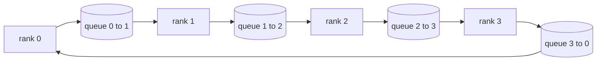

# 从零实现集体操作

> 支撑分布式训练的四个核心集体操作是 allreduce、broadcast、allgather 和 reduce_scatter。训练框架提供的其他所有原语都是基于这四个操作的封装。在 `multiprocessing.Queue` 网线上构建它们，用参考实现验证正确性，后续的练习就会变成管道搭建工作。

**类型：** 构建
**语言：** Python
**前置条件：** 第 19 阶段 C 轨道课程 42-49
**时间：** 约 90 分钟

## 学习目标

- 实现两阶段环形 allreduce（reduce-scatter 后接 allgather），并证明每 rank 的通信量为每元素 2(N-1)/N 字节。
- 基于 `multiprocessing.Queue` 上的点对点发送构建 broadcast、allgather 和 reduce_scatter。
- 用相同输入的 `torch.distributed` gloo 参考实现验证每个原语。
- 根据集群形状、延迟下界和带宽上界定义选择环形与树形的理由。

## 问题描述

一个简单的 allreduce 对 N 个 rank 的做法是将张量发送 N 次到根节点，再广播 N 次回来。带宽按每 rank O(N) 增长，根节点成为瓶颈，墙钟时间的下界是最慢链路乘以 N。环形 allreduce 将其平铺为 N-1 步，每步处理大小为 T/N 的块，因此每 rank 的字节数降为 2T(N-1)/N，与集群规模无关。树形 allreduce 在小 N 和高延迟链路上表现更好，因为深度是 log2(N) 跳而非 2(N-1)。为集群形状选择不当的拓扑会让最慢的 GPU 决定每一步的时间。

你在这个轨道中会读到的每个分布式训练框架都依赖这四个原语。PyTorch DDP 用每个参数桶一次 allreduce 来同步梯度。ZeRO 通过 reduce_scatter 分片优化器状态，通过 allgather 广播更新后的参数。FSDP 将整个前向传播转化为 allgather 加 reduce_scatter。流水线并行需要跨阶段组广播激活值。如果你无法实现这四个集合操作，就无法推理训练为何停滞、梯度不匹配为何出现在 rank 3、或交换拓扑时流水线气泡为何翻倍。

## 概念



### 两阶段环形 allreduce

将张量分为 N 个等长子块，索引 0..N-1。每个 rank 拥有等于其 rank 编号的子块索引。第一阶段 reduce-scatter 执行 N-1 步。在第 s 步，rank r 将子块 (r - s) mod N 发送给 rank (r + 1) mod N，并从 rank (r - 1) mod N 接收子块 (r - s - 1) mod N，将接收到的子块累积到本地副本中。经过 N-1 步后，rank r 持有子块 r 的完整求和结果。第二阶段 allgather 再执行 N-1 步，将完成的子块沿环形旋转，直到每个 rank 都持有所有子块的完整求和。

| 原语 | 每 rank 字节数 | 步数 | 适用场景 |
|-----------|---------------|-------|-------------|
| 环形 allreduce | 2T(N-1)/N | 2(N-1) | 大 T，同质化宽带集群 |
| 树形 allreduce | T log2(N) | 2 log2(N) | 小 T 或高延迟链路 |
| Broadcast | T | log2(N) 树 | 参数初始化、标量配置 |
| Allgather | T(N-1)/N | N-1 | 分片前向传播、ZeRO 解分片 |
| Reduce_scatter | T(N-1)/N | N-1 | ZeRO 梯度分片 |

### 用 Queue 网络替代 NCCL

NCCL 在 PCIe 和 NVLink 上运行，支持硬件卸载的约减操作。在 CPU 上没有这些。每个环形边上的 `multiprocessing.Queue` 提供有序点对点交付，单生产者单消费者。约减在用户空间发生，因此要承担 Python 开销，但总线模式与 NCCL 环形 allreduce 完全相同。在 Queue 版本上推理正确性，集群行为自然成立。

### 用 gloo 验证

每个原语都有单元测试，将在相同张量和相同 world size 上用 gloo 后端初始化的 `torch.distributed` 输出作为参照。如果你的环形 allreduce 与 gloo 的偏差超过 float32 epsilon，测试失败。用参考实现验证是不可妥协的；没有它，原语在真实训练的第 10000 步之前看起来都是正确的。

```figure
ci-ring-allreduce
```

## 构建它

`code/main.py` 实现：

- `Mesh` 类将 N 个 `multiprocessing.Queue` 实例连接成环形，并按 rank 暴露 `send(dst, tensor)` 和 `recv(src)`。
- `ring_allreduce(mesh, rank, world_size, tensor)` 执行两阶段算法。
- `broadcast(mesh, rank, world_size, tensor, src)` 基于对数树实现。
- `allgather(mesh, rank, world_size, tensor)` 使用 N-1 次旋转。
- `reduce_scatter(mesh, rank, world_size, tensor)` 作为 allreduce 的第一阶段。
- `_gloo_reference(op, world_size, tensor)` 用 gloo 后端运行 `torch.distributed` 以进行字节级比较。

运行方式：

```bash
python3 code/main.py
```

输出：每原语的验证表格对比 queue-mesh 与 gloo 输出，后跟每 rank 的字节计数器，证明 2T(N-1)/N 的缩放规律。

## 生产环境中的模式

三个模式让原语足够健壮以投入生产。

**allreduce 前对梯度分桶。** 一个 10 亿参数的模型有数万个梯度张量。每个张量一次 allreduce 会让延迟下界支付 N 次。DDP 将梯度分桶为约 25 MB 的块，每个桶发起一次 allreduce；小张量搭大张量的便车。没有分桶的话，延迟开销会主导每一步。

**通信与计算重叠。** 反向传播按逆序逐层计算梯度。一旦最后一层的梯度就绪，立即启动其 allreduce，同时下一层继续计算。PyTorch DDP 通过桶就绪钩子实现这一机制。当网络有冗余时，重叠可使可见通信时间减半。

**根据消息大小而非教条选择环形或树形。** NCCL 自带拓扑检测器，对大于约 1 MB 的消息选择环形，对小于的消息选择树形。临界点是带宽与延迟的权衡：超过 1 MB 时，带宽项 2T(N-1)/N 占主导，环形胜出；低于 1 MB 时，log2(N) 跳数胜出。硬编码单一拓扑会在错误的消息尺寸上损失吞吐。

## 使用它

生产模式：

- **PyTorch DDP。** 在反向传播后对分桶梯度调用 `dist.all_reduce`。桶大小可调；默认 25 MB 对于 100Gbit 以太网是合理的。
- **DeepSpeed ZeRO。** 发起 reduce_scatter 以分片梯度，在前向传播前用 allgather 重建完整参数。本课的原语正是 ZeRO 所调用的操作。
- **FSDP。** 前向传播开始时用 allgather 解分片层，计算后与 reduce_scatter 约减并丢弃未分片数据。相同的原语，不同的调度。

## 交付它

在第 77-81 课中使用 queue-mesh 原语。第 77 课将 allreduce 接入 DDP。第 78 课将 reduce_scatter 接入 ZeRO。第 79 课将 broadcast 接入流水线激活值。第 81 课将四个原语组合为端到端演示。

## 练习

1. 添加树形 allreduce 变体，并根据消息大小在环形和树形之间切换。测量临界点。
2. 添加 `recv_timeout_ms`，使卡住的 rank 抛出截止时间错误而不是永远挂起。
3. 用 TCP 套接字替换 `multiprocessing.Queue` 实现四个原语。相同的测试，真实的传输。
4. 添加带宽计量钩子，使每 rank 字节计数器记录到 JSONL。
5. 在 4 个 rank 上比较环形与树形在 1KB、1MB、16MB 张量上的墙钟时间。用实验数据论证临界点。

## 关键术语

| 术语 | 人们怎么说 | 实际含义 |
|------|----------------|------------------------|
| Allreduce | "跨 rank 求和" | 调用结束后每个 rank 持有相同的约减张量 |
| 环形 | "快速拓扑" | 大小为 T/N 的 N-1 个子块沿环流转两轮 |
| 树形 | "对数拓扑" | 约减沿二叉树进行；深度为 log2(N) 跳 |
| Allgather | "拼接分片" | 每个 rank 最终持有所有其他 rank 的分片 |
| Reduce_scatter | "分割求和" | 每个 rank 最终只持有其中一个子块的求和 |
| Bucket | "融合小张量" | 将 N 次小 allreduce 合并为一次大 allreduce |

## 延伸阅读

- [PyTorch Distributed: NCCL 集体操作](https://pytorch.org/docs/stable/distributed.html#collective-functions)
- [Horovod 环形 allreduce 论文](https://arxiv.org/abs/1802.05799)
- [NCCL 拓扑与算法选择](https://docs.nvidia.com/deeplearning/nccl/user-guide/docs/index.html)
- [Patarasuk 和 Yuan，带宽最优的 allreduce 算法](https://www.cs.fsu.edu/~xyuan/paper/09jpdc.pdf)
- 第 10 阶段 第 05 课 - 分布式训练概述
- 第 19 阶段 第 77 课 - 基于这些原语搭建 DDP
