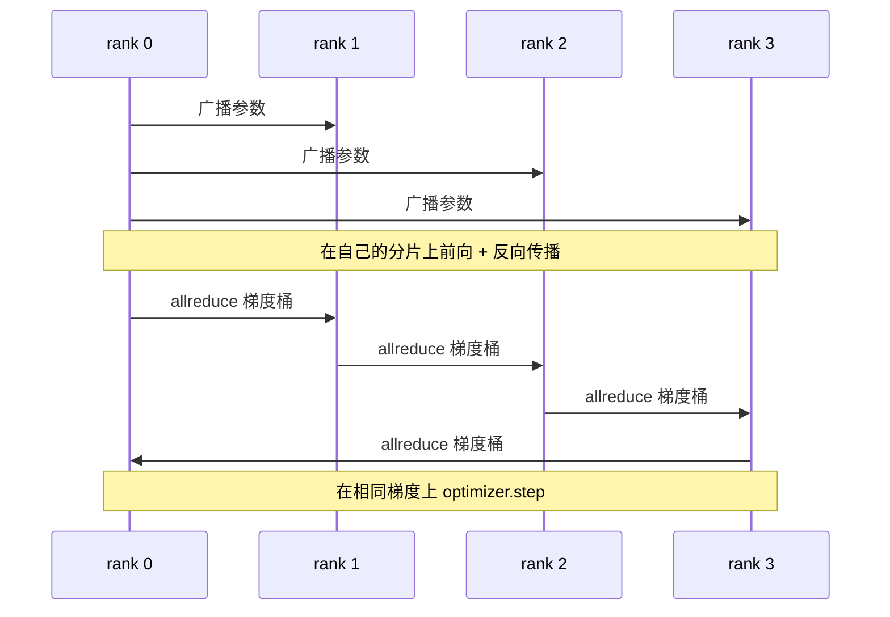

# 从零实现 Data Parallel DDP

> DistributedDataParallel 是建立在 allreduce 之上的一个封装。包装模型，从 rank 0 广播初始参数使每个 rank 起点一致，为每个参数安装反向钩子以执行梯度 allreduce，剩下的就是梯度下降。整个模式约 200 行代码。

**类型：** 构建
**语言：** Python
**前置要求：** Phase 19 Track C 课程 42-49
**时间：** 约 90 分钟

## 学习目标

- 构建一个 `DistributedDataParallel` 形状的封装，在构造时广播初始参数，并在反向传播后 allreduce 梯度。
- 使用 `torch.multiprocessing.spawn` 在 gloo 后端上通过基于文件的 rendezvous 启动 N 个 CPU rank。
- 通过在相同数据上顺序训练同一模型并验证每步参数等价性，证明梯度同步的正确性。
- 用桶（梯度融合）和重叠（反向传播期间的通信）这两个改进来论证如何将一个可用的 DDP 转变为生产级 DDP。

## 问题

一个拥有 10 亿参数、12 GB 激活值的模型无法装入单张消费级 GPU。即使能装下，训练也需要数周时间。数据并行将批次拆分到 N 个 rank 上，每个 rank 在自己的分片上计算前向和反向传播，每一步每个 rank 的梯度都被求和，使所有 N 个副本保持一致。优化器步进时使用的就是这些求和后的梯度。

如果没有梯度同步，N 个副本到第 2 步就会发散。模型不再是"在更多数据上训练的一个模型"，而是 N 个碰巧共享初始权重的独立模型。如果梯度同步做得不好（每个参数一个 allreduce，无重叠，无桶），网络会成为瓶颈，GPU 只能空等数据传输。DDP 的精髓是让梯度同步相对于计算几乎免费。PyTorch 的 DDP 通过桶化梯度、将 allreduce 与下一层的反向传播重叠、以及在 NVLink 上使用 NCCL 来实现这一点。我们可以在 CPU 上用 gloo 完成这三件事，并学到同样的经验。

## 概念



### DDP 需要的三个操作

| 阶段 | 集合操作 | 原因 |
|-------|-----------|-----|
| 初始化 | 从 rank 0 广播 | 每个 rank 以相同的参数开始 |
| 反向传播后 | 每个梯度的 allreduce | 均值梯度是优化器步进的依据 |
| 有时 | buffer 的广播 | Batchnorm 运行统计量保持同步 |

### 为什么是均值而不是求和

Allreduce-SUM 除以 world_size 得到均值梯度。均值对 world_size 不变：在一个 rank 上调优的学习率在四个 rank 下仍然有效，因为每步的梯度幅度不变。不带除法的 Allreduce-SUM 迫使你每次更改集群规模时都要重新调优学习率。DDP 对 SUM 进行封装并除法；本课也这样做。

### 为什么对梯度桶化

一个 transformer 有成千上万个参数张量。每个张量一次 allreduce 要支付 gloo 延迟下界成千上万次。DDP 将梯度分组为约 25 MB 的桶，每个桶发一次 allreduce。通过网络传输的总字节数相同，但延迟被分摊到整个桶。对于本课的微小模型，我们将所有内容归入一个桶；结构是可移植的。

### 为什么要固定种子

每个 rank 必须调用 `torch.manual_seed(seed + rank)` 用于打乱数据，但调用 `torch.manual_seed(seed)` 用于参数初始化。一个共享种子意味着每个 rank 看到相同的批次顺序（使数据并行失效）；参数用 rank 特定的种子意味着初始参数因 float epsilon 而不一致，梯度同步不再使副本完全相同。种子模式必须正确，否则第 1 步的参数等价性测试就会失败。

```figure
ci-ddp-grad-sync
```

## 构建

`code/main.py` 实现了：

- `MiniMLP`：一个 3 层 MLP，小到能在几秒内收敛，大到足以展示接线逻辑。
- `DistributedDataParallel(model, world_size)`：在构造时广播参数，返回一个封装，其 `sync_grads` 将累积的 allreduce 求和梯度除以 world_size。
- `worker(rank, world_size, ...)`：完整的训练循环，在 gloo 上通过 `torch.distributed` 初始化，执行前向传播、反向传播、同步、步进。
- `_reference_single_process_loop(...)`：在单个 rank 上按顺序在同一数据上训练同一模型，用于测试每步后的字节级参数等价性。

运行它：

```bash
python3 code/main.py
```

输出：一个逐步骤的训练表，对比单进程损失和参数校验和与在 4 个 rank 上运行的 DDP。两条路径产生与 float epsilon 同精度一致的损失曲线，证明梯度同步是正确的。

## 生产环境中的模式

三种模式让 DDP 足够坚固以投入生产。

**查找未使用的参数。** 某些前向路径会条件性地跳过参数（提前退出、mixture-of-experts 路由）。被跳过的参数没有梯度，但 DDP 的桶就绪钩子仍在等待它们，导致 allreduce 死锁。`find_unused_parameters=True` 告诉 DDP 在约简前查看哪些参数获得了梯度。代价是每步需要一次图遍历，所以在前向不分支时请关闭它。

**静态图优化。** 当前向在各步之间稳定时，`static_graph=True` 让 DDP 预先计算桶调度。该优化在大规模下很重要：预计算每步节省几毫秒，在 10000 步上累计起来就很可观。

**梯度累加需要小心处理。** 在 K 个微批次上累加梯度而不每步同步，可获得 10 倍吞吐提升。DDP 暴露了 `no_sync()` 作为上下文管理器来暂停反向传播后的 allreduce。忘记使用管理器就多余地 allreduce K 次，吞吐会降到地板上。

## 使用

生产模式：

- **PyTorch DDP。** 标准实现。`torch.nn.parallel.DistributedDataParallel(model)` 接线了桶化、重叠和 no_sync 上下文。
- **HuggingFace Accelerate。** 添加了处理 `torchrun` 环境变量和模型封装的启动器。底层仍是 DDP。
- **Megatron-LM 数据并行。** 将 DDP 与张量并行结合用于大模型；数据并行部分仍是相同的反向传播后 allreduce 模式。

## 交付

第 78 课（ZeRO 分片）用 reduce_scatter 替代逐参数 allreduce，使每个 rank 仅存储优化器状态的其分片。第 81 课将 DDP 与 ZeRO 组合为端到端演示。

## 练习

1. 添加可配置大小的梯度桶，并在更深的模型上测量 vs 每参数一次 allreduce 的速度提升。
2. 实现作为上下文管理器的 `no_sync()`，并验证梯度累加在 K 个微批次上匹配单进程基线。
3. 添加一个 `find_unused_parameters` 模式，使前向有时跳过 MLP 的其中一层；在没有该标志的情况下运行应会死锁。
4. 用仅 `torch.distributed.barrier()` 的同步替代 gloo，感受基于 allreduce 和基于 barrier 的同步之间的差异。
5. 测量梯度同步开销占步时的比例，针对批次大小 1、16、256，并解释缩放规律。

## 关键术语

| 术语 | 人们说的 | 实际含义 |
|------|----------------|------------------------|
| DDP | "数据并行" | 每步广播参数并 allreduce 梯度的封装 |
| Bucket | "融合梯度" | 将 N 次小 allreduce 合并为一次大 allreduce |
| Overlap | "隐藏通信" | 在后续层仍在计算反向传播时发起 allreduce |
| no_sync | "累加" | 跳过反向传播后的 allreduce 以进行梯度累加 |
| find_unused | "分支前向" | 在约简前检测无梯度的参数 |

## 延伸阅读

- [PyTorch DistributedDataParallel 文档](https://pytorch.org/docs/stable/generated/torch.nn.parallel.DistributedDataParallel.html)
- [PyTorch DDP 内部教程](https://pytorch.org/tutorials/intermediate/ddp_tutorial.html)
- [Li et al, PyTorch Distributed: Experiences on Accelerating Data Parallel Training](https://arxiv.org/abs/2006.15704)
- Phase 19 第 76 课 - DDP 构建所依赖的集合操作
- Phase 19 第 78 课 - ZeРО 分片用 reduce_scatter 替代逐参数 allreduce
