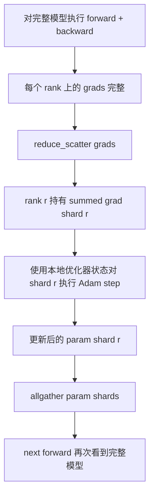

# ZeRO 优化器状态分片

> Adam 为每个参数存储两个矩估计值，均为 float32。一个 7B 参数的模型携带 56 GB 的优化器状态。ZeRO 第 1 阶段将这些状态 Across N 个 rank 分片；每个 rank 拥有 1/N 的优化器。在本地步骤之后，更新后的参数分片广播回来，每个 rank 重建完整模型，下一轮步骤开始。收益是训练栈中最大单次分配的内存线性下降。

**类型：** Build
**语言：** Python
**前置要求：** Phase 19 Track C 课程 42-49
**时间：** ~90 分钟

## 学习目标

- 将优化器状态（一阶矩、二阶矩、fp32 主拷贝）Across N 个 rank 分片，使每个 rank 拥有 1/N。
- 使用 reduce_scatter 使每个 rank 只接收其分片的梯度求和，然后 allgather 将更新后的参数分片广播回来。
- 计算 Stage 1、Stage 2、Stage 3 相对于 vanilla DDP 的内存节省表。
- 根据模型大小和带宽预算，为选择 Stage 1 vs Stage 2 vs Stage 3 进行辩护。

## 问题所在

Vanilla DDP 会复制所有数据：参数、梯度和优化器状态在每个 rank 上都有完整副本。对于一个 fp16 下 7B 参数的模型，这意味着每个 rank 上有 14 GB 参数、14 GB 梯度和 28 GB 优化器状态。优化器状态是最大的一项，也是最容易分片的一项，因为它只在 step 过程中被访问，而不是在前向或反向传播过程中。

ZeRO 第 1 阶段对优化器状态进行分片。每个 rank 持有 1/N 的 Adam 矩。反向传播后，ZeRO 不使用 allreduce 完整梯度然后本地步进，而是执行 reduce_scatter，使每个 rank 仅接收其分片的求和梯度。该 rank 对其主参数的分片应用优化器步骤。然后更新后的参数分片通过 allgather 广播回来，使每个 rank 在下一轮前向传播时拥有完整模型。优化器内存减少 N 倍。每步的网络流量与 DDP 相同：一次 reduce_scatter 加一次 allgather 等于一次 allreduce 的带宽。内存获胜，吞吐量保持。

## 概念



### ZeRO 的阶段

| 阶段 | 分片内容 | 每 rank 内存 | 每步通信 |
|-------|----------------|------------------|---------------|
| DDP | 无 | params + grads + optim | 1x allreduce |
| ZeRO-1 | 优化器状态 | params + grads + optim/N | 1x reduce_scatter + 1x allgather |
| ZeRO-2 | optim + grads | params + grads/N + optim/N | 1x reduce_scatter + 1x allgather |
| ZeRO-3 | optim + grads + params | params/N + grads/N + optim/N | 每层 1x allgather + 每层 1x reduce_scatter |

第 1 阶段是最经济的收益，因为优化器状态主导了预算。第 2 阶段需要梯度分片累积逻辑，但带宽相同。第 3 阶段（FSDP）为每次前向和反向传播付出按层通信的代价，获得参数分片内存下降的收益。本课程完整实现第 1 阶段。

### 内存数学，真实数字

对于用 Adam 在混合精度下训练的具有 P 个参数的模型：

| 项 | Vanilla | ZeRO-1 | 原因 |
|------|---------|--------|-----|
| fp16 参数 | 2P 字节 | 2P 字节 | 前向传播需要 |
| fp16 梯度 | 2P 字节 | 2P 字节 | 反向传播需要 |
| fp32 主拷贝 | 4P 字节 | 4P/N 字节 | 只有优化器使用它 |
| fp32 一阶矩 | 4P 字节 | 4P/N 字节 | 只有优化器使用它 |
| fp32 二阶矩 | 4P 字节 | 4P/N 字节 | 只有优化器使用它 |
| 总计 | 16P 字节 | 4P + 12P/N 字节 |   |

在 N=8 时：vanilla 16P，ZeRO-1 5.5P，下降 65%。在 N=64 时：vanilla 16P，ZeRO-1 4.19P，下降 74%。

### 为什么 reduce_scatter 优于 allreduce-then-shard

Allreduce 给每个 rank 完整的求和梯度。如果你只需要 shard r，那么在 rank r 上被 reduce 掉的 (N-1)/N 梯度是浪费的。Reduce_scatter 精确地交付每个 rank 拥有的分片；每 rank 字节数与 allreduce 相同（因为 allreduce 等于 reduce_scatter + allgather），但后半部分在后面被参数分片 allgather 所替代。净网络流量与 DDP 相同，内存被分割。

```figure
cd-zero-shard
```

## 构建它

`code/main.py` 实现了：

- `flatten_params(module)` 和 `unflatten_into(module, flat)`，将模型的参数打包成一个连续张量并解包回去。这种扁平布局使按 rank 分片变成简单的切片操作。
- `ZeroOptimizer(model, world_size, rank, lr)`，拥有 rank 的主拷贝分片和 Adam 矩。
- `step()`，对扁平梯度执行 reduce_scatter，对 rank 的分片应用 Adam，然后将更新后的参数 allgather 回去。
- 一个演示，训练一个 3 层 MLP 共 20 步，并打印每步内存预算以及一个 vanilla DDP 基线。

运行：

```bash
python3 code/main.py
```

输出：每步 loss 和内存表，显示 ZeRO-1 在每个 rank 上持有 1/N 的优化器状态，而 DDP 持有完整副本。

## 生产环境中的模式

三种模式使 ZeRO 足够健壮以投入生产。

**分片检查点至关重要。** ZeRO-1 的优化器状态分散在各个 rank 上；检查点必须记录哪个 rank 拥有什么。课程 80 构建了分片检查点清单，以在同一 world size 上恢复 ZeRO 运行。没有它，保存的状态在重启时无法读取。

**混合精度是关键。** ZeRO 是一种混合精度技术；被分片的是 fp32 主拷贝。在不使用混合精度的情况下运行 ZeRO，会在 fp32 主拷贝上支付内存税，而没有相应的 fp16 前向收益。生产运行始终将 ZeRO 与 autocast 或 bf16 权重配对。

**第 1 阶段几乎是免费收益。** 按带宽计算，通信与 DDP 相同。内存节省与 N 成线性关系。唯一的成本是优化器分片的簿记。除非参数分片内存也是一个问题，否则生产栈默认使用第 1 阶段；那时第 2 或第 3 阶段会用通信换取内存。

## 使用它

生产模式：

- **DeepSpeed ZeRO。** 参考实现。`deepspeed_config.json` 选择 stage 1/2/3 和分区大小。
- **PyTorch FSDP。** PyTorch 原生等效方案。`ShardingStrategy.SHARD_GRAD_OP` 是 ZeRO-2；`FULL_SHARD` 是 ZeRO-3。
- **HuggingFace Accelerate。** 在统一配置下封装 DeepSpeed 和 FSDP。

## 交付它

课程 79（流水线并行）是正交的分片轴：不是 Across 相同模型分片优化器状态，流水线在各 rank 间分片层。课程 81 在端到端演示上组合 DDP + ZeRO。

## 练习

1. 扩展到 ZeRO-2：通过分片梯度实现，每个 rank 只存储其分片对应的梯度，方法是在反向传播后将被分片部分之外的梯度置零。
2. 添加内存分析器，打印 rank 0 上实际的 fp32 字节使用量与公式预测值的对比。
3. 测量 vanilla DDP 与 ZeRO-1 的每步实际时钟时间，分解为前向、反向、通信。
4. 在 ZeRO-1 下实现梯度裁剪：L2 范数必须通过对局部范数平方执行 allreduce 来 Across 所有分片计算。
5. 使用 allreduce 而非 reduce_scatter 实现"朴素 ZeRO"，测量网络时间差异。用数字为 reduce_scatter 的选择进行辩护。

## 关键术语

| 术语 | 人们怎么说 | 实际含义 |
|------|----------------|------------------------|
| ZeRO-1 | "分片优化器" | 每个 rank 持有 1/N 的 fp32 主拷贝 + Adam 矩 |
| ZeRO-2 | "也分片梯度" | 每个 rank 在 reduce_scatter 后也丢弃非分片梯度 |
| ZeRO-3 | "分片参数" | 每个 rank 持有 1/N 的 fp16 参数；前向传播中每层 allgather |
| Master copy | "fp32 权重" | 优化器更新的高精度参数副本 |
| Reduce_scatter | "分割求和" | 只向每个 rank 交付其分片的求和梯度 |

## 延伸阅读

- [Rajbhandari et al, ZeRO: Memory Optimizations Toward Training Trillion Parameter Models](https://arxiv.org/abs/1910.02054)
- [DeepSpeed ZeRO documentation](https://www.deepspeed.ai/tutorials/zero/)
- [PyTorch FSDP documentation](https://pytorch.org/docs/stable/fsdp.html)
- Phase 19 Lesson 76 - 本课程所基于的 reduce_scatter 和 allgather
- Phase 19 Lesson 80 - ZeRO 状态必须使用的分片检查点
