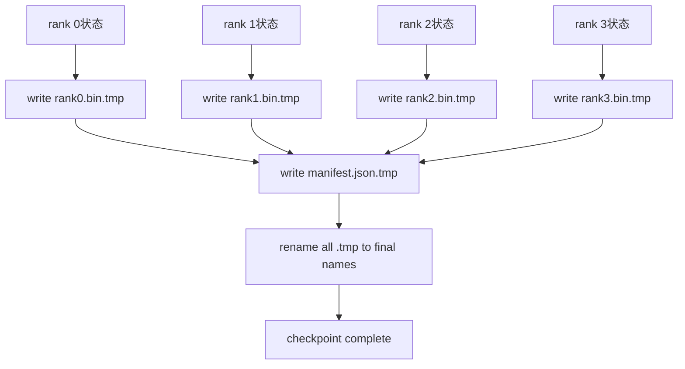

# 分片检查点与原子恢复

> 一个70B参数的训练任务每隔几小时就会因节点故障而中断。检查点格式决定了你是损失30分钟还是30小时。分片检查点并行写入每个 rank 的 shard，并通过 manifest 记录所有权。恢复时从各自的文件加载每个 rank 的 shard，在同一 world size 下重建状态，优化器像什么都没发生一样继续步进。原子写入防止半成品检查点污染下一次恢复。

**类型：** 构建
**语言：** Python
**前置要求：** 第19阶段C轨道课程42-49
**时间：** 约90分钟

## 学习目标

- 将多 rank 检查点保存为每个 rank 的独立 shard 文件，加上记录各 rank 所有权的 manifest。
- 使用原子写入模式（先写入临时路径再重命名），确保写入过程中的崩溃永远不会产生半成品检查点。
- 从 manifest 恢复，在每个 rank 上验证 fp16 参数和 ZeRO 优化器状态是否字节级相等。
- 防御三种故障模式：world size 变化、shard 数量不匹配、部分写入。

## 问题所在

普通检查点将所有参数和优化器状态收集到 rank 0，写入单个文件。对于70B模型，这意味着1.1TB的状态数据要通过一个 rank 的网络端口。写入过程阻塞了所有其他 rank，因为它们空闲等待收集完成。IO 带宽受限于单个 GPU 最慢的网络链路，而非聚合带宽。在真实集群上，收集后再写入的步骤可能比前一小时的训练时间还长，这意味着每天训练只能完成不到一个检查点。

分片检查点翻转了这个模式：每个 rank 并行地将自己的 shard 写入自己的文件。manifest 记录了哪个 rank 拥有哪个 shard，这样恢复时可以将每个 shard 放回原位。聚合写入带宽随集群规模扩展。一个通过单个 rank 需要4小时的1TB检查点，通过64个 rank 只需要4分钟。此外，manifest 提供了不兼容恢复的检测机制：world size 变化可检测，部分写入可检测，加载路径可以发出明确警告而不是静默地使用陈旧数据。

## 概念



### Manifest Schema

```json
{
  "world_size": 4,
  "step": 1234,
  "wall_clock_seconds": 4521,
  "shards": [
    {"rank": 0, "path": "rank0.bin", "sha256": "...", "param_shard_offset": 0, "param_shard_numel": 65536},
    {"rank": 1, "path": "rank1.bin", "sha256": "...", "param_shard_offset": 65536, "param_shard_numel": 65536}
  ],
  "schema_version": 1
}
```

三个字段是加载时的关键保障。`world_size` 确保在不同 size 下恢复时能发出明确失败而非静默损坏。每个 shard 的 `sha256` 捕获部分或损坏的写入。每个 shard 的 `param_shard_offset` 和 `param_shard_numel` 让加载器能在正确位置重建扁平化的参数张量。

### 原子写入

标准模式：将每个 shard 写入 `<name>.tmp`，将 manifest 写入 `manifest.json.tmp`，对每个文件执行 fsync，然后重命名。同一文件系统内的 POSIX rename 是原子的；要么新文件完全存在，要么旧的还在。最终重命名前的崩溃会让之前的检查点保持活动状态。没有原子写入时，崩溃可能留下一个部分 shard 配上指向它的 manifest，加载时会在恢复时损坏优化器状态。

### Schema必须防御的三种故障模式

| 故障 | 症状 | 防御 |
|---------|---------|---------|
| World-size change | 用 N=4 的 manifest 在 N=8 上恢复 | manifest 中 world_size 不匹配，发出明确失败 |
| Shard count mismatch | 恢复时看到的 rank*.bin 文件数少于 manifest 中的 shard 数量 | 枚举 shards，逐一验证存在性 |
| Partial write | shard 文件在 flush 中途被截断 | 加载时进行 sha256 验证 |

每种防御都能早期拒绝不良加载；否则沉默的损坏会在100步后以 loss 变为 NaN 的方式暴露。

### 为什么用 per-rank 文件而非一个大文件

通过 `O_APPEND` 向单个文件并发写入在 POSIX 上对字节对齐的写入是可行的，但实际上一个 shard 内的偏移跨越 MB 级区域，锁竞争成为主要瓶颈。Per-rank 文件不存在争用，且当下层文件系统是并行文件系统（Lustre、GPFS）时能从条带化中受益。生产级框架（DeepSpeed、FSDP、NeMo）都因此使用 per-rank 文件。

```figure
ci-sharded-checkpoint
```

## 实现

`code/main.py` 实现了：

- `ShardManifest` 数据类，包含上述 schema 以及 `to_json`/`from_json` 方法。
- `save_sharded(state_dict_per_rank, dir, step)` 使用原子临时写入后重命名的模式将每个 rank 的二进制状态写入各自文件，然后写入 manifest。
- `load_sharded(dir, expected_world_size)` 读取 manifest，验证每个 shard 的 sha256，返回 per-rank 的 state dict。
- 往返测试：构建 per-rank 状态，保存，加载，断言字节级相等。

运行：

```bash
python3 code/main.py
```

输出：写入4个 shard 文件和 manifest，然后重新加载并验证字节级相等。

## 生产环境模式

三种模式让检查点足够健壮以满足生产要求。

**异步写入。** 生产级框架在单独的线程或进程中发起检查点写入，让训练继续。屏障在于下一个检查点：前一个保存完成前不启动下一次保存。DeepSpeed 的 `async_io` 标志正是如此。本教程保持同步写入以便步骤可见。

**先写入本地高速磁盘，再异步上传。** 写入本地 NVMe（快速），然后异步上传到 S3 或 GCS。这种两层模式让集群内的检查点快速恢复，同时将持久副本发送到集群外归档。manifest 携带本地路径；上传 manifest 携带远程路径。

**轮换很重要。** 生产运行保留最后 K 个检查点（通常3-5个）并轮换删除最旧的。没有轮换时磁盘会在运行中途填满，导致下一个检查点失败。有轮换时，下一次保存会先删除最旧的，释放配额。

## 使用方式

生产级模式：

- **DeepSpeed 检查点。** `deepspeed.save_checkpoint(tag=step)` 写入 per-rank 文件和指向当前 tag 的 `latest` 文件。
- **PyTorch FSDP 检查点。** `torch.distributed.checkpoint` 使用 `Planner` 保存分片状态，决定 per-rank 布局。
- **NeMo。** 用统一的 `save_to_checkpoint` API 封装 DeepSpeed 和 FSDP，并添加元数据。

## 交付

第81课保存端到端 DDP+ZeRO 运行的分片检查点，并在相同 world size 下重新加载，以证明恢复契约成立。

## 练习

1. 添加异步写入：在后台线程发起保存，让训练继续。直到前一个保存完成才阻塞下一次保存。
2. 添加 `last_5_steps` 轮换：保留最近的5个检查点，在保存新检查点前删除最旧的。
3. 为内循环重载添加仅 CRC 的快速验证路径（轮换时将检查点提升为新活动状态，无需完整 sha256）。
4. 添加跨 world-size 加载：通过读取 manifest、合并、重新分片，实现从 N=4 到 N=8 的 shard 重新平衡。
5. 添加上传到伪 S3（第二个目录）并写入上传 manifest。防御两层存储策略。

## 关键术语

| 术语 | 人们怎么说 | 实际含义 |
|------|----------------|------------------------|
| Sharded checkpoint | "Per-rank save" | 每个 rank 并行写入自己的 shard 文件 |
| Manifest | "Index" | 记录 shard 路径、偏移和 sha256 的 JSON 文件 |
| Atomic write | "tmp then rename" | 写入 .tmp 后再 POSIX 重命名，使崩溃时前一个文件保持有效 |
| Partial write | "Truncated shard" | 写入过程中的崩溃会产生损坏的 shard；sha256 能检测到 |
| Rotation | "Keep last K" | 写入新检查点前先删除最旧的，以限制磁盘使用 |

## 延伸阅读

- [DeepSpeed checkpointing](https://deepspeed.readthedocs.io/en/latest/model-checkpointing.html)
- [PyTorch torch.distributed.checkpoint](https://pytorch.org/docs/stable/distributed.checkpoint.html)
- [POSIX rename atomicity](https://pubs.opengroup.org/onlinepubs/9699919799/functions/rename.html)
- Phase 19 Lesson 78 - the ZeRO state this checkpoint is shaped to save
- Phase 19 Lesson 81 - the end-to-end demo round-trips the saved state
