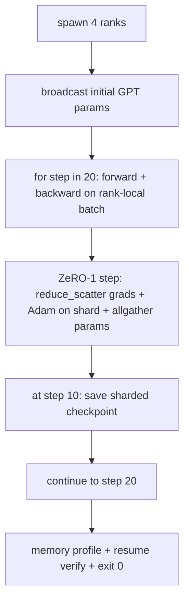

# 端到端分布式训练

> 第76至80课各自构建了其中一个组件。本课是组装：使用DDP进行梯度同步、ZeRO-1进行优化器状态分片，并在中途进行分片检查点的极小型GPT跨4个模拟rank训练。演示运行20步后自动终止，输出损失曲线和内存配置文件，并写入可恢复的检查点。

**类型：** 构建
**语言：** Python
**前置知识：** Phase 19 Track C 第42-49课
**耗时：** 约90分钟

## 学习目标

- 将DDP（第77课）、ZeRO-1（第78课）和分片检查点（第80课）组合成一个训练循环。
- 在小合成语料库上跨4个模拟rank训练2层transformer语言模型共20步。
- 打印每步损失表、每个rank的内存配置，以及能在相同world size下字节级恢复的检查点清单。
- 论证组合的正确性：每个组件在前面的课中都已独立测试，本课证明它们能够组合工作。

## 问题

封顶项目是证明各组件能够协同工作的试金石。第76课实现了collectives，第77课将它们封装成DDP，第78课用reduce_scatter实现了优化器状态的分片，第79课分析了流水线，第80课保存了分片检查点。每个课程都有自己的测试，能够独立成立。但一次真正的训练运行会同时使用每一个原语；如果组合有误，损失会发散、检查点拒绝恢复，或者每个rank的内存该缩减时反而增长。

本课运行端到端演示并验证四个不变量：(a) 损失在20步内单调递减（在浮点噪声范围内），(b) 每个rank在每个步骤持有相同的参数范数，(c) 每个rank的优化器内存等于ZeRO-1公式 `12P/N` 字节，(d) 步骤10的检查点重启时字节级相等。演示自终止：20步、一条命令、exit 0。

## 概念



### 微型GPT

模型故意设计得很小：2个transformer块、嵌入维度32、4个注意力头、词表64、序列长度16、批量4。几千个参数。足够大以锻炼每一个接线决策（多头注意力走标准掩码路径；LayerNorm有需要同步的权重；LM头是单独投影回词表的线性层）。足够小以至于20步在4个CPU rank上几秒内就能完成。

### 组合规则

| 课程组件 | 负责什么 | 留给循环什么 |
|--------------|--------------|----------------------------|
| DDP broadcast | 初始参数同步 | 构造时调用一次 |
| ZeRO-1 step | 梯度同步、主副本更新、参数广播 | 每步调用一次，替代optimiser.step |
| Sharded checkpoint | 持久化每rank状态、带sha256的清单 | 在rank 0调用，通过allgather收集状态 |
| Training loop | 前向、反向、损失记录 | 按顺序调用上述三项 |

循环不感知reduce_scatter或rendezvous文件。ZeRO和checkpoint模块暴露窄接口，由循环来组合。

### 为什么是微型GPT而非MLP

第77课的MLP足以验证梯度同步。微型GPT增加了三样东西：一个独立的覆盖词表的LM头（本课中为清晰起见不解耦权重；完整GPT通常将头与token嵌入共享）、softmax+cross-entropy作为损失（比MSE有更多的数值边界情况）、非对称前向传播（embeddings → attention → MLP 每层）。封顶项目继续用MLP会掩盖组合是否正确处理了LayerNorm或嵌入层梯度的形状。

### 自终止意味着exit 0

循环运行固定20步后退出。没有`while True`，无需人工干预，不从外部状态恢复。一个你可以无人值守地运行、完成后找到完整日志的封顶项目，才是证明系统接线正确的封顶项目。如果任何组件死锁，演示永远不会返回，测试框架会捕获它。

```figure
ci-distributed-assembly
```

## 构建

`code/main.py` 实现了：

- `MiniGPT`：带掩码自注意力和独立LM头的2层transformer。
- `make_corpus(seed, total_tokens)`：确定性下一个token预测数据。
- `_train_worker`：每rank派生；广播初始参数、运行循环、调用ZeRO步骤、在步骤10写入分片检查点。
- `verify_resume`：主运行后，在进程内重新加载步骤10检查点并断言保存的主分片与内存快照字节级匹配。
- `main`：编排整个演示，打印损失表、内存配置和验证结果。

运行：

```bash
python3 code/main.py
```

输出：20行损失表、4行每rank内存配置、检查点清单，成功时打印"RESUME VERIFIED"。

## 生产环境中的模式

三种模式完成真实运行的组合。

**每隔K分钟保存检查点，而非每隔K步。** 步长时间随序列长度和微批量数量变化。10分钟的检查点频率无论模型大小都能捕获相同的计算量。本课为简单使用基于步长的；生产环境使用基于墙钟的。

**尽早检测发散。** 生产运行在反向传播后添加NaN保护器和损失尖峰检测器；如果损失在一跳内跳跃超过2倍，回滚到上一个检查点而非让优化器 marches 进入退化状态。本课的损失曲线平滑所以保护器未被使用但钩子保留。

**在rank间聚合内存配置。** 真实运行中每个rank的内存不同（拥有最大pipeline stage的rank持有更多activations）。生产环境记录跨rank的最大值加平均值；本课打印每个rank的值以显示公式匹配。

## 使用

生产模式：

- **DeepSpeed。** 将DDP + ZeRO + pipeline + activation checkpointing组合在一个配置下。本课的组合是缩小版的DeepSpeed形态。
- **PyTorch FSDP。** 原生等价物。`FullyShardedDataParallel` 配 `ShardingStrategy.SHARD_GRAD_OP` 就是ZeRO-2。
- **NeMo和Megatron-LM。** 为极大的模型添加tensor parallel；否则组合形态相同。

## 交付

整个track到此结束。这6课一起构成了一个真实团队在采用DeepSpeed前会构建的分布式训练子系统；抽象已在gloo上验证，各种失败模式也已演练过。Phase 17（基础设施与生产）是将这个组合带到真实集群的地方。

## 练习

1. 添加注意力头的tensor-parallel分割，并验证损失与单rank基线匹配。两个rank：每个rank一半的heads，对注意力输出做allreduce。
2. 在4个microbatch上添加gradient accumulation，并证明梯度等于一个大batch的梯度。
3. 添加从步骤10恢复的路径，实际继续训练到步骤20并产生与原始运行相同的最终损失。
4. 添加指标导出（loss、grad norm、step time）到JSONL，以便事后可视化运行。
5. 添加NaN保护器，在损失尖峰时回滚到上一个检查点，并用一步LR倍增强制产生尖峰来演练回滚。

## 关键术语

| 术语 | 人们怎么说 | 实际含义 |
|------|----------------|------------------------|
| End-to-end | "把所有东西接起来" | 一次运行组合所有组件，而非每个组件一个单元测试 |
| Memory profile | "每个rank多少GB" | 每个rank上为params、gradients、optimiser state持有的字节数 |
| Resume contract | "保存和加载" | 一次检查点往返后每rank状态字节级相等 |
| Self-terminating | "有界运行" | 固定步数，完成时exit 0，无需人工介入 |

## 延伸阅读

- [DeepSpeed end-to-end training tutorial](https://www.deepspeed.ai/getting-started/)
- [PyTorch FSDP advanced tutorial](https://pytorch.org/tutorials/intermediate/FSDP_advanced_tutorial.html)
- [Megatron-LM training script reference](https://github.com/NVIDIA/Megatron-LM)
- Phase 19 Lessons 76-80 — 本课组合的每个组件
- Phase 17 — 将组合迁移到真实集群
