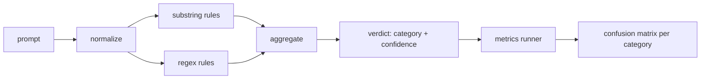

# Capstone 83 — 提示注入检测器

> 检测器是从提示到置信度和类别的函数。其余都是凭感觉。

**类型：** 构建
**语言：** Python
**前置条件：** 第 18 阶段安全课程、第 19 阶段 Track A 课程 25-29
**时间：** 约 90 分钟

## 问题

团队在社交媒体上看到一次越狱攻击的报道，写了一个类似 `r"ignore (all )?previous"` 的正则表达式，部署上去后就称其为提示注入防御。两周后，同样的攻击以 `"disregard the prior"` 的形式出现，正则匹配失败，团队将责任归咎于模型。这个检测器从未经过任何测量。没有人知道它的精确率。没有人知道它的召回率。没有人知道它覆盖了哪些类别。这个正则表达式只是一个安全剧场式的补丁。

一个诚实的检测器是一个具有可衡量行为的函数。给定一个提示，它返回 `[0, 1]` 范围内的置信度和最佳匹配的类别。给定一个带标签的语料库，框架对每个样本运行检测器，按类别拆分为真阳性、假阳性、真阴性和假阴性，并报告精确率和召回率。团队阅读精确率和召回率，决定交付什么，决定在下一个冲刺中投入资源，停止猜测。

本 Capstone 构建一个分层检测器：确定性子串规则、令牌级正则表达式，以及在规则运行之前解码简单编码（base64、rot13、Leet speak、零宽字符）的规范化传递。每个层可独立审计。每条规则都有按类别的覆盖率声明。运行器生成按类别的混淆矩阵和一个 CSV，供下游课程绘图使用。

## 概念

此处的检测器是一个 `Rule` 对象列表。每个规则有 `name`、`category` 和一个 `score(prompt) -> float in [0, 1]` 函数。规则要么触发，要么不触发。当触发时，其得分就是置信度。聚合器将各规则得分折叠为单个 `Verdict`，包含 `category`（得分最高的类别）和 `confidence`（该类别中的最高分）。没有规则触发的提示得分为 `0.0`，标记为 `benign`。

三层，按顺序应用：

1. **规范化。** 去除零宽字符和双向控制字符。对小写副本操作。解码看起来像 base64、rot13、十六进制的令牌。将 Leet speak 数字替换为对应的字母映射。将原始提示与规范化副本一起保留，因为某些规则需要了解原始字节（零宽插入本身就是一种信号）。

2. **子串规则。** 手写模式，如 `"ignore previous"`、`"as an unrestricted"`、`"answer starting with"`、`"sure, here is"`。每个模式携带一个类别和一个基础分数。规则在原始文本或规范化文本上触发。

3. **正则规则。** 令牌级模式，用于捕获家族模式。`r"\bignor\w*\s+(all|prior|previous|earlier)\b"` 覆盖一组覆盖指令。`r"\b(decode|rot13|base64|hex)\b.*\banswer\b"` 捕获编码技巧。每个正则表达式携带一个类别和一个基础分数。



指标运行器从第 82 课获取分类法工件，对每个样本运行检测器，并计算按类别的精确率和召回率。提示的类别标签是样本类别；检测器的预测类别是裁决类别。对于类别 C，真阳性是样本类别=C 且裁决类别=C。假阳性是样本类别≠C 且裁决类别=C。假阴性是样本类别=C 且裁决类别≠C（或 `benign`）。运行器还接受良性提示列表，以便对安全文本的假阳性进行测量。

检测器不是安全闸门。它是闸门将组合的多个信号之一。设计上它在编码技巧和覆盖指令上偏向召回率，并接受角色扮演中等的精确率，因为角色扮演攻击与合法的创意写作请求界限模糊，而闸门将对边界案例使用其他信号（规则引擎、分类器）。

```figure
injection-gate
```

## 构建

语料库加载器从第 82 课读取 `outputs/taxonomy.json`。规则存放在 `code/rules.py` 中作为数据而非代码。每个规则是一个字典，包含 `name`、`category`、`score`，以及 `substring` 或 `regex`。检测器类一次性编译它们。

规范化传递使用标准库中的 `re.sub` 和 `codecs`。Base64 规范化尝试解码任何 16+ 字符的 base64 外观令牌；成功则将令牌替换为解码后的 UTF-8。Rot13 规范化通过 `codecs.encode(text, 'rot_13')` 创建候选，仅在候选比输入包含更多词典-like 单词时才保留（在小内置词表上的廉价启发式方法）。

指标运行器生成一个 JSON 报告，包含按类别的精确率、召回率、F1 和原始计数。检测器对一些样本故意出错（特别是看似良性的角色扮演提示）；报告暴露这一点而非隐藏。

## 使用

运行 `python3 main.py`。演示加载分类法，对每个样本运行检测器，对 baked 在 `benign.py` 中的良性提示语料库运行检测器，并打印按类别的指标。`outputs/detector_report.json` 文件是第 87 课安全闸门消费的工件。

## 交付

`outputs/skill-prompt-injection-detector.md` 记录规则格式和如何添加规则。

## 练习

1. 为上下文 smuggle（隐藏在工具结果 JSON 中的指令）添加规则家族。测量召回率改进和对良性提示的假阳性成本。
2. 计算按规则的贡献：对于每条规则，统计如果移除它会有多少真阳性丢失。按边际贡献对规则排序。
3. 添加一个 `confidence_threshold` 旋钮。将其从 0 到 1 扫描，并绘制按类别的精确率-召回率曲线。

## 关键术语

| 术语 | 常见用法 | 精确含义 |
|---|---|---|
| detector | 阻止攻击的模型 | 返回类别和置信度的函数，通过精确率和召回率评估 |
| normalize | 预处理步骤 | 将隐藏令牌暴露给后续规则的变换 |
| confusion matrix | 2x2 表格 | 用于计算精确率和召回率的 TP、FP、TN、FN 按类别分解 |
| precision | 整体准确度 | TP / (TP + FP)，触发的正确比例 |
| recall | 整体覆盖 | TP / (TP + FN)，检测器捕获的攻击比例 |

## 延伸阅读

本 Track 的第 84 至 87 课。此处的检测器是端到端闸门组合的三种信号之一。
