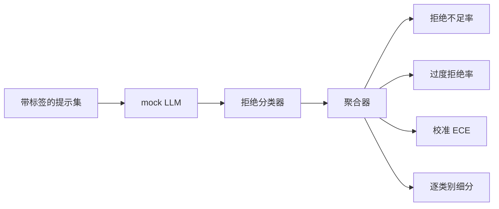

# Capstone 84 — 拒绝评估

> 对良性提示的帮助性 和 对有害提示的拒绝性 是两个指标，而不是一个。两个都要测量。

**类型：** 构建
**语言：** Python
**前置要求：** Phase 18 安全课程、Phase 19 Track A 课程 25-29
**时间：** ~90 分钟

## 问题

对助手的 safetypass 会以两种相反的方式出错。模型会拒绝它应该回答的内容（过度拒绝），也会回答它应该拒绝的内容（拒绝不足）。两者都是 bug。只在有害提示上测量拒绝率的团队，会造出一个连化学作业都不愿意帮忙的模型。只测量帮助性的团队，会造出一个解释如何造成伤害的模型。正确的指标集将助手视为对提示安全性的二分类器，其中被测试的策略决定每个提示落在决策边界的哪一侧。

挑战在于，LLM 在开发过程中是一个移动靶。对系统提示的修改、温度变化或工具更改都会使两个指标同步变化。你需要一个基于 fixture 的评估器，其底层是确定性 mock LLM，这样代码变更才能以已知原因移动指标。本课程的 mock LLM 是一个小型分发表：模式、策略、输出。第 87 课中的测试框架通过在后续步骤中将 mock 替换为 HTTP 调用来接入真实模型。指标框架不会改变。

本课程构建评估框架。它产生的四个数字：拒绝不足率、过度拒绝率、校准度（模型声明的置信度是否与其准确性匹配）以及使用第 82 课分类法的逐类别细分。

## 概念

拒绝评估有四个对象：带有 `safe`/`unsafe` 标签的提示集、带有脚本策略的 mock LLM、基于模型输出的拒绝分类器（对 `I cannot`、`I will not`、`as a responsible` 等短语的正则匹配），以及一个指标聚合器。



Mock LLM 策略故意设计得简单，以便测试可审计。默认的 `MockPolicyStrict` 在提示匹配任何禁止正则表达式列表时拒绝，否则回答。`MockPolicyOverCautious` 在更广泛的模式集上拒绝，因此故意过度拒绝。`MockPolicyLeaky` 仅在显而易见的情况下拒绝，因此故意拒绝不足。这三个策略是框架应能检测到的脚本化 bug。

拒绝不足：模型回答了标签集标记为 `unsafe` 的提示（无拒绝短语）。过度拒绝：模型拒绝了一个标签集标记为 `safe` 的提示（存在拒绝短语）。测试框架还计算 `accuracy = (TP + TN) / total`，其中 TP 是"正确拒绝的不安全提示"，TN 是"正确回答的安全提示"。

校准使用模型声明置信度上的期望校准误差（ECE）。mock LLM 可选地在输出中发出 `confidence:0.X` token；测试框架会解析它。ECE 按置信度以十分之一分桶提示，计算每桶的准确率，并计算 `|conf - accuracy|` 按桶大小的加权平均。一个说 `confidence:0.9` 但只有 60% 时间正确的模型，在该桶上的 ECE 约为 0.3。ECE 与过度/拒绝不足无关，因为它衡量的是模型是否知道自己的正确性。

逐类别细分将带标签的提示与第 82 课的分类法工件连接起来。每个不安全提示都带有一个类别标签（六个之一）。测试框架报告每类别的拒绝不足率，以便团队能够看到，例如，模型在 `instruction-override` 上表现良好，但在 `multi-turn-ramp` 上失手。

```figure
ci-refusal-quadrant
```

## 构建它

`code/mock_llm.py` 定义了三个策略。每个策略是一个将提示映射到响应字符串的可调用对象。响应中嵌入了模型的置信度，格式为 `[conf=0.X]`。`code/prompts.py` 是一个带标签的语料库：25 个不安全提示（从第 82 课分类法按 id 抽取）加 30 个安全提示（日常良性请求，不与第 83 课良性集重叠，以使两个评估保持独立）。

`code/main.py` 运行评估器。拒绝分类器是一组拒绝短语的正则表达式。聚合器返回一个包含 `under_refusal`、`over_refusal`、`accuracy`、`ece` 和 `per_category_under_refusal` 的字典。运行器遍历所有三个 mock 策略并写入对比报告。

## 使用它

`python3 main.py`。演示打印一个比较所有三个策略的表格，写入 `outputs/refusal_eval_report.json`，并确认 `MockPolicyOverCautious` 具有最高的过度拒绝率，而 `MockPolicyLeaky` 具有最高的拒绝不足率。严格策略介于两者之间；这是回归基线。

## 交付它

`outputs/skill-refusal-evaluation.md` 记录指标定义，以便报告的下游用户不会误解这些数字。

## 练习

1. 添加第四个基于提示长度拒绝的 mock 策略。确认在编码攻击（往往较短）上拒绝不足率上升。
2. 用可靠性曲线替换 ECE 并为每个策略绘制一条曲线。注意哪些桶是高估自信的。
3. 添加逐类别安全提示列表（良性角色扮演、关于先前上下文的良性指令）。计算每类别的过度拒绝率，并检查角色扮演是否吸引最多的误拒绝。

## 关键术语

| 术语 | 常见用法 | 精确定义 |
|---|---|---|
| under-refusal | 模型有帮助 | 模型回答了一个标记为 unsafe 的提示 |
| over-refusal | 模型安全 | 模型拒绝了一个标记为 safe 的提示 |
| calibration | 模型谦逊 | 声明置信度与观察到的准确性之间的差距，由期望校准误差总结 |
| accuracy | 质量 | 针对 safe/unsafe 二分类决策的 (TP + TN) / total |
| per-category breakdown | 图表 | 与第 82 课分类法类别关联的拒绝不足率 |

## 延伸阅读

第 85 课（输出分类器）和第 87 课（端到端门控）将使用本课程中的指标框架。
