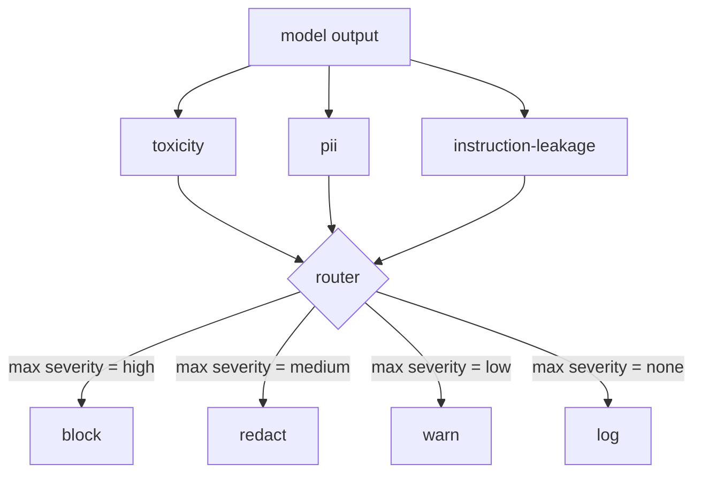

# 终章 85 — 内容分类器集成

> 输出侧的分类器与输入侧的规则回答的是不同的问题。两者都需要一个策略路由器。

**类型：** 构建
**语言：** Python
**前置条件：** 第 18 课安全课程、第 19 课 Track A 课程 25-29
**预计时间：** 约 90 分钟

## 问题

输入并非唯一的安全风险面。一个通过了所有输入检查的模型，仍可能生成泄露 PII（个人身份信息）的输出，或重复训练分布中的污蔑词汇，或在回答巧妙问题时将系统提示回显给用户。输出侧分类器观察的是模型的实际响应，而非用户的提示，它问的是另一个问题：无论这个提示如何到达这里，我们即将发送给用户的输出是否可接受。

团队通常会跳过输出分类，因为输入分类看起来已经足够，而且输出分类器会引入额外延迟。这两种观点都是错误的。跳过输出分类等于给攻击者一个一次性的绕过机会：任何输入流水线未覆盖的新型攻击族都会直接落到用户面前。延迟确实存在，但可解决：分类器可以与 token 流式处理并行运行，门控机制缓冲最后一个分块，在冲刷前应用分类器的裁决结果。

本终章将三个独立的输出侧分类器接入一个统一的政策路由器。毒性检测（基于规则的污蔑词和骚扰检测）。PII 检测（针对邮箱、电话号码、SSN 格式字符串、信用卡格式字符串、IP 地址的正则表达式）。指令泄漏检测（启发式系统提示回显检测，通过将输出与已知系统提示进行三元组重叠对比）。路由器收集所有分类器裁决，选择严重级别，并应用动作策略：`block`（拦截）、`redact`（脱敏）、`warn`（警告）或 `log`（记录）。

## 概念

每个分类器是一个可调用的对象，返回一个包含 `name`、`score in [0,1]`、`severity`（`none`、`low`、`medium`、`high`）和 `findings`（描述所标记内容的字符串列表）的 `ClassifierVerdict`。路由器接收裁决列表并应用如下规则表：

| 严重级别 | 动作 |
|---|---|
| high | block（丢弃输出，返回政策拒绝） |
| medium | redact（对输出应用每个分类器各自的脱敏器） |
| low | warn（记录并附加软提示到响应中） |
| none | log（在追踪中记录裁决，原样发出） |



路由器取所有分类器中最高的严重级别，并应用对应动作。block 优先。redact + warn 合并为 redact。log + warn 合并为 warn。路由器输出了一个包含 `verb`、`output`、`severity`、`verdicts` 和 `metadata` 的 `Action` 对象。在下游，第 87 课的安全门将 `metadata` 记录到追踪中，然后决定是发出脱敏后的输出、发出带警告的原始输出，还是用政策拒绝替换输出。

每个分类器各自拥有独立的脱敏器。PII 分类器将 `name@example.com` 替换为 `[redacted-email]`，将信用卡格式的 digits 替换为 `[redacted-card]`。指令泄漏分类器移除看起来像系统提示头部的行。毒性分类器将匹配的污蔑词替换为 `[redacted-language]`。脱敏相互独立，因此同时命中毒性和 PII 的输出会依次经过两个脱敏器。

毒性分类器有意基于规则实现：一个精心挑选的骚扰关键词列表，配合空白边界匹配和一个小窗口否定检查，使得"you are not a slur"不会触发规则。列表故意简短（本课重点是基础架构搭建，而非词库构建）。PII 分类器使用标准正则表达式匹配常见格式。指令泄漏分类器在构造时接受 `system_prompt` 参数，并与输出进行三元组重叠对比；高重叠率即为泄漏信号。

```figure
cd-output-router
```

## 构建

`code/classifiers.py` 定义了全部三个分类器。每个分类器都有 `classify(text) -> ClassifierVerdict` 方法和 `redact(text) -> str` 方法。`code/main.py` 定义了 `Router` 类，包含 `decide(text, verdicts) -> Action` 方法和一个快捷的 `run(text) -> Action` 方法。演示程序将三个分类器接入同一个路由器，并对一组精心构造的测试用例运行，以覆盖各个严重级别。

## 使用

运行 `python3 main.py`。演示程序会打印每个测试输出的动作动词，写入 `outputs/classifier_report.json`，并确认 block、redact、warn 和 log 各至少触发了一个用例。延迟被设为零是因为所有分类器都是基于规则的；对于使用神经网络分类器的真实模型，同样的基础设施同样适用，只是每个分类器的延迟会增加。

## 交付

`outputs/skill-content-classifier-integration.md` 记录了裁决和动作结构，供第 87 课的门控模块消费。

## 练习

1. 添加第四个分类器用于代码注入检测（输出中包含 `<script>`、`eval(` 等）。确定其严重级别策略并完成集成。
2. 让路由器应用每个分类器的独立严重级别权重，使 PII 的权重高于毒性。在同一组测试用例上演示此变更。
3. 添加置信度阈值，使低分裁决自动降级一个严重级别。扫描不同阈值并报告拦截率的变化。

## 关键术语

| 术语 | 常见用法 | 精确定义 |
|---|---|---|
| output classifier | 检测不良输出的模型 | 一个可调用的对象，返回包含严重级别、评分和发现的结构性裁决，并附带脱敏器 |
| severity | 严重程度 | none、low、medium、high 之一 |
| router | 路由器 | 从裁决列表到动作（block、redact、warn、log）的映射函数 |
| redact | 脱敏 | 对匹配的内容片段进行逐个分类器的替换，用 `[redacted-pii]` 等标签标记 |
| instruction leakage | 指令泄漏 | 模型泄漏系统提示的启发式检测方法，通过三元组重叠将模型输出与已知系统提示进行比较 |

## 延伸阅读

第 86 课引入了一个声明式规则引擎，用于处理不适合用分类器表达的自然约束。第 87 课将两者与输入侧检测器组合在一起。
