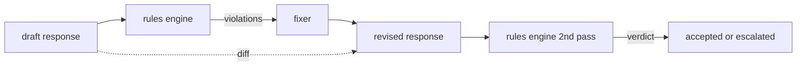

# Capstone 86 — 宪法规则引擎

> 一条规则由名称、谓词和说明构成。缺少其中任何一项的，是氛围，不是规则。

**类型：** 构建
**语言：** Python, YAML
**前置条件：** 第 18 课安全章节、第 19 课 Track A 第 25-29 课
**时间：** ~90 分钟

## 问题

分类器处理可识别的失败。规则引擎处理契约式的失败。编写编码助手的团队需要一个约束，如"每条包含代码的响应必须以下载可运行代码块或明确声明假设结束"。运行客服机器人的团队需要"每条拒绝必须提供下一步操作"。这些约束不是自然的分类器目标。它们是对响应、对话和系统策略的谓词，且需要让非工程师可读。

诚实的表达是一种声明式文件。宪法以 YAML 形式与代码并存，纳入版本控制，有独立的审阅流程。每条规则包含 `name`、`predicate`、`severity` 和 `explanation` 模板。引擎加载文件，对候选输出评估每条规则，并对触发的每条规则返回结构化的 `Violation`。本 capstone 中的规则引擎用 `all_of`、`any_of` 和 `not_` 组合谓词，使单条规则能表达"若响应包含代码，必须以可运行代码块结尾且不得引用仅内部使用的库"。

本课的另一半是修订。仅能拦截的规则引擎是半成品。能提议修复的规则引擎才具备操作价值：助手起草响应，引擎标记违规，修复器生成修订响应，引擎确认修订满足规则。本课附带一个极简修复器（按规则的正则替换）和结构化的差异（草稿与修订之间的逐行增删改）。

## 概念



一条规则的结构如下：

```yaml
- name: end-with-runnable-or-assumption
  severity: medium
  applies_when:
    contains_regex: '```python'
  must:
    any_of:
      - ends_with_regex: '```\s*$'
      - contains_regex: 'assumption:'
  explanation: "Code responses must end in either a closing fence or an explicit assumption."
  fix:
    append_if_missing: "\n\nAssumption: example inputs are valid."
```

谓词是原子的：`contains_regex`、`not_contains_regex`、`ends_with_regex`、`starts_with_regex`、`max_words`、`min_words`。组合是 `all_of`、`any_of`、`not_`。引擎先评估 `applies_when`；若规则不适用，违规记录为 `not_applicable`。否则引擎评估 `must`，产生 `pass` 或 `violation`。

严重等级为 `low`、`medium`、`high`，与第 85 课保持一致。下游闸门（第 87 课）将 `high` 规则违规视为与 `high` 分类器判定相同：拦截。

修复器是一组声明式操作列表：`append_if_missing`、`prepend_if_missing`、`replace_regex`。每个操作按规则名映射到一个变换。修复器有意限于局部编辑；结构性重写属于另一层的拒绝与帮助模块，不在此覆盖。

差异是对原始和修订计算的。它是包含 `op`（add、remove、edit）和相关文本的 `Change` 记录列表。下游闸门可以记录差异，以便人工审阅者审计修复器的行为。

```figure
cd-constitution-loop
```

## 构建

`code/rules.yml` 保存宪法。`code/main.py` 中的加载器接受 YAML 文件（当 PyYAML 可用时）或 JSON 文件（内置）。本课附带一份 `rules.yml`，测试通过两条代码路径解析。`code/main.py` 定义 `Engine` 和 `Fixer` 类以及 `diff` 函数。组合谓词以递归方式评估，`any_of` 短路求值。

随课附带的宪法：

- `no-empty-refusal`（medium）——拒绝必须包含建议或重定向
- `end-with-runnable-or-assumption`（medium）——代码响应必须干净收尾
- `no-pii-in-examples`（high）——示例数据不得包含邮箱或电话号码
- `cite-when-asserting-fact`（low）——以"According to"开头的行必须包含括号引用
- `no-internal-library-leak`（high）——输出中不得出现 `internal-only` 和 `policybot-internal` 字样
- `bounded-length`（low）——响应不得超过 800 词

## 使用

`python3 main.py`。演示将三条草稿响应送入引擎，打印违规，运行修复器，打印差异，并写入 `outputs/rules_report.json`。其中一个样例含不适用规则（草稿中无代码块），报告中该规则显示 `not_applicable`，以便团队看到引擎确实显式评估了它。

## 交付

`outputs/skill-constitutional-rules-engine.md` 文档记录规则语法和修复器操作。

## 练习

1. 添加一条规则：当提示涉及安全时，每条响应必须包含"If this is urgent"短语。使用组合谓词。
2. 将正则修复器替换为带命名槽位的模板修复器。演示一条规则在新设计下的重写。
3. 添加一个指标端点：给定一批草稿，返回每条规则的违规率，以便团队观察哪条规则过触发。

## 关键术语

| 术语 | 常见用法 | 精确含义 |
|---|---|---|
| constitution | 模糊的策略文档 | 包含谓词、严重等级和说明的 YAML 规则文件 |
| predicate | 检查 | 从文本到布尔值的可调用的，原子或通过 all_of/any_of/not_ 组合 |
| violation | 失败 | 含规则名、严重等级、说明和匹配片段的 структурированный记录 |
| fixer | 模型微调 | 按规则确定的变换，将草稿映射为修订 |
| diff | 字符串比较 | 草稿与修订之间增、删、改操作的結構化列表 |

## 延伸阅读

第 87 课将此引擎与输入侧检测器和输出侧分类器组合为单一安全闸门。
