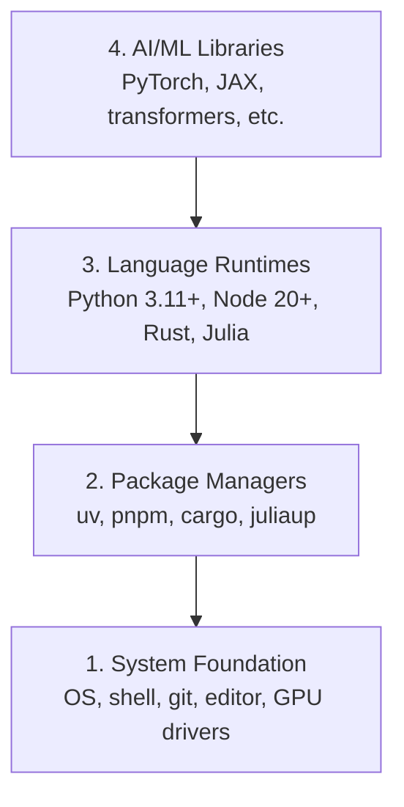

# 开发环境

> 工具塑造思维。一次设置，终身受用。

**类型：** 构建
**语言：** Python、Node.js、Rust
**前提条件：** 无
**时间：** 约 45 分钟

## 学习目标

- 从零开始搭建 Python 3.11+、Node.js 20+ 和 Rust 工具链
- 为可复现的构建配置虚拟环境和包管理器
- 通过 CUDA/MPS 验证 GPU 访问并运行测试张量操作
- 理解四层技术栈：系统层、包层、运行时层、AI 库层

## 问题所在

你将通过 200 多节课程学习 AI 工程，涉及 Python、TypeScript、Rust 和 Julia。如果环境有问题，每节课都会变成与工具的斗争，而非真正的学习。

大多数人会跳过环境搭建。然后他们花数小时调试导入错误、版本冲突和缺失的 CUDA 驱动。我们要一次性把它做好。

## 核心概念

AI 工程环境包含四层：



我们自下而上安装。每一层都依赖于其下层。

## 开始构建

### 第一步：系统基础

检查系统并安装基础组件。

```bash
# macOS
xcode-select --install
brew install git curl wget

# Ubuntu/Debian
sudo apt update && sudo apt install -y build-essential git curl wget

# Windows (use WSL2)
wsl --install -d Ubuntu-24.04
```

### 第二步：使用 uv 管理 Python

我们使用 `uv` —— 它比 pip 快 10-100 倍，并能自动管理虚拟环境。

```bash
curl -LsSf https://astral.sh/uv/install.sh | sh

uv python install 3.12

uv venv
source .venv/bin/activate  # or .venv\Scripts\activate on Windows

uv pip install numpy matplotlib jupyter
```

验证：

```python
import sys
print(f"Python {sys.version}")

import numpy as np
print(f"NumPy {np.__version__}")
a = np.array([1, 2, 3])
print(f"Vector: {a}, dot product with itself: {np.dot(a, a)}")
```

### 第三步：使用 pnpm 管理 Node.js

用于 TypeScript 课程（代理、MCP 服务器、Web 应用）。

```bash
curl -fsSL https://fnm.vercel.app/install | bash
fnm install 22
fnm use 22

npm install -g pnpm

node -e "console.log('Node', process.version)"
```

### 第四步：Rust

用于性能关键的课程（推理、系统编程）。

```bash
curl --proto '=https' --tlsv1.2 -sSf https://sh.rustup.rs | sh

rustc --version
cargo --version
```

### 第五步：Julia（可选）

用于 Julia 擅长的数学密集型课程。

```bash
curl -fsSL https://install.julialang.org | sh

julia -e 'println("Julia ", VERSION)'
```

### 第六步：GPU 设置（如果有）

```bash
# NVIDIA
nvidia-smi

# Install PyTorch with CUDA
uv pip install torch torchvision torchaudio --index-url https://download.pytorch.org/whl/cu124
```

```python
import torch
print(f"CUDA available: {torch.cuda.is_available()}")
if torch.cuda.is_available():
    print(f"GPU: {torch.cuda.get_device_name(0)}")
```

没有 GPU？没问题。大部分课程在 CPU 上也能运行。对于训练密集的课程，可使用 Google Colab 或云端 GPU。

### 第七步：验证一切

运行验证脚本：

```bash
python phases/00-setup-and-tooling/01-dev-environment/code/verify.py
```

## 开始使用

你的环境现已准备好支持本课程的所有课程。以下是各语言的使用场景：

| 语言 | 应用阶段 | 包管理器 |
|------|----------|----------|
| Python | 阶段 1-12（机器学习、深度学习、自然语言处理、视觉、音频、大语言模型） | uv |
| TypeScript | 阶段 13-17（工具、代理、集群、基础设施） | pnpm |
| Rust | 阶段 12、15-17（性能关键系统） | cargo |
| Julia | 阶段 1（数学基础） | Pkg |

## 交付成果

本课程提供一个验证脚本，任何人都可以运行它来检查自己的环境设置。

参见 `outputs/prompt-env-check.md` 获取一个提示，可帮助 AI 助手诊断环境问题。

## 练习

1.  运行验证脚本并修复所有失败项
2.  为本课程创建一个 Python 虚拟环境并安装 PyTorch
3.  用四种语言分别编写并运行一个 "hello world" 程序