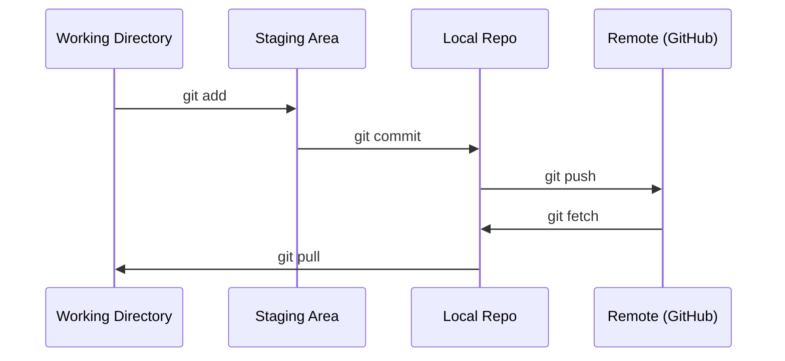

# Git 与协作

> 版本控制不是可选项。您在这里进行的每个实验、每个模型、每项学习都会被跟踪。

**类型：** 学习
**语言：** --
**前置要求：** 阶段 0，第 01 课
**时间：** 约 30 分钟

## 学习目标

- 配置 git 身份并掌握 add、commit、push 的日常工作流程
- 创建和合并分支，以便在不破坏主分支的情况下进行隔离实验
- 编写一个 `.gitignore` 以排除模型检查点和大型二进制文件
- 使用 `git log` 浏览提交历史，了解项目演变过程

## 问题所在

您即将跨越 20 个阶段编写数百个代码文件。如果没有版本控制，您将丢失工作成果，破坏无法撤销的东西，并且无法与他人协作。

Git 是工具，GitHub 是代码的托管平台。本课仅涵盖本课程所需的内容，不多也不少。

## 核心概念



需要记住的三件事：
1. 经常保存 (`git commit`)
2. 推送到远程 (`git push`)
3. 为实验创建分支 (`git checkout -b experiment`)

## 动手实践

### 第 1 步：配置 git

```bash
git config --global user.name "Your Name"
git config --global user.email "you@example.com"
```

### 第 2 步：日常工作流程

```bash
git status
git add file.py
git commit -m "Add perceptron implementation"
git push origin main
```

### 第 3 步：为实验创建分支

```bash
git checkout -b experiment/new-optimizer

# ... make changes, commit ...

git checkout main
git merge experiment/new-optimizer
```

### 第 4 步：操作本课程仓库

```bash
git clone https://github.com/rohitg00/ai-engineering-from-scratch.git
cd ai-engineering-from-scratch

git checkout -b my-progress
# work through lessons, commit your code
git push origin my-progress
```

## 学以致用

在本课程中，您只需要使用这些确切的命令：

| 命令 | 使用场景 |
|---------|------|
| `git clone` | 获取课程仓库 |
| `git add` + `git commit` | 保存您的工作 |
| `git push` | 将其备份到 GitHub |
| `git checkout -b` | 尝试某些操作而不破坏主分支 |
| `git log --oneline` | 查看您做了什么 |

就是这样。本课程不需要 rebase、cherry-pick 或 submodule。

## 练习

1. 克隆此仓库，创建一个名为 `my-progress` 的分支，创建一个文件，提交它，然后推送它
2. 创建一个 `.gitignore` 以排除模型检查点文件 (`.pt`, `.pth`, `.safetensors`)
3. 使用 `git log --oneline` 查看此仓库的提交历史，并阅读课程是如何添加的

## 关键术语

| 术语 | 人们常说 | 它的实际含义 |
|------|----------------|----------------------|
| 提交 (Commit) | “保存” | 在某个时间点对整个项目的一个快照 |
| 分支 (Branch) | “一个副本” | 指向某个提交的指针，在您工作时向前移动 |
| 合并 (Merge) | “组合代码” | 将一个分支的更改应用到另一个分支 |
| 远程 (Remote) | “云端” | 存储在其他地方（GitHub、GitLab）的仓库副本 |