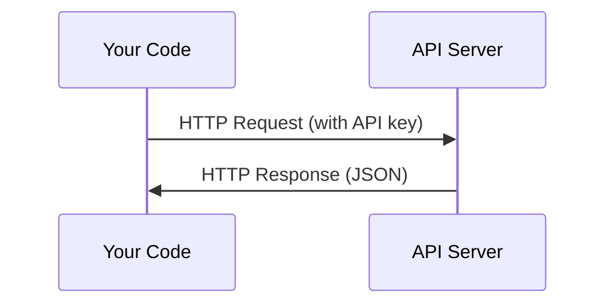

# API 与密钥

> 所有AI API的工作方式都相同：发送请求，获得响应。细节虽有变化，但模式始终不变。

**类型：** 构建
**编程语言：** Python, TypeScript
**先决条件：** 阶段0，课程01
**时间：** ~30分钟

## 学习目标

- 使用环境变量和 `.env` 文件安全地存储API密钥
- 使用Anthropic Python SDK和原始HTTP方式调用LLM API
- 比较基于SDK和原始HTTP的请求/响应格式以进行调试
- 识别并处理常见API错误，包括认证错误和速率限制

## 问题描述

从第11阶段开始，你将调用LLM API（Anthropic、OpenAI、Google）。在第13-16阶段，你将构建在循环中使用这些API的智能体。你需要了解API密钥的工作原理，如何安全存储它们，以及如何发起第一个API调用。

## 核心概念



每个API调用都包含：
1. 端点（URL）
2. API密钥（认证）
3. 请求体（你想要什么）
4. 响应体（你得到什么）

## 动手构建

### 步骤1：安全存储API密钥

切勿将API密钥直接写在代码中。使用环境变量。

```bash
export ANTHROPIC_API_KEY="sk-ant-..."
export OPENAI_API_KEY="sk-..."
```

或使用 `.env` 文件（将其添加到 `.gitignore`）：

```
ANTHROPIC_API_KEY=sk-ant-...
OPENAI_API_KEY=sk-...
```

### 步骤2：第一个API调用（Python）

```python
import anthropic

client = anthropic.Anthropic()

response = client.messages.create(
    model="claude-sonnet-4-20250514",
    max_tokens=256,
    messages=[{"role": "user", "content": "What is a neural network in one sentence?"}]
)

print(response.content[0].text)
```

### 步骤3：第一个API调用（TypeScript）

```typescript
import Anthropic from "@anthropic-ai/sdk";

const client = new Anthropic();

const response = await client.messages.create({
  model: "claude-sonnet-4-20250514",
  max_tokens: 256,
  messages: [{ role: "user", content: "What is a neural network in one sentence?" }],
});

console.log(response.content[0].text);
```

### 步骤4：原始HTTP（无SDK）

```python
import os
import urllib.request
import json

url = "https://api.anthropic.com/v1/messages"
headers = {
    "Content-Type": "application/json",
    "x-api-key": os.environ["ANTHROPIC_API_KEY"],
    "anthropic-version": "2023-06-01",
}
body = json.dumps({
    "model": "claude-sonnet-4-20250514",
    "max_tokens": 256,
    "messages": [{"role": "user", "content": "What is a neural network in one sentence?"}],
}).encode()

req = urllib.request.Request(url, data=body, headers=headers, method="POST")
with urllib.request.urlopen(req) as resp:
    result = json.loads(resp.read())
    print(result["content"][0]["text"])
```

这是SDK在底层执行的操作。理解原始HTTP调用有助于调试。

## 使用指南

关于本课程：

| API | 何时需要 | 免费额度 |
|-----|-----------------|-----------|
| Anthropic (Claude) | 第11-16阶段（智能体、工具） | 注册即赠$5额度 |
| OpenAI | 第11阶段（对比使用） | 注册即赠$5额度 |
| Hugging Face | 第4-10阶段（模型、数据集） | 免费 |

你无需现在就全部注册。在课程需要时再设置即可。

## 完成产出

本课程将产出：
- `outputs/prompt-api-troubleshooter.md` - 诊断常见API错误

## 练习

1. 获取一个Anthropic API密钥并发起你的第一个API调用
2. 尝试原始HTTP版本，并将响应格式与SDK版本进行对比
3. 故意使用一个错误的API密钥，并阅读错误信息

## 关键术语

| 术语 | 常见说法 | 实际含义 |
|------|----------------|----------------------|
| API 密钥 | "API的密码" | 一个用于标识账户并授权请求的唯一字符串 |
| 速率限制 | "限流/限制我" | 为防止滥用和确保公平使用而设置的每分钟/小时最大请求数 |
| Token | "一个词"（在API语境下） | 一个计费单位：输入和输出token会被分开计数和收费 |
| 流式传输 | "实时响应" | 逐词获取响应，而不是等待完整的响应 |