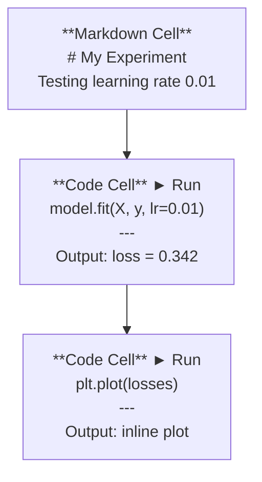
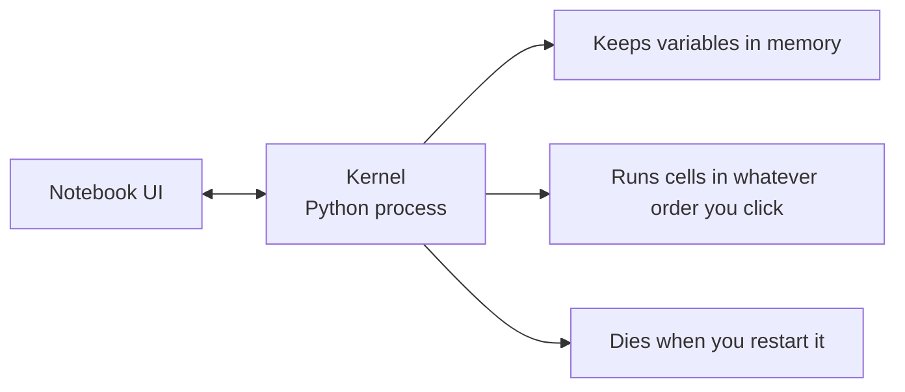

# Jupyter 笔记本

> 笔记本是 AI 工程的实验台。你在这里进行原型开发，然后将可行的部分移入生产。

**类型：** 构建
**语言：** Python
**前置要求：** 阶段 0，课程 01
**时间：** 约 30 分钟

## 学习目标

- 安装并启动 JupyterLab、Jupyter Notebook 或带 Jupyter 扩展的 VS Code
- 使用魔术命令（`%timeit`、`%%time`、`%matplotlib inline`）进行基准测试和内联可视化
- 区分何时使用笔记本与脚本，并应用“在笔记本中探索，在脚本中部署”的工作流
- 识别并避免常见的笔记本陷阱：乱序执行、隐藏状态和内存泄漏

## 问题所在

每篇 AI 论文、教程和 Kaggle 竞赛都使用 Jupyter 笔记本。它们允许你分段运行代码、内联查看输出、混合代码与解释，并快速迭代。如果你尝试在不使用笔记本的情况下学习 AI，那就像做数学作业不用草稿纸。

但笔记本也有真正的陷阱。人们把它们用于所有事情，包括它们不擅长的事情。知道何时使用笔记本、何时使用脚本，可以让你在日后免于调试噩梦。

## 核心概念

笔记本是单元格的列表。每个单元格要么是代码，要么是文本。



内核是运行在后台的 Python 进程。当你运行一个单元格时，它将代码发送给内核，内核执行代码并返回结果。所有单元格共享同一个内核，因此变量在单元格之间持续存在。



“无论你点击顺序如何”这部分既是超能力，也是隐患。

## 动手构建

### 步骤 1：选择你的界面

三个选项，一种格式：

| 界面 | 安装 | 最适用于 |
|------|------|----------|
| JupyterLab | `pip install jupyterlab` 然后 `jupyter lab` | 完整的 IDE 体验，多标签页，文件浏览器，终端 |
| Jupyter Notebook | `pip install notebook` 然后 `jupyter notebook` | 简单、轻量，一次处理一个笔记本 |
| VS Code | 安装 "Jupyter" 扩展 | 已在你的编辑器中，Git 集成，调试 |

这三者读写的是相同的 `.ipynb` 文件。选择你喜欢的任意一种。JupyterLab 在 AI 工作中最常见。

```bash
pip install jupyterlab
jupyter lab
```

### 步骤 2：重要的键盘快捷键

你可以在两种模式下操作。按 `Escape` 进入命令模式（左侧蓝色边框），按 `Enter` 进入编辑模式（绿色边框）。

**命令模式（最常用）：**

| 按键 | 操作 |
|------|------|
| `Shift+Enter` | 运行单元格，移动到下一个 |
| `A` | 在上方插入单元格 |
| `B` | 在下方插入单元格 |
| `DD` | 删除单元格 |
| `M` | 转换为 Markdown |
| `Y` | 转换为代码 |
| `Z` | 撤销单元格操作 |
| `Ctrl+Shift+H` | 显示所有快捷键 |

**编辑模式：**

| 按键 | 操作 |
|------|------|
| `Tab` | 自动补全 |
| `Shift+Tab` | 显示函数签名 |
| `Ctrl+/` | 切换注释 |

`Shift+Enter` 是你一天会用上千次的快捷键。先学习它。

### 步骤 3：单元格类型

**代码单元格**运行 Python 并显示输出：

```python
import numpy as np
data = np.random.randn(1000)
data.mean(), data.std()
```

输出：`(0.0032, 0.9987)`

**Markdown 单元格**渲染格式化文本。用它们来记录你在做什么以及为什么做。支持标题、粗体、斜体、LaTeX 数学（`$E = mc^2$`）、表格和图片。

### 步骤 4：魔术命令

这些不是 Python。它们是 Jupyter 特有的命令，以 `%`（行魔术命令）或 `%%`（单元格魔术命令）开头。

**为你的代码计时：**

```python
%timeit np.random.randn(10000)
```

输出：`45.2 us +/- 1.3 us per loop`

```python
%%time
model.fit(X_train, y_train, epochs=10)
```

输出：`Wall time: 2.34 s`

`%timeit` 会多次运行代码并取平均值。`%%time` 运行一次。对于微基准测试使用 `%timeit`，对于训练运行使用 `%%time`。

**启用内联绘图：**

```python
%matplotlib inline
```

现在，每个 `plt.plot()` 或 `plt.show()` 都会直接在笔记本中渲染。

**无需离开笔记本即可安装包：**

```python
!pip install scikit-learn
```

`!` 前缀用于运行任何 shell 命令。

**检查环境变量：**

```python
%env CUDA_VISIBLE_DEVICES
```

### 步骤 5：内联显示富输出

笔记本会自动显示单元格中的最后一个表达式。但你可以控制它：

```python
import pandas as pd

df = pd.DataFrame({
    "model": ["Linear", "Random Forest", "Neural Net"],
    "accuracy": [0.72, 0.89, 0.94],
    "training_time": [0.1, 2.3, 45.6]
})
df
```

这会渲染一个格式化的 HTML 表格，而不是文本转储。绘图也是一样：

```python
import matplotlib.pyplot as plt

plt.figure(figsize=(8, 4))
plt.plot([1, 2, 3, 4], [1, 4, 2, 3])
plt.title("Inline Plot")
plt.show()
```

图表会直接显示在单元格下方。这就是为什么笔记本主导了 AI 工作。你可以同时看到数据、图表和代码。

对于图片：

```python
from IPython.display import Image, display
display(Image(filename="architecture.png"))
```

### 步骤 6：Google Colab

Colab 是一个免费的云端 Jupyter 笔记本。它为你提供一个 GPU、预安装的库以及与 Google Drive 的集成。无需设置。

1. 访问 [colab.research.google.com](https://colab.research.google.com)
2. 上传本课程中的任意 `.ipynb` 文件
3. 运行时 > 更改运行时类型 > T4 GPU（免费）

Colab 与本地 Jupyter 的区别：
- 文件在会话之间不持久（需保存到 Drive 或下载）
- 预安装：numpy, pandas, matplotlib, torch, tensorflow, sklearn
- 使用 `from google.colab import files` 上传/下载文件
- 使用 `from google.colab import drive; drive.mount('/content/drive')` 进行持久存储
- 闲置 90 分钟后会话超时（免费版）

## 学以致用

### 笔记本 vs 脚本：何时使用哪个

| 用笔记本用于 | 用脚本用于 |
|--------------|------------|
| 探索数据集 | 训练管道 |
| 原型化模型 | 可复用的工具函数 |
| 可视化结果 | 任何带 `if __name__` 的东西 |
| 解释你的工作 | 按计划运行的代码 |
| 快速实验 | 生产代码 |
| 课程练习 | 包和库 |

规则：**在笔记本中探索，在脚本中部署**。

AI 中的常见工作流：
1. 在笔记本中探索数据
2. 在笔记本中原型化你的模型
3. 一旦可行，将代码移动到 `.py` 文件中
4. 将那些 `.py` 文件导入回笔记本进行进一步实验

### 常见陷阱

**乱序执行。** 你运行了单元格 5，然后是单元格 2，然后是单元格 7。笔记本在你的机器上可以工作，但别人从头到尾运行时会失败。修复：在分享前，选择内核 > 重启并全部运行。

**隐藏状态。** 你删除了一个单元格，但它创建的变量仍在内存中。笔记本看起来很干净，但却依赖于一个幽灵单元格。修复：定期重启内核。

**内存泄漏。** 加载一个 4GB 数据集，训练模型，再加载另一个数据集。内存没有被释放。修复：使用 `del variable_name` 和 `gc.collect()`，或者重启内核。

## 部署成果

本课程产出：
- `outputs/prompt-notebook-helper.md` 用于调试笔记本问题

## 练习

1. 打开 JupyterLab，创建一个笔记本，使用 `%timeit` 比较列表推导式与 numpy 在创建 100,000 个随机数数组时的性能。
2. 创建一个包含 Markdown 和代码单元格的笔记本，加载一个 CSV，显示一个数据框，并绘制一个图表。然后运行内核 > 重启并全部运行，以验证它能从头到尾正常工作。
3. 获取 `code/notebook_tips.py` 中的代码，将其粘贴到一个 Colab 笔记本中，并使用免费 GPU 运行它。

## 关键术语

| 术语 | 人们的说法 | 它的实际含义 |
|------|------------|--------------|
| 内核 (Kernel) | “运行我代码的东西” | 一个独立的 Python 进程，执行单元格并将变量保持在内存中 |
| 单元格 (Cell) | “一个代码块” | 笔记本中一个可独立运行的单元，可以是代码或 Markdown |
| 魔术命令 (Magic command) | “Jupyter 技巧” | 以前缀 `%` 或 `%%` 开头的特殊命令，用于控制笔记本环境 |
| `.ipynb` | “笔记本文件” | 一个包含单元格、输出和元数据的 JSON 文件。代表 IPython Notebook |

## 延伸阅读

- [JupyterLab 文档](https://jupyterlab.readthedocs.io/) 了解完整功能集
- [Google Colab 常见问题](https://research.google.com/colaboratory/faq.html) 了解 Colab 特定的限制和功能
- [28 个 Jupyter Notebook 技巧](https://www.dataquest.io/blog/jupyter-notebook-tips-tricks-shortcuts/) 获取高级用户快捷键