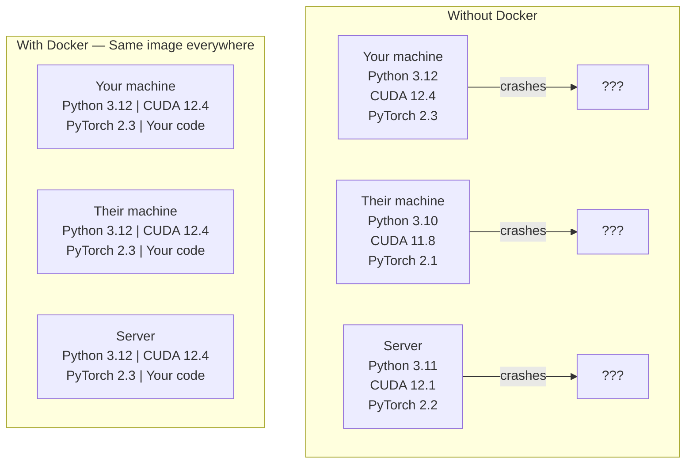

# 用于AI的Docker

> 容器技术让“在我机器上能跑”成为过去时。

**类型：** 构建
**语言：** Python
**前置条件：** 第0阶段，第01和03课
**时间：** 约60分钟

## 学习目标

- 使用Dockerfile构建一个包含CUDA、PyTorch和AI库的启用GPU的Docker镜像
- 将主机目录挂载为卷，以便在重建容器时持久化模型、数据集和代码
- 配置NVIDIA容器工具包，以便在容器内暴露GPU
- 使用Docker Compose编排多服务AI应用（推理服务器 + 向量数据库）

## 问题所在

你用PyTorch 2.3、CUDA 12.4和Python 3.12在笔记本电脑上训练了一个模型。你的同事使用的是PyTorch 2.1、CUDA 11.8和Python 3.10。你的模型在他们的机器上崩溃了。而你的Dockerfile在两者的机器上都能工作。

AI项目是依赖的噩梦。一个典型的栈包括Python、PyTorch、CUDA驱动、cuDNN、系统级C库，以及像flash-attn这样需要精确编译器版本的专用包。Docker将所有这些打包成一个单一的镜像，可在任何地方以相同方式运行。

## 核心概念

Docker将你的代码、运行时、库和系统工具打包到一个称为容器的隔离单元中。可以把它想象成一个轻量级的虚拟机，但它共享主机操作系统的内核而不是运行自己的内核，因此它可以在几秒钟内启动，而不是几分钟。



### 为什么AI项目比大多数项目更需要Docker

1.  **GPU驱动很脆弱。** CUDA 12.4的代码无法在CUDA 11.8上运行。Docker将CUDA工具包隔离在容器内部，同时通过NVIDIA容器工具包共享主机GPU驱动。

2.  **模型权重很大。** 一个70亿参数的模型以fp16存储有14GB。你不会想每次重建都重新下载它。Docker卷允许你挂载主机上的一个模型目录。

3.  **多服务架构很常见。** 一个真正的AI应用不仅仅是一个Python脚本。它包含一个推理服务器、一个用于RAG的向量数据库，可能还有一个Web前端。Docker Compose只需一个命令就能编排所有这些服务。

### 关键词汇

| 术语 | 含义 |
|------|------|
| 镜像 | 一个只读的模板。你的“食谱”。通过Dockerfile构建。 |
| 容器 | 镜像的一个运行实例。你的“厨房”。 |
| Dockerfile | 构建镜像的指令。逐层构建。 |
| 卷 | 容器重启后仍然存在的持久化存储。 |
| docker-compose | 用于在YAML中定义多容器应用程序的工具。 |

### AI中常见的容器模式

```
Dev Container
  Full toolkit. Editor support. Jupyter. Debugging tools.
  Used during development and experimentation.

Training Container
  Minimal. Just the training script and dependencies.
  Runs on GPU clusters. No editor, no Jupyter.

Inference Container
  Optimized for serving. Small image. Fast cold start.
  Runs behind a load balancer in production.
```

## 动手构建

### 第一步：安装Docker

```bash
# macOS
brew install --cask docker
open /Applications/Docker.app

# Ubuntu
curl -fsSL https://get.docker.com | sh
sudo usermod -aG docker $USER
# Log out and back in for group change to take effect
```

验证安装：

```bash
docker --version
docker run hello-world
```

### 第二步：安装NVIDIA容器工具包（适用于带NVIDIA GPU的Linux）

这能让Docker容器访问你的GPU。macOS和Windows（WSL2）用户可以跳过这一步；Docker Desktop在这些平台上以不同方式处理GPU透传。

```bash
distribution=$(. /etc/os-release;echo $ID$VERSION_ID)
curl -fsSL https://nvidia.github.io/libnvidia-container/gpgkey | sudo gpg --dearmor -o /usr/share/keyrings/nvidia-container-toolkit-keyring.gpg
curl -s -L https://nvidia.github.io/libnvidia-container/$distribution/libnvidia-container.list | \
    sed 's#deb https://#deb [signed-by=/usr/share/keyrings/nvidia-container-toolkit-keyring.gpg] https://#g' | \
    sudo tee /etc/apt/sources.list.d/nvidia-container-toolkit.list

sudo apt-get update
sudo apt-get install -y nvidia-container-toolkit
sudo nvidia-ctk runtime configure --runtime=docker
sudo systemctl restart docker
```

在容器内测试GPU访问：

```bash
docker run --rm --gpus all nvidia/cuda:12.4.1-base-ubuntu22.04 nvidia-smi
```

如果你能看到你的GPU信息，说明工具包工作正常。

### 第三步：理解基础镜像

选择正确的基础镜像可以节省数小时的调试时间。

```
nvidia/cuda:12.4.1-devel-ubuntu22.04
  Full CUDA toolkit. Compilers included.
  Use for: building packages that need nvcc (flash-attn, bitsandbytes)
  Size: ~4 GB

nvidia/cuda:12.4.1-runtime-ubuntu22.04
  CUDA runtime only. No compilers.
  Use for: running pre-built code
  Size: ~1.5 GB

pytorch/pytorch:2.3.1-cuda12.4-cudnn9-runtime
  PyTorch pre-installed on top of CUDA.
  Use for: skipping the PyTorch install step
  Size: ~6 GB

python:3.12-slim
  No CUDA. CPU only.
  Use for: inference on CPU, lightweight tools
  Size: ~150 MB
```

### 第四步：为AI开发编写Dockerfile

这是`code/Dockerfile`中的Dockerfile。让我们逐步了解：

```dockerfile
FROM nvidia/cuda:12.4.1-devel-ubuntu22.04

ENV DEBIAN_FRONTEND=noninteractive
ENV PYTHONUNBUFFERED=1

RUN apt-get update && apt-get install -y --no-install-recommends \
    python3.12 \
    python3.12-venv \
    python3.12-dev \
    python3-pip \
    git \
    curl \
    build-essential \
    && rm -rf /var/lib/apt/lists/*

RUN update-alternatives --install /usr/bin/python python /usr/bin/python3.12 1

RUN python -m pip install --no-cache-dir --upgrade pip setuptools wheel

RUN python -m pip install --no-cache-dir \
    torch==2.3.1 \
    torchvision==0.18.1 \
    torchaudio==2.3.1 \
    --index-url https://download.pytorch.org/whl/cu124

RUN python -m pip install --no-cache-dir \
    numpy \
    pandas \
    scikit-learn \
    matplotlib \
    jupyter \
    transformers \
    datasets \
    accelerate \
    safetensors

WORKDIR /workspace

VOLUME ["/workspace", "/models"]

EXPOSE 8888

CMD ["python"]
```

构建它：

```bash
docker build -t ai-dev -f phases/00-setup-and-tooling/07-docker-for-ai/code/Dockerfile .
```

第一次构建需要一些时间（下载CUDA基础镜像+PyTorch）。后续构建会使用缓存层。

运行它：

```bash
docker run --rm -it --gpus all \
    -v $(pwd):/workspace \
    -v ~/models:/models \
    ai-dev python -c "import torch; print(f'PyTorch {torch.__version__}, CUDA: {torch.cuda.is_available()}')"
```

在容器内运行Jupyter：

```bash
docker run --rm -it --gpus all \
    -v $(pwd):/workspace \
    -v ~/models:/models \
    -p 8888:8888 \
    ai-dev jupyter notebook --ip=0.0.0.0 --port=8888 --no-browser --allow-root
```

### 第五步：用于数据和模型的卷挂载

卷挂载对AI工作至关重要。没有它们，你下载的14GB模型在容器停止后就会消失。

```bash
# Mount your code
-v $(pwd):/workspace

# Mount a shared models directory
-v ~/models:/models

# Mount datasets
-v ~/datasets:/data
```

在你的训练脚本中，从挂载的路径加载：

```python
from transformers import AutoModel

model = AutoModel.from_pretrained("/models/llama-7b")
```

模型保存在你的主机文件系统上。你可以随时重建容器，而无需重新下载。

### 第六步：用于多服务AI应用的Docker Compose

一个真正的RAG应用需要一个推理服务器和一个向量数据库。Docker Compose只需一个命令就能运行两者。

参见`code/docker-compose.yml`：

```yaml
services:
  ai-dev:
    build:
      context: .
      dockerfile: Dockerfile
    deploy:
      resources:
        reservations:
          devices:
            - driver: nvidia
              count: all
              capabilities: [gpu]
    volumes:
      - ../../../:/workspace
      - ~/models:/models
      - ~/datasets:/data
    ports:
      - "8888:8888"
    stdin_open: true
    tty: true
    command: jupyter notebook --ip=0.0.0.0 --port=8888 --no-browser --allow-root

  qdrant:
    image: qdrant/qdrant:v1.12.5
    ports:
      - "6333:6333"
      - "6334:6334"
    volumes:
      - qdrant_data:/qdrant/storage

volumes:
  qdrant_data:
```

启动所有服务：

```bash
cd phases/00-setup-and-tooling/07-docker-for-ai/code
docker compose up -d
```

现在，你的AI开发容器可以通过服务名称`http://qdrant:6333`访问向量数据库。Docker Compose会自动创建一个共享网络。

从AI容器内测试连接：

```python
from qdrant_client import QdrantClient

client = QdrantClient(host="qdrant", port=6333)
print(client.get_collections())
```

停止所有服务：

```bash
docker compose down
```

添加`-v`以同时删除qdrant卷：

```bash
docker compose down -v
```

### 第七步：适用于AI工作的实用Docker命令

```bash
# List running containers
docker ps

# List all images and their sizes
docker images

# Remove unused images (reclaim disk space)
docker system prune -a

# Check GPU usage inside a running container
docker exec -it <container_id> nvidia-smi

# Copy a file from container to host
docker cp <container_id>:/workspace/results.csv ./results.csv

# View container logs
docker logs -f <container_id>
```

## 实际应用

你现在拥有了一个可复现的AI开发环境。在本课程的其余部分：

- 使用`docker compose up`同时启动你的开发环境和向量数据库
- 将你的代码、模型和数据作为卷挂载，这样在重建之间不会丢失任何内容
- 当课程需要一个新的Python包时，将其添加到Dockerfile中并重新构建
- 与队友分享你的Dockerfile。他们将获得完全相同的环境。

### 没有GPU？

移除`--gpus all`标志和NVIDIA部署块。容器仍然可以用于基于CPU的课程。PyTorch会自动检测到没有CUDA并回退到CPU。

## 练习

1.  构建Dockerfile并在容器内运行`python -c "import torch; print(torch.__version__)"`
2.  启动docker-compose栈，并验证从AI容器可以在`http://qdrant:6333/collections`访问Qdrant
3.  将`flask`添加到Dockerfile，重新构建，并在端口5000上运行一个简单的API服务器。使用`-p 5000:5000`映射端口
4.  使用`docker images`测量镜像大小。尝试将基础镜像从`devel`切换到`runtime`并比较大小

## 关键术语

| 术语 | 人们怎么说 | 它的实际含义 |
|------|------------|--------------|
| 容器 | “轻量级虚拟机” | 一个使用主机内核的隔离进程，拥有自己的文件系统和网络 |
| 镜像层 | “缓存的步骤” | 每条Dockerfile指令创建一个层。未改变的层会被缓存，因此重建很快。 |
| NVIDIA容器工具包 | “Docker中的GPU” | 一个运行时钩子，通过`--gpus`标志将主机GPU暴露给容器 |
| 卷挂载 | “共享文件夹” | 主机上一个映射到容器内的目录。容器停止后更改仍然存在。 |
| 基础镜像 | “起点” | 你的Dockerfile所构建于其上的`FROM`镜像。它决定了哪些软件被预装。 |