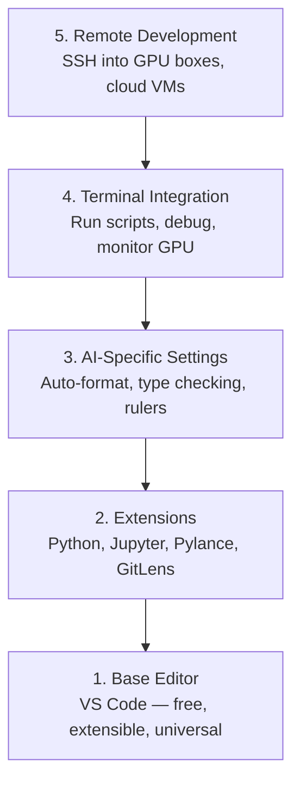

# 编辑器配置

> 你的编辑器是你的副驾。一次性配置好，让它不再妨碍你，开始为你效力。

**类型:** 构建
**语言:** --
**前置要求:** 第0阶段，第01课
**时间:** 约20分钟

## 学习目标

- 安装 VS Code 以及用于 Python、Jupyter、代码检查和远程 SSH 的关键扩展
- 配置保存时格式化、类型检查和 Notebook 输出滚动，以适应 AI 工作流
- 设置远程 SSH，以便像本地编辑和调试远程 GPU 机器上的代码
- 评估其他编辑器选项（Cursor、Windsurf、Neovim）及其在 AI 工作中的权衡

## 问题所在

你将在编辑器里花费数千小时编写 Python、运行 Notebook、调试训练循环以及通过 SSH 连接到 GPU 机器。一个配置不当的编辑器会让每次开发都充满摩擦：没有自动补全、没有类型提示、没有内联错误、手动格式化以及笨拙的终端工作流。

正确的配置只需20分钟。跳过它，你每天都要浪费20分钟。

## 核心概念

一个 AI 工程编辑器配置需要五样东西：



## 动手配置

### 第一步：安装 VS Code

VS Code 是推荐的编辑器。它免费、跨平台运行，对 Jupyter Notebook 有一流支持，并且其扩展生态系统涵盖了 AI 工作所需的一切。

从 [code.visualstudio.com](https://code.visualstudio.com/) 下载。

通过终端验证：

```bash
code --version
```

如果在 macOS 上 `code` 未找到，请打开 VS Code，按下 `Cmd+Shift+P`，输入 "Shell Command"，然后选择 "Install 'code' command in PATH"。

### 第二步：安装关键扩展

在 VS Code 中打开集成终端（`Ctrl+`` ` 或 `` Cmd+` ``）并安装对 AI 工作至关重要的扩展：

```bash
code --install-extension ms-python.python
code --install-extension ms-python.vscode-pylance
code --install-extension ms-toolsai.jupyter
code --install-extension eamodio.gitlens
code --install-extension ms-vscode-remote.remote-ssh
code --install-extension ms-python.debugpy
code --install-extension ms-python.black-formatter
code --install-extension charliermarsh.ruff
```

各个扩展的作用：

| 扩展名 | 作用 |
|-----------|-----|
| Python | 语言支持、虚拟环境检测、运行/调试 |
| Pylance | 快速类型检查、自动补全、导入解析 |
| Jupyter | 在 VS Code 中运行 Notebook、变量浏览器 |
| GitLens | 查看谁修改了什么、行内 git 责任追溯 |
| Remote SSH | 像本地一样打开远程 GPU 机器上的文件夹 |
| Debugpy | Python 的逐步调试 |
| Black Formatter | 保存时自动格式化，统一代码风格 |
| Ruff | 快速代码检查，捕捉常见错误 |

本课程中的 `code/.vscode/extensions.json` 文件包含完整的推荐列表。当你打开项目文件夹时，VS Code 会提示你安装它们。

### 第三步：配置设置

从本课程中的 `code/.vscode/settings.json` 复制设置，或通过 `Settings > Open Settings (JSON)` 手动应用。

AI 工作的关键设置：

```jsonc
{
    "python.analysis.typeCheckingMode": "basic",
    "editor.formatOnSave": true,
    "editor.rulers": [88, 120],
    "notebook.output.scrolling": true,
    "files.autoSave": "afterDelay"
}
```

这些设置重要的原因：

- **基本类型检查**：在运行前捕获错误的参数类型。节省在张量形状不匹配和错误 API 参数上的调试时间。
- **保存时格式化**：永远不用再考虑格式问题。Black 会处理它。
- **88 和 120 处的标尺**：Black 在 88 个字符处换行。120 的标记显示 docstring 和注释何时过长。
- **Notebook 输出滚动**：训练循环会打印数千行输出。没有滚动功能，输出面板会爆炸。
- **自动保存**：你会忘记保存。你的训练脚本会运行过时的代码。自动保存可以防止这种情况。

### 第四步：终端集成

VS Code 的集成终端是你运行训练脚本、监控 GPU 和管理环境的地方。

正确设置它：

```jsonc
{
    "terminal.integrated.defaultProfile.osx": "zsh",
    "terminal.integrated.defaultProfile.linux": "bash",
    "terminal.integrated.fontSize": 13,
    "terminal.integrated.scrollback": 10000
}
```

有用的快捷键：

| 操作 | macOS | Linux/Windows |
|--------|-------|---------------|
| 切换终端 | `` Ctrl+` `` | `` Ctrl+` `` |
| 新建终端 | `Ctrl+Shift+`` ` | `Ctrl+Shift+`` ` |
| 拆分终端 | `Cmd+\` | `Ctrl+\` |

拆分终端很有用：一个用于运行脚本，另一个用于使用 `nvidia-smi -l 1` 或 `watch -n 1 nvidia-smi` 监控 GPU。

### 第五步：远程开发（SSH 连接到 GPU 机器）

这是 AI 工作最重要的扩展。你将在远程机器（云虚拟机、实验室服务器、Lambda、Vast.ai）上运行训练。远程 SSH 让你像本地操作一样打开远程文件系统、编辑文件、运行终端和调试。

设置步骤：

1.  安装 Remote SSH 扩展（第二步已完成）。
2.  按下 `Ctrl+Shift+P`（或 `Cmd+Shift+P`），输入 "Remote-SSH: Connect to Host"。
3.  输入 `user@your-gpu-box-ip`。
4.  VS Code 会自动在远程机器上安装其服务器组件。

要实现免密码访问，请设置 SSH 密钥：

```bash
ssh-keygen -t ed25519 -C "your-email@example.com"
ssh-copy-id user@your-gpu-box-ip
```

为方便起见，将主机添加到 `~/.ssh/config`：

```
Host gpu-box
    HostName 203.0.113.50
    User ubuntu
    IdentityFile ~/.ssh/id_ed25519
    ForwardAgent yes
```

现在，`Remote-SSH: Connect to Host > gpu-box` 可以立即连接。

## 其他选择

### Cursor

[cursor.com](https://cursor.com) 是一个内置 AI 代码生成功能的 VS Code 分支。它使用相同的扩展生态系统和设置格式。如果你使用 Cursor，本课程中的所有内容仍然适用。导入相同的 `settings.json` 和 `extensions.json`。

### Windsurf

[windsurf.com](https://windsurf.com) 是另一个 AI 优先的 VS Code 分支。情况相同：相同的扩展、相同的设置格式、相同的 Remote SSH 支持。

### Vim/Neovim

如果你已经在使用 Vim 或 Neovim 并且效率很高，那就继续使用。AI Python 工作的最低配置：

- **pyright** 或 **pylsp** 用于类型检查（通过 Mason 或手动安装）
- **nvim-lspconfig** 用于语言服务器集成
- **jupyter-vim** 或 **molten-nvim** 用于类似 Notebook 的执行
- **telescope.nvim** 用于文件/符号搜索
- **none-ls.nvim** 配合 black 和 ruff 用于格式化/代码检查

如果你目前不使用 Vim，现在不要开始学习。学习曲线会与学习 AI 工程竞争时间。请使用 VS Code。

## 日常使用

完成此配置后，你的日常工作流如下：

1.  在 VS Code 中打开项目文件夹（或通过 Remote SSH 连接到 GPU 机器）。
2.  在编辑器中编写 Python，享受自动补全、类型提示和内联错误提示。
3.  使用 Jupyter 扩展内联运行 Jupyter Notebook。
4.  使用集成终端运行训练脚本、`uv pip install` 和监控 GPU。
5.  提交前使用 GitLens 审查更改。

## 练习

1.  安装 VS Code 和第二步列出的所有扩展
2.  将本课程中的 `settings.json` 复制到你的 VS Code 配置中
3.  打开一个 Python 文件，验证 Pylance 是否显示类型提示，Black 是否在保存时格式化
4.  如果你有远程机器的访问权限，请设置 Remote SSH 并在其中打开一个文件夹

## 关键术语

| 术语 | 常见说法 | 实际含义 |
|------|----------------|----------------------|
| LSP | "自动补全引擎" | 语言服务器协议：一种标准，使编辑器能够从特定语言的服务器获取类型信息、补全建议和诊断信息 |
| Pylance | "那个 Python 插件" | 微软的 Python 语言服务器，使用 Pyright 进行类型检查和提供智能感知 |
| Remote SSH | "在服务器上工作" | VS Code 扩展，在远程机器上运行轻量级服务器，并将 UI 流式传输到你的本地编辑器 |
| 保存时格式化 | "自动美化工具" | 编辑器在你每次保存时运行格式化程序（如 Black、Ruff），确保代码风格始终一致 |