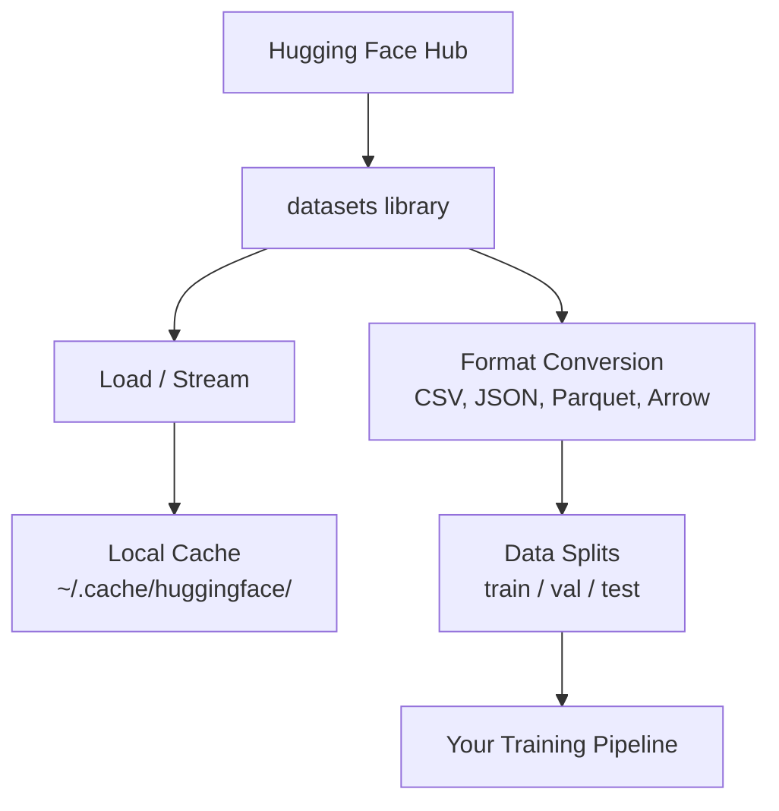

# 数据管理

> 数据是燃料。管理数据的方式决定了前进的速度。

**类型:** 构建
**语言:** Python
**先决条件:** 阶段 0, 第 01 课
**时间:** ~45 分钟

## 学习目标

- 使用 Hugging Face `datasets` 库加载、流式传输和缓存数据集
- 在 CSV、JSON、Parquet 和 Arrow 格式之间转换并解释它们的权衡
- 使用固定的随机种子创建可重复的训练/验证/测试集划分
- 使用 `.gitignore`、Git LFS 或 DVC 管理大型模型和数据集文件

## 挑战

每个 AI 项目都始于数据。你需要找到数据集、下载它们、在不同格式之间转换、为训练和评估进行划分，并进行版本控制以便实验可重复。每次手动执行这些操作既缓慢又容易出错。你需要一个可重复的工作流程。

## 核心概念



Hugging Face `datasets` 库是为 AI 工作加载数据的标准方式。它开箱即用地处理下载、缓存、格式转换和流式传输。

## 实践构建

### 步骤 1：安装 datasets 库

```bash
pip install datasets huggingface_hub
```

### 步骤 2：加载数据集

```python
from datasets import load_dataset

dataset = load_dataset("imdb")
print(dataset)
print(dataset["train"][0])
```

这将下载 IMDB 电影评论数据集。首次下载后，它将从 `~/.cache/huggingface/datasets/` 的缓存中加载。

### 步骤 3：流式传输大型数据集

有些数据集太大，无法完全放入磁盘。流式传输允许逐行加载，而无需下载整个数据集。

```python
dataset = load_dataset("wikimedia/wikipedia", "20220301.en", split="train", streaming=True)

for i, example in enumerate(dataset):
    print(example["title"])
    if i >= 4:
        break
```

流式传输会给你一个 `IterableDataset`。你可以在数据到达时逐行处理。无论数据集大小如何，内存使用量都保持恒定。

### 步骤 4：数据集格式

`datasets` 库底层使用 Apache Arrow。你可以根据流水线的需求将其转换为其他格式。

```python
dataset = load_dataset("imdb", split="train")

dataset.to_csv("imdb_train.csv")
dataset.to_json("imdb_train.json")
dataset.to_parquet("imdb_train.parquet")
```

格式比较：

| 格式 | 大小 | 读取速度 | 最佳用途 |
|------|------|----------|----------|
| CSV | 大 | 慢 | 人类可读性、电子表格 |
| JSON | 大 | 慢 | API、嵌套数据 |
| Parquet | 小 | 快 | 分析、列式查询 |
| Arrow | 小 | 最快 | 内存处理（`datasets` 内部使用） |

对于 AI 工作，Parquet 是最佳的存储格式。Arrow 是你内存中操作的数据格式。CSV 和 JSON 用于数据交换。

### 步骤 5：数据划分

每个机器学习项目都需要三种划分：

- **训练集**：模型从中学习（通常占 80%）
- **验证集**：在训练过程中检查进度（通常占 10%）
- **测试集**：训练完成后的最终评估（通常占 10%）

一些数据集预先划分好了。如果没有，你需要自己划分：

```python
dataset = load_dataset("imdb", split="train")

split = dataset.train_test_split(test_size=0.2, seed=42)
train_val = split["train"].train_test_split(test_size=0.125, seed=42)

train_ds = train_val["train"]
val_ds = train_val["test"]
test_ds = split["test"]

print(f"Train: {len(train_ds)}, Val: {len(val_ds)}, Test: {len(test_ds)}")
```

始终设置随机种子以确保可重复性。相同的种子每次都会产生相同的划分结果。

### 步骤 6：下载和缓存模型

模型是大文件。`huggingface_hub` 库负责处理下载和缓存。

```python
from huggingface_hub import hf_hub_download, snapshot_download

model_path = hf_hub_download(
    repo_id="sentence-transformers/all-MiniLM-L6-v2",
    filename="config.json"
)
print(f"Cached at: {model_path}")

model_dir = snapshot_download("sentence-transformers/all-MiniLM-L6-v2")
print(f"Full model at: {model_dir}")
```

模型会缓存到 `~/.cache/huggingface/hub/`。一旦下载完成，在后续运行中会瞬间加载。

### 步骤 7：处理大文件

模型权重和大型数据集不应放入 git 仓库。有三种选择：

**选项 A：.gitignore（最简单）**

```
*.bin
*.safetensors
*.pt
*.onnx
data/*.parquet
data/*.csv
models/
```

**选项 B：Git LFS（在 git 中跟踪大文件）**

```bash
git lfs install
git lfs track "*.bin"
git lfs track "*.safetensors"
git add .gitattributes
```

Git LFS 在你的仓库中存储指针，而实际文件存储在单独的服务器上。GitHub 提供 1 GB 免费空间。

**选项 C：DVC（数据版本控制）**

```bash
pip install dvc
dvc init
dvc add data/training_set.parquet
git add data/training_set.parquet.dvc data/.gitignore
git commit -m "Track training data with DVC"
```

DVC 创建小型 `.dvc` 文件来指向你的数据。数据本身存储在 S3、GCS 或其他远程存储后端。

| 方法 | 复杂度 | 最佳用途 |
|------|--------|----------|
| .gitignore | 低 | 个人项目，可重新获取的下载数据 |
| Git LFS | 中等 | 通过 git 共享模型权重的团队 |
| DVC | 高 | 可重复的实验，大型数据集，团队协作 |

对于本课程，`.gitignore` 足够了。当你需要跨机器复现实验时，请使用 DVC。

### 步骤 8：存储模式

**本地存储**适用于 ~10 GB 以下的数据集。HF 缓存会自动处理。

**云存储**适用于更大的数据集或需要在多台机器间共享的数据集：

```python
import os

local_path = os.path.expanduser("~/.cache/huggingface/datasets/")

# s3_path = "s3://my-bucket/datasets/"
# gcs_path = "gs://my-bucket/datasets/"
```

DVC 直接与 S3 和 GCS 集成：

```bash
dvc remote add -d myremote s3://my-bucket/dvc-store
dvc push
```

对于本课程，本地存储已足够。当您在远程 GPU 实例上进行微调时，云存储才会变得相关。

## 本课程使用的数据集

| 数据集 | 课程 | 大小 | 学习目标 |
|--------|------|------|----------|
| IMDB | 分词、分类 | 84 MB | 文本分类基础 |
| WikiText | 语言建模 | 181 MB | 下一个 token 预测 |
| SQuAD | QA 系统 | 35 MB | 问答、跨度 |
| Common Crawl（子集） | 嵌入 | 可变 | 大规模文本处理 |
| MNIST | 视觉基础 | 21 MB | 图像分类基础 |
| COCO（子集） | 多模态 | 可变 | 图像-文本对 |

你不需要现在就下载所有这些数据集。每节课都会说明所需的数据集。

## 动手使用

运行工具脚本以验证一切正常：

```bash
python code/data_utils.py
```

这会下载一个小型数据集、进行转换、划分并打印摘要。

## 交付成果

本节课将产出：
- `code/data_utils.py` - 可复用的数据加载和缓存工具
- `outputs/prompt-data-helper.md` - 用于为任务寻找合适数据集的提示词

## 练习

1. 使用 `mrpc` 配置加载 `glue` 数据集，并检查前 5 个示例
2. 流式传输 `c4` 数据集，计算你在 10 秒内可以处理多少个示例
3. 将数据集转换为 Parquet 格式，并将文件大小与 CSV 格式进行比较
4. 使用固定种子创建 70/15/15 的训练/验证/测试集划分，并验证大小

## 关键术语

| 术语 | 常见说法 | 实际含义 |
|------|----------|----------|
| 数据集划分 | “训练数据” | 在机器学习生命周期不同阶段使用的命名子集（训练/验证/测试） |
| 流式传输 | “延迟加载” | 逐行处理来自远程源的数据，而无需下载整个数据集 |
| Parquet | “压缩的 CSV” | 一种列式文件格式，针对分析查询和存储效率进行了优化 |
| Arrow | “快速数据框” | 一种内存中的列式格式，被 datasets 库内部用于零拷贝读取 |
| Git LFS | “Git 处理大文件” | 一种扩展，将大文件存储在 git 仓库之外，同时在版本控制中保留指针 |
| DVC | “数据版 Git” | 一种用于数据集和模型的版本控制系统，可与云存储集成 |
| 缓存 | “已下载” | 之前获取的数据的本地副本，默认存储在 ~/.cache/huggingface/ |