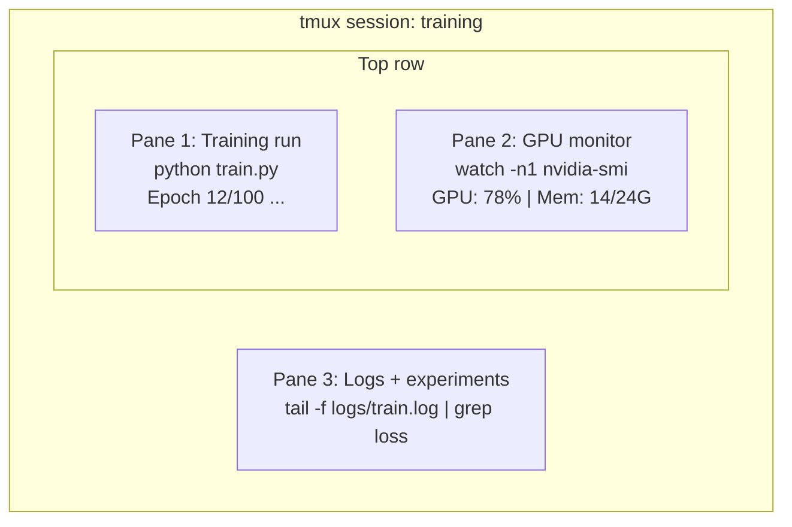

# 终端与 Shell

> 终端是 AI 工程师的日常环境。请在此处熟练操作。

**类型：** 学习  
**语言：** --  
**先决条件：** 第 0 阶段，第 01 课  
**时间：** 约 35 分钟

## 学习目标

- 使用管道、重定向和 `grep` 从命令行过滤与处理训练日志
- 创建带有多窗格的持久化 tmux 会话，用于并行训练和 GPU 监控
- 使用 `htop`、`nvtop` 和 `nvidia-smi` 监控系统与 GPU 资源
- 通过 SSH、`scp` 和 `rsync` 在本地与远程机器间传输文件

## 问题所在

你在终端中花费的时间将超过任何编辑器。训练运行、GPU 监控、日志跟踪、远程 SSH 会话、环境管理——每个 AI 工作流都离不开 Shell。如果你在这里操作缓慢，那么整体效率都会受影响。

本课程涵盖对 AI 工作至关重要的终端技能。不涉及 Unix 历史，也不深入 Bash 脚本。只聚焦于你真正需要的内容。

## 核心概念



三个任务同时运行。仅需一个终端。你可以分离会话、回家后通过 SSH 重新连接并恢复。训练任务会持续运行。

## 动手实践

### 步骤 1：了解你的 Shell

检查你正在使用的 Shell 类型：

```bash
echo $SHELL
```

大多数系统使用 `bash` 或 `zsh`。两者均可正常工作。本课程的命令在两种环境中均可运行。

关键知识点：

```bash
# Move around
cd ~/projects/ai-engineering-from-scratch
pwd
ls -la

# History search (most useful shortcut you'll learn)
# Ctrl+R then type part of a previous command
# Press Ctrl+R again to cycle through matches

# Clear terminal
clear   # or Ctrl+L

# Cancel a running command
# Ctrl+C

# Suspend a running command (resume with fg)
# Ctrl+Z
```

### 步骤 2：管道与重定向

管道将多个命令连接起来。这是你处理日志、过滤输出并链接工具的核心方式，将会频繁使用。

```bash
# Count how many times "loss" appears in a log
cat train.log | grep "loss" | wc -l

# Extract just the loss values from training output
grep "loss:" train.log | awk '{print $NF}' > losses.txt

# Watch a log file update in real time, filtering for errors
tail -f train.log | grep --line-buffered "ERROR"

# Sort experiments by final accuracy
grep "final_accuracy" results/*.log | sort -t= -k2 -n -r

# Redirect stdout and stderr to separate files
python train.py > output.log 2> errors.log

# Redirect both to the same file
python train.py > train_full.log 2>&1
```

你需要掌握的三种重定向符号：

| 符号 | 作用 |
|--------|-------------|
| `>` | 将标准输出写入文件（覆盖） |
| `>>` | 将标准输出追加到文件 |
| `2>` | 将标准错误写入文件 |
| `2>&1` | 将标准错误重定向到标准输出相同位置 |
| `\|` | 将前一个命令的标准输出作为后一个命令的标准输入 |

### 步骤 3：后台进程

训练运行可能持续数小时。你不希望一直让终端保持打开状态。

```bash
# Run in background (output still goes to terminal)
python train.py &

# Run in background, immune to hangup (closing terminal won't kill it)
nohup python train.py > train.log 2>&1 &

# Check what's running in background
jobs
ps aux | grep train.py

# Bring a background job to foreground
fg %1

# Kill a background process
kill %1
# or find its PID and kill that
kill $(pgrep -f "train.py")
```

`&`、`nohup` 与 `screen`/`tmux` 的区别：

| 方法 | 终端关闭后是否存活 | 能否重新连接 |
|--------|-------------------------|---------------|
| `command &` | 否 | 否 |
| `nohup command &` | 是 | 否（可检查日志文件） |
| `screen` / `tmux` | 是 | 是 |

对于持续数分钟以上的任务，请使用 tmux。

### 步骤 4：tmux

tmux 让你可以创建持久化的终端会话并支持多窗格。这是管理训练运行最实用的工具。

```bash
# Install
# macOS
brew install tmux
# Ubuntu
sudo apt install tmux

# Start a named session
tmux new -s training

# Split horizontally
# Ctrl+B then "

# Split vertically
# Ctrl+B then %

# Navigate between panes
# Ctrl+B then arrow keys

# Detach (session keeps running)
# Ctrl+B then d

# Reattach
tmux attach -t training

# List sessions
tmux ls

# Kill a session
tmux kill-session -t training
```

典型的 AI 工作流会话布局：

```bash
tmux new -s train

# Pane 1: start training
python train.py --epochs 100 --lr 1e-4

# Ctrl+B, " to split, then run GPU monitor
watch -n1 nvidia-smi

# Ctrl+B, % to split vertically, tail the logs
tail -f logs/experiment.log

# Now detach with Ctrl+B, d
# SSH out, go get coffee, come back
# tmux attach -t train
```

### 步骤 5：使用 htop 与 nvtop 进行监控

```bash
# System processes (better than top)
htop

# GPU processes (if you have NVIDIA GPU)
# Install: sudo apt install nvtop (Ubuntu) or brew install nvtop (macOS)
nvtop

# Quick GPU check without nvtop
nvidia-smi

# Watch GPU usage update every second
watch -n1 nvidia-smi

# See which processes are using the GPU
nvidia-smi --query-compute-apps=pid,name,used_memory --format=csv
```

常用 `htop` 快捷键：
- `F6` 或 `>`：按列排序（通过内存排序可排查内存泄漏）
- `F5`：切换树状视图（查看子进程）
- `F9`：终止进程
- `/`：按名称搜索进程

### 步骤 6：通过 SSH 连接远程 GPU 设备

当你租用云 GPU（如 Lambda、RunPod、Vast.ai）时，需要通过 SSH 连接。

```bash
# Basic connection
ssh user@gpu-box-ip

# With a specific key
ssh -i ~/.ssh/my_gpu_key user@gpu-box-ip

# Copy files to remote
scp model.pt user@gpu-box-ip:~/models/

# Copy files from remote
scp user@gpu-box-ip:~/results/metrics.json ./

# Sync a whole directory (faster for many files)
rsync -avz ./data/ user@gpu-box-ip:~/data/

# Port forward (access remote Jupyter/TensorBoard locally)
ssh -L 8888:localhost:8888 user@gpu-box-ip
# Now open localhost:8888 in your browser

# SSH config for convenience
# Add to ~/.ssh/config:
# Host gpu
#     HostName 192.168.1.100
#     User ubuntu
#     IdentityFile ~/.ssh/gpu_key
#
# Then just:
# ssh gpu
```

### 步骤 7：AI 工作的实用别名

将以下内容添加到你的 `~/.bashrc` 或 `~/.zshrc` 中：

```bash
source phases/00-setup-and-tooling/10-terminal-and-shell/code/shell_aliases.sh
```

或选择你需要的别名。关键别名包括：

```bash
# GPU status at a glance
alias gpu='nvidia-smi --query-gpu=index,name,utilization.gpu,memory.used,memory.total,temperature.gpu --format=csv,noheader'

# Kill all Python training processes
alias killtraining='pkill -f "python.*train"'

# Quick virtual environment activate
alias ae='source .venv/bin/activate'

# Watch training loss
alias watchloss='tail -f logs/*.log | grep --line-buffered "loss"'
```

完整别名集合请见 `code/shell_aliases.sh`。

### 步骤 8：常见 AI 终端模式

这些模式在实践中反复出现：

```bash
# Run training, log everything, notify when done
python train.py 2>&1 | tee train.log; echo "DONE" | mail -s "Training complete" you@email.com

# Compare two experiment logs side by side
diff <(grep "accuracy" exp1.log) <(grep "accuracy" exp2.log)

# Find the largest model files (clean up disk space)
find . -name "*.pt" -o -name "*.safetensors" | xargs du -h | sort -rh | head -20

# Download a model from Hugging Face
wget https://huggingface.co/model/resolve/main/model.safetensors

# Untar a dataset
tar xzf dataset.tar.gz -C ./data/

# Count lines in all Python files (see how big your project is)
find . -name "*.py" | xargs wc -l | tail -1

# Check disk space (training data fills disks fast)
df -h
du -sh ./data/*

# Environment variable check before training
env | grep -i cuda
env | grep -i torch
```

## 应用场景

本课程中各工具的使用时机：

| 工具 | 使用场景 |
|------|----------------|
| tmux | 每次训练运行（第 3 阶段及之后） |
| `tail -f` + `grep` | 监控训练日志 |
| `nohup` / `&` | 快速后台任务 |
| `htop` / `nvtop` | 调试训练缓慢、内存溢出错误 |
| SSH + `rsync` | 在云 GPU 上工作 |
| 管道 + 重定向 | 处理实验结果 |
| 别名 | 节省重复命令的时间 |

## 练习

1. 安装 tmux，创建一个包含三个窗格的会话，在其中一个窗格运行 `htop`，另一个运行 `watch -n1 date`，第三个运行 Python 脚本。然后分离并重新连接。
2. 将 `code/shell_aliases.sh` 中的别名添加到你的 Shell 配置文件，并使用 `source ~/.zshrc`（或 `~/.bashrc`）重新加载。
3. 使用 `for i in $(seq 1 100); do echo "epoch $i loss: $(echo "scale=4; 1/$i" | bc)"; sleep 0.1; done > fake_train.log` 生成模拟训练日志，然后用 `grep`、`tail` 和 `awk` 提取仅包含损失值的行。
4. 为你可访问的服务器设置 SSH 配置条目（或使用 `localhost` 练习语法）。

## 关键术语

| 术语 | 常用说法 | 实际含义 |
|------|----------------|----------------------|
| Shell | “终端” | 解释用户命令的程序（如 bash、zsh、fish） |
| tmux | “终端复用器” | 允许在单个窗口中运行多个终端会话，并支持分离/重新连接的程序 |
| 管道 | “竖线符号” | `\|` 运算符，将一个命令的输出作为另一命令的输入 |
| PID | “进程 ID” | 分配给每个运行中进程的唯一数字，用于监控或终止进程 |
| nohup | “不挂断” | 运行命令时忽略挂断信号，确保关闭终端不会终止进程 |
| SSH | “连接服务器” | 安全 Shell，一种用于在远程机器上执行命令的加密协议 |