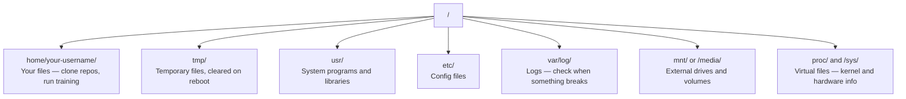

# 面向人工智能的Linux

> 大多数人工智能运行在Linux系统上。你需要掌握足够的知识，避免陷入困境。

**类型：** 学习
**语言：** --
**先决条件：** 阶段0，第01课
**时间：** 约30分钟

## 学习目标

- 从命令行浏览Linux文件系统并执行基本文件操作
- 使用 `chmod` 和 `chown` 管理文件权限，以解决"权限被拒绝"错误
- 使用 `apt` 安装系统软件包，并为人工智能工作配置全新的GPU服务器
- 识别macOS与Linux之间的差异，这些差异常会让在远程机器上工作的开发者感到困扰

## 问题所在

你在macOS或Windows上进行开发。但当你通过SSH连接到云GPU服务器、租用Lambda实例或启动EC2机器时，你会进入Ubuntu环境。终端是你唯一的界面。没有Finder，没有资源管理器，没有图形界面。如果你不能通过命令行浏览文件系统、安装软件包和管理进程，你就只能一边为闲置的GPU时间付费，一边在谷歌上搜索"如何在Linux中解压文件"。

这是一份生存指南。它只涵盖了你在远程Linux机器上进行人工智能工作所需的操作。仅此而已。

## 文件系统布局

Linux将所有内容组织在单个根 `/` 下。没有 `C:\` 或 `/Volumes`。你实际会接触到的目录：



你的主目录是 `~` 或 `/home/your-username`。你所做的几乎所有事情都发生在这里。

## 基本命令

以下是涵盖你在远程GPU服务器上95%操作的15个命令。

### 导航

```bash
pwd                         # Where am I?
ls                          # What's here?
ls -la                      # What's here, including hidden files with details?
cd /path/to/dir             # Go there
cd ~                        # Go home
cd ..                       # Go up one level
```

### 文件与目录

```bash
mkdir my-project            # Create a directory
mkdir -p a/b/c              # Create nested directories in one shot

cp file.txt backup.txt      # Copy a file
cp -r src/ src-backup/      # Copy a directory (recursive)

mv old.txt new.txt          # Rename a file
mv file.txt /tmp/           # Move a file

rm file.txt                 # Delete a file (no trash, it's gone)
rm -rf my-dir/              # Delete a directory and everything inside
```

`rm -rf` 是永久性的。没有撤销操作。在按下回车键之前，请仔细检查路径。

### 读取文件

```bash
cat file.txt                # Print entire file
head -20 file.txt           # First 20 lines
tail -20 file.txt           # Last 20 lines
tail -f log.txt             # Follow a log file in real time (Ctrl+C to stop)
less file.txt               # Scroll through a file (q to quit)
```

### 搜索

```bash
grep "error" training.log           # Find lines containing "error"
grep -r "learning_rate" .           # Search all files in current directory
grep -i "cuda" config.yaml          # Case-insensitive search

find . -name "*.py"                 # Find all Python files under current dir
find . -name "*.ckpt" -size +1G     # Find checkpoint files larger than 1GB
```

## 权限

Linux中的每个文件都有所有者和权限位。当脚本无法执行或你无法写入目录时，你就会遇到权限问题。

```bash
ls -l train.py
# -rwxr-xr-- 1 user group 2048 Mar 19 10:00 train.py
#  ^^^             owner permissions: read, write, execute
#     ^^^          group permissions: read, execute
#        ^^        everyone else: read only
```

常见修复方法：

```bash
chmod +x train.sh           # Make a script executable
chmod 755 deploy.sh         # Owner: full, others: read+execute
chmod 644 config.yaml       # Owner: read+write, others: read only

chown user:group file.txt   # Change who owns a file (needs sudo)
```

当出现"权限被拒绝"提示时，几乎总是权限问题。`chmod +x` 或 `sudo` 将解决大多数情况。

## 包管理（apt）

Ubuntu使用 `apt`。这是你安装系统级软件的方式。

```bash
sudo apt update             # Refresh the package list (always do this first)
sudo apt install -y htop    # Install a package (-y skips confirmation)
sudo apt install -y build-essential  # C compiler, make, etc. Needed by many Python packages
sudo apt install -y tmux    # Terminal multiplexer (keep sessions alive after disconnect)

apt list --installed        # What's installed?
sudo apt remove htop        # Uninstall
```

在全新的GPU服务器上你会安装的常见软件包：

```bash
sudo apt update && sudo apt install -y \
    build-essential \
    git \
    curl \
    wget \
    tmux \
    htop \
    unzip \
    python3-venv
```

## 用户与sudo

你通常以普通用户身份登录。某些操作需要root（管理员）权限。

```bash
whoami                      # What user am I?
sudo command                # Run a single command as root
sudo su                     # Become root (exit to go back, use sparingly)
```

在云GPU实例上，你通常是唯一的用户，并且已经拥有sudo权限。不要以root身份运行所有操作。仅在需要时使用sudo。

## 进程与systemd

当你的训练任务挂起，或你需要检查正在运行的进程时：

```bash
htop                        # Interactive process viewer (q to quit)
ps aux | grep python        # Find running Python processes
kill 12345                  # Gracefully stop process with PID 12345
kill -9 12345               # Force kill (use when graceful doesn't work)
nvidia-smi                  # GPU processes and memory usage
```

systemd管理服务（后台守护进程）。如果你运行推理服务器，你会用到它：

```bash
sudo systemctl start nginx          # Start a service
sudo systemctl stop nginx           # Stop it
sudo systemctl restart nginx        # Restart it
sudo systemctl status nginx         # Check if it's running
sudo systemctl enable nginx         # Start automatically on boot
```

## 磁盘空间

GPU服务器通常磁盘空间有限。模型和数据集会很快占满空间。

```bash
df -h                       # Disk usage for all mounted drives
df -h /home                 # Disk usage for /home specifically

du -sh *                    # Size of each item in current directory
du -sh ~/.cache             # Size of your cache (pip, huggingface models land here)
du -sh /data/checkpoints/   # Check how big your checkpoints are

# Find the biggest space hogs
du -h --max-depth=1 / 2>/dev/null | sort -hr | head -20
```

常见的节省空间方法：

```bash
# Clear pip cache
pip cache purge

# Clear apt cache
sudo apt clean

# Remove old checkpoints you don't need
rm -rf checkpoints/epoch_01/ checkpoints/epoch_02/
```

## 网络

你将从命令行下载模型、传输文件并访问API。

```bash
# Download files
wget https://example.com/model.bin                   # Download a file
curl -O https://example.com/data.tar.gz              # Same thing with curl
curl -s https://api.example.com/health | python3 -m json.tool  # Hit an API, pretty-print JSON

# Transfer files between machines
scp model.bin user@remote:/data/                     # Copy file to remote machine
scp user@remote:/data/results.csv .                  # Copy file from remote to local
scp -r user@remote:/data/checkpoints/ ./local-dir/   # Copy directory

# Sync directories (faster than scp for large transfers, resumes on failure)
rsync -avz --progress ./data/ user@remote:/data/
rsync -avz --progress user@remote:/results/ ./results/
```

对于任何大文件，使用 `rsync` 代替 `scp`。它只传输更改的字节，并能处理中断的连接。

## tmux：保持会话存活

当你通过SSH连接到远程服务器时，合上笔记本电脑会终止你的训练任务。tmux可以防止这种情况。

```bash
tmux new -s train           # Start a new session named "train"
# ... start your training, then:
# Ctrl+B, then D            # Detach (training keeps running)

tmux ls                     # List sessions
tmux attach -t train        # Reattach to session

# Inside tmux:
# Ctrl+B, then %            # Split pane vertically
# Ctrl+B, then "            # Split pane horizontally
# Ctrl+B, then arrow keys   # Switch between panes
```

始终在tmux内运行长时间训练任务。务必如此。

## Windows用户的WSL2

如果你使用Windows，WSL2可以为你提供一个真实的Linux环境，无需双系统。

```bash
# In PowerShell (admin)
wsl --install -d Ubuntu-24.04

# After restart, open Ubuntu from Start menu
sudo apt update && sudo apt upgrade -y
```

WSL2运行一个真正的Linux内核。本课程中的所有内容都可以在其中使用。从WSL内部，你的Windows文件位于 `/mnt/c/Users/YourName/`。

GPU直通需要在Windows端安装NVIDIA驱动程序。安装Windows版NVIDIA驱动程序（而非Linux版），CUDA将在WSL2内部可用。

## 注意事项：从macOS到Linux

如果你从macOS转过来，以下是一些会让你困扰的地方：

| macOS | Linux | 说明 |
|-------|-------|------|
| `brew install` | `sudo apt install` | 包名有时不同。`brew install htop` 与 `sudo apt install htop` 功能相同，但 `brew install readline` 与 `sudo apt install libreadline-dev` 则不同。 |
| `open file.txt` | `xdg-open file.txt` | 但远程服务器上没有图形界面。请使用 `cat` 或 `less`。 |
| `pbcopy` / `pbpaste` | 不可用 | 通过SSH无法与剪贴板进行管道传输。 |
| `~/.zshrc` | `~/.bashrc` | macOS默认使用zsh。大多数Linux服务器使用bash。 |
| `/opt/homebrew/` | `/usr/bin/`, `/usr/local/bin/` | 二进制文件位于不同的位置。 |
| `sed -i '' 's/a/b/' file` | `sed -i 's/a/b/' file` | macOS的sed命令需要在 `-i` 后跟一个空字符串。Linux则不需要。 |
| 不区分大小写的文件系统 | 区分大小写的文件系统 | `Model.py` 和 `model.py` 在Linux上是两个不同的文件。 |
| 换行符 `\n` | 换行符 `\n` | 相同。但Windows使用 `\r\n`，这会破坏bash脚本。运行 `dos2unix` 来修复。 |

## 快速参考卡片

```
Navigation:     pwd, ls, cd, find
Files:          cp, mv, rm, mkdir, cat, head, tail, less
Search:         grep, find
Permissions:    chmod, chown, sudo
Packages:       apt update, apt install
Processes:      htop, ps, kill, nvidia-smi
Services:       systemctl start/stop/restart/status
Disk:           df -h, du -sh
Network:        curl, wget, scp, rsync
Sessions:       tmux new/attach/detach
```

## 练习

1.  SSH连接到任何Linux机器（或打开WSL2）并导航到你的主目录。创建一个项目文件夹，在其中使用 `touch` 创建三个空文件，然后使用 `ls -la` 列出它们。
2.  使用apt安装 `htop`，运行它，并找出哪个进程使用了最多的内存。
3.  启动一个tmux会话，在其中运行 `sleep 300`，分离会话，列出会话，然后重新连接。
4.  使用 `df -h` 检查可用磁盘空间，然后使用 `du -sh ~/.cache/*` 找出你的缓存中占用了多少空间。
5.  使用 `scp` 将文件从本地机器传输到远程机器，然后使用 `rsync` 进行同样的传输，并比较体验。