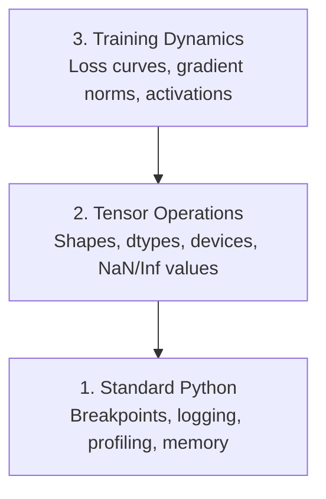

# 调试与性能分析

> 最糟糕的AI漏洞不会崩溃——它们在垃圾数据上默默训练，然后报告一条漂亮的损失曲线。

**类型：** 实战构建  
**语言：** Python  
**前置要求：** 第1课（开发环境）、基本的PyTorch熟悉度  
**时间：** 约60分钟

## 学习目标

- 使用条件式 `breakpoint()` 和 `debug_print` 在训练中检查张量的形状、数据类型和NaN值
- 利用 `cProfile`、`line_profiler` 和 `tracemalloc` 对训练循环进行性能分析，定位瓶颈
- 检测常见AI漏洞：形状不匹配、损失为NaN、数据泄露和错误设备上的张量
- 设置TensorBoard以可视化损失曲线、权重直方图和梯度分布

## 问题所在

AI代码的失败方式与常规代码不同。一个Web应用会因堆栈跟踪而崩溃。一个配置错误的训练循环会运行8小时，消耗200美元的GPU时间，却产生一个对每个输入都预测均值的模型。代码从未报错。漏洞可能是一个位于错误设备上的张量、一个被遗忘的 `.detach()`，或者标签泄露到了特征中。

你需要能在这些静默故障浪费你的时间和计算资源之前捕获它们的调试工具。

## 核心概念

AI调试在三个层次上进行：



大多数人直接跳到第3层（盯着TensorBoard看）。但80%的AI漏洞存在于第1层和第2层。

## 动手构建

### 第1部分：打印调试（没错，它确实有效）

打印调试常被轻视。但其实不该如此。对于张量代码，一个有针对性的print语句比单步调试器更有效，因为你需要同时查看形状、数据类型和取值范围。

```python
def debug_print(name, tensor):
    print(f"{name}: shape={tensor.shape}, dtype={tensor.dtype}, "
          f"device={tensor.device}, "
          f"min={tensor.min().item():.4f}, max={tensor.max().item():.4f}, "
          f"mean={tensor.mean().item():.4f}, "
          f"has_nan={tensor.isnan().any().item()}")
```

在每次可疑操作后调用此函数。找到漏洞后，删除这些print语句。简单。

### 第2部分：Python调试器（pdb 和 breakpoint）

内置调试器在AI工作中被低估了。在训练循环中放入 `breakpoint()`，就可以交互式检查张量。

```python
def training_step(model, batch, criterion, optimizer):
    inputs, labels = batch
    outputs = model(inputs)
    loss = criterion(outputs, labels)

    if loss.item() > 100 or torch.isnan(loss):
        breakpoint()

    loss.backward()
    optimizer.step()
```

当调试器启动后，有用的命令：

- `p outputs.shape` 检查形状
- `p loss.item()` 查看损失值
- `p torch.isnan(outputs).sum()` 计算NaN数量
- `p model.fc1.weight.grad` 检查梯度
- `c` 继续执行，`q` 退出

这是条件式调试。只有当某些东西看起来不对劲时，你才会停下来。对于一个10000步的训练运行，这很重要。

### 第3部分：Python日志记录

当你的调试超出快速检查范围时，用日志记录替换print语句。

```python
import logging

logging.basicConfig(
    level=logging.INFO,
    format="%(asctime)s [%(levelname)s] %(message)s",
    handlers=[
        logging.FileHandler("training.log"),
        logging.StreamHandler()
    ]
)
logger = logging.getLogger(__name__)

logger.info("Starting training: lr=%.4f, batch_size=%d", lr, batch_size)
logger.warning("Loss spike detected: %.4f at step %d", loss.item(), step)
logger.error("NaN loss at step %d, stopping", step)
```

日志记录为你提供时间戳、严重性级别和文件输出。当训练在凌晨3点失败时，你想要的是一个日志文件，而不是已经滚出屏幕的终端输出。

### 第4部分：计时代码段

了解时间花在哪里是优化的第一步。

```python
import time

class Timer:
    def __init__(self, name=""):
        self.name = name

    def __enter__(self):
        self.start = time.perf_counter()
        return self

    def __exit__(self, *args):
        elapsed = time.perf_counter() - self.start
        print(f"[{self.name}] {elapsed:.4f}s")

with Timer("data loading"):
    batch = next(dataloader_iter)

with Timer("forward pass"):
    outputs = model(batch)

with Timer("backward pass"):
    loss.backward()
```

常见发现：数据加载占用了60%的训练时间。解决办法是在DataLoader中使用 `num_workers > 0`，而不是换更快的GPU。

### 第5部分：cProfile 和 line_profiler

当你需要比手动计时器更详细的分析时：

```bash
python -m cProfile -s cumtime train.py
```

这显示了按累计时间排序的每个函数调用。若要逐行分析：

```bash
pip install line_profiler
```

```python
@profile
def train_step(model, data, target):
    output = model(data)
    loss = F.cross_entropy(output, target)
    loss.backward()
    return loss

# Run with: kernprof -l -v train.py
```

### 第6部分：内存分析

#### 使用tracemalloc分析CPU内存

```python
import tracemalloc

tracemalloc.start()

# your code here
model = build_model()
data = load_dataset()

snapshot = tracemalloc.take_snapshot()
top_stats = snapshot.statistics("lineno")
for stat in top_stats[:10]:
    print(stat)
```

#### 使用memory_profiler分析CPU内存

```bash
pip install memory_profiler
```

```python
from memory_profiler import profile

@profile
def load_data():
    raw = read_csv("data.csv")       # watch memory jump here
    processed = preprocess(raw)       # and here
    return processed
```

使用 `python -m memory_profiler your_script.py` 运行以查看逐行的内存使用情况。

#### 使用PyTorch分析GPU内存

```python
import torch

if torch.cuda.is_available():
    print(torch.cuda.memory_summary())

    print(f"Allocated: {torch.cuda.memory_allocated() / 1e9:.2f} GB")
    print(f"Cached: {torch.cuda.memory_reserved() / 1e9:.2f} GB")
```

当你遇到OOM（内存不足）错误时：

1. 减少批次大小（永远是第一个要尝试的方法）
2. 使用 `torch.cuda.empty_cache()` 释放缓存内存
3. 对于大型中间变量，先使用 `del tensor`，再用 `torch.cuda.empty_cache()`
4. 使用混合精度 (`torch.cuda.amp`) 可将内存使用减半
5. 对于非常深的模型，使用梯度检查点技术

### 第7部分：常见AI漏洞及捕获方法

#### 形状不匹配

最常见的漏洞。一个张量形状为 `[batch, features]`，但模型期望的是 `[batch, channels, height, width]`。

```python
def check_shapes(model, sample_input):
    print(f"Input: {sample_input.shape}")
    hooks = []

    def make_hook(name):
        def hook(module, inp, out):
            in_shape = inp[0].shape if isinstance(inp, tuple) else inp.shape
            out_shape = out.shape if hasattr(out, "shape") else type(out)
            print(f"  {name}: {in_shape} -> {out_shape}")
        return hook

    for name, module in model.named_modules():
        hooks.append(module.register_forward_hook(make_hook(name)))

    with torch.no_grad():
        model(sample_input)

    for h in hooks:
        h.remove()
```

用一个样本批次运行此代码。它映射出模型中所有的形状变换。

#### 损失为NaN

损失为NaN意味着有东西“爆炸”了。常见原因：

- 学习率过高
- 自定义损失函数中除以零
- 对零或负数取对数
- RNN中的梯度爆炸

```python
def detect_nan(model, loss, step):
    if torch.isnan(loss):
        print(f"NaN loss at step {step}")
        for name, param in model.named_parameters():
            if param.grad is not None:
                if torch.isnan(param.grad).any():
                    print(f"  NaN gradient in {name}")
                if torch.isinf(param.grad).any():
                    print(f"  Inf gradient in {name}")
        return True
    return False
```

#### 数据泄露

你的模型在测试集上达到了99%的准确率。听起来不错。但这是个漏洞。

```python
def check_data_leakage(train_set, test_set, id_column="id"):
    train_ids = set(train_set[id_column].tolist())
    test_ids = set(test_set[id_column].tolist())
    overlap = train_ids & test_ids
    if overlap:
        print(f"DATA LEAKAGE: {len(overlap)} samples in both train and test")
        return True
    return False
```

还要检查时间序列泄露：使用未来数据预测过去。在划分数据前按时间戳排序。

#### 错误设备

位于不同设备（CPU vs GPU）上的张量会导致运行时错误。但有时一个张量会静静地留在CPU上，而其他所有东西都在GPU上，训练只是运行得很慢。

```python
def check_devices(model, *tensors):
    model_device = next(model.parameters()).device
    print(f"Model device: {model_device}")
    for i, t in enumerate(tensors):
        if t.device != model_device:
            print(f"  WARNING: tensor {i} on {t.device}, model on {model_device}")
```

### 第8部分：TensorBoard基础

TensorBoard向你展示训练过程中随时间发生的情况。

```bash
pip install tensorboard
```

```python
from torch.utils.tensorboard import SummaryWriter

writer = SummaryWriter("runs/experiment_1")

for step in range(num_steps):
    loss = train_step(model, batch)

    writer.add_scalar("loss/train", loss.item(), step)
    writer.add_scalar("lr", optimizer.param_groups[0]["lr"], step)

    if step % 100 == 0:
        for name, param in model.named_parameters():
            writer.add_histogram(f"weights/{name}", param, step)
            if param.grad is not None:
                writer.add_histogram(f"grads/{name}", param.grad, step)

writer.close()
```

启动它：

```bash
tensorboard --logdir=runs
```

要关注的点：

- **损失不下降**：学习率过低，或模型架构有问题
- **损失剧烈振荡**：学习率过高
- **损失变为NaN**：数值不稳定（参见上面的NaN部分）
- **训练损失下降，验证损失上升**：过拟合
- **权重直方图坍缩到零**：梯度消失
- **梯度直方图爆炸**：需要梯度裁剪

### 第9部分：VS Code调试器

若要进行交互式调试，请使用 `launch.json` 配置VS Code：

```json
{
    "version": "0.2.0",
    "configurations": [
        {
            "name": "Debug Training",
            "type": "debugpy",
            "request": "launch",
            "program": "${file}",
            "console": "integratedTerminal",
            "justMyCode": false
        }
    ]
}
```

通过点击行号左侧区域设置断点。使用“变量”窗格检查张量属性。“调试控制台”允许你在执行过程中运行任意Python表达式。

这对于单步调试数据预处理管道非常有用，你可以看到每一步变换。

## 运用它

以下是能捕获大多数AI漏洞的调试工作流程：

1. **训练前**：使用一个样本批次运行 `check_shapes`。验证输入和输出维度是否符合预期。
2. **前10步**：对损失、输出和梯度使用 `debug_print`。确认没有NaN，且数值在合理范围内。
3. **训练期间**：记录损失、学习率和梯度范数。使用TensorBoard进行可视化。
4. **出现问题时**：在故障点放入 `breakpoint()`。交互式检查张量。
5. **针对性能**：对数据加载、前向传播和反向传播进行计时。如果接近OOM，分析内存使用。

## 交付它

运行调试工具包脚本：

```bash
python phases/00-setup-and-tooling/12-debugging-and-profiling/code/debug_tools.py
```

参阅 `outputs/prompt-debug-ai-code.md` 获取一个有助于诊断AI特定漏洞的提示。

## 练习

1. 运行 `debug_tools.py` 并阅读每部分的输出。修改虚拟模型以引入一个NaN（提示：在前向传播中除以零），并观察检测器如何捕获它。
2. 使用 `cProfile` 对一个训练循环进行性能分析，并找出最慢的函数。
3. 使用 `tracemalloc` 查找数据加载管道中哪一行分配了最多内存。
4. 为一个简单的训练运行设置TensorBoard，并判断模型是否过拟合。
5. 在训练循环内部使用 `breakpoint()`。练习从调试器提示符中检查张量形状、设备和梯度值。