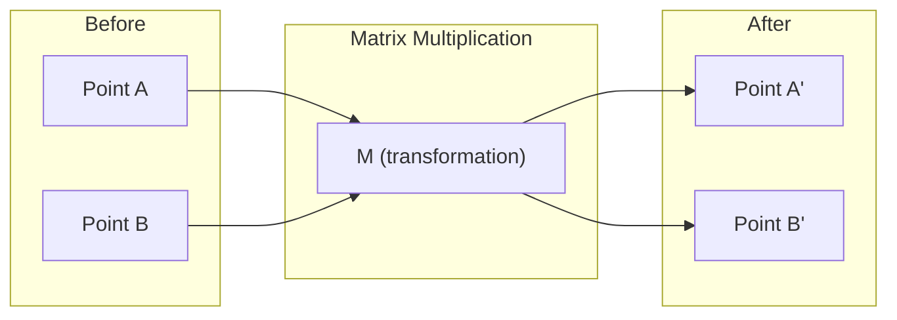
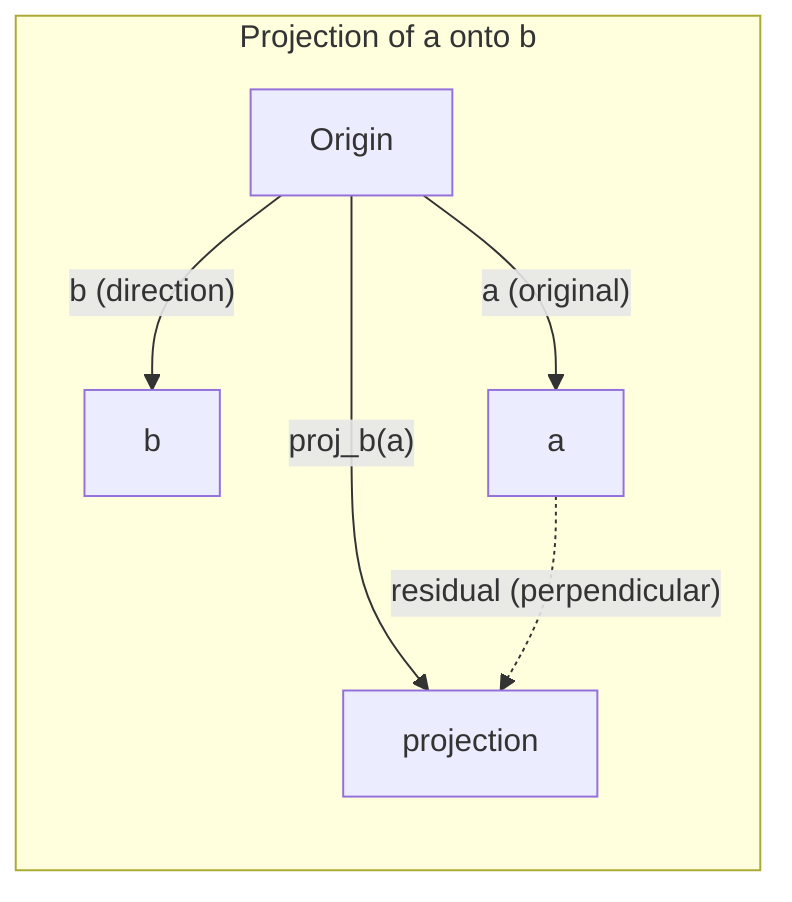

# 线性代数直觉

> 每个AI模型都只是戴着花哨帽子的矩阵运算。

**类型：** 学习
**语言：** Python, Julia
**先修要求：** 第0阶段
**时间：** 约60分钟

## 学习目标

- 使用Python从零开始实现向量和矩阵运算（加法、点积、矩阵乘法）
- 几何解释点积、投影和格拉姆-施密特过程的含义
- 通过行化简判断一组向量的线性无关性、秩和基
- 将线性代数概念与其AI应用关联起来：嵌入、注意力分数和LoRA

## 问题所在

打开任何机器学习论文。在第一页内，你就会看到向量、矩阵、点积和变换。如果没有线性代数直觉，这些只是符号。有了它，你就能看清神经网络真正在做什么——在空间中移动点。

你不需要成为数学家。你需要理解这些运算的几何意义，然后自己编写代码。

## 核心概念

### 向量即点（和方向）

向量只是一个数字列表。但这些数字有其含义——它们是空间中的坐标。

**2D向量[3, 2]：**

| x | y | 点 |
|---|---|-------|
| 3 | 2 | 向量从原点(0,0)指向平面中的点(3, 2) |

该向量的大小为sqrt(3^2 + 2^2) = sqrt(13)，方向指向右上方。

在AI中，向量表示一切：
- 一个词 → 一个768维向量（在嵌入空间中的“含义”）
- 一张图像 → 一个包含数百万像素值的向量
- 一个用户 → 一个表示偏好的向量

### 矩阵即变换

矩阵将一个向量变换为另一个向量。它可以旋转、缩放、拉伸或投影。



在AI中，矩阵就是模型：
- 神经网络权重 → 将输入变换为输出的矩阵
- 注意力分数 → 决定关注什么的矩阵
- 嵌入 → 将词映射为向量的矩阵

### 点积衡量相似性

两个向量的点积告诉你它们有多相似。

```
a · b = a₁×b₁ + a₂×b₂ + ... + aₙ×bₙ

Same direction:      a · b > 0  (similar)
Perpendicular:       a · b = 0  (unrelated)
Opposite direction:  a · b < 0  (dissimilar)
```

这正是搜索引擎、推荐系统和RAG的工作原理——寻找具有高点积的向量。

### 线性无关性

如果一组向量中没有一个可以表示为其他向量的线性组合，则这些向量线性无关。如果v1、v2、v3无关，则它们张成一个3D空间。如果其中一个是其他向量的组合，则它们只张成一个平面。

这对AI为何重要：你的特征矩阵的列应该是线性无关的。如果两个特征完全相关（线性相关），模型就无法区分它们的影响。这会导致回归中的多重共线性——权重矩阵变得不稳定，微小的输入变化会产生剧烈的输出波动。

**具体例子：**

```
v1 = [1, 0, 0]
v2 = [0, 1, 0]
v3 = [2, 1, 0]   # v3 = 2*v1 + v2
```

v1和v2无关——它们之间没有一个是标量倍数或组合。但v3 = 2*v1 + v2，所以{v1, v2, v3}是相关集。这三个向量都位于xy平面内。无论你怎么组合它们，都无法到达[0, 0, 1]。你有三个向量，但只有两个自由度。

在数据集中：如果feature_3 = 2*feature_1 + feature_2，添加feature_3不会给模型带来任何新信息。更糟糕的是，它会导致法方程奇异——权重没有唯一解。

### 基和秩

基是一个最小线性无关向量集，可以张成整个空间。基向量的个数就是空间的维数。

3D空间的标准基是{[1,0,0], [0,1,0], [0,0,1]}。但3D空间中任何三个无关向量都可以构成有效的基。基的选择就是坐标系的选择。

矩阵的秩 = 线性无关列的个数 = 线性无关行的个数。如果秩 < min(行数, 列数)，则矩阵是秩亏的。这意味着：
- 系统有无穷多个解（或无解）
- 变换过程中信息丢失
- 矩阵不可逆

| 情况 | 秩 | 对ML的意义 |
|-----------|------|---------------------|
| 满秩（秩 = min(m, n)） | 最大可能 | 存在唯一最小二乘解。模型条件良好。 |
| 秩亏（秩 < min(m, n)） | 低于最大 | 特征冗余。权重解有无穷多个。需要正则化。 |
| 秩为1 | 1 | 每一列都是一个向量的缩放副本。所有数据都在一条线上。 |
| 近似秩亏（小奇异值） | 数值上低 | 矩阵病态。微小的输入噪声会导致巨大的输出变化。使用SVD截断或岭回归。 |

### 投影

将向量**a**投影到向量**b**上，得到**a**在**b**方向上的分量：

```
proj_b(a) = (a dot b / b dot b) * b
```

残差（a - proj_b(a)）垂直于b。这种正交分解是拟合的基础。

投影在ML中无处不在：
- 线性回归最小化观测值到列空间的距离——解就是一个投影
- PCA将数据投影到最大方差方向上
- Transformer中的注意力计算查询在键上的投影



**例子：** a = [3, 4], b = [1, 0]

proj_b(a) = (3*1 + 4*0) / (1*1 + 0*0) * [1, 0] = 3 * [1, 0] = [3, 0]

投影丢弃了y分量。这是最简单形式的降维——丢弃你不关心的方向。

### 格拉姆-施密特过程

将任何一组无关向量转换为标准正交基。标准正交意味着每个向量长度为1，且每对向量都垂直。

算法：
1. 取第一个向量，将其归一化
2. 取第二个向量，减去它在第一个向量上的投影，归一化
3. 取第三个向量，减去它在所有先前向量上的投影，归一化
4. 对剩余向量重复此过程

```
Input:  v1, v2, v3, ... (linearly independent)

u1 = v1 / |v1|

w2 = v2 - (v2 dot u1) * u1
u2 = w2 / |w2|

w3 = v3 - (v3 dot u1) * u1 - (v3 dot u2) * u2
u3 = w3 / |w3|

Output: u1, u2, u3, ... (orthonormal basis)
```

这就是QR分解的内部工作原理。Q是标准正交基，R捕获投影系数。QR分解用于：
- 求解线性系统（比高斯消元法更稳定）
- 计算特征值（QR算法）
- 最小二乘回归（标准数值方法）

## 动手构建

### 第1步：从零开始构建向量（Python）

```python
class Vector:
    def __init__(self, components):
        self.components = list(components)
        self.dim = len(self.components)

    def __add__(self, other):
        return Vector([a + b for a, b in zip(self.components, other.components)])

    def __sub__(self, other):
        return Vector([a - b for a, b in zip(self.components, other.components)])

    def dot(self, other):
        return sum(a * b for a, b in zip(self.components, other.components))

    def magnitude(self):
        return sum(x**2 for x in self.components) ** 0.5

    def normalize(self):
        mag = self.magnitude()
        return Vector([x / mag for x in self.components])

    def cosine_similarity(self, other):
        return self.dot(other) / (self.magnitude() * other.magnitude())

    def __repr__(self):
        return f"Vector({self.components})"


a = Vector([1, 2, 3])
b = Vector([4, 5, 6])

print(f"a + b = {a + b}")
print(f"a · b = {a.dot(b)}")
print(f"|a| = {a.magnitude():.4f}")
print(f"cosine similarity = {a.cosine_similarity(b):.4f}")
```

### 第2步：从零开始构建矩阵（Python）

```python
class Matrix:
    def __init__(self, rows):
        self.rows = [list(row) for row in rows]
        self.shape = (len(self.rows), len(self.rows[0]))

    def __matmul__(self, other):
        if isinstance(other, Vector):
            return Vector([
                sum(self.rows[i][j] * other.components[j] for j in range(self.shape[1]))
                for i in range(self.shape[0])
            ])
        rows = []
        for i in range(self.shape[0]):
            row = []
            for j in range(other.shape[1]):
                row.append(sum(
                    self.rows[i][k] * other.rows[k][j]
                    for k in range(self.shape[1])
                ))
            rows.append(row)
        return Matrix(rows)

    def transpose(self):
        return Matrix([
            [self.rows[j][i] for j in range(self.shape[0])]
            for i in range(self.shape[1])
        ])

    def __repr__(self):
        return f"Matrix({self.rows})"


rotation_90 = Matrix([[0, -1], [1, 0]])
point = Vector([3, 1])

rotated = rotation_90 @ point
print(f"Original: {point}")
print(f"Rotated 90°: {rotated}")
```

### 第3步：为何这对AI重要

```python
import random

random.seed(42)
weights = Matrix([[random.gauss(0, 0.1) for _ in range(3)] for _ in range(2)])
input_vector = Vector([1.0, 0.5, -0.3])

output = weights @ input_vector
print(f"Input (3D): {input_vector}")
print(f"Output (2D): {output}")
print("This is what a neural network layer does -- matrix multiplication.")
```

### 第4步：Julia版本

```julia
a = [1.0, 2.0, 3.0]
b = [4.0, 5.0, 6.0]

println("a + b = ", a + b)
println("a · b = ", a ⋅ b)       # Julia supports unicode operators
println("|a| = ", √(a ⋅ a))
println("cosine = ", (a ⋅ b) / (√(a ⋅ a) * √(b ⋅ b)))

# Matrix-vector multiplication
W = [0.1 -0.2 0.3; 0.4 0.5 -0.1]
x = [1.0, 0.5, -0.3]
println("Wx = ", W * x)
println("This is a neural network layer.")
```

### 第5步：从零开始实现线性无关性和投影（Python）

```python
def is_linearly_independent(vectors):
    n = len(vectors)
    dim = len(vectors[0].components)
    mat = Matrix([v.components[:] for v in vectors])
    rows = [row[:] for row in mat.rows]
    rank = 0
    for col in range(dim):
        pivot = None
        for row in range(rank, len(rows)):
            if abs(rows[row][col]) > 1e-10:
                pivot = row
                break
        if pivot is None:
            continue
        rows[rank], rows[pivot] = rows[pivot], rows[rank]
        scale = rows[rank][col]
        rows[rank] = [x / scale for x in rows[rank]]
        for row in range(len(rows)):
            if row != rank and abs(rows[row][col]) > 1e-10:
                factor = rows[row][col]
                rows[row] = [rows[row][j] - factor * rows[rank][j] for j in range(dim)]
        rank += 1
    return rank == n


def project(a, b):
    scalar = a.dot(b) / b.dot(b)
    return Vector([scalar * x for x in b.components])


def gram_schmidt(vectors):
    orthonormal = []
    for v in vectors:
        w = v
        for u in orthonormal:
            proj = project(w, u)
            w = w - proj
        if w.magnitude() < 1e-10:
            continue
        orthonormal.append(w.normalize())
    return orthonormal


v1 = Vector([1, 0, 0])
v2 = Vector([1, 1, 0])
v3 = Vector([1, 1, 1])
basis = gram_schmidt([v1, v2, v3])
for i, u in enumerate(basis):
    print(f"u{i+1} = {u}")
    print(f"  |u{i+1}| = {u.magnitude():.6f}")

print(f"u1 · u2 = {basis[0].dot(basis[1]):.6f}")
print(f"u1 · u3 = {basis[0].dot(basis[2]):.6f}")
print(f"u2 · u3 = {basis[1].dot(basis[2]):.6f}")
```

## 实际应用

现在用NumPy做同样的事情——你实际在实践中会使用的：

```python
import numpy as np

a = np.array([1, 2, 3], dtype=float)
b = np.array([4, 5, 6], dtype=float)

print(f"a + b = {a + b}")
print(f"a · b = {np.dot(a, b)}")
print(f"|a| = {np.linalg.norm(a):.4f}")
print(f"cosine = {np.dot(a, b) / (np.linalg.norm(a) * np.linalg.norm(b)):.4f}")

W = np.random.randn(2, 3) * 0.1
x = np.array([1.0, 0.5, -0.3])
print(f"Wx = {W @ x}")
```

### 使用NumPy的秩、投影和QR

```python
import numpy as np

A = np.array([[1, 2], [2, 4]])
print(f"Rank: {np.linalg.matrix_rank(A)}")

a = np.array([3, 4])
b = np.array([1, 0])
proj = (np.dot(a, b) / np.dot(b, b)) * b
print(f"Projection of {a} onto {b}: {proj}")

Q, R = np.linalg.qr(np.random.randn(3, 3))
print(f"Q is orthogonal: {np.allclose(Q @ Q.T, np.eye(3))}")
print(f"R is upper triangular: {np.allclose(R, np.triu(R))}")
```

### PyTorch——带自动微分的张量即向量

```python
import torch

x = torch.randn(3, requires_grad=True)
y = torch.tensor([1.0, 0.0, 0.0])

similarity = torch.dot(x, y)
similarity.backward()

print(f"x = {x.data}")
print(f"y = {y.data}")
print(f"dot product = {similarity.item():.4f}")
print(f"d(dot)/dx = {x.grad}")
```

点积对x的梯度就是y。PyTorch自动计算了这个。神经网络中的每个操作都由这样的操作构建——矩阵乘法、点积、投影——而自动微分会跟踪所有这些操作中的梯度。

你刚刚从零开始构建了NumPy一行代码就能完成的功能。现在你知道底层发生了什么。

## 产出

本课程产出：
- `outputs/prompt-linear-algebra-tutor.md` —— 一个供AI助手通过几何直觉教授线性代数的提示

## 关联

本课程中的所有内容都与现代AI的具体部分相关：

| 概念 | 出现之处 |
|---------|------------------|
| 点积 | Transformer中的注意力分数，RAG中的余弦相似度 |
| 矩阵乘法 | 每一个神经网络层，每一个线性变换 |
| 线性无关性 | 特征选择，避免多重共线性 |
| 秩 | 判断系统是否可解，LoRA（低秩适应） |
| 投影 | 线性回归（投影到列空间），PCA |
| 格拉姆-施密特/QR | 数值求解器，特征值计算 |
| 标准正交基 | 稳定的数值计算，白化变换 |

LoRA值得特别一提。它通过将权重更新分解为低秩矩阵来微调大型语言模型。LoRA不是更新一个4096x4096的权重矩阵（1600万参数），而是更新两个大小为4096x16和16x4096的矩阵（131,000参数）。秩为16的约束意味着LoRA假设权重更新存在于完整4096维空间的16维子空间中。这就是线性代数在实际工作。

## 练习

1. 实现`Vector.angle_between(other)`，返回两个向量之间的角度（以度为单位）
2. 创建一个2D缩放矩阵，使x坐标加倍，y坐标变为三倍，然后将其应用于向量[1, 1]
3. 给定5个随机的类词向量（维度50），使用余弦相似度找出最相似的两个
4. 验证格拉姆-施密特的输出是否真正标准正交：检查每对点积是否为0，每个向量大小是否为1
5. 创建一个秩为2的3x3矩阵。使用`rank()`方法验证。然后解释列张成了什么几何对象。
6. 将向量[1, 2, 3]投影到[1, 1, 1]上。结果在几何上表示什么？

## 关键术语

| 术语 | 人们怎么说 | 实际含义 |
|------|----------------|----------------------|
| 向量 | “一支箭” | 表示n维空间中的点或方向的数字列表 |
| 矩阵 | “数字表格” | 将向量从一个空间映射到另一个空间的变换 |
| 点积 | “乘起来再加” | 衡量两个向量对齐程度的指标——相似性搜索的核心 |
| 嵌入 | “某种AI魔法” | 表示某物（词、图像、用户）含义的向量 |
| 线性无关性 | “它们不重叠” | 集合中没有一个向量可以表示为其他向量的组合 |
| 秩 | “有多少维” | 矩阵中线性无关列（或行）的数量 |
| 投影 | “影子” | 一个向量在另一个方向上的分量 |
| 基 | “坐标轴” | 张成空间的最小无关向量集 |
| 标准正交 | “垂直的单位向量” | 相互垂直且每个长度为1的向量 |