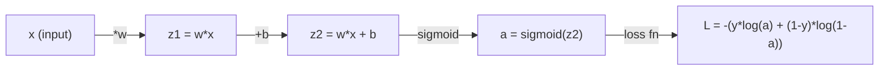
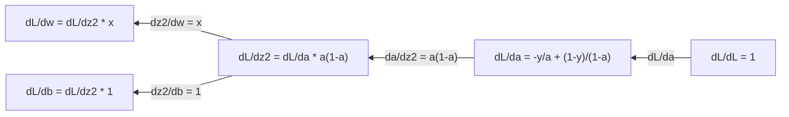
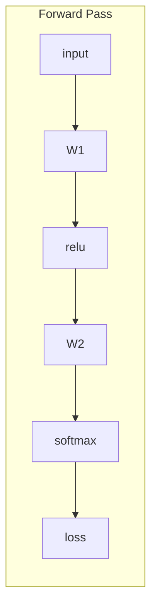
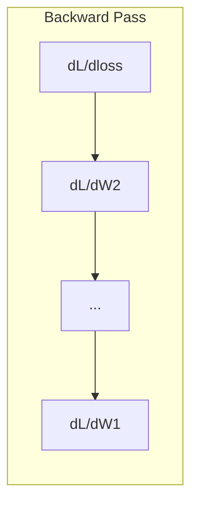

# 机器学习的微积分

> 导数告诉你下坡的方向。这就是神经网络学习所需的一切。

**类型：** 学习
**语言：** Python
**前提条件：** 第1阶段，课程01-03
**时间：** 约60分钟

## 学习目标

- 为常见的ML函数（x^2, sigmoid, 交叉熵）计算数值导数和解析导数
- 从零开始实现梯度下降法，在一维和二维中最小化损失函数
- 推导线性回归模型的梯度，并通过手动权重更新进行训练
- 解释海森矩阵、泰勒级数近似及其与优化方法的关系

## 问题描述

你有一个拥有数百万权重的神经网络。每个权重都是一个旋钮。你需要弄清楚每个旋钮应该朝哪个方向转动，才能让模型的错误略微减少。微积分为你指明了方向。

没有微积分，训练神经网络就意味着尝试随机的修改并寄希望于最好的结果。有了导数，你就能确切地知道每个权重如何影响误差。每次都能将每个旋钮转向正确的方向。

## 概念讲解

### 什么是导数？

导数衡量变化率。对于一个函数 y = f(x)，其导数 f'(x) 告诉你：如果将 x 轻轻推动一小下，y 会变化多少？

在几何上，导数是某一点切线的斜率。

**f(x) = x^2：**

| x | f(x) | f'(x) (斜率) |
|---|------|---------------|
| 0 | 0    | 0 (平坦，位于底部) |
| 1 | 1    | 2 |
| 2 | 4    | 4 (该点切线的斜率) |
| 3 | 9    | 6 |

在 x=2 处，斜率为 4。如果将 x 向右移动一点点，y 将增加大约该移动量的 4 倍。在 x=0 处，斜率为 0。你正处于碗状曲线的底部。

形式化定义：

```
f'(x) = lim   f(x + h) - f(x)
        h->0  -----------------
                     h
```

在代码中，你会跳过极限计算，直接使用一个很小的 h。这就是数值导数。

### 偏导数：一次一个变量

实际函数有多个输入。神经网络的损失函数依赖于数千个权重。偏导数保持其他所有变量不变，然后对其中一个变量求导。

```
f(x, y) = x^2 + 3xy + y^2

df/dx = 2x + 3y     (treat y as a constant)
df/dy = 3x + 2y     (treat x as a constant)
```

每个偏导数回答的问题是：如果我只推动这一个权重，损失会如何变化？

### 梯度：所有偏导数的向量

梯度将所有偏导数收集到一个向量中。对于函数 f(x, y, z)，其梯度为：

```
grad f = [ df/dx, df/dy, df/dz ]
```

梯度指向最陡上升的方向。为了最小化一个函数，需要沿相反方向移动。

**f(x,y) = x^2 + y^2 的等高线图：**

该函数形成一个碗状形状，等高线为同心圆。最小值在 (0, 0)。

| 点 | grad f | -grad f (下降方向) |
|-------|--------|----------------------------|
| (1, 1) | [2, 2] (指向上升方向，远离最小值) | [-2, -2] (指向下降方向，朝向最小值) |
| (0, 0) | [0, 0] (平坦，位于最小值) | [0, 0] |

这就是图示中的梯度下降法。计算梯度，取反，然后迈步。

### 与优化的联系

训练神经网络就是优化。你有一个损失函数 L(w1, w2, ..., wn)，它衡量模型的错误程度。你想要最小化它。

```
Gradient descent update rule:

  w_new = w_old - learning_rate * dL/dw

For every weight:
  1. Compute the partial derivative of loss with respect to that weight
  2. Subtract a small multiple of it from the weight
  3. Repeat
```

学习率控制步长。太大则会错过最优解，太小则收敛缓慢。

**损失函数景观（一维切片）：**

损失函数 L(w) 在权重 w 变化时形成一条有峰有谷的曲线。

| 特征 | 描述 |
|---------|-------------|
| 全局最小值 | 整条曲线上的最低点——最优解 |
| 局部最小值 | 比相邻点低但不是整体最低的一个山谷 |
| 斜率 | 梯度下降法从任意起点沿斜坡向下移动 |

梯度下降法沿着斜坡向下移动。它可能陷入局部最小值，但在高维空间（数百万权重）中，这通常不是实际问题。

### 数值导数与解析导数

计算导数有两种方法。

解析法：手动应用微积分规则。对于 f(x) = x^2，其导数是 f'(x) = 2x。精确。快速。

数值法：使用定义进行近似。为很小的 h 计算 f(x+h) 和 f(x-h)，然后利用差值。

```
Numerical (central difference):

f'(x) ~= f(x + h) - f(x - h)
          -----------------------
                  2h

h = 0.0001 works well in practice
```

数值导数较慢，但对任何函数都有效。解析导数快速，但需要你推导出公式。神经网络框架使用第三种方法：自动微分，它能机械地计算出精确导数。你将在第3阶段看到它。

### 简单函数的手动求导

这些是你会在机器学习中反复看到的导数。

```
Function        Derivative       Used in
--------        ----------       -------
f(x) = x^2     f'(x) = 2x      Loss functions (MSE)
f(x) = wx + b  f'(w) = x        Linear layer (gradient w.r.t. weight)
                f'(b) = 1        Linear layer (gradient w.r.t. bias)
                f'(x) = w        Linear layer (gradient w.r.t. input)
f(x) = e^x     f'(x) = e^x     Softmax, attention
f(x) = ln(x)   f'(x) = 1/x     Cross-entropy loss
f(x) = 1/(1+e^-x)  f'(x) = f(x)(1-f(x))   Sigmoid activation
```

对于 f(x) = x^2：

```
f(x) = x^2    f'(x) = 2x

  x    f(x)   f'(x)   meaning
  -2    4      -4      slope tilts left (decreasing)
  -1    1      -2      slope tilts left (decreasing)
   0    0       0      flat (minimum!)
   1    1       2      slope tilts right (increasing)
   2    4       4      slope tilts right (increasing)
```

对于 f(w) = wx + b，其中 x=3，b=1：

```
f(w) = 3w + 1    f'(w) = 3

The derivative with respect to w is just x.
If x is big, a small change in w causes a big change in output.
```

### 链式法则

当函数复合时，链式法则告诉你如何求导。

```
If y = f(g(x)), then dy/dx = f'(g(x)) * g'(x)

Example: y = (3x + 1)^2
  outer: f(u) = u^2       f'(u) = 2u
  inner: g(x) = 3x + 1    g'(x) = 3
  dy/dx = 2(3x + 1) * 3 = 6(3x + 1)
```

神经网络是函数的链：输入 -> 线性变换 -> 激活函数 -> 线性变换 -> 激活函数 -> 损失函数。反向传播就是链式法则从输出到输入的反复应用。这就是整个算法。

### 海森矩阵

梯度告诉你斜率。海森矩阵告诉你曲率。

海森矩阵是二阶偏导数的矩阵。对于函数 f(x1, x2, ..., xn)，海森矩阵的第 (i, j) 个元素是：

```
H[i][j] = d^2f / (dx_i * dx_j)
```

对于二元函数 f(x, y)：

```
H = | d^2f/dx^2    d^2f/dxdy |
    | d^2f/dydx    d^2f/dy^2 |
```

**海森矩阵在临界点（梯度为0处）告诉你什么：**

| 海森性质 | 含义 | 表面示例 |
|-----------------|---------|-----------------|
| 正定 (所有特征值 > 0) | 局部最小值 | 碗口朝上的碗 |
| 负定 (所有特征值 < 0) | 局部最大值 | 碗口朝下的碗 |
| 不定 (特征值有正有负) | 鞍点 | 马鞍形状 |

**示例：** f(x, y) = x^2 - y^2 (一个鞍形函数)

```
df/dx = 2x       df/dy = -2y
d^2f/dx^2 = 2    d^2f/dy^2 = -2    d^2f/dxdy = 0

H = | 2   0 |
    | 0  -2 |

Eigenvalues: 2 and -2 (one positive, one negative)
--> Saddle point at (0, 0)
```

与 f(x, y) = x^2 + y^2 (一个碗) 比较：

```
H = | 2  0 |
    | 0  2 |

Eigenvalues: 2 and 2 (both positive)
--> Local minimum at (0, 0)
```

**为什么海森矩阵在机器学习中很重要：**

牛顿法利用海森矩阵进行比梯度下降法更优的优化步长。它不仅仅跟随斜率，还考虑了曲率：

```
Newton's update:    w_new = w_old - H^(-1) * gradient
Gradient descent:   w_new = w_old - lr * gradient
```

牛顿法收敛更快，因为海森矩阵“重新缩放”了梯度——陡峭的方向步长变小，平坦的方向步长变大。

问题是：对于一个有 N 个参数的神经网络，海森矩阵是 N x N 的。一个拥有100万参数的模型需要一个1万亿个元素的矩阵。这就是为什么我们需要使用近似方法。

| 方法 | 使用什么 | 代价 | 收敛性 |
|--------|-------------|------|-------------|
| 梯度下降 | 仅一阶导数 | 每步 O(N) | 慢 (线性) |
| 牛顿法 | 完整海森矩阵 | 每步 O(N^3) | 快 (二次) |
| L-BFGS | 基于梯度历史的近似海森矩阵 | 每步 O(N) | 中等 (超线性) |
| Adam | 每个参数的自适应学习率 (海森矩阵对角线近似) | 每步 O(N) | 中等 |
| 自然梯度 | Fisher信息矩阵 (统计学的海森矩阵) | 每步 O(N^2) | 快 |

实践中，Adam是深度学习的默认优化器。它通过跟踪每个参数梯度的运行均值和方差，廉价地近似二阶信息。

### 泰勒级数近似

任何光滑函数都可以在局部用多项式近似：

```
f(x + h) = f(x) + f'(x)*h + (1/2)*f''(x)*h^2 + (1/6)*f'''(x)*h^3 + ...
```

包含的项越多，近似效果越好——但仅在点 x 附近有效。

**泰勒级数为何对机器学习重要：**

- **一阶梯度下降 = 梯度下降。** 当你使用 f(x + h) ~ f(x) + f'(x)*h 时，你正在做一个线性近似。梯度下降法最小化这个线性模型以选择 h = -lr * f'(x)。

- **二阶泰勒 = 牛顿法。** 使用 f(x + h) ~ f(x) + f'(x)*h + (1/2)*f''(x)*h^2，你将得到一个二次模型。最小化它得到 h = -f'(x)/f''(x) —— 牛顿步长。

- **损失函数设计。** MSE 和交叉熵是光滑的，这意味着它们的泰勒展开表现良好。这并非偶然。光滑的损失使优化具有可预测性。

```
Approximation order    What it captures    Optimization method
-------------------    -----------------   -------------------
0th order (constant)   Just the value      Random search
1st order (linear)     Slope               Gradient descent
2nd order (quadratic)  Curvature           Newton's method
Higher orders          Finer structure     Rarely used in ML
```

关键洞察：所有基于梯度的优化，本质上都是在局部近似损失函数，并朝着该近似值的最小值移动。

### 积分在机器学习中的应用

导数告诉你变化率。积分计算累积量——曲线下面积。

在机器学习中，你很少手动计算积分，但这个概念无处不在：

**概率。** 对于具有密度函数 p(x) 的连续随机变量：
```
P(a < X < b) = integral from a to b of p(x) dx
```
概率密度曲线在 a 和 b 之间的面积就是落在这个区间内的概率。

**期望值。** 以概率为权重的平均结果：
```
E[f(X)] = integral of f(x) * p(x) dx
```
数据分布上的期望损失是一个积分。训练过程最小化这个积分的经验近似值。

**KL散度。** 衡量两个分布的差异：
```
KL(p || q) = integral of p(x) * log(p(x) / q(x)) dx
```
用于变分自编码器、知识蒸馏和贝叶斯推断。

**归一化常数。** 在贝叶斯推断中：
```
p(w | data) = p(data | w) * p(w) / integral of p(data | w) * p(w) dw
```
分母是对所有可能参数值的积分。它通常是难处理的，这就是为什么我们使用MCMC和变分推断等近似方法。

| 积分概念 | 在机器学习中的出现位置 |
|-----------------|----------------------|
| 曲线下面积 | 来自密度函数的概率 |
| 期望值 | 损失函数，风险最小化 |
| KL散度 | VAE，策略优化，蒸馏 |
| 归一化 | 贝叶斯后验概率，softmax分母 |
| 边际似然 | 模型比较，证据下界(ELBO) |

### 计算图中的多元链式法则

链式法则不仅适用于一条线上的标量函数。在神经网络中，变量会分散和合并。这里展示导数如何流过一个简单的前向传播：



反向传播从左到右计算梯度：



每条边乘以其局部导数。任何参数的梯度是从损失到该参数路径上所有局部导数的乘积。当路径分支和合并时，你需要将贡献求和（多元链式法则）。

这就是反向传播的全部：系统地将链式法则通过计算图应用，从输出到输入。

### 雅可比矩阵

当一个函数将一个向量映射到另一个向量（比如神经网络的一层）时，它的导数是一个矩阵。雅可比矩阵包含每个输出对每个输入的偏导数。

对于 f: R^n -> R^m，雅可比矩阵 J 是一个 m x n 的矩阵：

| | x1 | x2 | ... | xn |
|---|---|---|---|---|
| f1 | df1/dx1 | df1/dx2 | ... | df1/dxn |
| f2 | df2/dx1 | df2/dx2 | ... | df2/dxn |
| ... | ... | ... | ... | ... |
| fm | dfm/dx1 | dfm/dx2 | ... | dfm/dxn |

你不需要为神经网络手动计算雅可比矩阵。PyTorch会处理它。但了解它的存在有助于你理解反向传播中的形状：如果一层将 R^n 映射到 R^m，那么它的雅可比矩阵就是 m x n。梯度通过这个矩阵的转置反向传播。

### 为什么这对神经网络很重要

神经网络中的每个权重都有一个梯度。梯度告诉你如何调整该权重以减少损失。





每次权重更新：
- `W1 = W1 - lr * dL/dW1`
- `W2 = W2 - lr * dL/dW2`

前向传播计算预测值和损失。反向传播计算损失对每个权重的梯度。然后每个权重沿着下坡方向迈出一小步。重复数百万次。这就是深度学习。

## 动手实现

### 第1步：从零开始实现数值导数

```python
def numerical_derivative(f, x, h=1e-7):
    return (f(x + h) - f(x - h)) / (2 * h)

def f(x):
    return x ** 2

for x in [-2, -1, 0, 1, 2]:
    numerical = numerical_derivative(f, x)
    analytical = 2 * x
    print(f"x={x:2d}  f'(x) numerical={numerical:.6f}  analytical={analytical:.1f}")
```

数值导数与解析导数在很多小数位上匹配。

### 第2步：偏导数与梯度

```python
def numerical_gradient(f, point, h=1e-7):
    gradient = []
    for i in range(len(point)):
        point_plus = list(point)
        point_minus = list(point)
        point_plus[i] += h
        point_minus[i] -= h
        partial = (f(point_plus) - f(point_minus)) / (2 * h)
        gradient.append(partial)
    return gradient

def f_multi(point):
    x, y = point
    return x**2 + 3*x*y + y**2

grad = numerical_gradient(f_multi, [1.0, 2.0])
print(f"Numerical gradient at (1,2): {[f'{g:.4f}' for g in grad]}")
print(f"Analytical gradient at (1,2): [2*1+3*2, 3*1+2*2] = [{2*1+3*2}, {3*1+2*2}]")
```

### 第3步：用梯度下降法寻找 f(x) = x^2 的最小值

```python
x = 5.0
lr = 0.1
for step in range(20):
    grad = 2 * x
    x = x - lr * grad
    print(f"step {step:2d}  x={x:8.4f}  f(x)={x**2:10.6f}")
```

从 x=5 开始，每一步都更接近 x=0（最小值）。

### 第4步：在2D函数上应用梯度下降

```python
def f_2d(point):
    x, y = point
    return x**2 + y**2

point = [4.0, 3.0]
lr = 0.1
for step in range(30):
    grad = numerical_gradient(f_2d, point)
    point = [p - lr * g for p, g in zip(point, grad)]
    loss = f_2d(point)
    if step % 5 == 0 or step == 29:
        print(f"step {step:2d}  point=({point[0]:7.4f}, {point[1]:7.4f})  f={loss:.6f}")
```

### 第5步：比较数值导数与解析导数

```python
import math

test_functions = [
    ("x^2",      lambda x: x**2,          lambda x: 2*x),
    ("x^3",      lambda x: x**3,          lambda x: 3*x**2),
    ("sin(x)",   lambda x: math.sin(x),   lambda x: math.cos(x)),
    ("e^x",      lambda x: math.exp(x),   lambda x: math.exp(x)),
    ("1/x",      lambda x: 1/x,           lambda x: -1/x**2),
]

x = 2.0
print(f"{'Function':<12} {'Numerical':>12} {'Analytical':>12} {'Error':>12}")
print("-" * 50)
for name, f, df in test_functions:
    num = numerical_derivative(f, x)
    ana = df(x)
    err = abs(num - ana)
    print(f"{name:<12} {num:12.6f} {ana:12.6f} {err:12.2e}")
```

### 第6步：数值计算海森矩阵

```python
def hessian_2d(f, x, y, h=1e-5):
    fxx = (f(x + h, y) - 2 * f(x, y) + f(x - h, y)) / (h ** 2)
    fyy = (f(x, y + h) - 2 * f(x, y) + f(x, y - h)) / (h ** 2)
    fxy = (f(x + h, y + h) - f(x + h, y - h) - f(x - h, y + h) + f(x - h, y - h)) / (4 * h ** 2)
    return [[fxx, fxy], [fxy, fyy]]

def saddle(x, y):
    return x ** 2 - y ** 2

def bowl(x, y):
    return x ** 2 + y ** 2

H_saddle = hessian_2d(saddle, 0.0, 0.0)
H_bowl = hessian_2d(bowl, 0.0, 0.0)
print(f"Saddle Hessian: {H_saddle}")  # [[2, 0], [0, -2]] -- mixed signs
print(f"Bowl Hessian:   {H_bowl}")    # [[2, 0], [0, 2]]  -- both positive
```

鞍形函数的海森矩阵特征值为 2 和 -2（符号混合，证实是鞍点）。碗形函数的特征值为 2 和 2（均为正，证实是最小值）。

### 第7步：泰勒近似的实际应用

```python
import math

def taylor_approx(f, f_prime, f_double_prime, x0, h, order=2):
    result = f(x0)
    if order >= 1:
        result += f_prime(x0) * h
    if order >= 2:
        result += 0.5 * f_double_prime(x0) * h ** 2
    return result

x0 = 0.0
for h in [0.1, 0.5, 1.0, 2.0]:
    true_val = math.sin(h)
    t1 = taylor_approx(math.sin, math.cos, lambda x: -math.sin(x), x0, h, order=1)
    t2 = taylor_approx(math.sin, math.cos, lambda x: -math.sin(x), x0, h, order=2)
    print(f"h={h:.1f}  sin(h)={true_val:.4f}  order1={t1:.4f}  order2={t2:.4f}")
```

在 x0=0 附近，sin(x) ~ x（一阶泰勒）。对于小的 h 近似效果很好，但对于大的 h 则失效。这就是为什么梯度下降在使用小学习率时效果最好——每一步都假设线性近似是准确的。

### 第8步：为什么这对神经网络重要

```python
import random

random.seed(42)

w = random.gauss(0, 1)
b = random.gauss(0, 1)
lr = 0.01

xs = [1.0, 2.0, 3.0, 4.0, 5.0]
ys = [3.0, 5.0, 7.0, 9.0, 11.0]

for epoch in range(200):
    total_loss = 0
    dw = 0
    db = 0
    for x, y in zip(xs, ys):
        pred = w * x + b
        error = pred - y
        total_loss += error ** 2
        dw += 2 * error * x
        db += 2 * error
    dw /= len(xs)
    db /= len(xs)
    total_loss /= len(xs)
    w -= lr * dw
    b -= lr * db
    if epoch % 40 == 0 or epoch == 199:
        print(f"epoch {epoch:3d}  w={w:.4f}  b={b:.4f}  loss={total_loss:.6f}")

print(f"\nLearned: y = {w:.2f}x + {b:.2f}")
print(f"Actual:  y = 2x + 1")
```

每个基于梯度的训练循环都遵循这个模式：预测、计算损失、计算梯度、更新权重。

## 实际使用

使用 NumPy，同样的操作会更快、更简洁：

```python
import numpy as np

x = np.array([1, 2, 3, 4, 5], dtype=float)
y = np.array([3, 5, 7, 9, 11], dtype=float)

w, b = np.random.randn(), np.random.randn()
lr = 0.01

for epoch in range(200):
    pred = w * x + b
    error = pred - y
    loss = np.mean(error ** 2)
    dw = np.mean(2 * error * x)
    db = np.mean(2 * error)
    w -= lr * dw
    b -= lr * db

print(f"Learned: y = {w:.2f}x + {b:.2f}")
```

你刚才从零开始构建了梯度下降法。PyTorch自动化了梯度计算，但更新循环是相同的。

## 练习题

1.  实现 `numerical_second_derivative(f, x)`，使用 `numerical_derivative` 调用两次。验证 x^3 在 x=2 处的二阶导数为 12。
2.  使用梯度下降法寻找 f(x, y) = (x - 3)^2 + (y + 1)^2 的最小值。从 (0, 0) 开始。答案应收敛到 (3, -1)。
3.  为梯度下降循环添加动量：维护一个积累过去梯度的速度向量。在 f(x) = x^4 - 3x^2 上比较有动量和无动量的收敛速度。

## 关键术语

| 术语 | 人们怎么称呼 | 它的实际含义 |
|------|----------------|----------------------|
| 导数 | "斜率" | 函数在某一点的变化率。告诉你输入每单位变化时输出变化多少。 |
| 偏导数 | "一个变量的导数" | 保持其他所有变量不变，对其中一个变量求导。 |
| 梯度 | "最陡上升方向" | 所有偏导数组成的向量。指向函数增长最快的方向。 |
| 梯度下降 | "下坡" | 从参数中减去梯度（乘以学习率）以减少损失。神经网络训练的核心。 |
| 学习率 | "步长" | 控制梯度下降每一步大小的标量。太大：发散。太小：收敛缓慢。 |
| 链式法则 | "导数相乘" | 对复合函数求导的法则：df/dx = df/dg * dg/dx。反向传播的数学基础。 |
| 雅可比矩阵 | "导数矩阵" | 当函数将向量映射到向量时，雅可比矩阵是所有输出对所有输入的偏导数组成的矩阵。 |
| 数值导数 | "有限差分" | 通过计算函数在两个临近点处的值并计算它们之间的斜率来近似导数。 |
| 反向传播 | "反向模式自动微分" | 使用链式法则从输出到输入逐层计算梯度。神经网络的学习方式。 |
| 海森矩阵 | "二阶导数矩阵" | 所有二阶偏导数的矩阵。描述函数的曲率。临界点处海森矩阵正定意味着局部最小值。 |
| 泰勒级数 | "多项式近似" | 使用导数在点附近近似函数：f(x+h) ~ f(x) + f'(x)h + (1/2)f''(x)h^2 + ... 是理解梯度下降和牛顿法工作原理的基础。 |
| 积分 | "曲线下面积" | 某量在一定范围内的累积。在机器学习中，积分定义概率、期望值和KL散度。 |

## 扩展阅读

- [3Blue1Brown: 微积分的本质](https://www.3blue1brown.com/topics/calculus) - 关于导数、积分和链式法则的直观视觉讲解
- [斯坦福CS231n: 反向传播](https://cs231n.github.io/optimization-2/) - 梯度如何流过神经网络各层