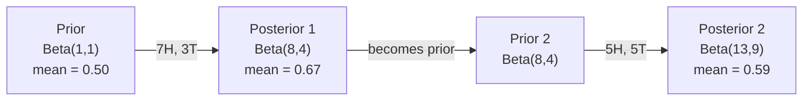

# 贝叶斯定理

> 概率关乎预期，贝叶斯定理关乎认知更新。

**类型：** 构建
**语言：** Python
**前置条件：** 阶段1，课程06（概率基础）
**时间：** 约75分钟

## 学习目标

- 应用贝叶斯定理，根据先验概率、似然性和证据计算后验概率
- 从零构建一个带拉普拉斯平滑和对数空间计算的朴素贝叶斯文本分类器
- 比较最大似然估计与最大后验估计，并解释最大后验估计如何对应L2正则化
- 使用贝塔-二项共轭先验实现顺序贝叶斯更新，用于A/B测试

## 问题提出

某医学检测准确率为99%。你的检测结果为阳性。你实际患病的概率是多少？

多数人会回答99%。但真实答案取决于该疾病的罕见程度。如果患病率是万分之一，那么阳性结果实际上只有约1%的概率意味着你真的患病了。另外99%的阳性结果是健康人的误报。

这不是脑筋急转弯，这正是贝叶斯定理的体现。每一个垃圾邮件过滤器、每一种医学诊断、每一个量化不确定性的机器学习模型都运用着这一推理。你从某个信念出发，看到证据后，便进行更新。

若在不理解此原理的情况下构建机器学习系统，你将误解模型输出、设置不当阈值，并发布过度自信的预测。

## 核心概念

### 从联合概率到贝叶斯

在课程06中你已经知道，条件概率定义为：

```
P(A|B) = P(A and B) / P(B)
```

对称地：

```
P(B|A) = P(A and B) / P(A)
```

两个表达式共享相同的分子：P(A 且 B)。令它们相等并整理：

```
P(A and B) = P(A|B) * P(B) = P(B|A) * P(A)

Therefore:

P(A|B) = P(B|A) * P(A) / P(B)
```

这就是贝叶斯定理。四个量，一个方程。

### 四个组成部分

| 部分 | 名称 | 含义 |
|------|------|------|
| P(A\|B) | 后验概率 | 看到证据B后，你对A的更新信念 |
| P(B\|A) | 似然性 | 如果A为真，证据B出现的可能性 |
| P(A) | 先验概率 | 在看到任何证据前，你对A的信念 |
| P(B) | 证据 | 在所有可能性下观察到B的总概率 |

证据项P(B)起到归一化作用。你可以使用全概率公式展开它：

```
P(B) = P(B|A) * P(A) + P(B|not A) * P(not A)
```

### 医学检测示例

某种疾病影响万分之一的人口。检测准确率为99%（能检出99%的患者，健康人中1%会误报阳性）。

```
P(sick)          = 0.0001     (prior: disease is rare)
P(positive|sick) = 0.99       (likelihood: test catches it)
P(positive|healthy) = 0.01    (false positive rate)

P(positive) = P(positive|sick) * P(sick) + P(positive|healthy) * P(healthy)
            = 0.99 * 0.0001 + 0.01 * 0.9999
            = 0.000099 + 0.009999
            = 0.010098

P(sick|positive) = P(positive|sick) * P(sick) / P(positive)
                 = 0.99 * 0.0001 / 0.010098
                 = 0.0098
                 = 0.98%
```

结果低于1%。先验概率主导了结果。当某种情况罕见时，即使检测非常准确，阳性结果也主要来自误报。这就是医生需要进行复检确认的原因。

### 垃圾邮件过滤示例

你收到一封包含“彩票”一词的邮件。它是垃圾邮件吗？

```
P(spam)                = 0.3      (30% of email is spam)
P("lottery"|spam)      = 0.05     (5% of spam emails contain "lottery")
P("lottery"|not spam)  = 0.001    (0.1% of legitimate emails contain "lottery")

P("lottery") = 0.05 * 0.3 + 0.001 * 0.7
             = 0.015 + 0.0007
             = 0.0157

P(spam|"lottery") = 0.05 * 0.3 / 0.0157
                  = 0.955
                  = 95.5%
```

仅仅一个词就将概率从30%提升到了95.5%。真实的垃圾邮件过滤器会同时应用贝叶斯定理处理数百个词。

### 朴素贝叶斯：独立性假设

朴素贝叶斯通过假设给定类别下所有特征条件独立，将贝叶斯推广到多个特征：

```
P(class | feature_1, feature_2, ..., feature_n)
  = P(class) * P(feature_1|class) * P(feature_2|class) * ... * P(feature_n|class)
    / P(feature_1, feature_2, ..., feature_n)
```

“朴素”的部分在于独立性假设。在文本中，词语的出现并非独立的（例如“New”和“York”是相关的）。但这个假设在实践中效果出奇地好，因为分类器只需要对类别进行排序，而不是产生精确校准的概率。

由于分母对所有类别都是相同的，可以忽略它，只比较分子：

```
score(class) = P(class) * product of P(feature_i | class)
```

选择得分最高的类别。

### 最大似然估计 (MLE)

如何从训练数据得到P(特征|类别)？通过计数。

```
P("free"|spam) = (number of spam emails containing "free") / (total spam emails)
```

这就是最大似然估计：选择使得观测数据可能性最大的参数值。你正在最大化似然函数，对于离散计数，这等价于相对频率。

问题：如果一个词在训练集的垃圾邮件中从未出现，最大似然估计会赋予它概率零。一个未见过的词会使得整个乘积为零。通过拉普拉斯平滑来修复此问题：

```
P(word|class) = (count(word, class) + 1) / (total_words_in_class + vocabulary_size)
```

给每个计数加1，确保概率永远不会为零。

### 最大后验估计 (MAP)

最大似然估计问：什么参数能最大化 P(数据|参数)？

最大后验估计问：什么参数能最大化 P(参数|数据)？

根据贝叶斯定理：

```
P(parameters|data) proportional to P(data|parameters) * P(parameters)
```

最大后验估计引入了关于参数本身的先验。如果你认为参数值应该较小，可以将其编码为一个惩罚大数值的先验。这等同于机器学习中的L2正则化。岭回归中的“岭”惩罚正是权重上的高斯先验。

| 估计方法 | 优化目标 | 机器学习中的等价物 |
|----------|----------|-------------------|
| MLE | P(数据\|参数) | 无正则化训练 |
| MAP | P(数据\|参数) * P(参数) | L2 / L1 正则化 |

### 贝叶斯 vs 频率学派：实践差异

频率学派将参数视为固定的未知量。他们问：“如果我多次重复这个实验，会发生什么？”

贝叶斯学派将参数视为分布。他们问：“根据我的观察，我对参数有何信念？”

在构建机器学习系统时的实际差异：

| 方面 | 频率学派 | 贝叶斯学派 |
|------|----------|------------|
| 输出 | 点估计 | 值的分布 |
| 不确定性 | 置信区间（关于程序） | 可信区间（关于参数） |
| 小数据 | 可能过拟合 | 先验起到正则化作用 |
| 计算 | 通常更快 | 通常需要采样（MCMC） |

大多数生产环境的机器学习是频率学派的（SGD，点估计）。当你需要校准的不确定性（如医疗决策、安全关键系统）或数据稀缺（少样本学习、冷启动）时，贝叶斯方法大放异彩。

### 为何贝叶斯思维对机器学习重要

二者的联系比类比更深刻：

**先验即正则化。** 权重上的高斯先验是L2正则化。拉普拉斯先验是L1正则化。每次你添加正则化项时，你都在做关于预期参数值的贝叶斯陈述。

**后验即不确定性。** 单个预测概率无法告诉你模型对该估计的置信度。贝叶斯方法为你提供一个分布：“我认为P(垃圾邮件)在0.8到0.95之间。”

**贝叶斯更新即在线学习。** 今天的后验成为明天的先验。当模型看到新数据时，它会增量更新其信念，而不是从头重新训练。

**模型比较是贝叶斯的。** 贝叶斯信息准则、边缘似然和贝叶斯因子都使用贝叶斯推理在模型间进行选择，同时避免过拟合。

## 动手构建

### 步骤1：贝叶斯定理函数

```python
def bayes(prior, likelihood, false_positive_rate):
    evidence = likelihood * prior + false_positive_rate * (1 - prior)
    posterior = likelihood * prior / evidence
    return posterior

result = bayes(prior=0.0001, likelihood=0.99, false_positive_rate=0.01)
print(f"P(sick|positive) = {result:.4f}")
```

### 步骤2：朴素贝叶斯分类器

```python
import math
from collections import defaultdict

class NaiveBayes:
    def __init__(self, smoothing=1.0):
        self.smoothing = smoothing
        self.class_counts = defaultdict(int)
        self.word_counts = defaultdict(lambda: defaultdict(int))
        self.class_word_totals = defaultdict(int)
        self.vocab = set()

    def train(self, documents, labels):
        for doc, label in zip(documents, labels):
            self.class_counts[label] += 1
            words = doc.lower().split()
            for word in words:
                self.word_counts[label][word] += 1
                self.class_word_totals[label] += 1
                self.vocab.add(word)

    def predict(self, document):
        words = document.lower().split()
        total_docs = sum(self.class_counts.values())
        vocab_size = len(self.vocab)
        best_class = None
        best_score = float("-inf")
        for cls in self.class_counts:
            score = math.log(self.class_counts[cls] / total_docs)
            for word in words:
                count = self.word_counts[cls].get(word, 0)
                total = self.class_word_totals[cls]
                score += math.log((count + self.smoothing) / (total + self.smoothing * vocab_size))
            if score > best_score:
                best_score = score
                best_class = cls
        return best_class
```

对数概率可以防止下溢。相乘许多小概率会产生小到浮点数无法表示的数字。对对数概率求和在数值上是稳定的，并且在数学上等价。

### 步骤3：在垃圾邮件数据上训练

```python
train_docs = [
    "win free money now",
    "free lottery ticket winner",
    "claim your prize today free",
    "urgent offer free cash",
    "congratulations you won free",
    "meeting tomorrow at noon",
    "project update attached",
    "can we schedule a call",
    "quarterly report review",
    "lunch on thursday sounds good",
    "team standup notes attached",
    "please review the pull request",
]

train_labels = [
    "spam", "spam", "spam", "spam", "spam",
    "ham", "ham", "ham", "ham", "ham", "ham", "ham",
]

classifier = NaiveBayes()
classifier.train(train_docs, train_labels)

test_messages = [
    "free money waiting for you",
    "meeting rescheduled to friday",
    "you won a free prize",
    "please review the attached report",
]

for msg in test_messages:
    print(f"  '{msg}' -> {classifier.predict(msg)}")
```

### 步骤4：检查学习到的概率

```python
def show_top_words(classifier, cls, n=5):
    vocab_size = len(classifier.vocab)
    total = classifier.class_word_totals[cls]
    probs = {}
    for word in classifier.vocab:
        count = classifier.word_counts[cls].get(word, 0)
        probs[word] = (count + classifier.smoothing) / (total + classifier.smoothing * vocab_size)
    sorted_words = sorted(probs.items(), key=lambda x: x[1], reverse=True)
    for word, prob in sorted_words[:n]:
        print(f"    {word}: {prob:.4f}")

print("\nTop spam words:")
show_top_words(classifier, "spam")
print("\nTop ham words:")
show_top_words(classifier, "ham")
```

## 使用它

Scikit-learn 提供了生产就绪的朴素贝叶斯实现：

```python
from sklearn.feature_extraction.text import CountVectorizer
from sklearn.naive_bayes import MultinomialNB
from sklearn.metrics import classification_report

vectorizer = CountVectorizer()
X_train = vectorizer.fit_transform(train_docs)
clf = MultinomialNB()
clf.fit(X_train, train_labels)

X_test = vectorizer.transform(test_messages)
predictions = clf.predict(X_test)
for msg, pred in zip(test_messages, predictions):
    print(f"  '{msg}' -> {pred}")
```

算法相同。CountVectorizer 处理分词和词汇表构建。MultinomialNB 内部处理平滑和对数概率。你从零开始的版本用40行代码做了同样的事情。

## 部署它

这里构建的 NaiveBayes 类展示了完整的流程：分词、使用拉普拉斯平滑进行概率估计、对数空间预测。`code/bayes.py` 中的代码是端到端运行的，仅依赖 Python 标准库。

### 共轭先验

当先验和后验属于同一分布族时，该先验被称为“共轭的”。这使得贝叶斯更新在代数上简洁——无需数值积分即可得到闭式后验。

| 似然 | 共轭先验 | 后验 | 示例 |
|------|----------|------|------|
| 伯努利分布 | Beta(a, b) | Beta(a + 成功次数, b + 失败次数) | 硬币翻转的偏差估计 |
| 正态分布（已知方差） | Normal(μ₀, σ₀) | Normal(加权平均值, 更小方差) | 传感器校准 |
| 泊松分布 | Gamma(a, b) | Gamma(a + 计数总和, b + n) | 到达率建模 |
| 多项分布 | Dirichlet(α) | Dirichlet(α + 计数向量) | 主题建模，语言模型 |

为何重要：没有共轭先验，你需要蒙特卡洛采样或变分推断来近似后验。有了共轭先验，你只需更新两个数字。

贝塔分布是实践中最常见的共轭先验。Beta(a, b) 表示你对某个概率参数的信念。均值为 a/(a+b)。a+b 越大，分布越集中（越确信）。

贝塔先验的特例：
- Beta(1, 1) = 均匀分布。你对参数没有看法。
- Beta(10, 10) = 峰值在0.5。你非常确信参数接近0.5。
- Beta(1, 10) = 偏向0。你认为参数很小。

更新规则极其简单：

```
Prior:     Beta(a, b)
Data:      s successes, f failures
Posterior: Beta(a + s, b + f)
```

无需积分，无需采样，只需加法。

### 顺序贝叶斯更新

贝叶斯推断天然具有顺序性。今天的后验成为明天的先验。这就是实际系统如何在不重新处理所有历史数据的情况下增量学习。

具体示例：估计一枚硬币是否公平。

**第1天：尚无数据。**
从 Beta(1, 1) 开始——均匀先验。你没有任何看法。
- 先验均值：0.5
- 先验在 [0, 1] 区间上是平坦的

**第2天：观察到7次正面，3次反面。**
后验 = Beta(1 + 7, 1 + 3) = Beta(8, 4)
- 后验均值：8/12 ≈ 0.667
- 证据表明硬币偏向正面

**第3天：再观察5次正面，5次反面。**
使用昨天的后验作为今天的先验。
后验 = Beta(8 + 5, 4 + 5) = Beta(13, 9)
- 后验均值：13/22 ≈ 0.591
- 均衡的新数据将估计值拉回了0.5附近



观察结果的顺序无关紧要。一次性用全部12次正面和8次反面更新 Beta(1,1) 得到 Beta(13, 9)——结果相同。顺序更新和批量更新在数学上是等价的。但顺序更新允许你在每一步做出决策，而无需存储原始数据。

这是生产环境中在线学习的基础。老虎机的汤普森采样、增量推荐系统、流式异常检测都使用这种模式。

### 与A/B测试的联系

A/B测试是伪装的贝叶斯推断。

场景：你正在测试两种按钮颜色。变体A（蓝色）和变体B（绿色）。你想知道哪个获得更多的点击。

贝叶斯A/B测试：

1.  **先验。** 为两个变体都从 Beta(1, 1) 开始。没有先验偏好。
2.  **数据。** 变体A：1000次浏览，50次点击。变体B：1000次浏览，65次点击。
3.  **后验。**
    *   A: Beta(1 + 50, 1 + 950) = Beta(51, 951)。均值 = 0.051
    *   B: Beta(1 + 65, 1 + 935) = Beta(66, 936)。均值 = 0.066
4.  **决策。** 计算 P(B > A)——变体B的真实转化率高于A的概率。

解析计算 P(B > A) 很难。但蒙特卡洛方法使其变得简单：

```
1. Draw 100,000 samples from Beta(51, 951)  -> samples_A
2. Draw 100,000 samples from Beta(66, 936)  -> samples_B
3. P(B > A) = fraction of samples where B > A
```

如果 P(B > A) > 0.95，则部署变体B。如果介于0.05和0.95之间，则继续收集数据。如果 P(B > A) < 0.05，则部署变体A。

相对于频率学派A/B测试的优势：
*   你得到一个直接的概率陈述：“B有97%的概率更好”
*   没有p值混淆。没有“无法拒绝原假设”的模糊表述。
*   你可以在任何时候检查结果，而不会膨胀误报率（没有“偷看问题”）
*   你可以纳入先验知识（例如，先前的测试表明转化率通常在3-8%之间）

| 方面 | 频率学派A/B | 贝叶斯A/B |
|------|-------------|-----------|
| 输出 | p值 | P(B > A) |
| 解释 | “如果A=B，看到这些数据有多意外？” | “B优于A的可能性有多大？” |
| 提前停止 | 会膨胀误报率 | 在任何点都是安全的（前提是先验选择得当且模型正确指定） |
| 先验知识 | 不使用 | 编码为贝塔先验 |
| 决策规则 | p < 0.05 | P(B > A) > 阈值 |

## 练习

1.  **多次检测。** 一位患者在两次独立检测中均呈阳性（两次检测准确率均为99%，疾病患病率为万分之一）。两次检测后患病概率 P(生病) 是多少？使用第一次检测的后验作为第二次检测的先验。
2.  **平滑影响。** 分别使用平滑值 0.01、0.1、1.0 和 10.0 运行垃圾邮件分类器。出现频率最高的单词概率如何变化？当平滑值=0且一个单词仅出现在正常邮件中时会发生什么？
3.  **添加特征。** 扩展 NaiveBayes 类，在使用词频的同时，也将消息长度（短/长）作为特征。从训练数据中估计 P(短|垃圾邮件) 和 P(短|正常邮件)，并将其纳入预测得分。
4.  **手动计算MAP。** 给定观测数据（10次硬币翻转，7次正面），使用 Beta(2,2) 先验计算偏差的 MAP 估计值。将其与 MLE 估计值（7/10）进行比较。

## 关键术语

| 术语 | 通俗说法 | 实际含义 |
|------|----------|----------|
| 先验 (Prior) | “我的初始猜测” | 观察证据前关于假设的概率 P(假设)。在机器学习中：即正则化项。 |
| 似然 (Likelihood) | “数据拟合程度” | P(证据\|假设)。在特定假设下观测到数据的概率。 |
| 后验 (Posterior) | “我的更新信念” | P(假设\|证据)。先验乘以似然，再经归一化得到。 |
| 证据 (Evidence) | “归一化常数” | 所有可能性下观测到数据的概率 P(数据)。确保后验概率之和为1。 |
| 朴素贝叶斯 (Naive Bayes) | “那个简单的文本分类器” | 假设给定类别下特征独立的分类器。尽管假设不成立，但在实践中效果很好。 |
| 拉普拉斯平滑 (Laplace smoothing) | “加一平滑” | 给每个特征增加一个小计数，以防止未见数据产生零概率。 |
| 最大似然估计 (MLE) | “直接用频率” | 选择使 P(数据\|参数) 最大的参数。无先验。在数据少时可能过拟合。 |
| 最大后验估计 (MAP) | “带先验的MLE” | 选择使 P(数据\|参数) * P(参数) 最大的参数。等价于正则化的MLE。 |
| 对数概率 (Log-probability) | “在对数空间工作” | 使用 log(P) 代替 P，以避免相乘许多小数时产生浮点下溢。 |
| 误报 (False positive) | “一个错误的警报” | 检测结果为阳性，但真实状态为阴性。这是基础率谬误的根源。 |

## 扩展阅读

- [3Blue1Brown：贝叶斯定理](https://www.youtube.com/watch?v=HZGCoVF3YvM) - 结合医学检测示例的直观解释
- [斯坦福CS229：生成学习算法](https://cs229.stanford.edu/notes2022fall/cs229-notes2.pdf) - 朴素贝叶斯及其与判别模型的联系
- [Think Bayes](https://greenteapress.com/wp/think-bayes/) - 免费书籍，用Python代码学习贝叶斯统计
- [scikit-learn 朴素贝叶斯文档](https://scikit-learn.org/stable/modules/naive_bayes.html) - 生产环境实现及各变体的使用场景