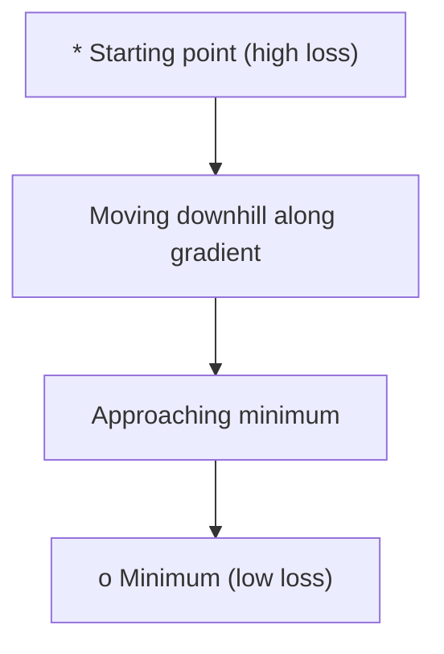
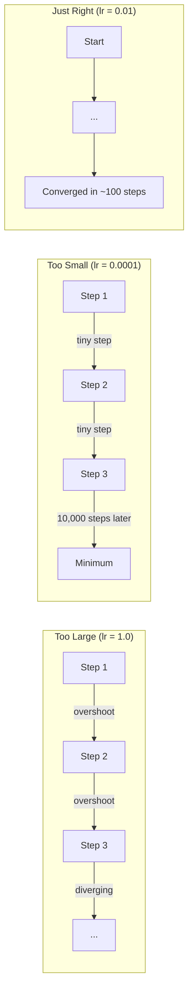
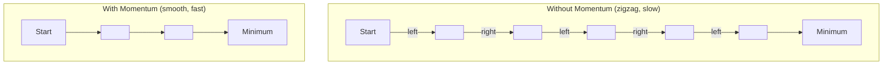
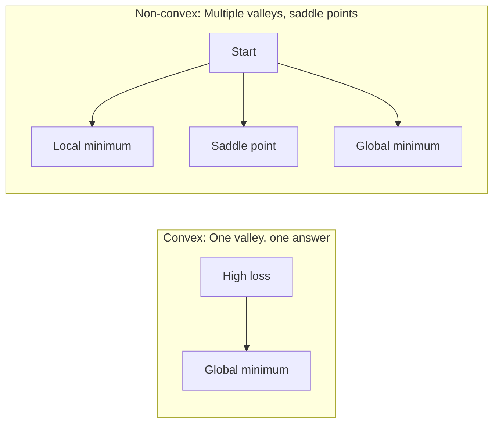
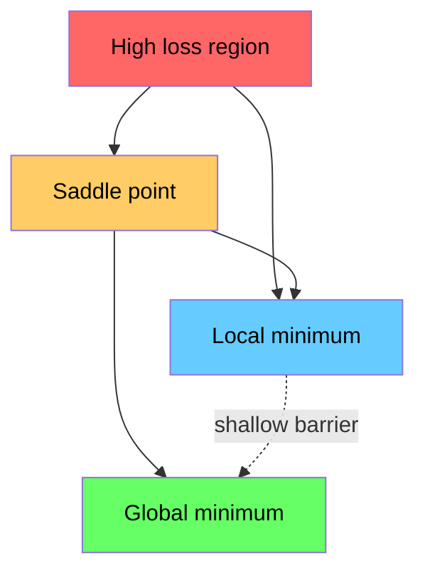

# 优化

> 训练神经网络，无非是找到山谷的底部。

**类型：** 实践
**语言：** Python
**前置课程：** 阶段 1，课程 04-05 (导数、梯度)
**时间：** 约 75 分钟

## 学习目标

- 从头实现基本梯度下降、带动量SGD和Adam优化器
- 在Rosenbrock函数上比较优化器的收敛性，并解释Adam如何实现自适应学习率
- 区分凸与非凸损失景观，并解释鞍点在高维空间中的作用
- 配置学习率调度（步长衰减、余弦退火、预热）以增强训练稳定性

## 问题描述

你有一个损失函数，它告诉你模型错得有多离谱。你有梯度，它们告诉你哪个方向会让损失变得更糟。现在你需要一个策略来走下山坡。

朴素的方法很简单：沿着梯度的反方向移动。用一个叫做学习率的数字来缩放步长。重复。这就是梯度下降，它确实有效。但“有效”是有前提条件的。学习率太大，你会完全越过山谷，在两壁之间弹跳。学习率太小，你会在成千上万不必要的步骤中缓慢爬向答案。遇到鞍点，即使还没找到最小值，你也会停止移动。

深度学习中的每一个优化器都是同一个问题的答案：如何更快、更可靠地到达山谷底部？

## 核心概念

### 优化的含义

优化是寻找使函数最小化（或最大化）的输入值。在机器学习中，这个函数是损失，输入是模型的权重。训练就是优化。

```
minimize L(w) where:
  L = loss function
  w = model weights (could be millions of parameters)
```

### 梯度下降（基本法）

最简单的优化器。计算损失相对于每个权重的梯度。将每个权重沿其梯度的反方向移动。用学习率缩放步长。

```
w = w - lr * gradient
```

这就是完整的算法。一行代码。



### 学习率：最重要的超参数

学习率控制步长。它决定了收敛的所有方面。



没有公式能确定正确的学习率。你需要通过实验找到它。常见的起点：Adam用0.001，带动量的SGD用0.01。

### SGD vs 批量梯度下降 vs 小批量梯度下降

基本梯度下降在执行一步之前，会对整个数据集计算梯度。这称为批量梯度下降。它稳定但慢。

随机梯度下降（SGD）在一个随机样本上计算梯度并立即执行一步。它噪声大但快。

小批量梯度下降折中处理。在一个小批量（32、64、128、256个样本）上计算梯度，然后执行一步。这是实际中最常用的。

| 变体           | 批大小         | 梯度质量         | 每步速度 | 噪声  |
|----------------|---------------|-----------------|----------|-------|
| 批量梯度下降   | 整个数据集     | 精确             | 慢       | 无    |
| 随机梯度下降   | 1个样本        | 噪声非常大       | 快       | 高    |
| 小批量梯度下降 | 32-256个样本   | 良好的估计       | 均衡     | 中等  |

SGD和小批量梯度下降中的噪声不是缺陷。它有助于逃离浅的局部最小值和鞍点。

### 动量：滚下山坡的球

基本梯度下降只关注当前梯度。如果梯度来回摆动（在狭窄山谷中很常见），进度就会很慢。动量通过将历史梯度累积到一个速度项中来解决这个问题。

```
v = beta * v + gradient
w = w - lr * v
```

类比：一个球滚下山坡。它不会在每一个凸起处停下并重新开始。它会在一致的方向上加速，并抑制振荡。



`beta`（通常为0.9）控制保留多少历史。较高的beta意味着更多的动量、更平滑的路径，但对方向变化的反应更慢。

### Adam：自适应学习率

不同的权重需要不同的学习率。一个很少获得大梯度的权重，当它最终获得大梯度时应该采取更大的步长。一个经常获得巨大梯度的权重应该采取更小的步长。

Adam（自适应矩估计）为每个权重跟踪两个东西：

1.  一阶矩 (m)：梯度的运行平均（类似动量）
2.  二阶矩 (v)：梯度平方的运行平均（梯度幅值）

```
m = beta1 * m + (1 - beta1) * gradient
v = beta2 * v + (1 - beta2) * gradient^2

m_hat = m / (1 - beta1^t)    bias correction
v_hat = v / (1 - beta2^t)    bias correction

w = w - lr * m_hat / (sqrt(v_hat) + epsilon)
```

除以 `sqrt(v_hat)` 是关键洞察。具有大梯度的权重会被一个大数除（有效步长小）。具有小梯度的权重会被一个小数除（有效步长大）。每个权重都获得自己的自适应学习率。

默认超参数：`lr=0.001, beta1=0.9, beta2=0.999, epsilon=1e-8`。这些默认值对大多数问题都适用。

### 学习率调度

固定的学习率是一种折中。在训练早期，你希望用大步长快速推进。在训练后期，你希望用小步长在最小值附近微调。

常见的调度策略：

| 调度策略       | 公式                                                                         | 使用场景                   |
|----------------|------------------------------------------------------------------------------|--------------------------|
| 步长衰减       | lr = lr * factor 每N个周期                                                    | 简单，手动控制             |
| 指数衰减       | lr = lr_0 * decay^t                                                         | 平滑减少                   |
| 余弦退火       | lr = lr_min + 0.5 * (lr_max - lr_min) * (1 + cos(pi * t / T))              | Transformer模型，现代训练  |
| 预热 + 衰减    | 线性升温，然后衰减                                                           | 大型模型，防止早期不稳定   |

### 凸函数 vs 非凸函数

凸函数只有一个最小值。梯度下降总能找到它。像 `f(x) = x^2` 这样的二次函数是凸的。

神经网络的损失函数是非凸的。它们有许多局部最小值、鞍点和平坦区域。



实际上，高维神经网络中的局部最小值很少成为问题。大多数局部最小值的损失值接近全局最小值。鞍点（在某些方向上平坦，在其他方向上弯曲）才是真正的障碍。来自小批量的动量和噪声有助于逃离它们。

### 损失景观可视化

损失是所有权重的函数。对于一个拥有100万权重的模型，损失景观存在于1,000,001维空间中。我们通过在权重空间中选取两个随机方向，并沿这些方向绘制损失，从而将其可视化为二维曲面。



尖锐的最小值泛化能力差。平坦的最小值泛化能力好。这就是为什么带动量的SGD在最终测试准确率上通常优于Adam的原因之一：它的噪声阻止了模型陷入尖锐的最小值。

## 动手构建

### 步骤 1：定义测试函数

Rosenbrock函数是一个经典的优化基准函数。它的最小值位于(1,1)，在一个狭窄弯曲的山谷中，容易找到但难以跟随。

```
f(x, y) = (1 - x)^2 + 100 * (y - x^2)^2
```

```python
def rosenbrock(params):
    x, y = params
    return (1 - x) ** 2 + 100 * (y - x ** 2) ** 2

def rosenbrock_gradient(params):
    x, y = params
    df_dx = -2 * (1 - x) + 200 * (y - x ** 2) * (-2 * x)
    df_dy = 200 * (y - x ** 2)
    return [df_dx, df_dy]
```

### 步骤 2：基本梯度下降

```python
class GradientDescent:
    def __init__(self, lr=0.001):
        self.lr = lr

    def step(self, params, grads):
        return [p - self.lr * g for p, g in zip(params, grads)]
```

### 步骤 3：带动量的SGD

```python
class SGDMomentum:
    def __init__(self, lr=0.001, momentum=0.9):
        self.lr = lr
        self.momentum = momentum
        self.velocity = None

    def step(self, params, grads):
        if self.velocity is None:
            self.velocity = [0.0] * len(params)
        self.velocity = [
            self.momentum * v + g
            for v, g in zip(self.velocity, grads)
        ]
        return [p - self.lr * v for p, v in zip(params, self.velocity)]
```

### 步骤 4：Adam

```python
class Adam:
    def __init__(self, lr=0.001, beta1=0.9, beta2=0.999, epsilon=1e-8):
        self.lr = lr
        self.beta1 = beta1
        self.beta2 = beta2
        self.epsilon = epsilon
        self.m = None
        self.v = None
        self.t = 0

    def step(self, params, grads):
        if self.m is None:
            self.m = [0.0] * len(params)
            self.v = [0.0] * len(params)

        self.t += 1

        self.m = [
            self.beta1 * m + (1 - self.beta1) * g
            for m, g in zip(self.m, grads)
        ]
        self.v = [
            self.beta2 * v + (1 - self.beta2) * g ** 2
            for v, g in zip(self.v, grads)
        ]

        m_hat = [m / (1 - self.beta1 ** self.t) for m in self.m]
        v_hat = [v / (1 - self.beta2 ** self.t) for v in self.v]

        return [
            p - self.lr * mh / (vh ** 0.5 + self.epsilon)
            for p, mh, vh in zip(params, m_hat, v_hat)
        ]
```

### 步骤 5：运行并比较

```python
def optimize(optimizer, func, grad_func, start, steps=5000):
    params = list(start)
    history = [params[:]]
    for _ in range(steps):
        grads = grad_func(params)
        params = optimizer.step(params, grads)
        history.append(params[:])
    return history

start = [-1.0, 1.0]

gd_history = optimize(GradientDescent(lr=0.0005), rosenbrock, rosenbrock_gradient, start)
sgd_history = optimize(SGDMomentum(lr=0.0001, momentum=0.9), rosenbrock, rosenbrock_gradient, start)
adam_history = optimize(Adam(lr=0.01), rosenbrock, rosenbrock_gradient, start)

for name, history in [("GD", gd_history), ("SGD+M", sgd_history), ("Adam", adam_history)]:
    final = history[-1]
    loss = rosenbrock(final)
    print(f"{name:6s} -> x={final[0]:.6f}, y={final[1]:.6f}, loss={loss:.8f}")
```

预期输出：Adam收敛最快。带动量的SGD路径更平滑。基本梯度下降沿狭窄山谷进展缓慢。

## 实际应用

在实践中，使用PyTorch或JAX的优化器。它们处理参数组、权重衰减、梯度裁剪和GPU加速。

```python
import torch

model = torch.nn.Linear(784, 10)

sgd = torch.optim.SGD(model.parameters(), lr=0.01, momentum=0.9)
adam = torch.optim.Adam(model.parameters(), lr=0.001)
adamw = torch.optim.AdamW(model.parameters(), lr=0.001, weight_decay=0.01)

scheduler = torch.optim.lr_scheduler.CosineAnnealingLR(adam, T_max=100)
```

经验法则：

- 从Adam（lr=0.001）开始。它适用于大多数问题，无需调优。
- 当你需要最佳最终准确率，并且能够承担更多调优工作时，切换到带动量的SGD（lr=0.01, momentum=0.9）。
- 对于Transformer模型，使用AdamW（解耦权重衰减的Adam）。
- 对于训练时长超过几个周期的训练，始终使用学习率调度。
- 如果训练不稳定，降低学习率。如果训练太慢，提高学习率。

## 交付产出

本课程产生了一个用于选择合适优化器的提示。参见 `outputs/prompt-optimizer-guide.md`。

这里构建的优化器类将在阶段3从头开始训练神经网络时再次出现。

## 练习

1.  **学习率扫描。** 在Rosenbrock函数上，使用学习率 [0.0001, 0.0005, 0.001, 0.005, 0.01] 运行基本梯度下降。为每个学习率绘制或打印5000步后的最终损失。找到仍然能收敛的最大学习率。

2.  **动量比较。** 在Rosenbrock函数上，使用动量值 [0.0, 0.5, 0.9, 0.99] 运行带动量的SGD。跟踪每一步的损失。哪个动量值收敛最快？哪个会发散（overshoot）？

3.  **逃离鞍点。** 定义函数 `f(x, y) = x^2 - y^2`（原点处有一个鞍点）。从点(0.01, 0.01)开始。比较基本梯度下降、带动量的SGD和Adam的行为。哪个能逃离鞍点？

4.  **实现学习率衰减。** 为梯度下降类添加指数衰减调度：`lr = lr_0 * 0.999^step`。在Rosenbrock函数上，比较有无衰减的收敛情况。

## 关键术语

| 术语         | 人们常说          | 实际含义                                                         |
|--------------|-------------------|----------------------------------------------------------------|
| 梯度下降     | “往下走”          | 通过减去梯度乘以学习率来更新权重。最基本的优化器。                 |
| 学习率       | “步长”            | 一个标量，控制每次更新移动权重的大小。太大会导致发散。太小会浪费算力。 |
| 动量         | “保持滚动”        | 将历史梯度累积成一个速度向量。抑制振荡，并在一致的方向上加速移动。   |
| 随机梯度下降 | “随机抽样”        | 在随机子集而非整个数据集上计算梯度。实践中几乎总是指小批量SGD。     |
| 小批量       | “一块数据”        | 用于估计梯度的一个小子集（32-256个样本）。平衡了速度和梯度的准确性。 |
| Adam         | “默认优化器”      | 自适应矩估计。跟踪每个权重的梯度和梯度平方的运行平均，为每个权重提供自己的学习率。 |
| 偏差校正     | “修正冷启动”      | Adam的一阶矩和二阶矩初始化为零。偏差校正除以 (1 - beta^t) 来补偿早期步骤。 |
| 学习率调度   | “随时间改变学习率” | 在训练期间调整学习率的函数。早期用大步长，后期用小步长。            |
| 凸函数       | “只有一个山谷”    | 任何局部最小值都是全局最小值的函数。梯度下降总能找到它。神经网络损失不是凸的。 |
| 鞍点         | “平坦但不是最小值” | 梯度为零，但在某些方向是最小值，在其他方向是最大值的点。在高维中常见。 |
| 损失景观     | “地形图”          | 损失函数在权重空间上的绘图。通过沿两个随机方向切片进行可视化。       |
| 收敛         | “到达那里”        | 优化器到达一个点，在此点之后的步骤不会显著降低损失。               |

## 扩展阅读

- [Sebastian Ruder: 梯度下降优化算法概述](https://ruder.io/optimizing-gradient-descent/) - 所有主要优化器的综合调查
- [为什么动量真的有效 (Distill)](https://distill.pub/2017/momentum/) - 动量动力学的交互式可视化
- [Adam: 一种随机优化方法 (Kingma & Ba, 2014)](https://arxiv.org/abs/1412.6980) - 原始的Adam论文，可读且简短
- [可视化神经网络的损失景观 (Li et al., 2018)](https://arxiv.org/abs/1712.09913) - 展示了尖锐与平坦最小值的论文