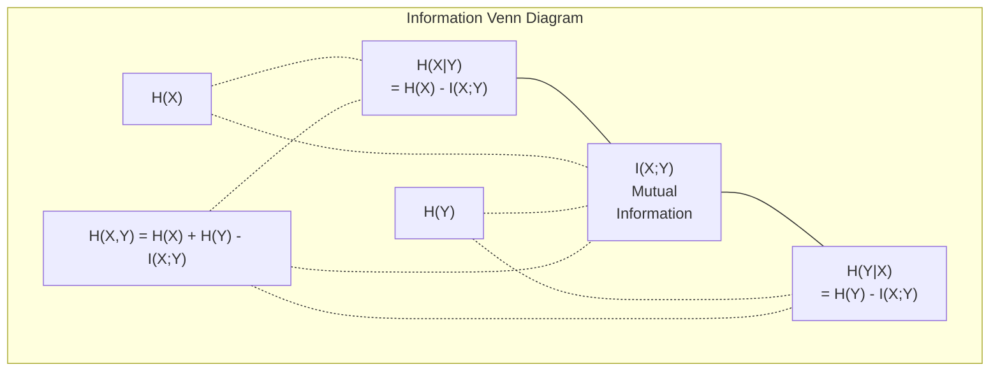

# 信息论

> 信息论衡量的是意外程度。损失函数正是建立在其基础之上。

**类型：** 学习  
**语言：** Python  
**前置知识：** 阶段 1，第 06 课（概率论）  
**时间：** 约 60 分钟

## 学习目标

- 从零开始计算熵、交叉熵和 KL 散度，并解释它们之间的关系
- 推导为什么最小化交叉熵损失等价于最大化对数似然
- 计算特征与目标之间的互信息，以对特征重要性进行排序
- 解释困惑度作为语言模型从中选择的有效词汇量

## 问题所在

你在每个训练的分类模型中都会调用 `CrossEntropyLoss()`。你在每篇语言模型论文中都会看到“困惑度”。你在 VAE、蒸馏和 RLHF 中读到 KL 散度。这些并非互不相关的概念。它们本质上是同一个思想的不同化身。

信息论为你提供了推理不确定性、压缩和预测的语言。Claude Shannon 在 1948 年发明了它来解决通信问题。结果表明，训练神经网络就是一个通信问题：模型正试图通过一个由学习到的权重构成的嘈杂信道来传输正确的标签。

本课将从零构建每一个公式，让你了解它们的来源和工作原理。

## 核心概念

### 信息量（意外程度）

当不太可能发生的事情发生时，它携带的信息量更大。硬币正面朝上？不意外。彩票中奖？非常意外。

一个概率为 p 的事件的信息量为：

```
I(x) = -log(p(x))
```

使用以 2 为底的对数得到比特。使用自然对数得到奈特。相同的思路，不同的单位。

```
Event              Probability    Surprise (bits)
Fair coin heads    0.5            1.0
Rolling a 6        0.167          2.58
1-in-1000 event    0.001          9.97
Certain event      1.0            0.0
```

必然事件携带的信息量为零。你早就知道它们会发生。

### 熵（平均意外程度）

熵是分布中所有可能结果的平均意外程度。

```
H(P) = -sum( p(x) * log(p(x)) )  for all x
```

对于二元变量，公平硬币具有最大熵：1 比特。有偏的硬币（99% 正面）具有低熵：0.08 比特。你已经知道会发生什么，所以每次抛掷几乎不会告诉你任何信息。

```
Fair coin:    H = -(0.5 * log2(0.5) + 0.5 * log2(0.5)) = 1.0 bit
Biased coin:  H = -(0.99 * log2(0.99) + 0.01 * log2(0.01)) = 0.08 bits
```

熵衡量的是一个分布中不可减少的不确定性。你无法将其压缩到低于这个值。

### 交叉熵（你每天使用的损失函数）

交叉熵衡量的是当你使用分布 Q 来编码实际上来自分布 P 的事件时，平均的意外程度。

```
H(P, Q) = -sum( p(x) * log(q(x)) )  for all x
```

P 是真实分布（标签）。Q 是你模型的预测。如果 Q 与 P 完全匹配，交叉熵就等于熵。任何不匹配都会使其变大。

在分类问题中，P 是一个独热向量（真实类别的概率为 1，其余为 0）。这将交叉熵简化为：

```
H(P, Q) = -log(q(true_class))
```

这就是分类问题中完整的交叉熵损失公式。最大化正确类别的预测概率。

### KL 散度（分布之间的“距离”）

KL 散度衡量的是，使用 Q 而不是 P 会带来多少额外的意外程度。

```
D_KL(P || Q) = sum( p(x) * log(p(x) / q(x)) )  for all x
             = H(P, Q) - H(P)
```

交叉熵等于熵加上 KL 散度。由于在训练期间真实分布的熵是常数，最小化交叉熵等同于最小化 KL 散度。你正在将模型的分布推向真实分布。

KL 散度不是对称的：D_KL(P || Q) != D_KL(Q || P)。它不是一个真正的距离度量。

### 互信息

互信息衡量的是，知道一个变量能告诉你多少关于另一个变量的信息。

```
I(X; Y) = H(X) - H(X|Y)
        = H(X) + H(Y) - H(X, Y)
```

如果 X 和 Y 是独立的，互信息为零。知道一个并不会告诉你关于另一个的任何信息。如果它们完全相关，互信息等于任一变量的熵。

在特征选择中，特征与目标之间的高互信息意味着该特征有用。低互信息意味着它是噪声。

### 条件熵

H(Y|X) 衡量的是在你观察到 X 后，关于 Y 还剩余多少不确定性。

```
H(Y|X) = H(X,Y) - H(X)
```

两种极端情况：
- 如果 X 完全决定了 Y，那么 H(Y|X) = 0。知道 X 就消除了关于 Y 的所有不确定性。例如：X = 摄氏温度，Y = 华氏温度。
- 如果 X 对 Y 毫无帮助，那么 H(Y|X) = H(Y)。知道 X 并不能减少你的不确定性。例如：X = 抛硬币，Y = 明天的天气。

条件熵总是非负的，并且永远不会超过 H(Y)：

```
0 <= H(Y|X) <= H(Y)
```

在机器学习中，条件熵出现在决策树中。在每次分裂时，算法选择最小化 H(Y|X) 的特征 X —— 即消除关于标签 Y 最多不确定性的特征。

### 联合熵

H(X,Y) 是 X 和 Y 的联合分布的熵。

```
H(X,Y) = -sum sum p(x,y) * log(p(x,y))   for all x, y
```

关键性质：

```
H(X,Y) <= H(X) + H(Y)
```

当 X 和 Y 独立时等式成立。如果它们共享信息，联合熵小于各自熵的总和。那“缺失”的熵恰好就是互信息。



各种关系：
- H(X,Y) = H(X) + H(Y|X) = H(Y) + H(X|Y)
- I(X;Y) = H(X) - H(X|Y) = H(Y) - H(Y|X)
- H(X,Y) = H(X) + H(Y) - I(X;Y)

### 互信息（深入探讨）

互信息 I(X;Y) 量化了知道一个变量能减少多少关于另一个变量的不确定性。

```
I(X;Y) = H(X) - H(X|Y)
       = H(Y) - H(Y|X)
       = H(X) + H(Y) - H(X,Y)
       = sum sum p(x,y) * log(p(x,y) / (p(x) * p(y)))
```

性质：
- I(X;Y) >= 0 总是成立。通过观察某事物，你永远不会丢失信息。
- I(X;Y) = 0 当且仅当 X 和 Y 独立。
- I(X;Y) = I(Y;X)。它是对称的，不像 KL 散度。
- I(X;X) = H(X)。一个变量与其自身共享所有信息。

**互信息用于特征选择。** 在机器学习中，你想要关于目标信息量大的特征。互信息为你提供了一种有原则的特征排序方法：
1. 对于每个特征 X_i，计算 I(X_i; Y)，其中 Y 是目标变量。
2. 根据 MI 分数对特征进行排序。
3. 保留前 k 个特征。

这对于特征和目标之间的任何关系都有效——无论是线性的、非线性的、单调的还是非单调的。相关性只能捕捉线性关系。互信息能捕捉所有关系。

| 方法 | 检测能力 | 计算复杂度 | 能否处理分类特征？ |
|--------|---------|-------------------|---------------------|
| 皮尔逊相关性 | 线性关系 | O(n) | 否 |
| 斯皮尔曼相关性 | 单调关系 | O(n log n) | 否 |
| 互信息 | 任何统计依赖性 | O(n log n)（使用分箱法） | 是 |

### 标签平滑与交叉熵

标准分类使用硬目标：[0, 0, 1, 0]。真实类别概率为 1，其余为 0。标签平滑将其替换为软目标：

```
soft_target = (1 - epsilon) * hard_target + epsilon / num_classes
```

当 epsilon = 0.1 且类别数为 4 时：
- 硬目标： [0, 0, 1, 0]
- 软目标： [0.025, 0.025, 0.925, 0.025]

从信息论的角度看，标签平滑增加了目标分布的熵。硬的独热目标熵为 0——没有不确定性。软目标具有正的熵。

这为什么有帮助：
- 防止模型将 logits 驱动到极端值（要完美匹配独热目标，在交叉熵下需要无限大的 logits）
- 起到正则化作用：模型无法达到 100% 的置信度
- 改善校准性：预测的概率更好地反映真实的不确定性
- 减小训练和推理行为之间的差距

带有标签平滑的交叉熵损失变为：

```
L = (1 - epsilon) * CE(hard_target, prediction) + epsilon * H_uniform(prediction)
```

第二项惩罚了远离均匀分布的预测——对置信度的直接正则化。

### 为什么交叉熵是分类损失函数的首选

三个视角，同一个结论。

**信息论视角。** 交叉熵衡量的是，使用你的模型分布而不是真实分布，你浪费了多少比特。最小化它使你的模型成为现实最高效的编码器。

**最大似然视角。** 对于 N 个训练样本，真实类别为 y_i：

```
Likelihood     = product( q(y_i) )
Log-likelihood = sum( log(q(y_i)) )
Negative log-likelihood = -sum( log(q(y_i)) )
```

最后一行就是交叉熵损失。最小化交叉熵 = 最大化在你的模型下训练数据的似然。

**梯度视角。** 交叉熵关于 logits 的梯度就是 (预测值 - 真实值)。干净、稳定且计算快速。这就是为什么它与 softmax 完美搭配。

### 比特 vs 奈特

唯一的区别是对数的底数。

```
log base 2   -> bits      (information theory tradition)
log base e   -> nats      (machine learning convention)
log base 10  -> hartleys  (rarely used)
```

1 奈特 = 1/ln(2) 比特 = 1.4427 比特。PyTorch 和 TensorFlow 默认使用自然对数（奈特）。

### 困惑度

困惑度是交叉熵的指数。它告诉模型不确定的、等可能的选项的有效数量。

```
Perplexity = 2^H(P,Q)   (if using bits)
Perplexity = e^H(P,Q)   (if using nats)
```

困惑度为 50 的语言模型，平均而言，其困惑程度相当于它必须从 50 个可能的下一个 token 中均匀选择。越低越好。

GPT-2 在常见基准测试上达到了约 30 的困惑度。现代模型在知识覆盖良好的领域，困惑度已降至个位数。

## 动手构建

### 步骤 1：信息量与熵

```python
import math

def information_content(p, base=2):
    if p <= 0 or p > 1:
        return float('inf') if p <= 0 else 0.0
    return -math.log(p) / math.log(base)

def entropy(probs, base=2):
    return sum(
        p * information_content(p, base)
        for p in probs if p > 0
    )

fair_coin = [0.5, 0.5]
biased_coin = [0.99, 0.01]
fair_die = [1/6] * 6

print(f"Fair coin entropy:   {entropy(fair_coin):.4f} bits")
print(f"Biased coin entropy: {entropy(biased_coin):.4f} bits")
print(f"Fair die entropy:    {entropy(fair_die):.4f} bits")
```

### 步骤 2：交叉熵与 KL 散度

```python
def cross_entropy(p, q, base=2):
    total = 0.0
    for pi, qi in zip(p, q):
        if pi > 0:
            if qi <= 0:
                return float('inf')
            total += pi * (-math.log(qi) / math.log(base))
    return total

def kl_divergence(p, q, base=2):
    return cross_entropy(p, q, base) - entropy(p, base)

true_dist = [0.7, 0.2, 0.1]
good_model = [0.6, 0.25, 0.15]
bad_model = [0.1, 0.1, 0.8]

print(f"Entropy of true dist:     {entropy(true_dist):.4f} bits")
print(f"CE (good model):          {cross_entropy(true_dist, good_model):.4f} bits")
print(f"CE (bad model):           {cross_entropy(true_dist, bad_model):.4f} bits")
print(f"KL divergence (good):     {kl_divergence(true_dist, good_model):.4f} bits")
print(f"KL divergence (bad):      {kl_divergence(true_dist, bad_model):.4f} bits")
```

### 步骤 3：交叉熵作为分类损失

```python
def softmax(logits):
    max_logit = max(logits)
    exps = [math.exp(z - max_logit) for z in logits]
    total = sum(exps)
    return [e / total for e in exps]

def cross_entropy_loss(true_class, logits):
    probs = softmax(logits)
    return -math.log(probs[true_class])

logits = [2.0, 1.0, 0.1]
true_class = 0

probs = softmax(logits)
loss = cross_entropy_loss(true_class, logits)

print(f"Logits:      {logits}")
print(f"Softmax:     {[f'{p:.4f}' for p in probs]}")
print(f"True class:  {true_class}")
print(f"Loss:        {loss:.4f} nats")
print(f"Perplexity:  {math.exp(loss):.2f}")
```

### 步骤 4：交叉熵等于负对数似然

```python
import random

random.seed(42)

n_samples = 1000
n_classes = 3
true_labels = [random.randint(0, n_classes - 1) for _ in range(n_samples)]
model_logits = [[random.gauss(0, 1) for _ in range(n_classes)] for _ in range(n_samples)]

ce_loss = sum(
    cross_entropy_loss(label, logits)
    for label, logits in zip(true_labels, model_logits)
) / n_samples

nll = -sum(
    math.log(softmax(logits)[label])
    for label, logits in zip(true_labels, model_logits)
) / n_samples

print(f"Cross-entropy loss:      {ce_loss:.6f}")
print(f"Negative log-likelihood: {nll:.6f}")
print(f"Difference:              {abs(ce_loss - nll):.2e}")
```

### 步骤 5：互信息

```python
def mutual_information(joint_probs, base=2):
    rows = len(joint_probs)
    cols = len(joint_probs[0])

    margin_x = [sum(joint_probs[i][j] for j in range(cols)) for i in range(rows)]
    margin_y = [sum(joint_probs[i][j] for i in range(rows)) for j in range(cols)]

    mi = 0.0
    for i in range(rows):
        for j in range(cols):
            pxy = joint_probs[i][j]
            if pxy > 0:
                mi += pxy * math.log(pxy / (margin_x[i] * margin_y[j])) / math.log(base)
    return mi

independent = [[0.25, 0.25], [0.25, 0.25]]
dependent = [[0.45, 0.05], [0.05, 0.45]]

print(f"MI (independent): {mutual_information(independent):.4f} bits")
print(f"MI (dependent):   {mutual_information(dependent):.4f} bits")
```

## 实践应用

使用 NumPy 实现相同的概念，这是你在实践中会用到的方式：

```python
import numpy as np

def np_entropy(p):
    p = np.asarray(p, dtype=float)
    mask = p > 0
    result = np.zeros_like(p)
    result[mask] = p[mask] * np.log(p[mask])
    return -result.sum()

def np_cross_entropy(p, q):
    p, q = np.asarray(p, dtype=float), np.asarray(q, dtype=float)
    mask = p > 0
    return -(p[mask] * np.log(q[mask])).sum()

def np_kl_divergence(p, q):
    return np_cross_entropy(p, q) - np_entropy(p)

true = np.array([0.7, 0.2, 0.1])
pred = np.array([0.6, 0.25, 0.15])
print(f"Entropy:    {np_entropy(true):.4f} nats")
print(f"Cross-ent:  {np_cross_entropy(true, pred):.4f} nats")
print(f"KL div:     {np_kl_divergence(true, pred):.4f} nats")
```

你从零构建了 `torch.nn.CrossEntropyLoss()` 内部所做的工作。现在你知道为什么训练期间损失会下降：你的模型预测的分布正在接近真实的分布，这是用浪费信息的奈特数来衡量的。

## 练习题

1. 假设英文字母表（26 个字母）是均匀分布的，计算其熵。然后使用实际字母频率估计它。哪个更高，为什么？

2. 一个模型对真实类别为 1 的样本输出 logits [5.0, 2.0, 0.5]。手工计算交叉熵损失，然后用你的 `cross_entropy_loss` 函数验证。什么样的 logits 会导致零损失？

3. 证明 KL 散度不是对称的。选择两个分布 P 和 Q，计算 D_KL(P || Q) 和 D_KL(Q || P)。解释为什么它们不同。

4. 构建一个函数，计算一系列 token 预测的困惑度。给定一个 (真实 token 索引, 预测 logits) 对的列表，返回该序列的困惑度。

## 关键术语

| 术语 | 人们怎么说 | 它的实际含义 |
|------|----------------|----------------------|
| 信息量 | “意外程度” | 编码一个事件所需的比特数（或奈特数）：-log(p) |
| 熵 | “随机性” | 分布中所有结果的平均意外程度。衡量不可减少的不确定性。 |
| 交叉熵 | “那个损失函数” | 使用模型分布 Q 编码来自真实分布 P 的事件时的平均意外程度。 |
| KL 散度 | “分布之间的距离” | 使用 Q 而不是 P 所浪费的额外比特数。等于交叉熵减去熵。不是对称的。 |
| 互信息 | “X 和 Y 有多相关” | 知道 Y 后，关于 X 的不确定性的减少量。零表示独立。 |
| Softmax | “将 logits 转换为概率” | 指数化然后归一化。将任何实值向量映射到一个有效的概率分布。 |
| 困惑度 | “模型有多困惑” | 交叉熵的指数。模型在每一步进行选择的有效词汇量大小。 |
| 比特 | “香农的单位” | 用以 2 为底的对数衡量的信息。一个比特解决一次公平硬币的抛掷。 |
| 奈特 | “ML 的单位” | 用自然对数衡量的信息。PyTorch 和 TensorFlow 默认使用。 |
| 负对数似然 | “NLL 损失” | 对于独热标签，与交叉熵损失完全相同。最小化它就是最大化正确预测的概率。 |

## 扩展阅读

- [Shannon 1948: A Mathematical Theory of Communication](https://people.math.harvard.edu/~ctm/home/text/others/shannon/entropy/entropy.pdf) - 原始论文，至今可读
- [Visual Information Theory (Chris Olah)](https://colah.github.io/posts/2015-09-Visual-Information/) - 关于熵和 KL 散度的最佳可视化解释
- [PyTorch CrossEntropyLoss 文档](https://pytorch.org/docs/stable/generated/torch.nn.CrossEntropyLoss.html) - 框架如何实现你刚刚构建的内容