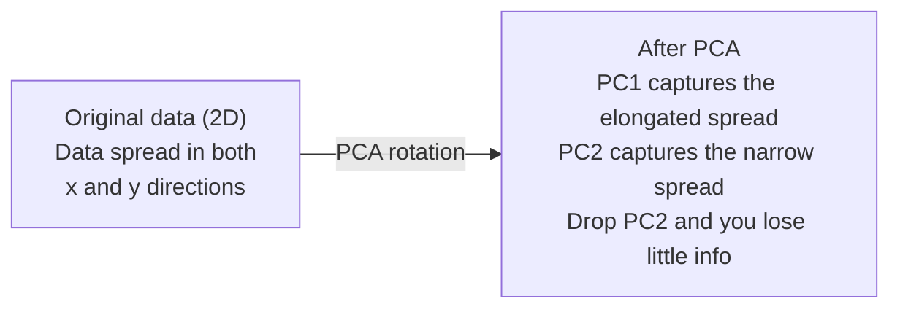

# 降维

> 高维数据有其内在结构。你需要找到合适的角度去发现它。

**类型：** 构建  
**语言：** Python  
**先决条件：** 第1阶段，课程01（线性代数直觉）、02（向量、矩阵与运算）、03（特征值与特征向量）、06（概率与分布）  
**时间：** 约90分钟

## 学习目标

- 从头实现PCA：中心化数据、计算协方差矩阵、特征分解和投影
- 使用解释方差比和肘部法则选择主成分数量
- 比较PCA、t-SNE和UMAP在二维空间中可视化MNIST数字的效果，并解释它们的权衡
- 应用带RBF核的核PCA分离标准PCA无法处理的非线性数据结构

## 问题所在

你手头有一个样本包含784个特征的数据集。可能是手写数字的像素值，可能是基因表达水平，也可能是用户行为信号。你无法可视化784个维度，无法绘制它们，甚至无法想象它们。

但其中大部分特征是冗余的。真正的信息存在于一个更小的表面上。一个手写的“7”不需要784个独立的数字来描述它，只需要几个：笔画的角度、横线的长度、倾斜程度。其余的都是噪声。

降维就是找到那个更小的表面。它将你的784维数据压缩到2维、10维或50维，同时保留重要的结构。

## 核心概念

### 维度灾难

高维空间是反直觉的。随着维度增加，有三件事会变得不正常。

**距离变得无意义。** 在高维空间中，任意两个随机点之间的距离会趋于相同的值。如果每个点到其他点的距离都大致相同，最近邻搜索就会失效。

```
Dimension    Avg distance ratio (max/min between random points)
2            ~5.0
10           ~1.8
100          ~1.2
1000         ~1.02
```

**体积集中在角落。** 一个d维的单位超立方体有2^d个角。在100维空间中，几乎所有的体积都集中在远离中心的角落里。数据点散布在边缘，模型在内部区域会因数据不足而失效。

**需要指数级更多的数据。** 为了维持相同的数据密度，从2D到20D意味着你需要多10^18倍的数据。你永远不会有足够的数据。降低维度可以使数据密度恢复到可操作的水平。

### PCA：寻找重要的方向

主成分分析（PCA）会寻找数据变化最大的坐标轴。它旋转你的坐标系，使得第一个轴捕获最大的方差，第二个轴捕获次大的方差，依此类推。

算法如下：

```
1. Center the data        (subtract the mean from each feature)
2. Compute covariance     (how features move together)
3. Eigendecomposition     (find the principal directions)
4. Sort by eigenvalue     (biggest variance first)
5. Project               (keep top k eigenvectors, drop the rest)
```

为什么是特征分解？协方差矩阵是对称且半正定的。其特征向量是特征空间中的正交方向。特征值告诉你每个方向捕获了多少方差。最大特征值对应的特征向量指向最大方差的方向。



- **PCA之前：** 数据云沿x轴和y轴呈对角线散布
- **PCA之后：** 坐标系被旋转，使得PC1与最大方差方向（拉伸的散布）对齐，PC2与最小方差方向（狭窄的散布）对齐
- **降维：** 丢弃PC2将数据投影到PC1上，信息损失非常小

### 解释方差比

每个主成分捕获总方差的一部分。解释方差比告诉你这个比例是多少。

```
Component    Eigenvalue    Explained ratio    Cumulative
PC1          4.73          0.473              0.473
PC2          2.51          0.251              0.724
PC3          1.12          0.112              0.836
PC4          0.89          0.089              0.925
...
```

当累积解释方差达到0.95时，你就知道用多少成分可以捕获95%的信息。之后的成分主要是噪声。

### 选择主成分数量

三种策略：

1.  **阈值法。** 保留足够多的成分以解释90-95%的方差。
2.  **肘部法则。** 绘制每个成分的解释方差。寻找急剧下降的点。
3.  **下游性能。** 将PCA作为预处理步骤。扫描不同的k值，并测量模型的准确率。准确率开始平稳时的k值就是最佳选择。

### t-SNE：保持邻近关系

t-分布随机邻域嵌入（t-SNE）是为可视化设计的。它将高维数据映射到2D（或3D）空间，同时保持哪些点彼此接近。

直觉上：在原始空间中，基于点对之间的距离计算一个概率分布。相近的点获得高概率，相远的点获得低概率。然后找到一个二维布局，使得相同的概率分布得以维持。在784维中是邻居的点，在2D中仍然是邻居。

t-SNE的关键特性：
- 非线性。它能展开PCA无法处理的复杂流形。
- 随机性。每次运行会产生不同的布局。
- 困惑度参数控制考虑多少个邻居（典型范围：5-50）。
- 输出中簇之间的距离没有意义，有意义的只是簇本身。
- 在大数据集上较慢。默认复杂度为O(n^2)。

### UMAP：更快，更好的全局结构

统一流形逼近与投影（UMAP）的工作方式与t-SNE类似，但有两个优势：
- 更快。它使用近似最近邻图，而不是计算所有点对的距离。
- 更好的全局结构。输出中簇的相对位置通常比t-SNE更有意义。

UMAP在高维空间中构建一个加权图（“模糊拓扑表示”），然后找到一个尽可能保留该图的低维布局。

关键参数：
- `n_neighbors`：定义局部结构的邻居数量（类似于困惑度）。较大的值能保留更多的全局结构。
- `min_dist`：输出中点的聚集紧密程度。较低的值会产生更密集的簇。

### 何时使用哪种方法

| 方法 | 使用场景 | 保留特性 | 速度 |
|------|----------|----------|------|
| PCA | 训练前的预处理 | 全局方差 | 快（精确），适用于数百万样本 |
| PCA | 快速探索性可视化 | 线性结构 | 快 |
| t-SNE | 出版质量的二维图 | 局部邻域 | 慢（< 1万样本为理想） |
| UMAP | 大规模二维可视化 | 局部 + 部分全局结构 | 中等（可处理数百万） |
| PCA | 模型特征缩减 | 按方差排序的特征 | 快 |
| t-SNE / UMAP | 理解聚类结构 | 簇的分离度 | 中等至慢 |

经验法则：将PCA用于预处理和数据压缩。需要在2D中可视化结构时，使用t-SNE或UMAP。

### 核PCA

标准PCA寻找的是线性子空间。它旋转坐标系并丢弃某些轴。但如果数据位于一个非线性流形上怎么办？二维空间中的一个圆无法用任何直线分离。标准PCA帮不上忙。

核PCA通过一个核函数在高维特征空间中应用PCA，而无需显式计算该空间中的坐标。这就是核技巧——与支持向量机（SVM）背后的思想相同。

算法：
1.  计算核矩阵K，其中 K_ij = k(x_i, x_j)
2.  在特征空间中中心化核矩阵
3.  对中心化后的核矩阵进行特征分解
4.  前几个特征向量（按 1/sqrt(特征值) 缩放）就是投影结果

常见的核函数：

| 核函数 | 公式 | 适用于 |
|--------|------|--------|
| RBF（高斯） | exp(-gamma * \|\|x - y\|\|^2) | 大多数非线性数据，平滑流形 |
| 多项式核 | (x . y + c)^d | 多项式关系 |
| Sigmoid核 | tanh(alpha * x . y + c) | 类似神经网络的映射 |

何时使用核PCA vs 标准PCA：

| 标准 | 标准PCA | 核PCA |
|------|---------|-------|
| 数据结构 | 线性子空间 | 非线性流形 |
| 速度 | O(min(n^2 d, d^2 n)) | O(n^2 d + n^3) |
| 可解释性 | 成分是特征的线性组合 | 成分缺乏直接的特征解释 |
| 可扩展性 | 适用于数百万样本 | 核矩阵为 n x n，受内存限制 |
| 重建 | 直接逆变换 | 需要预图像近似 |

经典例子：二维空间中的同心圆。两圈点，一圈在另一圈内部。标准PCA会将两者投影到同一条线上——对分类毫无用处。使用RBF核的核PCA会将内圈和外圈映射到不同的区域，使它们线性可分。

### 重建误差

你的降维效果如何？你将784维压缩到50维，损失了什么？

测量重建误差：
1.  将数据投影到k维：X_reduced = X @ W_k
2.  重建：X_hat = X_reduced @ W_k^T
3.  计算均方误差：mean((X - X_hat)^2)

对于PCA，重建误差与解释方差有直接的关系：

```
Reconstruction error = sum of eigenvalues NOT included
Total variance = sum of ALL eigenvalues
Fraction lost = (sum of dropped eigenvalues) / (sum of all eigenvalues)
```

每个成分的解释方差比为：

```
explained_ratio_k = eigenvalue_k / sum(all eigenvalues)
```

绘制累积解释方差与成分数量的关系图，就得到了“肘部”曲线。合适的成分数量应满足：
- 曲线趋于平稳（收益递减）
- 累积方差超过你的阈值（通常是0.90或0.95）
- 下游任务性能不再提升

重建误差在选择k值之外还有用处。你可以用它进行异常检测：重建误差高的样本是未符合所学子空间的离群点。这是生产系统中基于PCA的异常检测的基础。

## 动手构建

### 步骤1：从头实现PCA

```python
import numpy as np

class PCA:
    def __init__(self, n_components):
        self.n_components = n_components
        self.components = None
        self.mean = None
        self.eigenvalues = None
        self.explained_variance_ratio_ = None

    def fit(self, X):
        self.mean = np.mean(X, axis=0)
        X_centered = X - self.mean

        cov_matrix = np.cov(X_centered, rowvar=False)

        eigenvalues, eigenvectors = np.linalg.eigh(cov_matrix)

        sorted_idx = np.argsort(eigenvalues)[::-1]
        eigenvalues = eigenvalues[sorted_idx]
        eigenvectors = eigenvectors[:, sorted_idx]

        self.components = eigenvectors[:, :self.n_components].T
        self.eigenvalues = eigenvalues[:self.n_components]
        total_var = np.sum(eigenvalues)
        self.explained_variance_ratio_ = self.eigenvalues / total_var

        return self

    def transform(self, X):
        X_centered = X - self.mean
        return X_centered @ self.components.T

    def fit_transform(self, X):
        self.fit(X)
        return self.transform(X)
```

### 步骤2：在合成数据上测试

```python
np.random.seed(42)
n_samples = 500

t = np.random.uniform(0, 2 * np.pi, n_samples)
x1 = 3 * np.cos(t) + np.random.normal(0, 0.2, n_samples)
x2 = 3 * np.sin(t) + np.random.normal(0, 0.2, n_samples)
x3 = 0.5 * x1 + 0.3 * x2 + np.random.normal(0, 0.1, n_samples)

X_synthetic = np.column_stack([x1, x2, x3])

pca = PCA(n_components=2)
X_reduced = pca.fit_transform(X_synthetic)

print(f"Original shape: {X_synthetic.shape}")
print(f"Reduced shape:  {X_reduced.shape}")
print(f"Explained variance ratios: {pca.explained_variance_ratio_}")
print(f"Total variance captured: {sum(pca.explained_variance_ratio_):.4f}")
```

### 步骤3：将MNIST数字降至二维

```python
from sklearn.datasets import fetch_openml

mnist = fetch_openml("mnist_784", version=1, as_frame=False, parser="auto")
X_mnist = mnist.data[:5000].astype(float)
y_mnist = mnist.target[:5000].astype(int)

pca_mnist = PCA(n_components=50)
X_pca50 = pca_mnist.fit_transform(X_mnist)
print(f"50 components capture {sum(pca_mnist.explained_variance_ratio_):.2%} of variance")

pca_2d = PCA(n_components=2)
X_pca2d = pca_2d.fit_transform(X_mnist)
print(f"2 components capture {sum(pca_2d.explained_variance_ratio_):.2%} of variance")
```

### 步骤4：与sklearn比较

```python
from sklearn.decomposition import PCA as SklearnPCA
from sklearn.manifold import TSNE

sklearn_pca = SklearnPCA(n_components=2)
X_sklearn_pca = sklearn_pca.fit_transform(X_mnist)

print(f"\nOur PCA explained variance:     {pca_2d.explained_variance_ratio_}")
print(f"Sklearn PCA explained variance: {sklearn_pca.explained_variance_ratio_}")

diff = np.abs(np.abs(X_pca2d) - np.abs(X_sklearn_pca))
print(f"Max absolute difference: {diff.max():.10f}")

tsne = TSNE(n_components=2, perplexity=30, random_state=42)
X_tsne = tsne.fit_transform(X_mnist)
print(f"\nt-SNE output shape: {X_tsne.shape}")
```

### 步骤5：UMAP对比

```python
try:
    from umap import UMAP

    reducer = UMAP(n_components=2, n_neighbors=15, min_dist=0.1, random_state=42)
    X_umap = reducer.fit_transform(X_mnist)
    print(f"UMAP output shape: {X_umap.shape}")
except ImportError:
    print("Install umap-learn: pip install umap-learn")
```

## 实际应用

将PCA作为分类器的预处理步骤：

```python
from sklearn.decomposition import PCA as SklearnPCA
from sklearn.linear_model import LogisticRegression
from sklearn.model_selection import train_test_split
from sklearn.metrics import accuracy_score

X_train, X_test, y_train, y_test = train_test_split(
    X_mnist, y_mnist, test_size=0.2, random_state=42
)

results = {}
for k in [10, 30, 50, 100, 200]:
    pca_k = SklearnPCA(n_components=k)
    X_tr = pca_k.fit_transform(X_train)
    X_te = pca_k.transform(X_test)

    clf = LogisticRegression(max_iter=1000, random_state=42)
    clf.fit(X_tr, y_train)
    acc = accuracy_score(y_test, clf.predict(X_te))
    var_captured = sum(pca_k.explained_variance_ratio_)
    results[k] = (acc, var_captured)
    print(f"k={k:>3d}  accuracy={acc:.4f}  variance={var_captured:.4f}")
```

性能远在784维之前就趋于平稳。那个平稳点就是你的操作点。

## 交付成果

本课程将产出：
- `outputs/skill-dimensionality-reduction.md` - 一项为给定任务选择正确降维技术的能力

## 练习

1.  修改PCA类以支持`inverse_transform`。从10、50和200个成分重建MNIST数字。打印每种情况下的重建误差（与原始图像的均方差）。

2.  在相同的MNIST子集上运行t-SNE，困惑度值分别为5、30和100。描述输出如何变化。为什么困惑度会影响簇的紧密程度？

3.  使用一个包含50个特征的数据集，其中只有5个是有效的（用`sklearn.datasets.make_classification`生成一个）。应用PCA，检查解释方差曲线是否正确识别出数据实际上是5维的。

## 关键术语

| 术语 | 人们常说 | 实际含义 |
|------|----------|----------|
| 维度灾难 | “特征太多” | 随着维度增加，距离、体积和数据密度都会表现出反直觉的行为。模型需要指数级更多的数据来补偿。 |
| PCA | “降低维度” | 旋转坐标系，使坐标轴与最大方差方向对齐，然后丢弃低方差的坐标轴。 |
| 主成分 | “一个重要方向” | 协方差矩阵的特征向量。特征空间中数据变化最大的方向。 |
| 解释方差比 | “这个成分包含多少信息” | 一个主成分捕获的总方差比例。将前k个成分的解释方差比相加，以查看k个成分保留了多少信息。 |
| 协方差矩阵 | “特征如何相关” | 一个对称矩阵，其中条目(i,j)衡量特征i和特征j如何一起变化。对角线元素是各自的方差。 |
| t-SNE | “那个聚类图” | 一种非线性方法，通过保持成对邻域概率将高维数据映射到2D。适用于可视化，不适用于预处理。 |
| UMAP | “更快的t-SNE” | 一种基于拓扑数据分析的非线性方法。保留局部和一些全局结构。比t-SNE扩展性更好。 |
| 困惑度 | “一个t-SNE旋钮” | 控制每个点考虑的有效邻居数量。低困惑度关注非常局部的结构。高困惑度捕获更广泛的模式。 |
| 流形 | “数据所在的表面” | 嵌入在更高维空间中的低维表面。一张在3D空间中被揉皱的纸是一个2D流形。 |

## 延伸阅读

- [《主成分分析教程》](https://arxiv.org/abs/1404.1100) (Shlens) - 从零开始清晰推导PCA
- [《如何有效使用t-SNE》](https://distill.pub/2016/misread-tsne/) (Wattenberg 等) - t-SNE陷阱和参数选择的交互式指南
- [UMAP文档](https://umap-learn.readthedocs.io/) - 来自UMAP作者的理论和实践指导