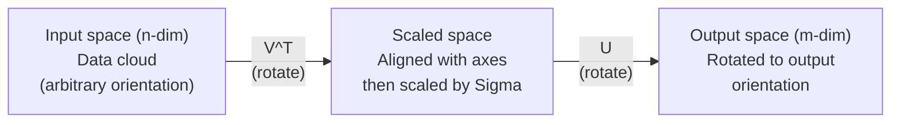
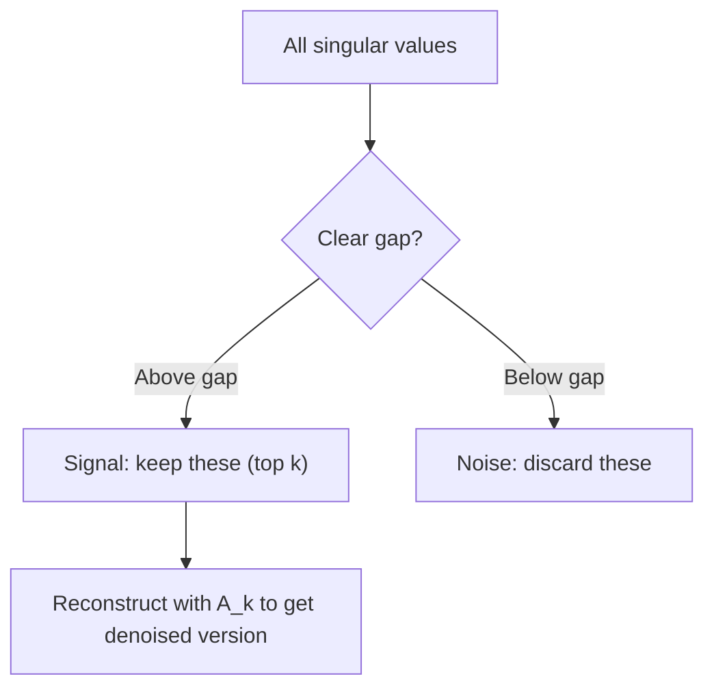

# 奇异值分解

> SVD 是线性代数中的瑞士军刀。每个矩阵都有一个。每位数据科学家都需要一个。

**类型：** 构建
**语言：** Python, Julia
**前提：** 第一阶段，课程 01（线性代数直觉）、02（向量与矩阵运算）、03（矩阵变换）
**时间：** 约120分钟

## 学习目标

- 通过幂迭代法实现 SVD，并解释 U、Sigma 和 V^T 的几何意义
- 应用截断 SVD 进行图像压缩，并衡量压缩率与重建误差
- 通过 SVD 计算 Moore-Penrose 伪逆，以求解超定最小二乘系统
- 将 SVD 与 PCA、推荐系统（潜在因子）以及自然语言处理中的潜在语义分析联系起来

## 问题陈述

你有一个 1000x2000 的矩阵。它可能是用户-电影评分矩阵。可能是一个文档-词项频率表。也可能是图像的像素值。你需要压缩它、去噪、发现其中的隐藏结构，或者用它来解决一个最小二乘系统。特征分解只适用于方阵。即便如此，它也要求矩阵具有一组完整的线性无关特征向量。

SVD 适用于任何矩阵。任意形状。任意秩。无条件限制。它将矩阵分解为三个因子，揭示了矩阵对空间进行变换的几何特性。这是整个线性代数中最通用、最有用的分解。

## 概念

### SVD 的几何意义

每个矩阵，无论形状如何，都依次执行三个操作：旋转、缩放、再旋转。SVD 使这种分解变得明确。

```
A = U * Sigma * V^T

      m x n     m x m    m x n    n x n
     (any)    (rotate)  (scale)  (rotate)
```

对于任意矩阵 A，SVD 将其分解为：
- V^T 旋转输入空间（n 维）中的向量
- Sigma 沿着每个轴缩放（拉伸或压缩）
- U 将结果旋转到输出空间（m 维）



可以这样理解。你把一个矩阵交给 SVD。它会告诉你：“这个矩阵作用于一个输入球体，首先通过 V^T 旋转它，然后通过 Sigma 将其拉伸成一个椭球体，最后通过 U 旋转该椭球体。” 奇异值就是椭球体各轴的长度。

### 完整分解

对于形状为 m x n 的矩阵 A：

```
A = U * Sigma * V^T

where:
  U     is m x m, orthogonal (U^T U = I)
  Sigma is m x n, diagonal (singular values on the diagonal)
  V     is n x n, orthogonal (V^T V = I)

The singular values sigma_1 >= sigma_2 >= ... >= sigma_r > 0
where r = rank(A)
```

U 的列称为左奇异向量。V 的列称为右奇异向量。Sigma 的对角线元素称为奇异值。它们总是非负的，并且通常按降序排列。

### 左奇异向量、奇异值、右奇异向量

SVD 的每个组成部分都有独特的几何意义。

**右奇异向量（V 的列）：** 它们构成输入空间（R^n）的一组正交基。它们是输入空间中的方向，矩阵将这些方向映射到输出空间中的正交方向。可以将它们视为定义域的自然坐标系。

**奇异值（Sigma 的对角线）：** 它们是缩放因子。第 i 个奇异值告诉你矩阵沿着第 i 个右奇异向量方向拉伸的程度。奇异值为零意味着矩阵完全压扁了那个方向。

**左奇异向量（U 的列）：** 它们构成输出空间（R^m）的一组正交基。第 i 个左奇异向量是第 i 个右奇异向量（经过缩放后）在输出空间中的落点方向。

它们之间的关系：

```
A * v_i = sigma_i * u_i

The matrix A takes the i-th right singular vector v_i,
scales it by sigma_i, and maps it to the i-th left singular vector u_i.
```

这为你提供了任何矩阵作用的坐标层面的图像。

### 外积形式

SVD 可以写成一系列秩-1 矩阵的和：

```
A = sigma_1 * u_1 * v_1^T + sigma_2 * u_2 * v_2^T + ... + sigma_r * u_r * v_r^T

Each term sigma_i * u_i * v_i^T is a rank-1 matrix (an outer product).
The full matrix is the sum of r such matrices, where r is the rank.
```

这种形式是低秩近似的基础。每一项都添加了一层结构。第一项捕获最重要的模式。第二项捕获次重要的，依此类推。截断这个和可以在任意给定的秩下获得最佳近似。

```
Rank-1 approx:    A_1 = sigma_1 * u_1 * v_1^T
                  (captures the dominant pattern)

Rank-2 approx:    A_2 = sigma_1 * u_1 * v_1^T + sigma_2 * u_2 * v_2^T
                  (captures the two most important patterns)

Rank-k approx:    A_k = sum of top k terms
                  (optimal by the Eckart-Young theorem)
```

### 与特征分解的关系

SVD 和特征分解有着深刻的联系。A 的奇异值和奇异向量直接来源于 A^T A 和 A A^T 的特征值和特征向量。

```
A^T A = V * Sigma^T * U^T * U * Sigma * V^T
      = V * Sigma^T * Sigma * V^T
      = V * D * V^T

where D = Sigma^T * Sigma is a diagonal matrix with sigma_i^2 on the diagonal.

So:
- The right singular vectors (V) are eigenvectors of A^T A
- The singular values squared (sigma_i^2) are eigenvalues of A^T A

Similarly:
A A^T = U * Sigma * V^T * V * Sigma^T * U^T
      = U * Sigma * Sigma^T * U^T

So:
- The left singular vectors (U) are eigenvectors of A A^T
- The eigenvalues of A A^T are also sigma_i^2
```

这种联系告诉你三件事：
1.  奇异值总是实数且非负的（它们是半正定矩阵特征值的平方根）。
2.  你可以通过 A^T A 的特征分解来计算 SVD，但这会平方条件数并损失数值精度。专用的 SVD 算法避免了这个问题。
3.  当 A 是方阵且对称半正定时，SVD 和特征分解是同一回事。

### 截断 SVD：低秩近似

Eckart-Young-Mirsky 定理指出，A 的最佳秩-k 近似（在 Frobenius 范数和谱范数下）是通过只保留前 k 个奇异值及其对应向量获得的：

```
A_k = U_k * Sigma_k * V_k^T

where:
  U_k     is m x k  (first k columns of U)
  Sigma_k is k x k  (top-left k x k block of Sigma)
  V_k     is n x k  (first k columns of V)

Approximation error = sigma_{k+1}  (in spectral norm)
                    = sqrt(sigma_{k+1}^2 + ... + sigma_r^2)  (in Frobenius norm)
```

这不仅仅是“一个好”的近似。可以证明，它是秩为 k 的最佳可能近似。没有其他秩为 k 的矩阵比它更接近 A。

| 分量        | 相对大小       | 是否保留在秩-3 近似中？ |
|-------------|----------------|------------------------|
| sigma_1     | 最大           | 是                     |
| sigma_2     | 大             | 是                     |
| sigma_3     | 中等偏大       | 是                     |
| sigma_4     | 中等           | 否（误差）             |
| sigma_5     | 中等偏小       | 否（误差）             |
| sigma_6     | 小             | 否（误差）             |
| sigma_7     | 非常小         | 否（误差）             |
| sigma_8     | 极小           | 否（误差）             |

保留前 3 个：A_3 捕获了三个最大的奇异值。误差 = 剩余的值（sigma_4 到 sigma_8）。

如果奇异值衰减很快，一个较小的 k 就能捕获矩阵的大部分信息。如果衰减缓慢，则矩阵没有低秩结构。

### 利用 SVD 进行图像压缩

灰度图像是一个像素强度矩阵。一张 800x600 的图像有 480,000 个值。SVD 允许你用少得多的值来近似它。

```
Original image: 800 x 600 = 480,000 values

SVD with rank k:
  U_k:      800 x k values
  Sigma_k:  k values
  V_k:      600 x k values
  Total:    k * (800 + 600 + 1) = k * 1401 values

  k=10:   14,010 values   (2.9% of original)
  k=50:   70,050 values  (14.6% of original)
  k=100: 140,100 values  (29.2% of original)

  The compression ratio improves as k gets smaller,
  but visual quality degrades.
```

关键洞察：自然图像的奇异值衰减很快。前几个奇异值捕获宏观结构（形状、渐变）。后面的奇异值捕获细节和噪声。在秩 50 处截断，通常能产生一个看起来与原图几乎相同、但存储空间减少 85% 的图像。

### 用于推荐系统的 SVD

Netflix 大奖使其闻名。你有一个用户-电影评分矩阵，其中大多数条目是缺失的。

```
             Movie1  Movie2  Movie3  Movie4  Movie5
  User1      [  5      ?       3       ?       1  ]
  User2      [  ?      4       ?       2       ?  ]
  User3      [  3      ?       5       ?       ?  ]
  User4      [  ?      ?       ?       4       3  ]

  ? = unknown rating
```

这个想法是：这个评分矩阵具有低秩性。用户的口味并非完全独立。存在少数几个潜在因子（动作片 vs. 剧情片，老片 vs. 新片，烧脑型 vs. 感官型）可以解释大部分偏好。

对（填充后的）评分矩阵进行 SVD 分解：
- U：潜在因子空间中的用户画像
- Sigma：每个潜在因子的重要性
- V^T：潜在因子空间中的电影画像

一个用户对一部电影的预测评分是其用户画像与电影画像的点积（由奇异值加权）。低秩近似填补了缺失的条目。

实际上，你会使用像 Simon Funk 的增量 SVD 或 ALS（交替最小二乘法）这样的变体来直接处理缺失数据。但核心思想是一样的：通过 SVD 进行潜在因子分解。

### 自然语言处理中的 SVD：潜在语义分析

潜在语义分析（LSA），也称为潜在语义索引（LSI），将 SVD 应用于词项-文档矩阵。

```
             Doc1   Doc2   Doc3   Doc4
  "cat"      [  3      0      1      0  ]
  "dog"      [  2      0      0      1  ]
  "fish"     [  0      4      1      0  ]
  "pet"      [  1      1      1      1  ]
  "ocean"    [  0      3      0      0  ]

After SVD with rank k=2:

  Each document becomes a point in 2D "concept space."
  Each term becomes a point in the same 2D space.
  Documents about similar topics cluster together.
  Terms with similar meanings cluster together.

  "cat" and "dog" end up near each other (land pets).
  "fish" and "ocean" end up near each other (water concepts).
  Doc1 and Doc3 cluster if they share similar topics.
```

LSA 是最早成功地从原始文本中捕获语义相似性的方法之一。它之所以有效，是因为同义词倾向于出现在相似的文档中，因此 SVD 将它们归类到相同的潜在维度中。现代的词嵌入（Word2Vec、GloVe）可以被视为这一思想的后续发展。

### 用于去噪的 SVD

有噪声的数据中，信号集中在前几个奇异值上，而噪声分散在所有奇异值上。截断去除了噪声基底。

**干净信号的奇异值：**

| 分量   | 大小       | 类型   |
|--------|------------|--------|
| sigma_1 | 非常大     | 信号   |
| sigma_2 | 大         | 信号   |
| sigma_3 | 中等       | 信号   |
| sigma_4 | 接近零     | 可忽略 |
| sigma_5 | 接近零     | 可忽略 |

**带噪信号的奇异值（噪声叠加到所有分量上）：**

| 分量   | 大小       | 类型   |
|--------|------------|--------|
| sigma_1 | 非常大     | 信号   |
| sigma_2 | 大         | 信号   |
| sigma_3 | 中等       | 信号   |
| sigma_4 | 小         | 噪声   |
| sigma_5 | 小         | 噪声   |
| sigma_6 | 小         | 噪声   |
| sigma_7 | 小         | 噪声   |



这用于信号处理、科学测量和数据清洗。任何时候你有一个被加性噪声损坏的矩阵，截断 SVD 都是一种将信号与噪声分离的原则性方法。

### 通过 SVD 求伪逆

Moore-Penrose 伪逆 A+ 将矩阵求逆推广到非方阵和奇异矩阵。SVD 使计算它变得简单。

```
If A = U * Sigma * V^T, then:

A+ = V * Sigma+ * U^T

where Sigma+ is formed by:
  1. Transpose Sigma (swap rows and columns)
  2. Replace each non-zero diagonal entry sigma_i with 1/sigma_i
  3. Leave zeros as zeros

For A (m x n):      A+ is (n x m)
For Sigma (m x n):  Sigma+ is (n x m)
```

伪逆可以解决最小二乘问题。如果 Ax = b 没有精确解（超定系统），那么 x = A+ b 就是最小二乘解（最小化 ||Ax - b||）。

```
Overdetermined system (more equations than unknowns):

  [1  1]         [3]
  [2  1] x   =   [5]       No exact solution exists.
  [3  1]         [6]

  x_ls = A+ b = V * Sigma+ * U^T * b

  This gives the x that minimizes the sum of squared residuals.
  Same result as the normal equations (A^T A)^(-1) A^T b,
  but numerically more stable.
```

### 数值稳定性优势

计算 A^T A 的特征分解会使奇异值平方化（A^T A 的特征值是 sigma_i^2）。这会平方条件数，放大数值误差。

```
Example:
  A has singular values [1000, 1, 0.001]
  Condition number of A: 1000 / 0.001 = 10^6

  A^T A has eigenvalues [10^6, 1, 10^{-6}]
  Condition number of A^T A: 10^6 / 10^{-6} = 10^{12}

  Computing SVD directly: works with condition number 10^6
  Computing via A^T A:     works with condition number 10^{12}
                           (6 extra digits of precision lost)
```

现代的 SVD 算法（如 Golub-Kahan 双对角化）直接对 A 进行操作，从不显式构造 A^T A。这就是为什么你应该始终优先使用 `np.linalg.svd(A)` 而不是 `np.linalg.eig(A.T @ A)`。

### 与 PCA 的联系

PCA 就是对中心化数据进行 SVD。这不是一个比喻。它字面上是相同的计算。

```
Given data matrix X (n_samples x n_features), centered (mean subtracted):

Covariance matrix: C = (1/(n-1)) * X^T X

PCA finds eigenvectors of C. But:

  X = U * Sigma * V^T    (SVD of X)

  X^T X = V * Sigma^2 * V^T

  C = (1/(n-1)) * V * Sigma^2 * V^T

So the principal components are exactly the right singular vectors V.
The explained variance for each component is sigma_i^2 / (n-1).

In sklearn, PCA is implemented using SVD, not eigendecomposition.
It is faster and more numerically stable.
```

这意味着你在第 10 课中学到的关于降维的所有内容，底层都是 SVD。PCA 是机器学习中最常见的 SVD 应用。

## 动手实现

### 步骤 1：从零开始使用幂迭代实现 SVD

思路：要找到最大的奇异值及其向量，可以对 A^T A（或 A A^T）使用幂迭代。然后压缩矩阵并重复以找到下一个奇异值。

```python
import numpy as np

def power_iteration(M, num_iters=100):
    n = M.shape[1]
    v = np.random.randn(n)
    v = v / np.linalg.norm(v)

    for _ in range(num_iters):
        Mv = M @ v
        v = Mv / np.linalg.norm(Mv)

    eigenvalue = v @ M @ v
    return eigenvalue, v

def svd_from_scratch(A, k=None):
    m, n = A.shape
    if k is None:
        k = min(m, n)

    sigmas = []
    us = []
    vs = []

    A_residual = A.copy().astype(float)

    for _ in range(k):
        AtA = A_residual.T @ A_residual
        eigenvalue, v = power_iteration(AtA, num_iters=200)

        if eigenvalue < 1e-10:
            break

        sigma = np.sqrt(eigenvalue)
        u = A_residual @ v / sigma

        sigmas.append(sigma)
        us.append(u)
        vs.append(v)

        A_residual = A_residual - sigma * np.outer(u, v)

    U = np.column_stack(us) if us else np.empty((m, 0))
    S = np.array(sigmas)
    V = np.column_stack(vs) if vs else np.empty((n, 0))

    return U, S, V
```

### 步骤 2：测试并与 NumPy 比较

```python
np.random.seed(42)
A = np.random.randn(5, 4)

U_ours, S_ours, V_ours = svd_from_scratch(A)
U_np, S_np, Vt_np = np.linalg.svd(A, full_matrices=False)

print("Our singular values:", np.round(S_ours, 4))
print("NumPy singular values:", np.round(S_np, 4))

A_reconstructed = U_ours @ np.diag(S_ours) @ V_ours.T
print(f"Reconstruction error: {np.linalg.norm(A - A_reconstructed):.8f}")
```

### 步骤 3：图像压缩演示

```python
def compress_image_svd(image_matrix, k):
    U, S, Vt = np.linalg.svd(image_matrix, full_matrices=False)
    compressed = U[:, :k] @ np.diag(S[:k]) @ Vt[:k, :]
    return compressed

image = np.random.seed(42)
rows, cols = 200, 300
image = np.random.randn(rows, cols)

for k in [1, 5, 10, 20, 50]:
    compressed = compress_image_svd(image, k)
    error = np.linalg.norm(image - compressed) / np.linalg.norm(image)
    original_size = rows * cols
    compressed_size = k * (rows + cols + 1)
    ratio = compressed_size / original_size
    print(f"k={k:>3d}  error={error:.4f}  storage={ratio:.1%}")
```

### 步骤 4：去噪

```python
np.random.seed(42)
clean = np.outer(np.sin(np.linspace(0, 4*np.pi, 100)),
                 np.cos(np.linspace(0, 2*np.pi, 80)))
noise = 0.3 * np.random.randn(100, 80)
noisy = clean + noise

U, S, Vt = np.linalg.svd(noisy, full_matrices=False)
denoised = U[:, :5] @ np.diag(S[:5]) @ Vt[:5, :]

print(f"Noisy error:    {np.linalg.norm(noisy - clean):.4f}")
print(f"Denoised error: {np.linalg.norm(denoised - clean):.4f}")
print(f"Improvement:    {(1 - np.linalg.norm(denoised - clean) / np.linalg.norm(noisy - clean)):.1%}")
```

### 步骤 5：伪逆

```python
A = np.array([[1, 1], [2, 1], [3, 1]], dtype=float)
b = np.array([3, 5, 6], dtype=float)

U, S, Vt = np.linalg.svd(A, full_matrices=False)
S_inv = np.diag(1.0 / S)
A_pinv = Vt.T @ S_inv @ U.T

x_svd = A_pinv @ b
x_lstsq = np.linalg.lstsq(A, b, rcond=None)[0]
x_pinv = np.linalg.pinv(A) @ b

print(f"SVD pseudoinverse solution:  {x_svd}")
print(f"np.linalg.lstsq solution:   {x_lstsq}")
print(f"np.linalg.pinv solution:    {x_pinv}")
```

## 使用它

完整的可运行示例在 `code/svd.py` 中。运行它可以看到 SVD 应用于图像压缩、推荐系统、潜在语义分析和去噪。

```bash
python svd.py
```

Julia 版本在 `code/svd.jl` 中，使用 Julia 原生的 `svd()` 函数和 `LinearAlgebra` 包演示了相同的概念。

```bash
julia svd.jl
```

## 成果

本课产出：
- `outputs/skill-svd.md` - 一项关于在真实项目中何时以及如何应用 SVD 的技能

## 练习

1.  **不使用幂迭代，从零开始实现完整的 SVD。** 相反，计算 A^T A 的特征分解以获得 V 和奇异值，然后计算 U = A V Sigma^{-1}。将其数值精度与你的幂迭代版本以及 NumPy 进行比较。

2.  **加载一张真实的灰度图像（或转换一张）。** 在秩 1、5、10、25、50、100 下压缩它。对于每个秩，计算压缩率和相对误差。找到图像变得视觉上可接受的秩。

3.  **构建一个微型推荐系统。** 创建一个 10x8 的用户-电影评分矩阵，包含一些已知条目。用行均值填充缺失条目。计算 SVD 并重建一个秩为 3 的近似矩阵。使用重建矩阵预测缺失的评分。验证预测是否合理。

4.  **创建一个 100x50 的文档-词项矩阵，包含 3 个合成主题。** 每个主题有 5 个关联词项。添加噪声。应用 SVD 并验证前 3 个奇异值远大于其余的。将文档投影到 3D 潜在空间，并检查来自同一主题的文档是否聚类在一起。

5.  **生成一个干净的低秩矩阵（秩为 3，大小为 50x40），并在不同水平（sigma = 0.1, 0.5, 1.0, 2.0）下添加高斯噪声。** 对于每个噪声水平，通过将 k 从 1 扫描到 40 并测量相对于干净矩阵的重建误差，找到最佳的截断秩 k。绘制最佳 k 如何随噪声水平变化的图表。

## 关键术语

| 术语             | 人们通常怎么说     | 其实际含义                                                                                                  |
|------------------|--------------------|-------------------------------------------------------------------------------------------------------------|
| SVD              | “分解任何矩阵”     | 将 A 分解为 U Sigma V^T，其中 U 和 V 是正交矩阵，Sigma 是对角矩阵，对角元非负。适用于任何形状的矩阵。      |
| 奇异值           | “这个分量有多重要” | Sigma 的第 i 个对角线元素。衡量矩阵沿着第 i 个主方向拉伸的程度。总是非负的，按降序排列。                   |
| 左奇异向量       | “输出方向”         | U 的一列。是第 i 个右奇异向量（经过 sigma_i 缩放后）在输出空间中的方向。                                   |
| 右奇异向量       | “输入方向”         | V 的一列。是矩阵映射到第 i 个左奇异向量（经过 sigma_i 缩放后）的输入空间方向。                             |
| 截断 SVD         | “低秩近似”         | 只保留前 k 个奇异值及其向量。产生可证明的最佳秩-k 近似（Eckart-Young 定理）。                               |
| 秩               | “真实维度”         | 非零奇异值的数量。告诉你矩阵实际使用了多少个独立方向。                                                     |
| 伪逆             | “广义逆”           | V Sigma+ U^T。对非零奇异值取逆，零仍为零。解决非方阵或奇异矩阵的最小二乘问题。                             |
| 条件数           | “对误差有多敏感”   | sigma_max / sigma_min。较大的条件数意味着小的输入变化会导致大的输出变化。SVD 直接揭示这一点。                |
| 潜在因子         | “隐藏变量”         | SVD 发现的低秩空间中的一个维度。在推荐中，一个潜在因子可能对应类型偏好。在 NLP 中，可能对应一个主题。       |
| Frobenius 范数   | “矩阵总大小”       | 所有元素平方和的平方根。等于所有奇异值平方和的平方根。用于衡量近似误差。                                   |
| Eckart-Young 定理 | “SVD 提供最佳压缩” | 对于任何目标秩 k，截断 SVD 在所有可能的秩 k 矩阵中最小化了近似误差。                                      |
| 幂迭代           | “找到最大的特征向量” | 重复地将一个随机向量乘以矩阵并归一化。收敛到最大特征值对应的特征向量。许多 SVD 算法的基础。               |

## 扩展阅读

- [Gilbert Strang: Linear Algebra and Its Applications, Chapter 7](https://math.mit.edu/~gs/linearalgebra/) - 对 SVD 及其应用的深入阐述
- [3Blue1Brown: But what is the SVD?](https://www.youtube.com/watch?v=vSczTbgc8Rc) - SVD 的几何直觉
- [We Recommend a Singular Value Decomposition](https://www.ams.org/publicoutreach/feature-column/fcarc-svd) - 来自美国数学学会的易于理解的概述
- [Netflix Prize and Matrix Factorization](https://sifter.org/~simon/journal/20061211.html) - Simon Funk 关于 SVD 用于推荐系统的原始博客文章
- [Latent Semantic Analysis](https://en.wikipedia.org/wiki/Latent_semantic_analysis) - SVD 在自然语言处理中的最初应用
- [Numerical Linear Algebra by Trefethen and Bau](https://people.maths.ox.ac.uk/trefethen/text.html) - 理解 SVD 算法及其数值特性的黄金标准