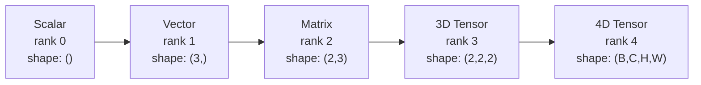
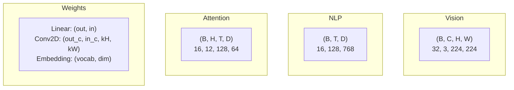
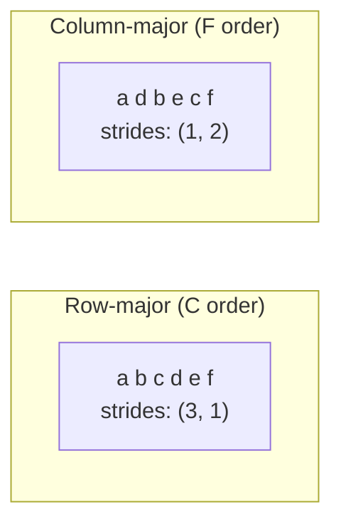
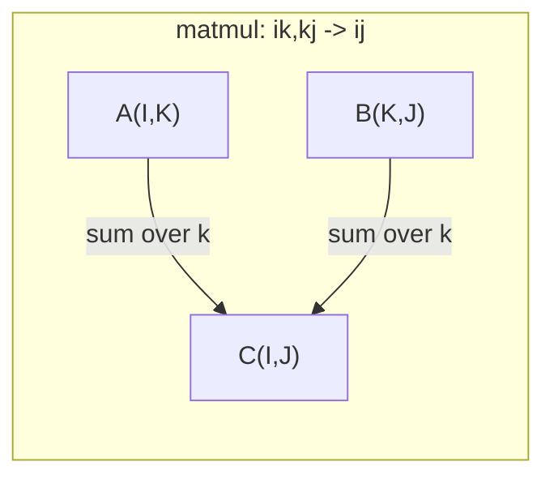

# 张量操作

> 张量是数据与深度学习之间的通用语言。每一张图片、每一句话、每一个梯度都流经它们。

**类型：** 构建
**语言：** Python
**前置要求：** 第一阶段，课程01（线性代数直觉）、02（向量、矩阵与操作）
**时间：** 约90分钟

## 学习目标

- 从零开始实现一个具有形状、步幅、重塑、转置和逐元素操作的张量类
- 应用广播规则对不同形状的张量进行运算而无需复制数据
- 编写用于点积、矩阵乘法、外积和批量操作的爱因斯坦求和表达式
- 追踪多头注意力中每一步的精确张量形状

## 问题所在

你构建了一个Transformer。前向传播看起来很干净。你运行它然后得到了：`RuntimeError: mat1 and mat2 shapes cannot be multiplied (32x768 and 512x768)`。你盯着形状看。你尝试转置。现在它显示`Expected 4D input (got 3D input)`。你添加一个解压缩维度。其他地方又出错了。

形状错误是深度学习代码中最常见的错误。从概念上讲它们并不难——每个操作都有一个形状契约——但它们会快速累积。一个Transformer有数十个重塑、转置和广播操作链接在一起。一个轴错了，错误就会级联。更糟的是，有些形状错误根本不会抛出错误。它们会静默地产生垃圾数据，因为沿着错误的维度广播或对错误的轴求和。

矩阵处理两组事物之间的成对关系。真实数据不适合二维。一批32张224x224的RGB图像是一个4D张量：`(32, 3, 224, 224)`。具有12个头的自注意力也是4D：`(batch, heads, seq_len, head_dim)`。你需要一个能够泛化到任意维度的数据结构，其操作能够在所有维度上干净地组合。这个结构就是张量。掌握其操作，形状错误就变得极易调试。

## 概念讲解

### 张量是什么

张量是具有统一数据类型的多维数字数组。维度数量是**秩**（或**阶**）。每个维度是一个**轴**。**形状**是一个元组，列出每个轴的大小。



元素总数 = 所有大小的乘积。形状为`(2, 3, 4)`的张量包含`2 * 3 * 4 = 24`个元素。

### 深度学习中的张量形状

不同类型的数据根据惯例映射到特定的张量形状。



PyTorch使用NCHW（通道优先）。TensorFlow默认NHWC（通道后置）。不匹配的布局会导致静默的性能下降或错误。

### 内存布局原理

内存中的2D数组是一个1D字节序列。**步幅**告诉你沿每个轴移动一步需要跳过多少个元素。



转置不会移动数据。它交换步幅，使张量变得**非连续**——一行的元素在内存中不再相邻。

### 广播规则

广播允许你对不同形状的张量进行运算而无需复制数据。从右侧对齐形状。两个维度在相等或其中一个为1时是兼容的。维度较少的一方在左侧用1填充。

```
Tensor A:     (8, 1, 6, 1)
Tensor B:        (7, 1, 5)
Padded B:     (1, 7, 1, 5)
Result:       (8, 7, 6, 5)
```

### 爱因斯坦求和：通用张量操作

爱因斯坦求和法用字母标记每个轴。在输入中出现但不在输出中的轴会被求和。两者都出现的轴会被保留。



关键模式：`i,i->`（点积）、`i,j->ij`（外积）、`ii->`（迹）、`ij->ji`（转置）、`bij,bjk->bik`（批量矩阵乘法）、`bhtd,bhsd->bhts`（注意力分数）。

## 动手构建

代码位于`code/tensors.py`。每一步都参考了那里的实现。

### 第一步：张量存储与步幅

张量存储一个扁平的数字列表加上形状元数据。步幅告诉索引逻辑如何将多维索引映射到扁平位置。

```python
class Tensor:
    def __init__(self, data, shape=None):
        if isinstance(data, (list, tuple)):
            self._data, self._shape = self._flatten_nested(data)
        elif isinstance(data, np.ndarray):
            self._data = data.flatten().tolist()
            self._shape = tuple(data.shape)
        else:
            self._data = [data]
            self._shape = ()

        if shape is not None:
            total = reduce(lambda a, b: a * b, shape, 1)
            if total != len(self._data):
                raise ValueError(
                    f"Cannot reshape {len(self._data)} elements into shape {shape}"
                )
            self._shape = tuple(shape)

        self._strides = self._compute_strides(self._shape)

    @staticmethod
    def _compute_strides(shape):
        if len(shape) == 0:
            return ()
        strides = [1] * len(shape)
        for i in range(len(shape) - 2, -1, -1):
            strides[i] = strides[i + 1] * shape[i + 1]
        return tuple(strides)
```

对于形状`(3, 4)`，步幅是`(4, 1)`——前进一行跳过4个元素，前进一列跳过1个元素。

### 第二步：重塑、压缩、解压缩维度

重塑在不改变元素顺序的情况下改变形状。元素总数必须保持不变。使用`-1`让其中一个维度自动推断其大小。

```python
t = Tensor(list(range(12)), shape=(2, 6))
r = t.reshape((3, 4))
r = t.reshape((-1, 3))
```

压缩维度移除大小为1的轴。解压缩维度插入一个。解压缩维度对于广播至关重要——一个偏置向量`(D,)`加到一个批次`(B, T, D)`上需要解压缩为`(1, 1, D)`。

```python
t = Tensor(list(range(6)), shape=(1, 3, 1, 2))
s = t.squeeze()
v = Tensor([1, 2, 3])
u = v.unsqueeze(0)
```

### 第三步：转置与维度置换

转置交换两个轴。维度置换重新排列所有轴。这是你在NCHW和NHWC之间进行转换的方式。

```python
mat = Tensor(list(range(6)), shape=(2, 3))
tr = mat.transpose(0, 1)

t4d = Tensor(list(range(24)), shape=(1, 2, 3, 4))
perm = t4d.permute((0, 2, 3, 1))
```

在转置或维度置换之后，张量在内存中是非连续的。在PyTorch中，`view`对非连续张量会失败——请使用`reshape`或先调用`.contiguous()`。

### 第四步：逐元素操作与归约

逐元素操作（加、乘、减）独立地应用于每个元素并保持形状。归约操作（求和、求均值、求最大值）会坍缩一个或多个轴。

```python
a = Tensor([[1, 2], [3, 4]])
b = Tensor([[10, 20], [30, 40]])
c = a + b
d = a * 2
s = a.sum(axis=0)
```

CNN中的全局平均池化：`(B, C, H, W).mean(axis=[2, 3])`产生`(B, C)`。NLP中的序列平均池化：`(B, T, D).mean(axis=1)`产生`(B, D)`。

### 第五步：使用NumPy进行广播

`tensors.py`中的`demo_broadcasting_numpy()`函数展示了核心模式。

```python
activations = np.random.randn(4, 3)
bias = np.array([0.1, 0.2, 0.3])
result = activations + bias

images = np.random.randn(2, 3, 4, 4)
scale = np.array([0.5, 1.0, 1.5]).reshape(1, 3, 1, 1)
result = images * scale

a = np.array([1, 2, 3]).reshape(-1, 1)
b = np.array([10, 20, 30, 40]).reshape(1, -1)
outer = a * b
```

通过广播计算成对距离：将`(M, 2)`重塑为`(M, 1, 2)`，将`(N, 2)`重塑为`(1, N, 2)`，相减，平方，沿最后一个轴求和，取平方根。结果：`(M, N)`。

### 第六步：爱因斯坦求和操作

`demo_einsum()`和`demo_einsum_gallery()`函数逐步讲解了每种常见模式。

```python
a = np.array([1.0, 2.0, 3.0])
b = np.array([4.0, 5.0, 6.0])
dot = np.einsum("i,i->", a, b)

A = np.array([[1, 2], [3, 4], [5, 6]], dtype=float)
B = np.array([[7, 8, 9], [10, 11, 12]], dtype=float)
matmul = np.einsum("ik,kj->ij", A, B)

batch_A = np.random.randn(4, 3, 5)
batch_B = np.random.randn(4, 5, 2)
batch_mm = np.einsum("bij,bjk->bik", batch_A, batch_B)
```

收缩的计算成本是所有索引大小（保留的和求和的）的乘积。对于B=32，I=128，J=64，K=128的`bij,bjk->bik`：`32 * 128 * 64 * 128 = 33,554,432`次乘加操作。

### 第七步：通过爱因斯坦求和实现注意力机制

`demo_attention_einsum()`函数端到端地实现了多头注意力。

```python
B, H, T, D = 2, 4, 8, 16
E = H * D

X = np.random.randn(B, T, E)
W_q = np.random.randn(E, E) * 0.02

Q = np.einsum("bte,ek->btk", X, W_q)
Q = Q.reshape(B, T, H, D).transpose(0, 2, 1, 3)

scores = np.einsum("bhtd,bhsd->bhts", Q, K) / np.sqrt(D)
weights = softmax(scores, axis=-1)
attn_output = np.einsum("bhts,bhsd->bhtd", weights, V)

concat = attn_output.transpose(0, 2, 1, 3).reshape(B, T, E)
output = np.einsum("bte,ek->btk", concat, W_o)
```

每一步都是一个张量操作：投影（通过爱因斯坦求和的矩阵乘法）、头拆分（重塑 + 转置）、注意力分数（通过爱因斯坦求和的批量矩阵乘法）、加权求和（通过爱因斯坦求和的批量矩阵乘法）、头合并（转置 + 重塑）、输出投影（通过爱因斯坦求和的矩阵乘法）。

## 实践应用

### 手写实现 vs NumPy

| 操作 | 手写实现 (Tensor类) | NumPy |
|---|---|---|
| 创建 | `Tensor([[1,2],[3,4]])` | `np.array([[1,2],[3,4]])` |
| 重塑 | `t.reshape((3,4))` | `a.reshape(3,4)` |
| 转置 | `t.transpose(0,1)` | `a.T` 或 `a.transpose(0,1)` |
| 压缩维度 | `t.squeeze(0)` | `np.squeeze(a, 0)` |
| 求和 | `t.sum(axis=0)` | `a.sum(axis=0)` |
| 爱因斯坦求和 | 不适用 | `np.einsum("ij,jk->ik", a, b)` |

### 手写实现 vs PyTorch

```python
import torch

t = torch.tensor([[1, 2, 3], [4, 5, 6]], dtype=torch.float32)
t.shape
t.stride()
t.is_contiguous()

t.reshape(3, 2)
t.unsqueeze(0)
t.transpose(0, 1)
t.transpose(0, 1).contiguous()

torch.einsum("ik,kj->ij", A, B)
```

PyTorch添加了自动微分、GPU支持和优化的BLAS内核。形状语义是相同的。如果你理解了手写版本，PyTorch的形状错误就变得可读了。

### 每个神经网络层都是一个张量操作

| 操作 | 张量形式 | 爱因斯坦求和 |
|---|---|---|
| 线性层 | `Y = X @ W.T + b` | `"bd,od->bo"` + 偏置 |
| 注意力QKV | `Q = X @ W_q` | `"btd,dh->bth"` |
| 注意力分数 | `Q @ K.T / sqrt(d)` | `"bhtd,bhsd->bhts"` |
| 注意力输出 | `softmax(scores) @ V` | `"bhts,bhsd->bhtd"` |
| 批归一化 | `(X - mu) / sigma * gamma` | 逐元素 + 广播 |
| Softmax | `exp(x) / sum(exp(x))` | 逐元素 + 归约 |

## 交付成果

本课程产生两个可复用的提示词：

1. **`outputs/prompt-tensor-shapes.md`** —— 一个用于调试张量形状不匹配的系统性提示词。包括每个常见操作（矩阵乘法、广播、拼接、Linear、Conv2d、BatchNorm、softmax）的决策表和一个修复查找表。

2. **`outputs/prompt-tensor-debugger.md`** —— 当形状错误阻碍你时，可以粘贴到任何AI助手中的逐步调试提示词。输入错误消息和你的张量形状，就能得到精确的修复方案。

## 练习

1. **简单——重塑往返。** 取一个形状为`(2, 3, 4)`的张量。将其重塑为`(6, 4)`，然后到`(24,)`，再回到`(2, 3, 4)`。通过打印扁平数据验证每一步都保留了元素顺序。

2. **中等——实现广播。** 扩展`Tensor`类，添加一个`broadcast_to(shape)`方法，将大小为1的维度扩展以匹配目标形状。然后修改`_elementwise_op`以在操作前自动进行广播。使用形状`(3, 1)`和`(1, 4)`产生`(3, 4)`进行测试。

3. **困难——从零构建爱因斯坦求和。** 实现一个基本的`einsum(subscripts, *tensors)`函数，至少能处理：点积（`i,i->`）、矩阵乘法（`ij,jk->ik`）、外积（`i,j->ij`）和转置（`ij->ji`）。解析下标字符串，识别收缩索引，并循环遍历所有索引组合。将你的结果与`np.einsum`进行比较。

4. **困难——注意力形状追踪器。** 编写一个函数，以`batch_size`、`seq_len`、`embed_dim`和`num_heads`作为输入，并在多头注意力的每一步打印确切的形状：输入、Q/K/V投影、头拆分、注意力分数、softmax权重、加权求和、头合并、输出投影。对照`demo_attention_einsum()`的输出进行验证。

## 关键术语

| 术语 | 人们怎么说 | 它实际意味着什么 |
|---|---|---|
| 张量 | "矩阵但更多维度" | 具有统一类型和定义形状、步幅和操作的多维数组 |
| 秩 | "维度的数量" | 轴的数量。矩阵的秩是2，而不是其矩阵秩 |
| 形状 | "张量的大小" | 列出每个轴大小的元组。`(2, 3)`表示2行3列 |
| 步幅 | "内存如何布局" | 沿每个轴前进一个位置需要跳过的元素数量 |
| 广播 | "形状不同时也能工作" | 一组严格的规则：从右侧对齐，维度必须相等或其中一个必须为1 |
| 连续 | "张量是正常的" | 元素在内存中按顺序存储，没有逻辑布局造成的间隙或重排 |
| 爱因斯坦求和 | "矩阵乘法的花哨写法" | 一种通用记号，可以在一行中表达任何张量收缩、外积、迹或转置 |
| 视图 | "和重塑一样" | 共享相同内存缓冲区但具有不同形状/步幅元数据的张量。对非连续数据会失败 |
| 收缩 | "对某个索引求和" | 两个张量之间的共享索引被相乘并求和，产生更低秩结果的通用操作 |
| NCHW / NHWC | "PyTorch vs TensorFlow格式" | 图像张量的内存布局惯例。NCHW将通道放在空间维度之前，NHWC放在之后 |

## 延伸阅读

- [NumPy广播](https://numpy.org/doc/stable/user/basics.broadcasting.html) —— 带有视觉示例的权威规则
- [PyTorch张量视图](https://pytorch.org/docs/stable/tensor_view.html) —— 视图何时工作，何时复制
- [einops](https://github.com/arogozhnikov/einops) —— 一个使张量重塑可读且安全的库
- [图解Transformer](https://jalammar.github.io/illustrated-transformer/) —— 可视化流经注意力的张量形状
- [NumPy中的爱因斯坦求和](https://numpy.org/doc/stable/reference/generated/numpy.einsum.html) —— 完整的爱因斯坦求和文档及示例