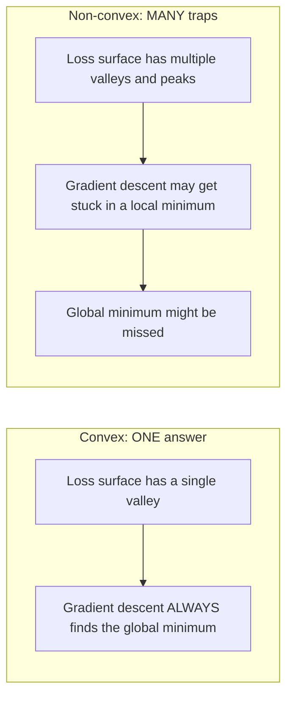
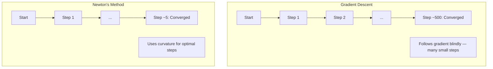
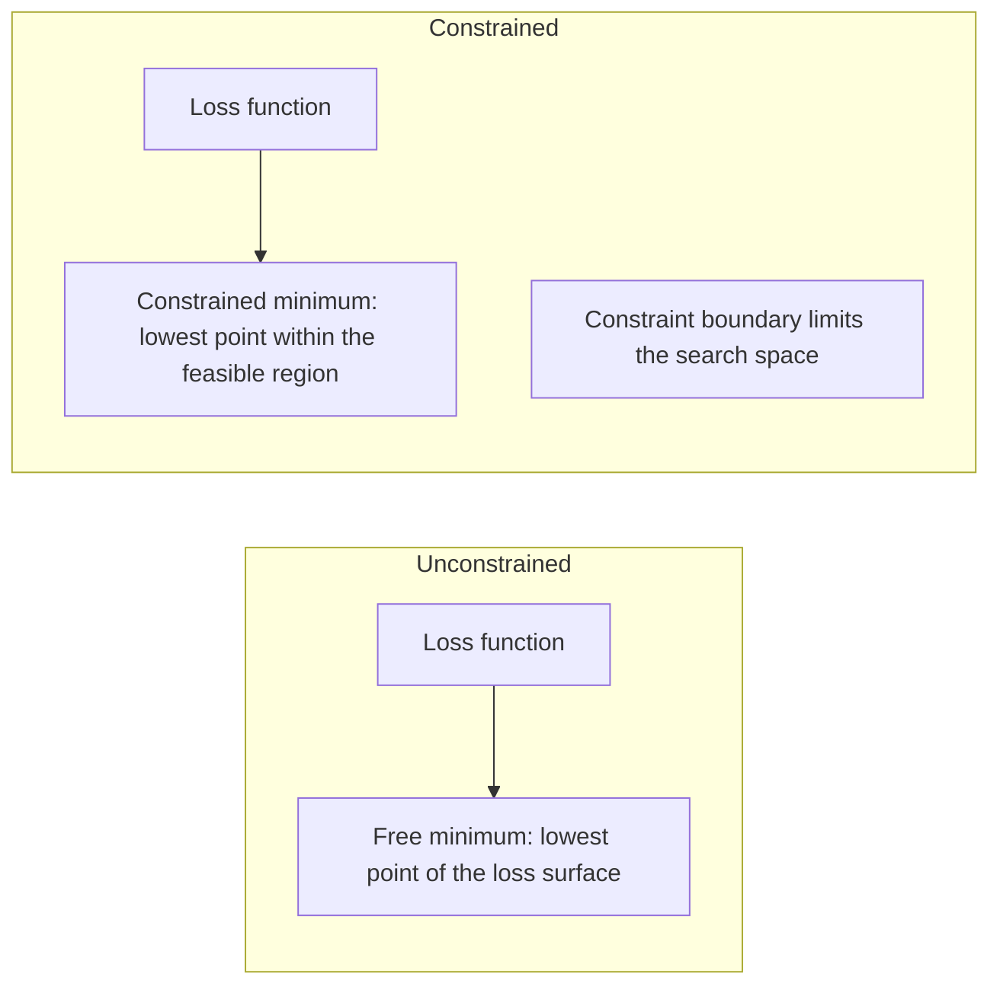
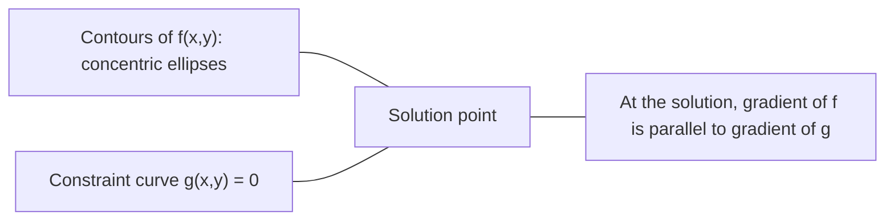

# 凸优化

> 凸问题只有一个山谷。神经网络有数百万个山谷。理解这种区别至关重要。

**类型：** 构建
**语言：** Python
**先决条件：** 阶段1，第04课（机器学习微积分），第08课（优化）
**时间：** 约90分钟

## 学习目标

- 使用定义、二阶导数和黑塞矩阵标准测试函数是否为凸函数
- 实现牛顿法并比较其与梯度下降的二次收敛速度
- 使用拉格朗日乘数法求解约束优化问题，并解释KKT条件
- 解释为什么神经网络的损失景观是非凸的，而随机梯度下降仍能找到良好解

## 问题所在

第08课教你梯度下降、动量和Adam。这些优化器可以在任何表面下行。但它们没有保证。在非凸景观上的梯度下降可能会陷入糟糕的局部最小值、卡在鞍点，或者永远振荡。你仍然使用它，因为神经网络是非凸的，而且没有替代方案。

但机器学习中的许多问题是凸的。线性回归、逻辑回归、支持向量机、LASSO、岭回归。对于这些问题，存在更强有力的工具：具有数学保证的优化。凸问题恰好只有一个山谷。任何下行的算法都会达到全局最小值。无需重新开始。无需学习率调度。无需祈祷。

理解凸性做三件事。首先，它告诉你问题何时是简单的（凸的）与困难的（非凸的）。其次，它为你提供了针对凸问题的更快工具，如牛顿法。第三，它解释了贯穿机器学习的概念：正则化作为约束、支持向量机中的对偶性，以及为什么深度学习在违反凸性赋予的所有优良性质的情况下仍然有效。

## 核心概念

### 凸集

一个集合S是凸的，如果对于S中的任意两点，它们之间的线段也完全位于S内。

| 凸集 | 非凸集 |
|---|---|
| **矩形**：内部任意两点都可以用一条保持在内部的线段连接 | **星形/新月形**：两个内部点之间的线段可能穿过集合外部 |
| **三角形**：所有内部点都具有相同性质 | **环形/圆环**：孔的存在意味着某些线段会离开集合 |
| 任意两点之间的线段都保持在集合内 | 某些点对之间的线段会离开集合 |

形式化测试：对于S中的任意点x, y以及[0, 1]中的任意t，点tx + (1-t)y也在S中。

凸集示例：
- 一条线、一个平面、所有R^n空间
- 一个球（圆、球体、超球体）
- 一个半空间：{x : a^T x <= b}
- 任意数量凸集的交集

非凸集示例：
- 一个圆环
- 两个不相交圆的并集
- 任何带有“凹陷”或“孔”的集合

### 凸函数

一个函数f是凸的，如果其定义域是一个凸集，并且对于定义域中的任意两点x, y以及[0, 1]中的任意t：

```
f(tx + (1-t)y) <= t*f(x) + (1-t)*f(y)
```

几何解释：图上任意两点之间的线段位于图形之上或之上。

| 性质 | 凸函数 | 非凸函数 |
|---|---|---|
| **线段测试** | 图上任意两点之间的线段位于曲线**之上或之上** | 图上某些点之间的线段位于曲线**之下** |
| **形状** | 单个向上弯曲的碗/山谷 | 多个山峰和山谷，曲率混合 |
| **局部最小值** | 每个局部最小值都是全局最小值 | 可能存在多个高度不同的局部最小值 |

常见的凸函数：
- f(x) = x^2 （抛物线）
- f(x) = |x| （绝对值）
- f(x) = e^x （指数函数）
- f(x) = max(0, x) （ReLU，虽然是分段线性的）
- 对于 x > 0, f(x) = -log(x) （负对数）
- 任何线性函数 f(x) = a^T x + b （既是凸的也是凹的）

### 凸性测试

三种实用测试，从最简单到最严格。

**测试1：二阶导数测试（一维）。** 如果对所有x有 f''(x) >= 0，则f是凸的。

- f(x) = x^2: f''(x) = 2 >= 0。凸。
- f(x) = x^3: f''(x) = 6x。对于x < 0为负。非凸。
- f(x) = e^x: f''(x) = e^x > 0。凸。

**测试2：黑塞矩阵测试（多元）。** 如果黑塞矩阵H(x)对所有x是半正定的，则f是凸的。黑塞矩阵是二阶偏导数的矩阵。

**测试3：定义测试。** 直接检查不等式 f(tx + (1-t)y) <= t*f(x) + (1-t)*f(y)。对于导数难以计算的函数很有用。

### 凸性的重要性

凸优化的核心定理：

**对于凸函数，每个局部最小值都是全局最小值。**

这意味着梯度下降不可能被困住。任何下行路径都会导向相同的答案。算法保证收敛到最优解。



结果：
- 无需随机重启
- 无需复杂的学习率调度
- 可以进行收敛性证明（速率取决于函数性质）
- 解是唯一的（除了平坦区域）

### 机器学习中的凸与非凸

| 问题 | 是凸的吗？ | 原因 |
|---------|---------|-----|
| 线性回归（均方误差） | 是 | 损失关于权重是二次的 |
| 逻辑回归 | 是 | 对数损失关于权重是凸的 |
| 支持向量机（合页损失） | 是 | 线性函数的最大值 |
| LASSO（L1回归） | 是 | 凸函数的和是凸的 |
| 岭回归（L2） | 是 | 二次 + 二次 = 凸 |
| 神经网络（任何损失） | 否 | 非线性激活函数创造了非凸景观 |
| k均值聚类 | 否 | 离散分配步骤 |
| 矩阵分解 | 否 | 未知量的乘积 |

具有凸损失的线性模型是凸的。一旦你添加了具有非线性激活函数的隐藏层，凸性就被破坏了。

### 黑塞矩阵

函数f: R^n -> R的黑塞矩阵H是一个n x n的二阶偏导数矩阵。

```
H[i][j] = d^2 f / (dx_i dx_j)
```

对于 f(x, y) = x^2 + 3xy + y^2:

```
df/dx = 2x + 3y       d^2f/dx^2 = 2      d^2f/dxdy = 3
df/dy = 3x + 2y       d^2f/dydx = 3      d^2f/dy^2 = 2

H = [ 2  3 ]
    [ 3  2 ]
```

黑塞矩阵告诉你曲率信息：
- 特征值全为正：函数在每个方向上向上弯曲（在该点是凸的）
- 特征值全为负：在每个方向上向下弯曲（凹的，局部最大值）
- 符号混合：鞍点（某些方向向上弯曲，某些向下）
- 特征值为零：在该方向上是平坦的（退化）

为了保证凸性，黑塞矩阵必须在所有地方都是半正定的（所有特征值 >= 0），而不仅仅是在一个点上。

### 牛顿法

梯度下降使用一阶信息（梯度）。牛顿法使用二阶信息（黑塞矩阵）。它在当前点拟合一个二次近似，并直接跳到该二次函数的最小值。

```
Update rule:
  x_new = x - H^(-1) * gradient

Compare to gradient descent:
  x_new = x - lr * gradient
```

牛顿法用黑塞矩阵的逆代替了标量学习率。这会根据局部曲率自动调整步长和方向。



优点：
- 在最小值附近具有二次收敛性（误差每步平方）
- 无需调整学习率
- 尺度不变（无论你如何参数化问题都适用）

缺点：
- 计算黑塞矩阵需要O(n^2)内存和O(n^3)的求逆成本
- 对于一个具有100万个权重的神经网络，那将是10^12个条目和10^18次运算
- 对于深度学习来说不实用

### 约束优化

无约束优化：在所有x上最小化f(x)。
约束优化：在约束条件下最小化f(x)。

现实问题都有约束。你希望最小化成本，但预算有限。你希望最小化误差，但模型复杂度受限。



### 拉格朗日乘数法

拉格朗日乘数法将约束问题转化为无约束问题。

问题：在 g(x) = 0 的条件下最小化 f(x)。

解：引入一个新变量（拉格朗日乘子λ），并求解无约束问题：

```
L(x, lambda) = f(x) + lambda * g(x)
```

在解处，L的梯度为零：

```
dL/dx = df/dx + lambda * dg/dx = 0
dL/dlambda = g(x) = 0
```

几何直觉：在约束最小值处，f的梯度必须与约束g的梯度平行。如果它们不平行，你可以沿着约束面移动并进一步减小f。



示例：在 x + y = 1 的条件下最小化 f(x,y) = x^2 + y^2。

```
L = x^2 + y^2 + lambda(x + y - 1)

dL/dx = 2x + lambda = 0  =>  x = -lambda/2
dL/dy = 2y + lambda = 0  =>  y = -lambda/2
dL/dlambda = x + y - 1 = 0

From first two: x = y
Substituting: 2x = 1, so x = y = 0.5, lambda = -1
```

在直线 x + y = 1 上距离原点最近的点是 (0.5, 0.5)。

### KKT条件

卡罗需-库恩-塔克条件将拉格朗日乘数法扩展到不等式约束。

问题：在 g_i(x) <= 0 （i = 1, ..., m）的条件下最小化 f(x)。

KKT条件（最优性的必要条件）：

```
1. Stationarity:    df/dx + sum(lambda_i * dg_i/dx) = 0
2. Primal feasibility:  g_i(x) <= 0  for all i
3. Dual feasibility:    lambda_i >= 0  for all i
4. Complementary slackness:  lambda_i * g_i(x) = 0  for all i
```

互补松弛性是关键见解：要么约束是紧的（g_i = 0，解位于边界上），要么乘子为零（约束无关紧要）。一个不影响解的约束其λ = 0。

KKT条件在支持向量机中至关重要。支持向量是约束紧（λ > 0）的数据点。所有其他数据点其λ = 0，不影响决策边界。

### 正则化作为约束优化

L1和L2正则化并非任意的技巧。它们是以约束优化问题的形式出现的。

**L2正则化（岭回归）：**

```
minimize  Loss(w)  subject to  ||w||^2 <= t

Equivalent unconstrained form:
minimize  Loss(w) + lambda * ||w||^2
```

约束 ||w||^2 <= t 定义了一个球（二维中是圆，三维中是球体）。解在损失等高线首次接触到这个球的地方。

**L1正则化（LASSO）：**

```
minimize  Loss(w)  subject to  ||w||_1 <= t

Equivalent unconstrained form:
minimize  Loss(w) + lambda * ||w||_1
```

约束 ||w||_1 <= t 定义了一个菱形（二维中是旋转的正方形）。

| 性质 | L2约束（圆） | L1约束（菱形） |
|---|---|---|
| **约束形状** | 圆（高维中是球） | 菱形（二维中是旋转的正方形） |
| **损失等高线接触处** | 光滑边界——圆上的任何点 | 角点——与坐标轴对齐 |
| **解的行为** | 权重很小但非零 | 某些权重恰好为零（稀疏） |
| **结果** | 权重收缩 | 特征选择 |

这解释了为什么L1产生稀疏模型（特征选择），而L2只是收缩权重。菱形具有与坐标轴对齐的角点。损失等高线更有可能接触到一个角点，将一个或多个权重精确地设置为零。

### 对偶性

每个约束优化问题（原问题）都有一个伴随问题（对偶问题）。对于凸问题，原问题和对偶问题具有相同的最优值。这就是强对偶性。

拉格朗日对偶函数：

```
Primal: minimize f(x) subject to g(x) <= 0
Lagrangian: L(x, lambda) = f(x) + lambda * g(x)
Dual function: d(lambda) = min_x L(x, lambda)
Dual problem: maximize d(lambda) subject to lambda >= 0
```

对偶性为何重要：
- 对偶问题有时比原问题更容易求解
- 支持向量机在其对偶形式下求解，此时问题依赖于数据点之间的点积（使得核技巧成为可能）
- 对偶为原问题最优值提供下界，有助于检查解的质量

对于支持向量机：

```
Primal: find w, b that maximize the margin 2/||w|| subject to
        y_i(w^T x_i + b) >= 1 for all i

Dual:   maximize sum(alpha_i) - 0.5 * sum_ij(alpha_i * alpha_j * y_i * y_j * x_i^T x_j)
        subject to alpha_i >= 0 and sum(alpha_i * y_i) = 0

The dual only involves dot products x_i^T x_j.
Replace x_i^T x_j with K(x_i, x_j) to get the kernel trick.
```

### 为什么深度学习在非凸情况下仍然有效

神经网络的损失函数是极其非凸的。按照任何经典度量，优化它们都应失败。然而，随机梯度下降可靠地找到了良好的解。几个因素可以解释这一点。

**大多数局部最小值足够好。** 在高维空间中，随机临界点（梯度为零的点）绝大多数是鞍点，而不是局部最小值。存在的少数局部最小值，其损失值往往接近全局最小值。当参数空间具有数百万个维度时，陷入一个糟糕的局部最小值的可能性极低。

**鞍点，而非局部最小值，是真正的障碍。** 在一个具有n个参数的函数中，鞍点具有正曲率和负曲率方向的混合。对于高维空间中的一个随机临界点，所有n个特征值均为正（局部最小值）的概率大约为2^(-n)。几乎所有的临界点都是鞍点。随机梯度下降的噪声有助于逃离它们。

**过参数化使景观变得平滑。** 参数数量多于训练样本的网络具有更平滑、连接更紧密的损失表面。更宽的网络具有更少的糟糕局部最小值。这反直觉，但与经验一致。

**损失景观结构：**

| 性质 | 低维空间 | 高维空间 |
|---|---|---|
| **景观** | 许多孤立的山峰和山谷 | 平滑连接的山谷 |
| **最小值** | 许多孤立的局部最小值 | 很少糟糕的局部最小值；大多数接近最优 |
| **导航** | 难以找到全局最小值 | 许多路径导向良好解 |
| **临界点** | 局部最小值和鞍点的混合 | 绝大多数是鞍点，而非局部最小值 |

**随机噪声充当隐式正则化。** 小批量随机梯度下降添加的噪声防止陷入尖锐的最小值。尖锐的最小值会过拟合；平坦的最小值则泛化。噪声使优化偏向损失景观的平坦区域。

### 实践中的二阶方法

纯牛顿法对于大型模型不实用。几种近似方法使二阶信息变得可用。

**L-BFGS（有限内存BFGS）：** 使用最后m个梯度差来近似黑塞矩阵的逆。需要O(mn)内存，而不是O(n^2)。对于参数最多约10,000个的问题效果良好。用于经典机器学习（逻辑回归、条件随机场），但不用于深度学习。

**自然梯度：** 使用费雪信息矩阵（对数似然的期望黑塞矩阵）代替标准黑塞矩阵。这考虑了概率分布的几何结构。K-FAC（克罗内克分解近似曲率）将费雪矩阵近似为克罗内克积，使其对神经网络具有实用性。

**无黑塞优化：** 使用共轭梯度法求解Hx = g，而无需显式构建H。只需要黑塞矩阵-向量乘积，这可以通过自动微分在O(n)时间内计算。

**对角近似：** Adam的二阶矩是黑塞矩阵对角线的对角近似。AdaHessian通过使用哈钦森估计器计算实际的黑塞矩阵对角线元素来扩展这一点。

| 方法 | 内存 | 每步成本 | 何时使用 |
|--------|--------|--------------|-------------|
| 梯度下降 | O(n) | O(n) | 基线，大型模型 |
| 牛顿法 | O(n^2) | O(n^3) | 小型凸问题 |
| L-BFGS | O(mn) | O(mn) | 中型凸问题 |
| Adam | O(n) | O(n) | 深度学习默认 |
| K-FAC | O(n) | O(n) 每层 | 研究，大批量训练 |

## 动手构建

### 步骤1：凸性检查器

构建一个函数，通过采样点并检查定义来经验性地测试凸性。

```python
import random
import math

def check_convexity(f, dim, bounds=(-5, 5), samples=1000):
    violations = 0
    for _ in range(samples):
        x = [random.uniform(*bounds) for _ in range(dim)]
        y = [random.uniform(*bounds) for _ in range(dim)]
        t = random.uniform(0, 1)
        mid = [t * xi + (1 - t) * yi for xi, yi in zip(x, y)]
        lhs = f(mid)
        rhs = t * f(x) + (1 - t) * f(y)
        if lhs > rhs + 1e-10:
            violations += 1
    return violations == 0, violations
```

### 步骤2：二维牛顿法

使用显式黑塞矩阵实现牛顿法。将其收敛速度与梯度下降进行比较。

```python
def newtons_method(f, grad_f, hessian_f, x0, steps=50, tol=1e-12):
    x = list(x0)
    history = [x[:]]
    for _ in range(steps):
        g = grad_f(x)
        H = hessian_f(x)
        det = H[0][0] * H[1][1] - H[0][1] * H[1][0]
        if abs(det) < 1e-15:
            break
        H_inv = [
            [H[1][1] / det, -H[0][1] / det],
            [-H[1][0] / det, H[0][0] / det],
        ]
        dx = [
            H_inv[0][0] * g[0] + H_inv[0][1] * g[1],
            H_inv[1][0] * g[0] + H_inv[1][1] * g[1],
        ]
        x = [x[0] - dx[0], x[1] - dx[1]]
        history.append(x[:])
        if sum(gi ** 2 for gi in g) < tol:
            break
    return history
```

### 步骤3：拉格朗日乘数法求解器

通过在拉格朗日函数上使用梯度下降法求解约束优化问题。

```python
def lagrange_solve(f_grad, g_val, g_grad, x0, lr=0.01,
                   lr_lambda=0.01, steps=5000):
    x = list(x0)
    lam = 0.0
    history = []
    for _ in range(steps):
        fg = f_grad(x)
        gv = g_val(x)
        gg = g_grad(x)
        x = [
            xi - lr * (fgi + lam * ggi)
            for xi, fgi, ggi in zip(x, fg, gg)
        ]
        lam = lam + lr_lambda * gv
        history.append((x[:], lam, gv))
    return history
```

### 步骤4：一阶法与二阶法比较

在同一个二次函数上运行梯度下降和牛顿法。计算收敛到给定精度所需的步数。

```python
def quadratic(x):
    return 5 * x[0] ** 2 + x[1] ** 2

def quadratic_grad(x):
    return [10 * x[0], 2 * x[1]]

def quadratic_hessian(x):
    return [[10, 0], [0, 2]]
```

牛顿法将在1步内收敛（对于二次函数是精确的）。梯度下降将需要数百步，因为黑塞矩阵的特征值相差5倍，形成了一个细长的山谷。

## 实际应用

凸性分析在选择机器学习模型和求解器时直接适用。

对于凸问题（逻辑回归、支持向量机、LASSO）：
- 使用专用求解器（liblinear, CVXPY, scipy.optimize.minimize with method='L-BFGS-B'）
- 预期存在唯一的全局解
- 二阶方法实用且快速

对于非凸问题（神经网络）：
- 使用一阶方法（SGD, Adam）
- 接受解依赖于初始化和随机性
- 使用过参数化、噪声和学习率调度作为隐式正则化
- 不要浪费时间寻找全局最小值。一个良好的局部最小值就足够了。

```python
from scipy.optimize import minimize

result = minimize(
    fun=lambda w: sum((y - X @ w) ** 2) + 0.1 * sum(w ** 2),
    x0=np.zeros(d),
    method='L-BFGS-B',
    jac=lambda w: -2 * X.T @ (y - X @ w) + 0.2 * w,
)
```

对于支持向量机，对偶形式允许你使用核技巧：

```python
from sklearn.svm import SVC

svm = SVC(kernel='rbf', C=1.0)
svm.fit(X_train, y_train)
print(f"Support vectors: {svm.n_support_}")
```

## 练习

1.  **凸性画廊。** 使用检查器测试以下函数的凸性：f(x) = x^4, f(x) = sin(x), f(x,y) = x^2 + y^2, f(x,y) = x*y, f(x) = max(x, 0)。解释为什么每个结果是有意义的。
2.  **牛顿法与梯度下降赛跑。** 在 f(x,y) = 50*x^2 + y^2 上，从点 (10, 10) 开始运行两种方法。每种方法需要多少步才能达到损失 < 1e-10？当条件数（黑塞矩阵最大与最小特征值之比）增加时，梯度下降会发生什么？
3.  **拉格朗日乘数几何。** 在 x + 2y = 4 的条件下最小化 f(x,y) = (x-3)^2 + (y-3)^2。通过检查解处f的梯度与g的梯度平行来验证解。
4.  **正则化约束。** 实现L1约束优化：在 |x| + |y| <= 1 的条件下最小化 (x-3)^2 + (y-2)^2。显示解有一个坐标等于零（菱形约束带来的稀疏性）。
5.  **黑塞矩阵特征值分析。** 计算Rosenbrock函数在 (1,1) 和 (-1,1) 处的黑塞矩阵。计算两点处的特征值。特征值告诉你关于在最小值附近与远离最小值处的曲率信息吗？

## 关键术语

| 术语 | 含义 |
|------|---------------|
| 凸集 | 一个集合，其中任意两点之间的线段都保持在集合内 |
| 凸函数 | 一个函数，其图上任意两点之间的线段位于图形之上或之上。等价地，黑塞矩阵处处半正定 |
| 局部最小值 | 一个比所有邻近点都低的点。对于凸函数，每个局部最小值都是全局最小值 |
| 全局最小值 | 函数在其整个定义域上的最低点 |
| 黑塞矩阵 | 所有二阶偏导数的矩阵。编码曲率信息 |
| 半正定 | 一个特征值全部非负的矩阵。是“二阶导数 >= 0”的多维类比 |
| 条件数 | 黑塞矩阵最大与最小特征值之比。高条件数意味着细长的山谷和缓慢的梯度下降 |
| 牛顿法 | 一种二阶优化器，使用黑塞矩阵的逆来确定步长方向和大小。在最小值附近具有二次收敛性 |
| 拉格朗日乘子 | 引入的一个变量，用于将约束优化问题转化为无约束问题 |
| KKT条件 | 带有不等式约束的最优性的必要条件。推广了拉格朗日乘数法 |
| 互补松弛性 | 在解处，要么一个约束是紧的，要么其乘子为零。绝不会两者同时非零 |
| 对偶性 | 每个约束问题都有一个伴随的对偶问题。对于凸问题，两者具有相同的最优值 |
| 强对偶性 | 原问题和对偶问题的最优值相等。对于满足Slater条件的凸问题成立 |
| L-BFGS | 一种近似二阶方法，存储最后m个梯度差，而不是完整的黑塞矩阵 |
| 鞍点 | 一个梯度为零，但在某些方向上是最小值，在其他方向上是最大值的点 |
| 过参数化 | 使用比训练样本更多的参数。平滑损失景观并减少糟糕的局部最小值 |

## 扩展阅读

- [Boyd & Vandenberghe: Convex Optimization](https://web.stanford.edu/~boyd/cvxbook/) - 标准教材，在线免费提供
- [Bottou, Curtis, Nocedal: Optimization Methods for Large-Scale Machine Learning (2018)](https://arxiv.org/abs/1606.04838) - 桥接凸优化理论与深度学习实践
- [Choromanska et al.: The Loss Surfaces of Multilayer Networks (2015)](https://arxiv.org/abs/1412.0233) - 解释为什么非凸神经网络景观并不像看起来那么糟糕
- [Nocedal & Wright: Numerical Optimization](https://link.springer.com/book/10.1007/978-0-387-40065-5) - 牛顿法、L-BFGS和约束优化的综合参考