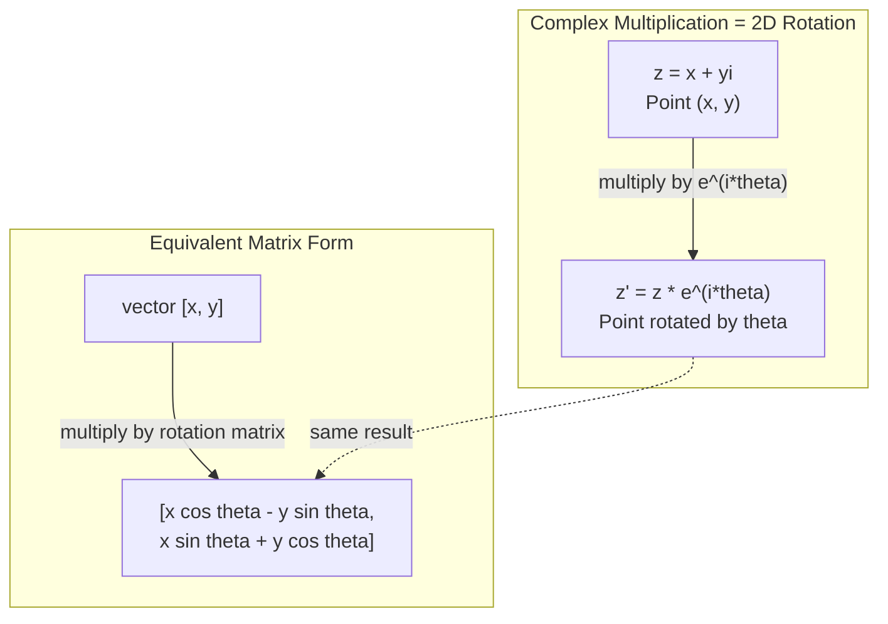
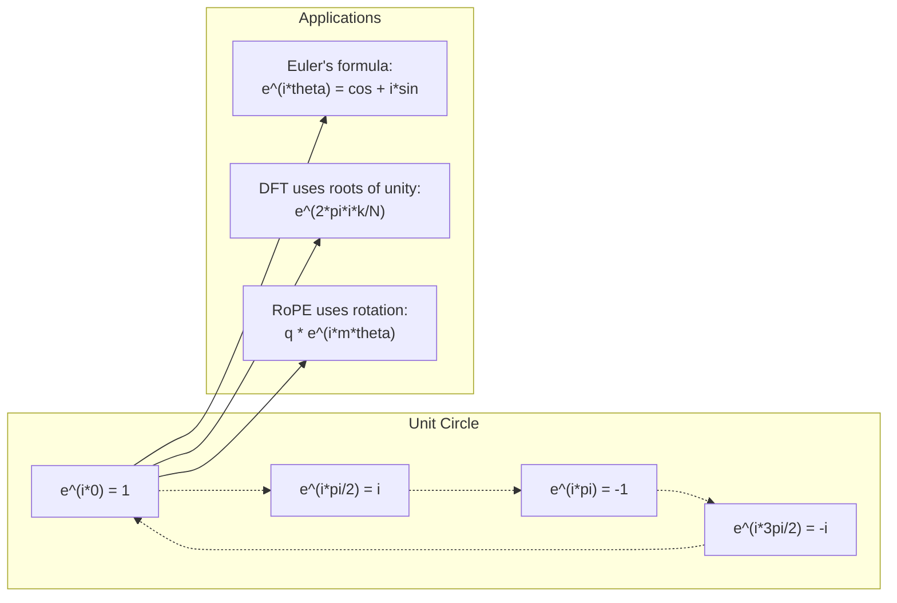

# AI中的复数

> -1的平方根并非虚幻。它是旋转、频率以及半数信号处理的基础。

**类型：** 学习
**语言：** Python
**先决条件：** 第1阶段，课程01-04（线性代数、微积分）
**时间：** 约60分钟

## 学习目标

- 在直角坐标和极坐标形式下执行复数算术（加、乘、除、共轭）
- 应用欧拉公式在复指数和三角函数之间进行转换
- 利用复数单位根实现离散傅里叶变换
- 解释复数旋转如何作为Transformer中RoPE和正弦位置编码的基础

## 问题所在

你打开一篇关于傅里叶变换的论文，里面到处都是`i`。你查看Transformer的位置编码，看到`sin`和`cos`出现在不同频率——它们是复指数的实部和虚部。你阅读量子计算的相关资料，发现一切都用复数向量空间表示。

复数似乎很抽象。一个建立在-1平方根上的数系感觉像是数学技巧。但它并非技巧。它是旋转与振荡的自然语言。每当有事物旋转、振动或振荡时，复数都是正确的工具。

如果不理解复数，你就无法理解离散傅里叶变换。你无法理解FFT。你无法理解RoPE（旋转位置嵌入）在现代语言模型中如何工作。你无法理解原始Transformer论文中正弦位置编码为何使用特定的频率。

本课从零开始构建复数算术，将其与几何联系起来，并向你精确展示复数在机器学习中出现的位置。

## 概念解析

### 什么是复数？

复数由两部分组成：实部和虚部。

```
z = a + bi

where:
  a is the real part
  b is the imaginary part
  i is the imaginary unit, defined by i^2 = -1
```

就这样。你将数轴扩展成一个平面。实数位于一个轴上。虚数位于另一个轴上。每个复数都是这个平面上的一个点。

### 复数算术

**加法。** 实部相加，虚部相加。

```
(a + bi) + (c + di) = (a + c) + (b + d)i

Example: (3 + 2i) + (1 + 4i) = 4 + 6i
```

**乘法。** 使用分配律并记住 i^2 = -1。

```
(a + bi)(c + di) = ac + adi + bci + bdi^2
                 = ac + adi + bci - bd
                 = (ac - bd) + (ad + bc)i

Example: (3 + 2i)(1 + 4i) = 3 + 12i + 2i + 8i^2
                            = 3 + 14i - 8
                            = -5 + 14i
```

**共轭。** 翻转虚部的符号。

```
conjugate of (a + bi) = a - bi
```

一个复数与其共轭的乘积总是实数：

```
(a + bi)(a - bi) = a^2 + b^2
```

**除法。** 将分子和分母乘以分母的共轭。

```
(a + bi) / (c + di) = (a + bi)(c - di) / (c^2 + d^2)
```

这消除了分母中的虚部，得到一个简洁的复数。

### 复平面

复平面将每个复数映射到一个二维点。水平轴是实轴，垂直轴是虚轴。

```
z = 3 + 2i  corresponds to the point (3, 2)
z = -1 + 0i corresponds to the point (-1, 0) on the real axis
z = 0 + 4i  corresponds to the point (0, 4) on the imaginary axis
```

一个复数同时是一个点和一个从原点出发的向量。这种双重解释使得复数在几何中非常有用。

### 极坐标形式

平面中的任何点都可以用它到原点的距离和它与正实轴的夹角来描述。

```
z = r * (cos(theta) + i*sin(theta))

where:
  r = |z| = sqrt(a^2 + b^2)     (magnitude, or modulus)
  theta = atan2(b, a)             (phase, or argument)
```

直角坐标形式（a + bi）适合加法。极坐标形式（r, theta）适合乘法。

**极坐标形式下的乘法。** 模长相乘，角度相加。

```
z1 = r1 * e^(i*theta1)
z2 = r2 * e^(i*theta2)

z1 * z2 = (r1 * r2) * e^(i*(theta1 + theta2))
```

这就是为什么复数非常适合旋转。乘以一个模为1的复数就是纯旋转。

### 欧拉公式

复指数与三角学之间的桥梁：

```
e^(i*theta) = cos(theta) + i*sin(theta)
```

这是本课最重要的公式。当 theta = pi 时：

```
e^(i*pi) = cos(pi) + i*sin(pi) = -1 + 0i = -1

Therefore: e^(i*pi) + 1 = 0
```

五个基本常数（e, i, pi, 1, 0）在一个方程中相联系。

### 欧拉公式对机器学习的意义

欧拉公式表明，随着 theta 变化，`e^(i*theta)` 描绘出单位圆。在 theta = 0 时，你在 (1, 0)。在 theta = pi/2 时，你在 (0, 1)。在 theta = pi 时，你在 (-1, 0)。在 theta = 3*pi/2 时，你在 (0, -1)。完整旋转一圈是 theta = 2*pi。

这意味着复指数就是旋转。而旋转在信号处理和机器学习中无处不在。

### 与2D旋转的联系

将复数 (x + yi) 乘以 e^(i*theta) 会将点 (x, y) 绕原点旋转角度 theta。

```
Rotation via complex multiplication:
  (x + yi) * (cos(theta) + i*sin(theta))
  = (x*cos(theta) - y*sin(theta)) + (x*sin(theta) + y*cos(theta))i

Rotation via matrix multiplication:
  [cos(theta)  -sin(theta)] [x]   [x*cos(theta) - y*sin(theta)]
  [sin(theta)   cos(theta)] [y] = [x*sin(theta) + y*cos(theta)]
```

它们产生相同的结果。复数乘法就是2D旋转。旋转矩阵只是用矩阵符号表示的复数乘法。



### 相量与旋转信号

一个复指数 e^(i*omega*t) 是一个以角速度 omega 绕单位圆旋转的点。随着 t 增加，该点描绘出圆。

这个旋转点的实部是 cos(omega*t)。虚部是 sin(omega*t)。正弦信号是一个旋转复数的影子。

```
e^(i*omega*t) = cos(omega*t) + i*sin(omega*t)

Real part:      cos(omega*t)    -- a cosine wave
Imaginary part: sin(omega*t)    -- a sine wave
```

这是相量表示法。你不用追踪一个摆动的正弦波，而是追踪一个平滑旋转的箭头。相移变成角度偏移。幅度变化变成模长变化。信号叠加变成向量加法。

### 单位根

第N个单位根是单位圆上等距分布的N个点：

```
w_k = e^(2*pi*i*k/N)    for k = 0, 1, 2, ..., N-1
```

当 N = 4 时，根为：1, i, -1, -i（四个基本方向点）。
当 N = 8 时，你得到四个基本方向点加上四个对角线方向点。

单位根是离散傅里叶变换的基础。DFT将信号分解为这N个等距频率上的分量。

### 与DFT的联系

信号 x[0], x[1], ..., x[N-1] 的离散傅里叶变换是：

```
X[k] = sum_{n=0}^{N-1} x[n] * e^(-2*pi*i*k*n/N)
```

每个 X[k] 测量信号与第k个单位根（频率k处的复正弦波）的相关性。DFT将信号分解为N个旋转相量，并告诉你每个相量的幅度和相位。

### 为什么i不是虚幻的

“虚数”（imaginary）这个词是一个历史偶然。笛卡尔使用它时带有轻蔑的意味。但i并不比人们最初排斥的负数更虚幻。负数回答“3减去什么得到-5？”这样的问题。虚数单位回答“什么数的平方等于-1？”

更实际地说：i是一个90度旋转算子。将一个实数乘以i一次，你旋转90度到虚轴。再乘以一次i（i^2），你再旋转90度——现在你指向负实方向。这就是为什么 i^2 = -1。这并不神秘。它是由两个四分之一转组成的一个半转。

这就是为什么复数在工程领域无处不在。任何旋转的事物——电磁波、量子态、信号振荡、位置编码——都自然地由复数描述。

### 复指数 vs 三角函数

在欧拉公式出现之前，工程师将信号写作 A*cos(omega*t + phi)——幅度A，频率omega，相位phi。这可行但使得算术运算很痛苦。将两个不同相位的余弦波相加需要三角恒等式。

使用复指数，同样的信号表示为 A*e^(i*(omega*t + phi))。将两个信号相加只是将两个复数相加。乘法（调制）只是模长相乘和角度相加。相移变成角度加法。频移变成乘以相量。

整个信号处理领域都转向了复指数符号，因为数学更简洁。“真实信号”总是复数表示的实部。虚部作为簿记被携带进来，使得所有代数运算都自然成立。

### 与Transformer的联系

**正弦位置编码**（原始Transformer论文）：

```
PE(pos, 2i) = sin(pos / 10000^(2i/d))
PE(pos, 2i+1) = cos(pos / 10000^(2i/d))
```

正弦和余弦对是不同频率的复指数的实部和虚部。每个频率为位置编码提供不同的“分辨率”。低频变化缓慢（粗略位置）。高频变化迅速（精确位置）。它们共同为每个位置提供一个独特的频率指纹。

**RoPE（旋转位置嵌入）** 更进一步。它显式地将查询和键向量乘以复数旋转矩阵。两个token之间的相对位置变成了一个旋转角度。注意力使用这些旋转后的向量进行计算，通过复数乘法使模型对相对位置敏感。

| 操作 | 代数形式 | 几何意义 |
|-----------|---------------|-------------------|
| 加法 | (a+c) + (b+d)i | 平面中的向量加法 |
| 乘法 | (ac-bd) + (ad+bc)i | 旋转并缩放 |
| 共轭 | a - bi | 关于实轴反射 |
| 模长 | sqrt(a^2 + b^2) | 到原点的距离 |
| 相位 | atan2(b, a) | 与正实轴的夹角 |
| 除法 | 乘以共轭 | 反向旋转并重新缩放 |
| 幂 | r^n * e^(i*n*theta) | 旋转n次，缩放r^n倍 |



## 动手实现

### 步骤1：复数类

构建一个复数类，支持算术运算、求模、求幅角以及直角坐标与极坐标形式之间的转换。

```python
import math

class Complex:
    def __init__(self, real, imag=0.0):
        self.real = real
        self.imag = imag

    def __add__(self, other):
        return Complex(self.real + other.real, self.imag + other.imag)

    def __mul__(self, other):
        r = self.real * other.real - self.imag * other.imag
        i = self.real * other.imag + self.imag * other.real
        return Complex(r, i)

    def __truediv__(self, other):
        denom = other.real ** 2 + other.imag ** 2
        r = (self.real * other.real + self.imag * other.imag) / denom
        i = (self.imag * other.real - self.real * other.imag) / denom
        return Complex(r, i)

    def magnitude(self):
        return math.sqrt(self.real ** 2 + self.imag ** 2)

    def phase(self):
        return math.atan2(self.imag, self.real)

    def conjugate(self):
        return Complex(self.real, -self.imag)
```

### 步骤2：极坐标转换与欧拉公式

```python
def to_polar(z):
    return z.magnitude(), z.phase()

def from_polar(r, theta):
    return Complex(r * math.cos(theta), r * math.sin(theta))

def euler(theta):
    return Complex(math.cos(theta), math.sin(theta))
```

验证：`euler(theta).magnitude()` 应该总是 1.0。`euler(0)` 应该给出 (1, 0)。`euler(pi)` 应该给出 (-1, 0)。

### 步骤3：旋转

将点 (x, y) 旋转角度 theta 就是一次复数乘法：

```python
point = Complex(3, 4)
rotated = point * euler(math.pi / 4)
```

模长保持不变。只有角度改变。

### 步骤4：从复数算术实现DFT

```python
def dft(signal):
    N = len(signal)
    result = []
    for k in range(N):
        total = Complex(0, 0)
        for n in range(N):
            angle = -2 * math.pi * k * n / N
            total = total + Complex(signal[n], 0) * euler(angle)
        result.append(total)
    return result
```

这是时间复杂度为 O(N^2) 的DFT。每个输出 X[k] 是信号样本乘以单位根的和。

### 步骤5：逆DFT

逆DFT从频谱重建原始信号。与正向DFT相比，唯一的变化是：指数中的符号取反并除以N。

```python
def idft(spectrum):
    N = len(spectrum)
    result = []
    for n in range(N):
        total = Complex(0, 0)
        for k in range(N):
            angle = 2 * math.pi * k * n / N
            total = total + spectrum[k] * euler(angle)
        result.append(Complex(total.real / N, total.imag / N))
    return result
```

这给你完美的重建。应用DFT，然后应用IDFT，你就能以机器精度恢复原始信号。没有信息损失。

### 步骤6：单位根

```python
def roots_of_unity(N):
    return [euler(2 * math.pi * k / N) for k in range(N)]
```

验证两个性质：
- 每个根的模长严格为1。
- 所有N个根的和为零（由于对称性，它们相互抵消）。

这些性质使得DFT可逆。单位根构成了频域的正交基。

## 使用它

Python有内置的复数支持。字面量`j`表示虚数单位。

```python
z = 3 + 2j
w = 1 + 4j

print(z + w)
print(z * w)
print(abs(z))

import cmath
print(cmath.phase(z))
print(cmath.exp(1j * cmath.pi))
```

对于数组，numpy原生支持复数：

```python
import numpy as np

z = np.array([1+2j, 3+4j, 5+6j])
print(np.abs(z))
print(np.angle(z))
print(np.conj(z))
print(np.real(z))
print(np.imag(z))

signal = np.sin(2 * np.pi * 5 * np.linspace(0, 1, 128))
spectrum = np.fft.fft(signal)
freqs = np.fft.fftfreq(128, d=1/128)
```

## 交付

运行`code/complex_numbers.py` 以生成 `outputs/skill-complex-arithmetic.md`。

## 练习题

1. **手算复数运算。** 计算 (2 + 3i) * (4 - i) 并用代码验证。然后计算 (5 + 2i) / (1 - 3i)。在复平面上绘制这两个结果，并验证乘法旋转并缩放了第一个数。

2. **旋转序列。** 从点 (1, 0) 开始。乘以 e^(i*pi/6) 十二次。验证在12次乘法后你回到了 (1, 0)。打印每一步的坐标，并确认它们描绘出一个正12边形。

3. **已知信号的DFT。** 创建一个信号，它是 sin(2*pi*3*t) 和 0.5*sin(2*pi*7*t) 的和，在32个点上采样。运行你的DFT。验证幅度谱在频率3和7处有峰，频率7处的峰高是频率3处峰高的一半。

4. **单位根可视化。** 计算第8个单位根。验证它们的和为零。验证将任意一个根乘以本原根 e^(2*pi*i/8) 会得到下一个根。

5. **旋转矩阵等价性。** 对于10个随机角度和10个随机点，验证复数乘法与使用2x2旋转矩阵进行矩阵-向量乘法得到相同的结果。打印最大的数值差异。

## 关键术语

| 术语 | 含义 |
|------|---------------|
| 复数 | 一个数 a + bi，其中 a 是实部，b 是虚部，且 i^2 = -1 |
| 虚数单位 | 数 i，定义为 i^2 = -1。在哲学意义上并不虚幻——它是一个旋转算子 |
| 复平面 | x轴为实数，y轴为虚数的二维平面。也称为阿甘平面 |
| 模长（模） | 到原点的距离：sqrt(a^2 + b^2)。记作 \|z\| |
| 相位（辐角） | 与正实轴的夹角：atan2(b, a)。记作 arg(z) |
| 共轭 | 关于实轴的镜像：a + bi 的共轭是 a - bi |
| 极坐标形式 | 将 z 表示为 r * e^(i*theta) 而不是 a + bi。使乘法更容易 |
| 欧拉公式 | e^(i*theta) = cos(theta) + i*sin(theta)。将指数与三角学联系起来 |
| 相量 | 代表正弦信号的旋转复数 e^(i*omega*t) |
| 单位根 | N个复数 e^(2*pi*i*k/N)，其中 k = 0 到 N-1。单位圆上N个等距的点 |
| DFT | 离散傅里叶变换。使用单位根将信号分解为复正弦分量 |
| RoPE | 旋转位置嵌入。使用复数乘法在Transformer注意力中编码相对位置 |

## 扩展阅读

- [欧拉公式的直观介绍](https://betterexplained.com/articles/intuitive-understanding-of-eulers-formula/) - 不依赖繁重符号建立几何直觉
- [Su 等人：RoFormer (2021)](https://arxiv.org/abs/2104.09864) - 提出使用复数旋转的旋转位置嵌入的论文
- [Vaswani 等人：Attention Is All You Need (2017)](https://arxiv.org/abs/1706.03762) - 包含正弦位置编码的原始Transformer论文
- [3Blue1Brown：结合入门群论讲解欧拉公式](https://www.youtube.com/watch?v=mvmuCPvRoWQ) - 关于 e^(i*pi) = -1 的直观解释
- [Needham：Visual Complex Analysis](https://global.oup.com/academic/product/visual-complex-analysis-9780198534464) - 最佳的复数可视化讲解，充满几何洞察
- [Strang：Introduction to Linear Algebra, 第10章](https://math.mit.edu/~gs/linearalgebra/) - 线性代数和特征值背景下的复数