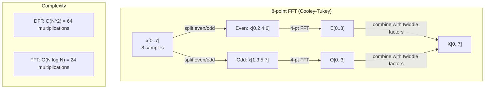
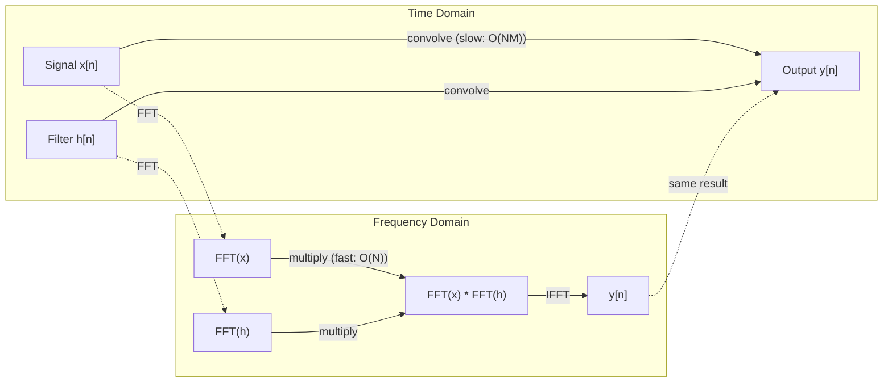

# 傅里叶变换

> 每个信号都是正弦波的叠加。傅里叶变换告诉你哪些波。

**类型：** 构建
**语言：** Python
**先修知识：** 阶段1，第01-04课，19课（复数）
**时间：** 约90分钟

## 学习目标

- 从头实现DFT，并与O(N log N)的Cooley-Tukey FFT进行验证
- 解读频率系数：从信号中提取振幅、相位和功率谱
- 应用卷积定理，通过FFT乘法执行卷积
- 建立傅里叶频率分解与Transformer位置编码及CNN卷积层之间的联系

## 问题

音频录制是随时间变化的一系列压力测量值。股票价格是按天排列的一系列数值。图像是空间分布的像素强度网格。这些都是时域（或空域）中的数据。你看到的是值随某个索引而变化。

但许多模式在时域中是不可见的。这个音频信号是纯音还是和弦？这个股价有周周期吗？这幅图像有重复纹理吗？这些问题关乎频率内容，而时域隐藏了它。

傅里叶变换将数据从时域转换到频域。它接收一个信号，并将其分解为不同频率的正弦波。每个正弦波都有一个振幅（有多强）和一个相位（从哪里开始）。傅里叶变换告诉你这两者。

这对机器学习很重要，因为频率域思维无处不在。卷积神经网络执行卷积，这等价于频率域中的乘法。Transformer位置编码使用频率分解来表示位置。音频模型（语音识别、音乐生成）在频谱图（声音的频率表示）上操作。时间序列模型寻找周期性模式。理解傅里叶变换能为你提供处理所有这些的词汇。

## 概念

### DFT定义

给定N个样本x[0], x[1], ..., x[N-1]，离散傅里叶变换产生N个频率系数X[0], X[1], ..., X[N-1]：

```
X[k] = sum_{n=0}^{N-1} x[n] * e^(-2*pi*i*k*n/N)

for k = 0, 1, ..., N-1
```

每个X[k]是一个复数。它的幅度|X[k]|告诉你频率k的振幅。它的相位角angle(X[k])告诉你该频率的相位偏移。

关键洞察：`e^(-2*pi*i*k*n/N)`是一个以频率k旋转的相量。DFT计算信号与N个等间距频率中的每一个之间的相关性。如果信号在频率k处包含能量，相关性就大。如果不包含，相关性就接近于零。

### 每个系数的含义

**X[0]：直流分量。** 这是所有样本的总和——与均值成正比。它代表信号的常数（零频率）偏移。

```
X[0] = sum_{n=0}^{N-1} x[n] * e^0 = sum of all samples
```

**X[k]（1 <= k <= N/2）：正频率。** X[k]代表每N个样本k个周期的频率。k越大意味着频率越高（振荡越快）。

**X[N/2]：奈奎斯特频率。** 用N个样本能表示的最高频率。高于此频率，会出现混叠——高频被伪装成低频。

**X[k]（N/2 < k < N）：负频率。** 对于实值信号，X[N-k] = conj(X[k])。负频率是正频率的镜像。这就是为什么有用信息包含在前N/2 + 1个系数中。

### 逆DFT

逆DFT从频率系数重建原始信号：

```
x[n] = (1/N) * sum_{k=0}^{N-1} X[k] * e^(2*pi*i*k*n/N)

for n = 0, 1, ..., N-1
```

与正向DFT的唯一区别在于：指数中的符号是正的（而不是负的），并且有一个1/N的归一化因子。

逆DFT是完美重建。没有信息损失。你可以从时域到频域再返回，而不会产生任何误差。DFT是基的变换——它用不同的坐标系重新表达相同的信息。

### FFT：使其快速

如上定义的DFT是O(N^2)：对于N个输出系数中的每一个，你都要对N个输入样本求和。对于N = 1百万，那就是10^12次操作。

快速傅里叶变换（FFT）以O(N log N)计算相同的结果。对于N = 1百万，那大约是2000万次操作，而不是一万亿次。这使得频率分析变得实用。

Cooley-Tukey算法（最常见的FFT）通过分治法工作：

1.  将信号分成偶数索引和奇数索引的样本。
2.  递归地计算每一半的DFT。
3.  使用“旋转因子”e^(-2*pi*i*k/N)组合两个半长的DFT。

```
X[k] = E[k] + e^(-2*pi*i*k/N) * O[k]          for k = 0, ..., N/2 - 1
X[k + N/2] = E[k] - e^(-2*pi*i*k/N) * O[k]    for k = 0, ..., N/2 - 1

where E = DFT of even-indexed samples
      O = DFT of odd-indexed samples
```

这种对称性意味着每一层递归做O(N)的工作，并且有log2(N)层。总复杂度：O(N log N)。



FFT要求信号长度为2的幂。在实践中，信号被零填充到下一个2的幂。

### 频谱分析

**功率谱**是|X[k]|^2——每个频率系数的幅度平方。它显示了每个频率处有多少能量。

**相位谱**是angle(X[k])——每个频率成分的相位偏移。对于大多数分析任务，你关心功率谱而忽略相位。

```
Power at frequency k:  P[k] = |X[k]|^2 = X[k].real^2 + X[k].imag^2
Phase at frequency k:  phi[k] = atan2(X[k].imag, X[k].real)
```

### 频率分辨率

DFT的频率分辨率取决于样本数N和采样率fs。

```
Frequency of bin k:      f_k = k * fs / N
Frequency resolution:    delta_f = fs / N
Maximum frequency:       f_max = fs / 2  (Nyquist)
```

要分辨两个靠得很近的频率，你需要更多的样本。要捕获高频，你需要更高的采样率。

### 卷积定理

这是信号处理中最重要的结果之一，并且与CNN直接相关。

**时域中的卷积等于频域中的逐点乘法。**

```
x * h = IFFT(FFT(x) . FFT(h))

where * is convolution and . is element-wise multiplication
```

这为什么重要：

- 两个长度分别为N和M的信号的直接卷积需要O(N*N*M)次操作。
- 基于FFT的卷积需要O(N log N)：变换两者，相乘，再变换回来。
- 对于大核，FFT卷积速度显著更快。
- 这正是卷积层中发生的情况。

注意：DFT计算循环卷积（信号环绕）。对于线性卷积（无环绕），在计算前将两个信号零填充到长度N + M - 1。



### 加窗

DFT假设信号是周期性的——它将N个样本视为无限重复信号的一个周期。如果信号的起点和终点不在同一个值，这会在边界处产生不连续性，表现为虚假的高频内容。这称为频谱泄漏。

加窗通过在计算DFT之前将信号两端逐渐衰减到零来减少泄漏。

常见窗函数：

| 窗函数 | 形状 | 主瓣宽度 | 旁瓣水平 | 使用场景 |
|--------|------|----------|----------|----------|
| 矩形窗 | 平坦（无窗） | 最窄 | 最高 (-13 dB) | 当信号在N个样本内正好是周期性的 |
| 汉宁窗 | 升余弦 | 中等 | 低 (-31 dB) | 通用频谱分析 |
| 海明窗 | 修正余弦 | 中等 | 更低 (-42 dB) | 音频处理，语音分析 |
| 布莱克曼窗 | 三重余弦 | 宽 | 非常低 (-58 dB) | 当旁瓣抑制至关重要时 |

```
Hann window:    w[n] = 0.5 * (1 - cos(2*pi*n / (N-1)))
Hamming window: w[n] = 0.54 - 0.46 * cos(2*pi*n / (N-1))
```

通过在DFT之前将窗函数与信号逐元素相乘来应用窗函数：`X = DFT(x * w)`。

### DFT性质

| 性质 | 时域 | 频域 |
|------|------|------|
| 线性 | a*x + b*y | a*X + b*Y |
| 时移 | x[n - k] | X[f] * e^(-2*pi*i*f*k/N) |
| 频移 | x[n] * e^(2*pi*i*f0*n/N) | X[f - f0] |
| 卷积 | x * h | X * H (逐点) |
| 乘法 | x * h (逐点) | X * H (循环卷积，缩放1/N) |
| 帕塞瓦尔定理 | sum \|x[n]\|^2 | (1/N) * sum \|X[k]\|^2 |
| 共轭对称性（实输入） | x[n] 实数 | X[k] = conj(X[N-k]) |

帕塞瓦尔定理表明总能量在两个域中是相同的。能量在变换过程中守恒。

### 与位置编码的联系

最初的Transformer使用正弦位置编码：

```
PE(pos, 2i)   = sin(pos / 10000^(2i/d_model))
PE(pos, 2i+1) = cos(pos / 10000^(2i/d_model))
```

每个维度对(2i, 2i+1)以不同的频率振荡。频率从高（维度0,1）到低（最后的维度）呈几何级数分布。这使得每个位置在所有频带上具有独特的模式——类似于傅里叶系数唯一标识信号的方式。

这提供的关键属性：
- **唯一性：** 没有两个位置具有相同的编码。
- **有界值：** sin和cos总是在[-1, 1]范围内。
- **相对位置：** 位置p+k的编码可以表示为位置p编码的线性函数。模型可以学习关注相对位置。

### 与CNN的联系

卷积层通过将学习到的滤波器（核）在信号或图像上滑动来应用它。数学上，这就是卷积操作。

根据卷积定理，这等价于：
1.  对输入做FFT
2.  对核做FFT
3.  在频域相乘
4.  对结果做IFFT

标准的CNN实现使用直接卷积（对于小的3x3核更快）。但对于大核或全局卷积，基于FFT的方法显著更快。一些架构（如FNet）完全用FFT替代注意力机制，以O(N log N)而不是O(N^2)的复杂度实现了有竞争力的精度。

### 频谱图与短时傅里叶变换

单个FFT给你整个信号的频率内容，但不告诉你这些频率何时出现。一个啁啾（频率随时间增加的信号）和一个和弦（所有频率同时出现）可以具有相同的幅度谱。

短时傅里叶变换通过在信号的重叠窗口上计算FFT来解决这个问题。结果是一个频谱图：一个二维表示，一个轴是时间，另一个轴是频率。每个点的强度显示该频率在该时间的能量。

```
STFT procedure:
1. Choose a window size (e.g., 1024 samples)
2. Choose a hop size (e.g., 256 samples -- 75% overlap)
3. For each window position:
   a. Extract the windowed segment
   b. Apply a Hann/Hamming window
   c. Compute FFT
   d. Store the magnitude spectrum as one column of the spectrogram
```

频谱图是音频ML模型的标准输入表示。语音识别模型（Whisper, DeepSpeech）在梅尔频谱图上操作——频率映射到梅尔尺度的频谱图，这更好地匹配人类的音高感知。

### 混叠

如果信号包含高于fs/2（奈奎斯特频率）的频率，以采样率fs采样会产生混叠副本。一个90 Hz的信号以100 Hz采样看起来与10 Hz的信号完全相同。仅从样本无法区分它们。

```
Example:
  True signal: 90 Hz sine wave
  Sampling rate: 100 Hz
  Apparent frequency: 100 - 90 = 10 Hz

  The samples from the 90 Hz signal at 100 Hz sampling rate
  are identical to the samples from a 10 Hz signal.
  No amount of math can recover the original 90 Hz.
```

这就是为什么模数转换器包含抗混叠滤波器，在采样前移除高于奈奎斯特频率的频率。在ML中，当对特征图进行下采样而没有适当的低频滤波时，会出现混叠——一些架构通过抗混叠池化层来解决这个问题。

### 零填充不增加分辨率

一个常见的误解：在FFT之前对信号进行零填充可以提高频率分辨率。它不能。零填充在现有频率箱之间插值，给你一个看起来更平滑的频谱。但它无法揭示原始样本中不存在的频率细节。

真正的频率分辨率只取决于观测时间T = N / fs。要分辨相隔delta_f的两个频率，你至少需要T = 1 / delta_f秒的数据。无论多少零填充都无法改变这个基本限制。

## 构建它

### 步骤1：从头实现DFT

O(N^2)的DFT直接来自定义。

```python
import math

class Complex:
    ...

def dft(x):
    N = len(x)
    result = []
    for k in range(N):
        total = Complex(0, 0)
        for n in range(N):
            angle = -2 * math.pi * k * n / N
            w = Complex(math.cos(angle), math.sin(angle))
            xn = x[n] if isinstance(x[n], Complex) else Complex(x[n])
            total = total + xn * w
        result.append(total)
    return result
```

### 步骤2：逆DFT

结构相同，指数为正，除以N。

```python
def idft(X):
    N = len(X)
    result = []
    for n in range(N):
        total = Complex(0, 0)
        for k in range(N):
            angle = 2 * math.pi * k * n / N
            w = Complex(math.cos(angle), math.sin(angle))
            total = total + X[k] * w
        result.append(Complex(total.real / N, total.imag / N))
    return result
```

### 步骤3：FFT (Cooley-Tukey)

递归FFT要求长度为2的幂。分成偶数和奇数索引，递归，用旋转因子组合。

```python
def fft(x):
    N = len(x)
    if N <= 1:
        return [x[0] if isinstance(x[0], Complex) else Complex(x[0])]
    if N % 2 != 0:
        return dft(x)

    even = fft([x[i] for i in range(0, N, 2)])
    odd = fft([x[i] for i in range(1, N, 2)])

    result = [Complex(0)] * N
    for k in range(N // 2):
        angle = -2 * math.pi * k / N
        twiddle = Complex(math.cos(angle), math.sin(angle))
        t = twiddle * odd[k]
        result[k] = even[k] + t
        result[k + N // 2] = even[k] - t
    return result
```

### 步骤4：频谱分析辅助函数

```python
def power_spectrum(X):
    return [xk.real ** 2 + xk.imag ** 2 for xk in X]

def convolve_fft(x, h):
    N = len(x) + len(h) - 1
    padded_N = 1
    while padded_N < N:
        padded_N *= 2

    x_padded = x + [0.0] * (padded_N - len(x))
    h_padded = h + [0.0] * (padded_N - len(h))

    X = fft(x_padded)
    H = fft(h_padded)

    Y = [xk * hk for xk, hk in zip(X, H)]

    y = idft(Y)
    return [y[n].real for n in range(N)]
```

## 使用它

对于实际工作，使用numpy的FFT，它由高度优化的C库支持。

```python
import numpy as np

signal = np.sin(2 * np.pi * 5 * np.arange(256) / 256)
spectrum = np.fft.fft(signal)
freqs = np.fft.fftfreq(256, d=1/256)

power = np.abs(spectrum) ** 2

positive_freqs = freqs[:len(freqs)//2]
positive_power = power[:len(power)//2]
```

对于加窗和更高级的频谱分析：

```python
from scipy.signal import windows, stft

window = windows.hann(256)
windowed = signal * window
spectrum = np.fft.fft(windowed)
```

对于卷积：

```python
from scipy.signal import fftconvolve

result = fftconvolve(signal, kernel, mode='full')
```

对于频谱图：

```python
from scipy.signal import stft

frequencies, times, Zxx = stft(signal, fs=sample_rate, nperseg=256)
spectrogram = np.abs(Zxx) ** 2
```

频谱图矩阵形状为(n_frequencies, n_time_frames)。每一列是一个时间窗口的功率谱。这就是音频ML模型作为输入消费的内容。

## 交付它

运行 `code/fourier.py` 以生成 `outputs/prompt-spectral-analyzer.md`。

## 练习

1.  **纯音识别。** 创建一个在未知频率（1到50 Hz之间）的单一正弦波信号，以128 Hz采样1秒。使用你的DFT识别频率。验证答案匹配。现在添加标准差为0.5的高斯噪声并重复。噪声如何影响频谱？
2.  **FFT与DFT验证。** 生成长度为64的随机信号。计算DFT (O(N^2))和FFT。验证所有系数在1e-10的误差范围内匹配。在长度为256、512、1024和2048的信号上计时这两个函数。绘制DFT时间与FFT时间的比率。
3.  **卷积定理实例证明。** 创建信号x = [1, 2, 3, 4, 0, 0, 0, 0]和滤波器h = [1, 1, 1, 0, 0, 0, 0, 0]。直接计算它们的循环卷积（嵌套循环）。然后通过FFT计算（变换，相乘，逆变换）。验证结果匹配。现在通过适当零填充进行线性卷积。
4.  **加窗效应。** 创建一个信号，它是10 Hz和12 Hz（非常接近）两个正弦波的和。以128 Hz采样1秒。计算无窗、汉宁窗和海明窗下的功率谱。哪个窗函数最容易区分两个峰？为什么？
5.  **位置编码分析。** 为d_model = 128和max_pos = 512生成正弦位置编码。对于每对位置(p1, p2)，计算它们编码的点积。证明点积仅取决于|p1 - p2|，而不是绝对位置。随着距离增加，点积会发生什么变化？

## 关键术语

| 术语 | 含义 |
|------|------|
| DFT（离散傅里叶变换） | 将N个时域样本转换为N个频域系数。每个系数是与该频率复正弦波的相关性 |
| FFT（快速傅里叶变换） | 计算DFT的O(N log N)算法。Cooley-Tukey算法递归地分割偶/奇索引 |
| 逆DFT | 从频率系数重建时域信号。公式与DFT相同，但指数符号翻转并有1/N缩放 |
| 频率箱 | DFT输出中的每个索引k代表频率k*fs/N Hz。“箱”是离散频率槽 |
| 直流分量 | X[0]，零频率系数。与信号均值成正比 |
| 奈奎斯特频率 | fs/2，在采样率fs下可表示的最大频率。高于此频率会出现混叠 |
| 功率谱 | \|X[k]\|^2，每个频率系数的幅度平方。显示能量在频率上的分布 |
| 相位谱 | angle(X[k])，每个频率分量的相位偏移。在分析中常被忽略 |
| 频谱泄漏 | 由于将非周期信号视为周期信号而产生的虚假频率内容。通过加窗减少 |
| 窗函数 | 在DFT之前应用的渐缩函数（汉宁、海明、布莱克曼）以减少频谱泄漏 |
| 旋转因子 | FFT蝶形运算中用于组合子DFT的复数指数e^(-2*pi*i*k/N) |
| 卷积定理 | 时域卷积等于频域逐点乘法。信号处理和CNN的基础 |
| 循环卷积 | 信号环绕的卷积。这是DFT自然计算的卷积 |
| 线性卷积 | 无环绕的标准卷积。通过在DFT前进行零填充实现 |
| 帕塞瓦尔定理 | 总能量通过傅里叶变换得以保持。sum \|x[n]\|^2 = (1/N) sum \|X[k]\|^2 |
| 混叠 | 当高于奈奎斯特频率的频率由于采样率不足而显示为较低频率时 |

## 扩展阅读

- [Cooley & Tukey: An Algorithm for the Machine Calculation of Complex Fourier Series (1965)](https://www.ams.org/journals/mcom/1965-19-090/S0025-5718-1965-0178586-1/) - 改变了计算领域的原始FFT论文
- [3Blue1Brown: But what is the Fourier Transform?](https://www.youtube.com/watch?v=spUNpyF58BY) - 最佳傅里叶变换可视化入门
- [Lee-Thorp et al.: FNet: Mixing Tokens with Fourier Transforms (2021)](https://arxiv.org/abs/2105.03824) - 在Transformer中用FFT替代自注意力机制
- [Smith: The Scientist and Engineer's Guide to Digital Signal Processing](http://www.dspguide.com/) - 免费在线教材，深入涵盖FFT、加窗和频谱分析
- [Vaswani et al.: Attention Is All You Need (2017)](https://arxiv.org/abs/1706.03762) - 源自傅里叶频率分解的正弦位置编码
- [Radford et al.: Whisper (2022)](https://arxiv.org/abs/2212.04356) - 使用梅尔频谱图作为输入表示的语音识别