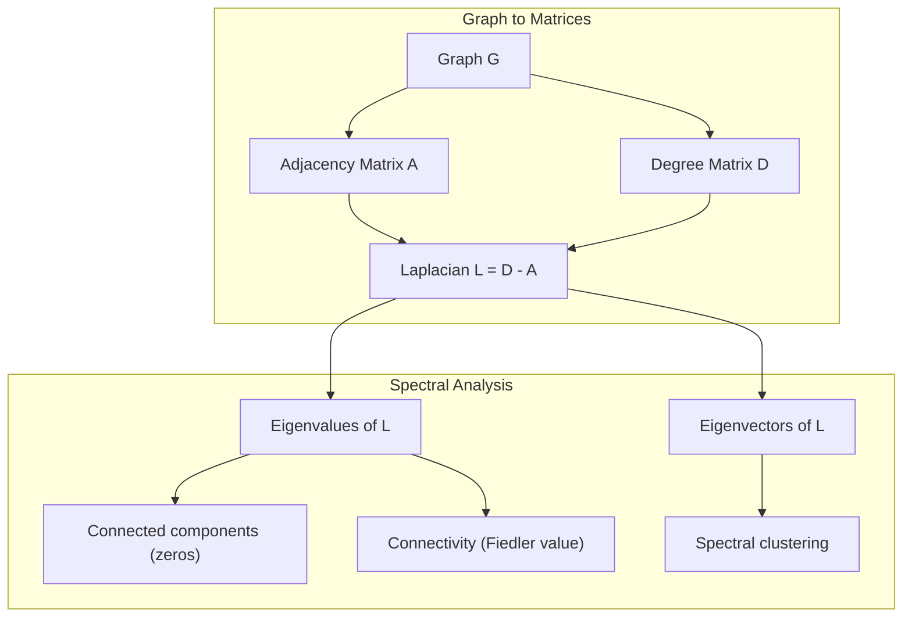
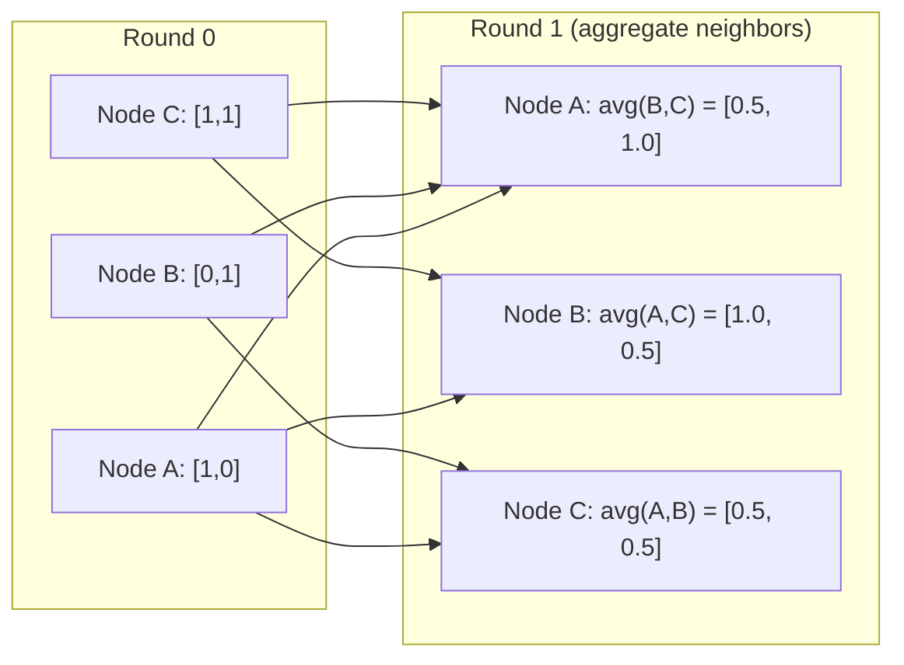

# 面向机器学习的图论

> 图是关系的数据结构。如果你的数据具有连接性，你就需要图论。

**类型：** 构建
**语言：** Python
**先决条件：** 阶段1，第01-03课（线性代数，矩阵）
**时间：** 约90分钟

## 学习目标

- 构建一个具有邻接矩阵/列表表示的图类，并实现BFS和DFS遍历
- 计算图拉普拉斯矩阵，并利用其特征值检测连通分量和聚类节点
- 实现一轮GNN风格的消息传递，作为归一化邻接矩阵乘法
- 应用谱聚类，利用费德勒向量来划分图

## 问题所在

社交网络、分子、知识库、引文网络、道路地图——所有这些都是图。传统机器学习将数据视为扁平的表格。每一行是独立的。每个特征是一列。但当连接的结构很重要时，表格就失效了。

考虑一个社交网络。你想预测用户会购买什么产品。他们的购买历史很重要。但他们朋友的购买历史更重要。连接传递着信号。

再考虑一个分子。你想预测它是否能与蛋白质结合。原子很重要，但真正重要的是原子之间是如何键合的。结构就是数据。

图神经网络是深度学习中增长最快的领域。它们推动了药物发现、社会推荐、欺诈检测和知识图谱推理。每一个GNN都建立在相同的基础之上：基本的图论。

你需要四样东西：
1. 一种将图表示为矩阵的方法（以便进行矩阵乘法）
2. 探索图结构的遍历算法
3. 拉普拉斯矩阵——谱图论中最重要的单一矩阵
4. 消息传递——使GNNs工作的核心操作

## 核心概念

### 图：节点和边

一个图 G = (V, E) 由顶点（节点）V 和边 E 组成。每条边连接两个节点。

**有向 vs 无向。** 在无向图中，边 (u, v) 意味着 u 连接到 v **并且** v 连接到 u。在有向图中，边 (u, v) 意味着 u 指向 v，但不一定反之。

**带权 vs 无权。** 在无权图中，边要么存在要么不存在。在带权图中，每条边有一个数值权重——距离、成本或强度。

| 图类型 | 示例 |
|-----------|---------|
| 无向、无权 | Facebook 好友网络 |
| 有向、无权 | Twitter 关注网络 |
| 无向、带权 | 道路地图（距离） |
| 有向、带权 | 网页链接（PageRank 分数） |

### 邻接矩阵

邻接矩阵 A 是核心表示。对于一个有 n 个节点的图：

```
A[i][j] = 1    if there is an edge from node i to node j
A[i][j] = 0    otherwise
```

对于无向图，A 是对称的：A[i][j] = A[j][i]。对于带权图，A[i][j] = 边 (i, j) 的权重。

**示例——一个三角形：**

```
Nodes: 0, 1, 2
Edges: (0,1), (1,2), (0,2)

A = [[0, 1, 1],
     [1, 0, 1],
     [1, 1, 0]]
```

邻接矩阵是每个GNN的输入。对 A 的矩阵运算对应于对图的操作。

### 度

节点的度是连接到它的边的数量。对于有向图，有入度（传入的边）和出度（传出的边）。

度矩阵 D 是对角矩阵：

```
D[i][i] = degree of node i
D[i][j] = 0    for i != j
```

对于三角形示例：D = diag(2, 2, 2)，因为每个节点都连接到其他两个节点。

度反映了节点的重要性。高度数 = 枢纽节点。网络的度分布揭示了其结构。社交网络遵循幂律分布（少数枢纽，多数叶节点）。随机图的度服从泊松分布。

### BFS 和 DFS

两种基本的图遍历算法。你两者都需要。

**广度优先搜索：** 先探索所有邻居，然后是邻居的邻居。使用队列（FIFO）。

```
BFS from node 0:
  Visit 0
  Queue: [1, 2]        (neighbors of 0)
  Visit 1
  Queue: [2, 3]        (add neighbors of 1)
  Visit 2
  Queue: [3]           (neighbors of 2 already visited)
  Visit 3
  Queue: []            (done)
```

BFS 在无权图中找到最短路径。从起点到任意节点的距离等于该节点首次被发现时的BFS层级。这就是为什么BFS用于社交网络中的跳数距离。

**深度优先搜索：** 尽可能深入，然后再回溯。使用栈（LIFO）或递归。

```
DFS from node 0:
  Visit 0
  Stack: [1, 2]        (neighbors of 0)
  Visit 2               (pop from stack)
  Stack: [1, 3]         (add neighbors of 2)
  Visit 3               (pop from stack)
  Stack: [1]
  Visit 1               (pop from stack)
  Stack: []             (done)
```

DFS 适用于：
- 查找连通分量（从未访问的节点运行DFS）
- 环检测（DFS树中的回边）
- 拓扑排序（DFS完成时间的逆序）

| 算法 | 数据结构 | 查找内容 | 用例 |
|-----------|---------------|-------|----------|
| BFS | 队列 | 最短路径 | 社交网络距离，知识图谱遍历 |
| DFS | 栈 | 分量，环 | 连通性，拓扑排序 |

### 图拉普拉斯矩阵

L = D - A。谱图论中最重要的矩阵。

对于三角形：

```
D = [[2, 0, 0],    A = [[0, 1, 1],    L = [[2, -1, -1],
     [0, 2, 0],         [1, 0, 1],         [-1, 2, -1],
     [0, 0, 2]]         [1, 1, 0]]         [-1, -1,  2]]
```

拉普拉斯矩阵具有显著的性质：

1.  **L 是半正定的。** 所有特征值都 >= 0。

2.  **零特征值的数量等于连通分量的数量。** 一个连通图恰好有一个零特征值。一个具有3个不连通分量的图有三个零特征值。

3.  **最小的非零特征值（费德勒值）衡量连通性。** 较大的费德勒值意味着图连通性良好。较小的费德勒值意味着图存在弱点——瓶颈。

4.  **费德勒值对应的特征向量（费德勒向量）揭示了最佳划分。** 正值节点归为一组，负值节点归为另一组。这就是谱聚类。



### 谱性质

邻接矩阵和拉普拉斯矩阵的特征值无需遍历即可揭示结构特性。

**谱聚类**的工作原理如下：
1. 计算拉普拉斯矩阵 L
2. 找到 L 的 k 个最小的特征向量（跳过第一个，在连通图中它通常是全1向量）
3. 将这些特征向量作为每个节点的新坐标
4. 在这些坐标上运行 k-means 聚类

这为什么有效？L 的特征向量编码了图上“最平滑”的函数。连接良好的节点具有相似的特征向量值。被瓶颈隔开的节点具有不同的值。特征向量自然地分隔了聚类。

**随机游走联系。** 归一化拉普拉斯矩阵与图上的随机游走相关。随机游走的平稳分布与节点度数成正比。混合时间（游走收敛的速度）取决于谱间隙。

### 消息传递

图神经网络的核心操作。每个节点从其邻居收集消息，聚合它们，并更新自己的状态。

```
h_v^(k+1) = UPDATE(h_v^(k), AGGREGATE({h_u^(k) : u in neighbors(v)}))
```

在最简单的形式中，聚合函数 AGGREGATE 是均值，更新函数 UPDATE 是线性变换 + 激活：

```
h_v^(k+1) = sigma(W * mean({h_u^(k) : u in neighbors(v)}))
```

这本质上是矩阵乘法。如果 H 是所有节点特征的矩阵，A 是邻接矩阵：

```
H^(k+1) = sigma(A_norm * H^(k) * W)
```

其中 A_norm 是归一化邻接矩阵（每行和为1）。

一轮消息传递让每个节点“看到”其直接邻居。两轮让它看到邻居的邻居。K 轮让每个节点获得其 K 跳邻域的信息。



### 概念与机器学习应用

| 概念 | 机器学习应用 |
|---------|---------------|
| 邻接矩阵 | GNN 输入表示 |
| 图拉普拉斯矩阵 | 谱聚类，社区检测 |
| BFS/DFS | 知识图谱遍历，路径查找 |
| 度分布 | 节点重要性，特征工程 |
| 消息传递 | GNN 层（GCN, GAT, GraphSAGE） |
| L 的特征值 | 社区检测，图划分 |
| 谱聚类 | 无监督节点分组 |
| PageRank | 节点重要性，网页搜索 |

## 动手构建

### 第1步：从头构建图类

```python
class Graph:
    def __init__(self, n_nodes, directed=False):
        self.n = n_nodes
        self.directed = directed
        self.adj = {i: {} for i in range(n_nodes)}

    def add_edge(self, u, v, weight=1.0):
        self.adj[u][v] = weight
        if not self.directed:
            self.adj[v][u] = weight

    def neighbors(self, node):
        return list(self.adj[node].keys())

    def degree(self, node):
        return len(self.adj[node])

    def adjacency_matrix(self):
        import numpy as np
        A = np.zeros((self.n, self.n))
        for u in range(self.n):
            for v, w in self.adj[u].items():
                A[u][v] = w
        return A

    def degree_matrix(self):
        import numpy as np
        D = np.zeros((self.n, self.n))
        for i in range(self.n):
            D[i][i] = self.degree(i)
        return D

    def laplacian(self):
        return self.degree_matrix() - self.adjacency_matrix()
```

邻接表（`self.adj`）高效地存储邻居。邻接矩阵转换使用numpy，因为所有谱操作都需要它。

### 第2步：BFS 和 DFS

```python
from collections import deque

def bfs(graph, start):
    visited = set()
    order = []
    distances = {}
    queue = deque([(start, 0)])
    visited.add(start)
    while queue:
        node, dist = queue.popleft()
        order.append(node)
        distances[node] = dist
        for neighbor in graph.neighbors(node):
            if neighbor not in visited:
                visited.add(neighbor)
                queue.append((neighbor, dist + 1))
    return order, distances


def dfs(graph, start):
    visited = set()
    order = []
    stack = [start]
    while stack:
        node = stack.pop()
        if node in visited:
            continue
        visited.add(node)
        order.append(node)
        for neighbor in reversed(graph.neighbors(node)):
            if neighbor not in visited:
                stack.append(neighbor)
    return order
```

BFS 使用 deque（双端队列）以实现 O(1) 的 popleft 操作。DFS 使用列表作为栈。两者都精确地访问每个节点一次——时间复杂度 O(V + E)。

### 第3步：连通分量与拉普拉斯特征值

```python
def connected_components(graph):
    visited = set()
    components = []
    for node in range(graph.n):
        if node not in visited:
            order, _ = bfs(graph, node)
            visited.update(order)
            components.append(order)
    return components


def laplacian_eigenvalues(graph):
    import numpy as np
    L = graph.laplacian()
    eigenvalues = np.linalg.eigvalsh(L)
    return eigenvalues
```

`eigvalsh` 适用于对称矩阵——对于无向图，拉普拉斯矩阵总是对称的。它返回升序排列的特征值。计算零值的数量以找到连通分量的数量。

### 第4步：谱聚类

```python
def spectral_clustering(graph, k=2):
    import numpy as np
    L = graph.laplacian()
    eigenvalues, eigenvectors = np.linalg.eigh(L)
    features = eigenvectors[:, 1:k+1]

    labels = np.zeros(graph.n, dtype=int)
    for i in range(graph.n):
        if features[i, 0] >= 0:
            labels[i] = 0
        else:
            labels[i] = 1
    return labels
```

对于 k=2，费德勒向量的符号将图划分为两个聚类。对于 k>2，你需要在前 k 个特征向量（排除平凡的全1特征向量）上运行 k-means。

### 第5步：消息传递

```python
def message_passing(graph, features, weight_matrix):
    import numpy as np
    A = graph.adjacency_matrix()
    row_sums = A.sum(axis=1, keepdims=True)
    row_sums[row_sums == 0] = 1
    A_norm = A / row_sums
    aggregated = A_norm @ features
    output = aggregated @ weight_matrix
    return output
```

这是一轮GNN消息传递。每个节点的新特征是其邻居特征的加权平均，由权重矩阵变换。叠加多轮以将信息传播得更远。

## 实际应用

使用 networkx 和 numpy，相同的操作只需一行代码：

```python
import networkx as nx
import numpy as np

G = nx.karate_club_graph()

A = nx.adjacency_matrix(G).toarray()
L = nx.laplacian_matrix(G).toarray()

eigenvalues = np.linalg.eigvalsh(L.astype(float))
print(f"Smallest eigenvalues: {eigenvalues[:5]}")
print(f"Connected components: {nx.number_connected_components(G)}")

communities = nx.community.greedy_modularity_communities(G)
print(f"Communities found: {len(communities)}")

pr = nx.pagerank(G)
top_nodes = sorted(pr.items(), key=lambda x: x[1], reverse=True)[:5]
print(f"Top 5 PageRank nodes: {top_nodes}")
```

networkx 使用优化的 C 后端处理任意规模的图。在生产环境中使用它。使用你从头实现的代码来理解其工作原理。

### numpy 谱分析

```python
import numpy as np

A = np.array([
    [0, 1, 1, 0, 0],
    [1, 0, 1, 0, 0],
    [1, 1, 0, 1, 0],
    [0, 0, 1, 0, 1],
    [0, 0, 0, 1, 0]
])

D = np.diag(A.sum(axis=1))
L = D - A

eigenvalues, eigenvectors = np.linalg.eigh(L)
print(f"Eigenvalues: {np.round(eigenvalues, 4)}")
print(f"Fiedler value: {eigenvalues[1]:.4f}")
print(f"Fiedler vector: {np.round(eigenvectors[:, 1], 4)}")

fiedler = eigenvectors[:, 1]
group_a = np.where(fiedler >= 0)[0]
group_b = np.where(fiedler < 0)[0]
print(f"Cluster A: {group_a}")
print(f"Cluster B: {group_b}")
```

费德勒向量承担了繁重的工作。正值在一个聚类，负值在另一个。无需迭代优化——只需一次特征分解。

## 交付成果

本课产生：
- `outputs/skill-graph-analysis.md` —— 分析图结构数据的技能参考

## 知识关联

| 概念 | 出现之处 |
|---------|------------------|
| 邻接矩阵 | GCN, GAT, GraphSAGE 输入 |
| 拉普拉斯矩阵 | 谱聚类，ChebNet 滤波器 |
| BFS | 知识图谱遍历，最短路径查询 |
| 消息传递 | 每一个GNN层，神经消息传递 |
| 谱间隙 | 图连通性，随机游走混合时间 |
| 度分布 | 幂律网络，节点特征工程 |
| 连通分量 | 预处理，处理不连通图 |
| PageRank | 节点重要性排序，注意力初始化 |

GNN 值得特别一提。GCN（Kipf & Welling, 2017）中的图卷积操作使用添加了自环的邻接矩阵，A_hat = A + I：

```text
H^(l+1) = sigma(D_hat^(-1/2) * A_hat * D_hat^(-1/2) * H^(l) * W^(l))
```

其中 A_hat = A + I（邻接矩阵加自环），D_hat 是 A_hat 的度矩阵。自环确保每个节点在聚合期间包含自己的特征。这正是对称归一化的消息传递。D_hat^(-1/2) * A_hat * D_hat^(-1/2) 是归一化邻接矩阵。拉普拉斯矩阵出现是因为这种归一化与 L_sym = I - D^(-1/2) * A * D^(-1/2) 相关。理解拉普拉斯矩阵意味着理解为什么GCN有效。

## 练习

1.  **从头实现 PageRank。** 从均匀分数开始。每一步：score(v) = (1-d)/n + d * sum(score(u)/out_degree(u))，对所有指向 v 的 u。使用 d=0.85。运行直到收敛（变化 < 1e-6）。在一个小型网页图上测试。

2.  **使用谱聚类查找社区。** 创建一个有两个明显分离的聚类的图（例如，两个团通过一条边连接）。运行谱聚类并验证它找到了正确的划分。当你添加更多跨聚类边时会发生什么？

3.  **实现 Dijkstra 算法** 用于带权图的最短路径。将结果与同一图上具有均匀权重的 BFS 结果进行比较。

4.  **构建一个2层消息传递网络。** 使用不同的权重矩阵应用两次消息传递。证明经过2轮后，每个节点都获得了其2跳邻域的信息。

5.  **分析一个真实世界的图。** 使用空手道俱乐部图（34个节点，78条边）。计算度分布、拉普拉斯特征值和谱聚类。将谱聚类结果与已知的真实划分进行比较。

## 关键术语

| 术语 | 人们怎么说 | 它的实际含义 |
|------|----------------|----------------------|
| 图 | "节点和边" | 一个编码成对关系的数学结构 G=(V,E) |
| 邻接矩阵 | "连接表" | 一个 n x n 矩阵，如果节点 i 和 j 相连，则 A[i][j] = 1 |
| 度 | "节点连接程度" | 接触到一个节点的边的数量 |
| 拉普拉斯矩阵 | "D 减 A" | L = D - A，其特征值揭示图结构的矩阵 |
| 费德勒值 | "代数连通性" | L 的最小非零特征值，衡量图的连通程度 |
| BFS | "逐层搜索" | 先访问所有邻居再深入的遍历，找到最短路径 |
| DFS | "深度优先" | 沿一条路径走到底再回溯的遍历 |
| 消息传递 | "节点与邻居对话" | 每个节点聚合来自邻居的信息，GNN的核心 |
| 谱聚类 | "通过特征向量聚类" | 使用其拉普拉斯矩阵的特征向量划分图 |
| 连通分量 | "一个独立的部分" | 一个极大子图，其中每个节点都能到达其他任何节点 |

## 扩展阅读

- **Kipf & Welling (2017)** —— "Graph Convolutional Networks for Semi-Supervised Classification." 开启现代GNNs的论文。表明谱图卷积可简化为消息传递。
- **Spielman (2012)** —— "Spectral Graph Theory" 讲义。关于拉普拉斯矩阵、谱间隙和图划分的权威介绍。
- **Hamilton (2020)** —— "Graph Representation Learning." 涵盖GNNs从基础到应用的书籍。
- **Bronstein et al. (2021)** —— "Geometric Deep Learning: Grids, Groups, Graphs, Geodesics, and Gauges." 统一框架论文。
- **Veličković et al. (2018)** —— "Graph Attention Networks." 使用注意力机制扩展消息传递。