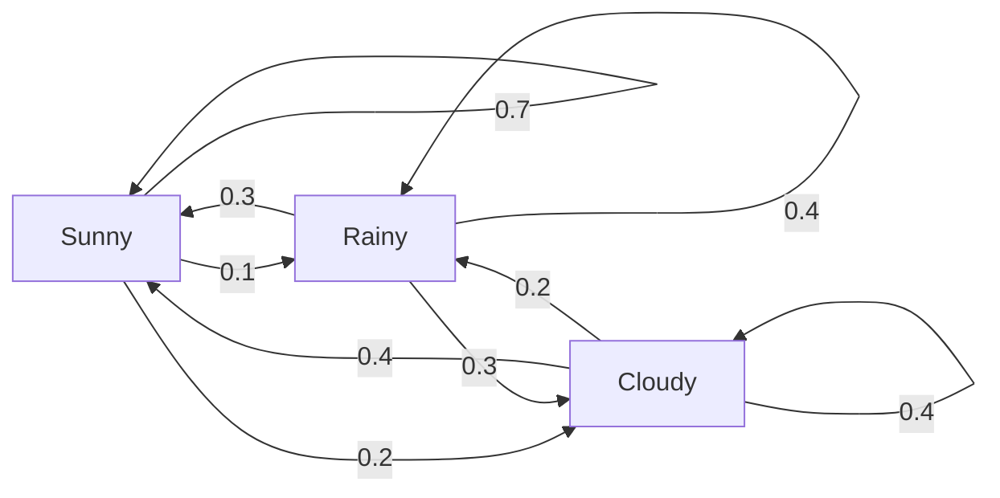
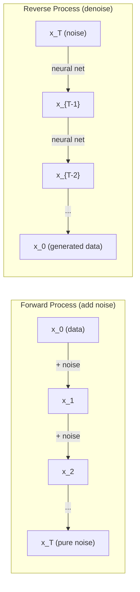

# 随机过程

> 具有结构性的随机性。随机游走、马尔可夫链和扩散模型背后的数学。

**类型:** 学习
**语言:** Python
**先修要求:** 第1阶段，第06-07课（概率论，贝叶斯）
**时间:** 约75分钟

## 学习目标

- 模拟一维和二维随机游走，并验证位移的平方根(n)缩放规律
- 构建马尔可夫链模拟器，并通过特征分解计算其平稳分布
- 实现Metropolis-Hastings MCMC和朗之万动力学，用于从目标分布中采样
- 将前向扩散过程与布朗运动联系起来，并解释反向过程如何生成数据

## 问题描述

许多AI系统都涉及随时间演变的随机性。不是静态的随机——而是有结构的、顺序的随机性，每一步都依赖于前一步。

语言模型逐个生成token。每个token都依赖于之前的上下文。模型输出一个概率分布，从中采样，然后继续。这是一个随机过程。

扩散模型逐步向图像添加噪声，直到它变成纯静态。然后他们逆转这个过程，逐步去噪，直到出现一张新图像。前向过程是一个马尔可夫链。反向过程是一个学习到的马尔可夫链反向运行。

强化学习智能体在环境中采取行动。每个行动都以某种概率导致一个新状态。智能体在一个随机世界中遵循随机策略。整个过程是一个马尔可夫决策过程。

MCMC采样——贝叶斯推理的支柱——构建一个马尔可夫链，其平稳分布正是你想要采样的后验分布。

所有这些都建立在四个基本思想上：
1. 随机游走——最简单的随机过程
2. 马尔可夫链——具有转移矩阵的结构性随机性
3. 朗之万动力学——带噪声的梯度下降
4. Metropolis-Hastings——从任意分布中采样

## 核心概念

### 随机游走

从位置0开始。每一步，抛一枚公平硬币。正面：向右移动(+1)。反面：向左移动(-1)。

经过n步后，你的位置是n个随机+/-1值的和。期望位置是0（游走是无偏的）。但离原点的期望距离以sqrt(n)增长。

这有违直觉。游走是公平的——没有向任一方向的漂移。但随着时间推移，它会离起点越来越远。n步后的标准差是sqrt(n)。

```
Step 0:  Position = 0
Step 1:  Position = +1 or -1
Step 2:  Position = +2, 0, or -2
...
Step 100: Expected distance from origin ~ 10 (sqrt(100))
Step 10000: Expected distance from origin ~ 100 (sqrt(10000))
```

**在2D中**，游走向上、下、左、右移动的概率相等。同样的sqrt(n)缩放规律适用于离原点的距离。路径描绘出一种分形般的图案。

**为什么是sqrt(n)?** 每一步是+1或-1，概率相等。n步后，位置S_n = X_1 + X_2 + ... + X_n，其中每个X_i是+/-1。每一步的方差是1，且各步独立，因此Var(S_n) = n。标准差 = sqrt(n)。根据中心极限定理，S_n / sqrt(n) 收敛于标准正态分布。

这种sqrt(n)缩放规律在机器学习中无处不在。SGD噪声缩放为1/sqrt(batch_size)。嵌入维度缩放为sqrt(d)。平方根是独立随机加法的标志。

**与布朗运动的联系。** 取一个步长为1/sqrt(n)、每单位时间有n步的随机游走。当n趋于无穷大时，该游走收敛于布朗运动B(t)——一个连续时间过程，其中B(t)服从均值为0、方差为t的正态分布。

布朗运动是扩散的数学基础。它模拟了流体中粒子的随机抖动、股票价格的波动，以及——至关重要地——扩散模型中的噪声过程。

**赌徒破产问题。** 一个随机游走者从位置k出发，在0和N处有吸收屏障。在到达0之前到达N的概率是多少？对于公平游走：P(到达N) = k/N。这非常简单优雅。它与鞅理论相关——公平的随机游走是一个鞅（期望的未来值=当前值）。

### 马尔可夫链

马尔可夫链是一个根据固定概率在状态之间转移的系统。关键属性：下一个状态仅取决于当前状态，与历史无关。

```
P(X_{t+1} = j | X_t = i, X_{t-1} = ...) = P(X_{t+1} = j | X_t = i)
```

这就是马尔可夫性质。这意味着你可以用一个转移矩阵P来描述整个动态：

```
P[i][j] = probability of going from state i to state j
```

P的每一行之和为1（你必须去往某处）。

**示例——天气：**

```
States: Sunny (0), Rainy (1), Cloudy (2)

P = [[0.7, 0.1, 0.2],    (if sunny: 70% sunny, 10% rainy, 20% cloudy)
     [0.3, 0.4, 0.3],    (if rainy: 30% sunny, 40% rainy, 30% cloudy)
     [0.4, 0.2, 0.4]]    (if cloudy: 40% sunny, 20% rainy, 40% cloudy)
```

从任何状态开始。经过多次转移后，状态的分布收敛于平稳分布π，其中π * P = π。这是P的对应特征值为1的左特征向量。

对于天气链，平稳分布可能是[0.53, 0.18, 0.29]——从长远来看，无论起始状态如何，53%的时间是晴天。



**计算平稳分布。** 有两种方法：

1. **幂法**：将任意初始分布反复乘以P。经过足够迭代后，它会收敛。
2. **特征值法**：找到P的对应特征值为1的左特征向量。即P^T的对应特征值为1的特征向量。

两种方法都要求链满足收敛条件。

**收敛条件。** 如果马尔可夫链满足以下条件，则收敛到唯一的平稳分布：
- **不可约**：每个状态都可以从任何其他状态到达
- **非周期性**：链不会以固定周期循环

你在机器学习中遇到的大多数链都满足这两个条件。

**吸收状态。** 如果一个状态一旦进入就永远不会离开（P[i][i] = 1），则该状态是吸收状态。吸收马尔可夫链模拟具有终止状态的过程——结束的游戏、流失的客户、到达文本结束token的序列。

**混合时间。** 需要多少步，链才会“接近”平稳分布？正式地说，是直到总变差距离低于某个阈值的步数。混合速度快 = 需要的步数少。P的谱间隙（1减去第二大特征值）控制混合时间。间隙越大 = 混合越快。

### 与语言模型的联系

语言模型中的token生成近似于一个马尔可夫过程。给定当前上下文，模型输出下一个token的分布。温度控制锐度：

```
P(token_i) = exp(logit_i / temperature) / sum(exp(logit_j / temperature))
```

- 温度 = 1.0：标准分布
- 温度 < 1.0：更锐利（更确定性）
- 温度 > 1.0：更平坦（更随机）
- 温度 -> 0：argmax（贪心）

Top-k采样截断到概率最高的k个token。Top-p（核）采样截断到累积概率超过p的最小token集。两者都修改了马尔可夫转移概率。

### 布朗运动

随机游走的连续时间极限。位置B(t)具有三个性质：
1. B(0) = 0
2. B(t) - B(s) 服从均值为0、方差为t - s的正态分布（对于t > s）
3. 不重叠区间上的增量是独立的

布朗运动是连续的，但处处不可微——它在每个尺度上都在抖动。路径在平面上的分形维度为2。

在离散模拟中，你通过以下方式近似布朗运动：

```
B(t + dt) = B(t) + sqrt(dt) * z,    where z ~ N(0, 1)
```

sqrt(dt)的缩放很重要。它来自于应用于随机游走的中心极限定理。

### 朗之万动力学

梯度下降找到函数的最小值。朗之万动力学找到与exp(-U(x)/T)成正比的概率分布，其中U是能量函数，T是温度。

```
x_{t+1} = x_t - dt * gradient(U(x_t)) + sqrt(2 * T * dt) * z_t
```

两个力作用在粒子上：
1. **梯度力** (-dt * gradient(U))：推向低能量区域（类似于梯度下降）
2. **随机力** (sqrt(2*T*dt) * z)：向随机方向推动（探索）

在温度T=0时，这是纯梯度下降。在高温时，它几乎是随机游走。在合适的温度下，粒子探索能量景观，并在低能量区域停留更长时间。

**与扩散模型的联系。** 扩散模型的前向过程是：

```
x_t = sqrt(alpha_t) * x_{t-1} + sqrt(1 - alpha_t) * noise
```

这是一个逐渐将数据与噪声混合的马尔可夫链。经过足够多步后，x_T是纯高斯噪声。

反向过程——从噪声回到数据——也是一个马尔可夫链，但其转移概率由神经网络学习。网络学习预测每一步添加的噪声，然后减去它。



### MCMC：马尔可夫链蒙特卡洛

有时你需要从一个可以计算（最多相差一个常数）但无法直接采样的分布p(x)中采样。贝叶斯后验是经典的例子——你知道似然乘以先验，但归一化常数难以处理。

**Metropolis-Hastings** 构建一个平稳分布为p(x)的马尔可夫链：

1. 从某个位置x开始
2. 从提议分布Q(x'|x)提出一个新位置x'
3. 计算接受比率：a = p(x') * Q(x|x') / (p(x) * Q(x'|x))
4. 以概率min(1, a)接受x'。否则留在x。
5. 重复。

如果Q是对称的（例如，Q(x'|x) = Q(x|x') = N(x, sigma^2)），则比率简化为a = p(x') / p(x)。你只需要概率之比——归一化常数消掉了。

该链在温和条件下保证收敛到p(x)。但如果提议太小（随机游走）或太大（高拒绝率），收敛可能会很慢。调整提议是MCMC的艺术。

**为什么有效。** 接受比率确保了细致平衡：处于x并移动到x'的概率等于处于x'并移动到x的概率。细致平衡意味着p(x)是链的平稳分布。因此，经过足够多步后，样本来自p(x)。

**实际考虑：**
- **预烧期**：丢弃前N个样本。链需要时间从其起始点到达平稳分布。
- **细化**：每隔k个样本保留一个，以减少自相关。
- **多链**：从不同起点运行几条链。如果它们收敛到同一个分布，你就有了收敛的证据。
- **接受率**：对于d维高斯提议，最佳接受率约为23%（Roberts & Rosenthal, 2001）。太高意味着链几乎不动。太低意味着它拒绝一切。

### AI中的随机过程

| 过程 | AI应用 |
|------|--------|
| 随机游走 | 强化学习中的探索，Node2Vec嵌入 |
| 马尔可夫链 | 文本生成，MCMC采样 |
| 布朗运动 | 扩散模型（前向过程） |
| 朗之万动力学 | 基于分数的生成模型，SGLD |
| 马尔可夫决策过程 | 强化学习 |
| Metropolis-Hastings | 贝叶斯推理，后验采样 |

## 构建实现

### 步骤1：随机游走模拟器

```python
import numpy as np

def random_walk_1d(n_steps, seed=None):
    rng = np.random.RandomState(seed)
    steps = rng.choice([-1, 1], size=n_steps)
    positions = np.concatenate([[0], np.cumsum(steps)])
    return positions


def random_walk_2d(n_steps, seed=None):
    rng = np.random.RandomState(seed)
    directions = rng.choice(4, size=n_steps)
    dx = np.zeros(n_steps)
    dy = np.zeros(n_steps)
    dx[directions == 0] = 1   # right
    dx[directions == 1] = -1  # left
    dy[directions == 2] = 1   # up
    dy[directions == 3] = -1  # down
    x = np.concatenate([[0], np.cumsum(dx)])
    y = np.concatenate([[0], np.cumsum(dy)])
    return x, y
```

一维游走存储累积和。每一步是+1或-1。n步后，位置是总和。方差随n线性增长，因此标准差随sqrt(n)增长。

### 步骤2：马尔可夫链

```python
class MarkovChain:
    def __init__(self, transition_matrix, state_names=None):
        self.P = np.array(transition_matrix, dtype=float)
        self.n_states = len(self.P)
        self.state_names = state_names or [str(i) for i in range(self.n_states)]

    def step(self, current_state, rng=None):
        if rng is None:
            rng = np.random.RandomState()
        probs = self.P[current_state]
        return rng.choice(self.n_states, p=probs)

    def simulate(self, start_state, n_steps, seed=None):
        rng = np.random.RandomState(seed)
        states = [start_state]
        current = start_state
        for _ in range(n_steps):
            current = self.step(current, rng)
            states.append(current)
        return states

    def stationary_distribution(self):
        eigenvalues, eigenvectors = np.linalg.eig(self.P.T)
        idx = np.argmin(np.abs(eigenvalues - 1.0))
        stationary = np.real(eigenvectors[:, idx])
        stationary = stationary / stationary.sum()
        return np.abs(stationary)
```

平稳分布是P的对应特征值为1的左特征向量。我们通过计算P^T的特征向量来找到它（转置将左特征向量转化为右特征向量）。

### 步骤3：朗之万动力学

```python
def langevin_dynamics(grad_U, x0, dt, temperature, n_steps, seed=None):
    rng = np.random.RandomState(seed)
    x = np.array(x0, dtype=float)
    trajectory = [x.copy()]
    for _ in range(n_steps):
        noise = rng.randn(*x.shape)
        x = x - dt * grad_U(x) + np.sqrt(2 * temperature * dt) * noise
        trajectory.append(x.copy())
    return np.array(trajectory)
```

梯度将x推向低能量区域。噪声防止其陷入局部。在平衡状态下，样本的分布与exp(-U(x)/temperature)成正比。

### 步骤4：Metropolis-Hastings

```python
def metropolis_hastings(target_log_prob, proposal_std, x0, n_samples, seed=None):
    rng = np.random.RandomState(seed)
    x = np.array(x0, dtype=float)
    samples = [x.copy()]
    accepted = 0
    for _ in range(n_samples - 1):
        x_proposed = x + rng.randn(*x.shape) * proposal_std
        log_ratio = target_log_prob(x_proposed) - target_log_prob(x)
        if np.log(rng.rand()) < log_ratio:
            x = x_proposed
            accepted += 1
        samples.append(x.copy())
    acceptance_rate = accepted / (n_samples - 1)
    return np.array(samples), acceptance_rate
```

该算法提议一个新点，检查它是否具有更高的概率（或以与比率成正比的概率接受），然后重复。为了良好的混合，接受率应在23-50%左右。

## 应用实践

在实践中，你为这些算法使用成熟的库。但理解其机制对于调试和调优很重要。

```python
import numpy as np

rng = np.random.RandomState(42)
walk = np.cumsum(rng.choice([-1, 1], size=10000))
print(f"Final position: {walk[-1]}")
print(f"Expected distance: {np.sqrt(10000):.1f}")
print(f"Actual distance: {abs(walk[-1])}")
```

### numpy用于转移矩阵

```python
import numpy as np

P = np.array([[0.7, 0.1, 0.2],
              [0.3, 0.4, 0.3],
              [0.4, 0.2, 0.4]])

distribution = np.array([1.0, 0.0, 0.0])
for _ in range(100):
    distribution = distribution @ P

print(f"Stationary distribution: {np.round(distribution, 4)}")
```

将初始分布反复乘以P。经过足够迭代后，无论你从哪里开始，它都收敛于平稳分布。这是求主左特征向量的幂法。

### 与真实框架的联系

- **PyTorch diffusion:** Hugging Face `diffusers` 中的 `DDPMScheduler` 实现了前向和反向马尔可夫链
- **NumPyro / PyMC:** 使用MCMC（NUTS采样器，改进了Metropolis-Hastings）进行贝叶斯推理
- **Gymnasium (RL):** 环境步函数定义了一个马尔可夫决策过程

### 验证马尔可夫链收敛

```python
import numpy as np

P = np.array([[0.9, 0.1], [0.3, 0.7]])

eigenvalues = np.linalg.eigvals(P)
spectral_gap = 1 - sorted(np.abs(eigenvalues))[-2]
print(f"Eigenvalues: {eigenvalues}")
print(f"Spectral gap: {spectral_gap:.4f}")
print(f"Approximate mixing time: {1/spectral_gap:.1f} steps")
```

谱间隙告诉你链忘记其初始状态的速度。0.2的间隙意味着大约需要5步混合。0.01的间隙意味着大约需要100步。在运行长模拟之前务必检查这一点——混合缓慢的链会浪费计算资源。

## 产出成果

本课产出：
- `outputs/prompt-stochastic-process-advisor.md` — 一个提示，帮助识别给定问题适用哪个随机过程框架

## 知识联系

| 概念 | 体现之处 |
|------|----------|
| 随机游走 | Node2Vec图嵌入，强化学习中的探索 |
| 马尔可夫链 | 大语言模型中的token生成，MCMC采样 |
| 布朗运动 | DDPM中的前向扩散过程，基于SDE的模型 |
| 朗之万动力学 | 基于分数的生成模型，随机梯度朗之万动力学 (SGLD) |
| 平稳分布 | MCMC收敛目标，PageRank |
| Metropolis-Hastings | 贝叶斯后验采样，模拟退火 |
| 温度 | 大语言模型采样，强化学习中的玻尔兹曼探索，模拟退火 |
| 混合时间 | MCMC的收敛速度，谱间隙分析 |
| 吸收状态 | 序列结束token，强化学习中的终止状态 |
| 细致平衡 | MCMC采样器的正确性保证 |

扩散模型值得特别关注。DDPM (Ho et al., 2020) 定义了一个前向马尔可夫链：

```
q(x_t | x_{t-1}) = N(x_t; sqrt(1-beta_t) * x_{t-1}, beta_t * I)
```

其中beta_t是一个噪声调度。经过T步后，x_T近似服从N(0, I)。反向过程由一个预测噪声的神经网络参数化：

```
p_theta(x_{t-1} | x_t) = N(x_{t-1}; mu_theta(x_t, t), sigma_t^2 * I)
```

生成的每一步都是一个学习到的马尔可夫链中的一步。理解马尔可夫链意味着理解扩散模型如何以及为何生成数据。

SGLD（随机梯度朗之万动力学）将小批量梯度下降与朗之万噪声相结合。不是计算完整梯度，而是使用随机估计并添加校准的噪声。随着学习率衰减，SGLD从优化过渡到采样——你免费获得了近似的贝叶斯后验样本。这是从神经网络获得不确定性估计的最简单方法之一。

贯穿所有这些联系的关键洞察：随机过程不仅仅是理论工具。它们是现代AI系统内部的计算机制。当你调优大语言模型的温度时，你正在调整一个马尔可夫链。当你训练扩散模型时，你正在学习逆转一个类似布朗运动的过程。当你运行贝叶斯推理时，你正在构建一个收敛到后验的链。

## 练习

1. **模拟1000次步长为10000的随机游走。** 绘制最终位置的分布图。验证其近似为均值0、标准差sqrt(10000) = 100的高斯分布。

2. **使用马尔可夫链构建文本生成器。** 在一个小型语料库上训练：对于每个单词，统计到下一个单词的转移。构建转移矩阵。通过从链中采样生成新句子。

3. **使用Metropolis-Hastings实现模拟退火。** 从高温开始（几乎接受所有状态），然后逐渐冷却（只接受改进）。用它来寻找具有许多局部极小值的函数的最小值。

4. **比较不同温度下的朗之万动力学。** 从双井势能U(x) = (x^2 - 1)^2中采样。在低温下，样本聚集在一个井中。在高温下，它们分布在两个井中。找到链在两个井之间混合的临界温度。

5. **实现前向扩散过程。** 从一个一维信号开始（例如正弦波）。使用线性噪声调度，在100步内逐步添加噪声。展示信号如何退化为纯噪声。然后实现一个简单的去噪器来逆转这个过程（甚至是一个只是减去估计噪声的朴素去噪器）。

## 关键术语

| 术语 | 常见说法 | 实际含义 |
|------|----------|----------|
| 随机游走 | "抛硬币移动" | 一个位置在每一步根据随机增量变化的过程 |
| 马尔可夫性质 | "无记忆性" | 未来仅取决于当前状态，与历史无关 |
| 转移矩阵 | "概率表" | P[i][j] = 从状态i转移到状态j的概率 |
| 平稳分布 | "长期平均" | 满足π*P = π的分布π——链的均衡状态 |
| 布朗运动 | "随机抖动" | 随机游走的连续时间极限，B(t) ~ N(0, t) |
| 朗之万动力学 | "带噪声的梯度下降" | 结合确定性梯度和随机扰动的更新规则 |
| MCMC | "走向目标" | 构建一个平稳分布为你所需分布的马尔可夫链 |
| Metropolis-Hastings | "提议并接受/拒绝" | 使用接受比率确保收敛的MCMC算法 |
| 温度 | "随机性旋钮" | 控制探索与利用权衡的参数 |
| 扩散过程 | "噪声进，噪声出" | 前向：逐渐添加噪声。反向：逐渐去除噪声。生成数据。 |

## 延伸阅读

- **Ho, Jain, Abbeel (2020)** -- "Denoising Diffusion Probabilistic Models." 引发扩散模型革命的DDPM论文。清晰地推导了前向和反向马尔可夫链。
- **Song & Ermon (2019)** -- "Generative Modeling by Estimating Gradients of the Data Distribution." 使用朗之万动力学进行采样的基于分数的方法。
- **Roberts & Rosenthal (2004)** -- "General state space Markov chains and MCMC algorithms." MCMC何时以及为何有效的理论基础。
- **Norris (1997)** -- "Markov Chains." 标准教科书。涵盖收敛、平稳分布和命中时间。
- **Welling & Teh (2011)** -- "Bayesian Learning via Stochastic Gradient Langevin Dynamics." 将SGD与朗之万动力学相结合，实现可扩展的贝叶斯推理。