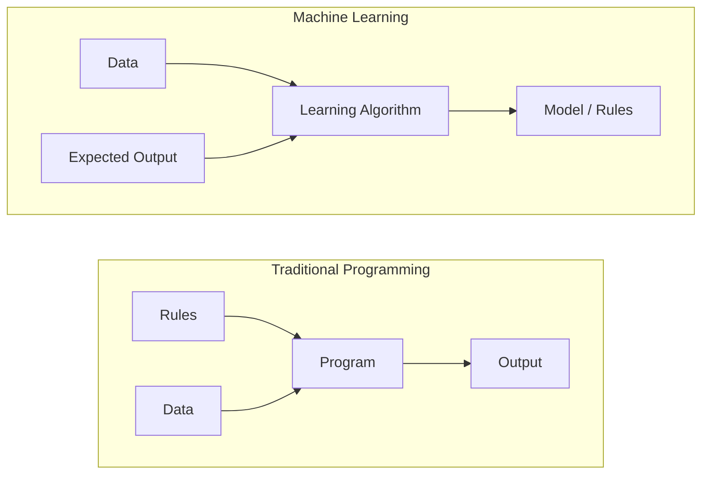
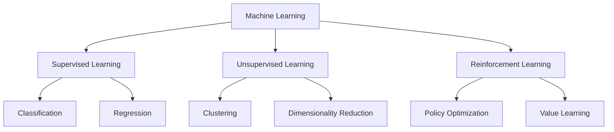
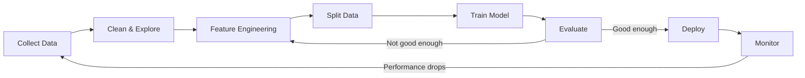
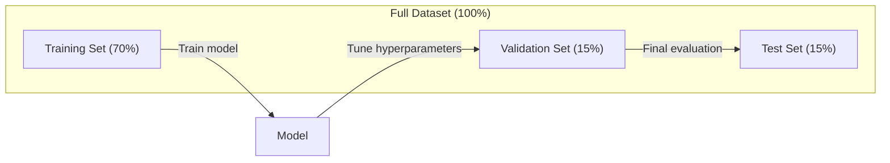
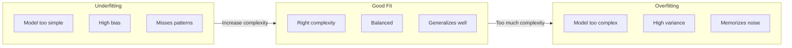
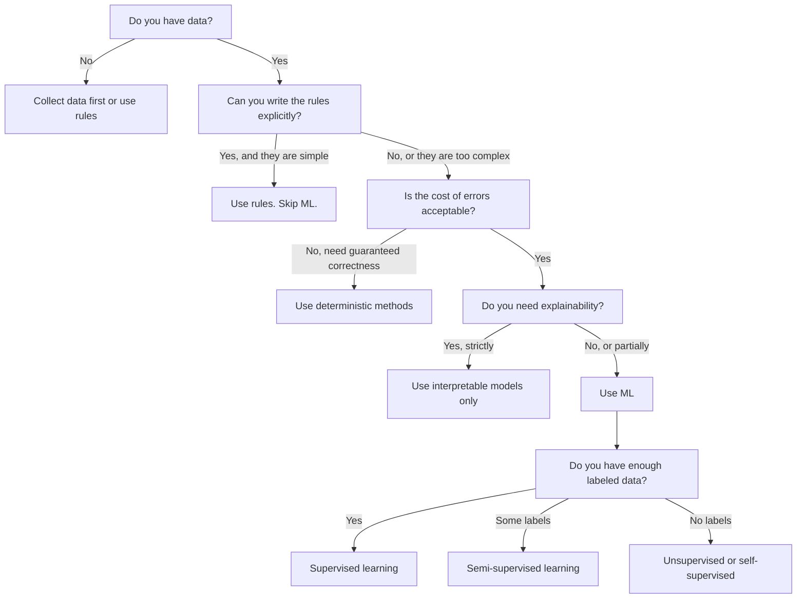

# 什么是机器学习

> 机器学习是教会计算机从数据中发现规律，而非手动编写规则。

**类型：** 学习
**语言：** Python
**先决条件：** 阶段 1（数学基础）
**时间：** ~45 分钟

## 学习目标

- 解释监督学习、无监督学习和强化学习之间的区别，并能识别给定问题属于哪种类型
- 从头实现一个最近质心分类器，并与随机基线进行评估
- 区分分类和回归任务，并为每种任务选择合适的损失函数
- 评估给定的业务问题是否适合使用机器学习，还是用确定性规则解决更佳

## 问题所在

你想构建一个垃圾邮件过滤器。传统方法是：坐下来编写数百条规则。“如果邮件包含‘免费送钱’，就标记为垃圾邮件。如果超过3个感叹号，就标记为垃圾邮件。”你花几周时间编写规则。然后，垃圾邮件发送者改变了措辞。你的规则失效了。你编写更多规则。这个循环永无止境。

机器学习颠覆了这种方式。你不用编写规则，而是给计算机数千封标记好的邮件（“垃圾邮件”或“非垃圾邮件”），让它自己找出规则。计算机能找到你从未想到过的规律。当垃圾邮件发送者改变策略时，你只需在新数据上重新训练，而不是重写代码。

从“编写规则”到“从数据学习”的这种转变，是机器学习的核心。每个推荐引擎、语音助手、自动驾驶汽车和语言模型都是这样工作的。

## 概念

### 从数据而非规则中学习

传统编程和机器学习以相反的方式解决问题。



传统编程：你编写规则。程序将规则应用于数据以产生输出。
机器学习：你提供数据和期望的输出。算法自动发现规则。

训练过程中产生的“模型”就是规则本身，它以数字（权重、参数）形式编码。它从已见的示例中泛化，以便对未见过的数据做出预测。

### 机器学习的三种类型



**监督学习**：你拥有输入-输出对。模型学习将输入映射到输出。
- “这里有 10,000 张标有‘猫’或‘狗’的照片。学习区分它们。”
- “这里有房屋特征和价格。学习预测价格。”

**无监督学习**：你只有输入，没有标签。模型自行发现结构。
- “这里有 10,000 位客户的购买记录。找出自然分组。”
- “这里有 1,000 个维度的数据点。在保留结构的同时降到 2 维。”

**强化学习**：一个智能体在环境中执行动作，并接收奖励或惩罚。它学习一种策略（策略）以最大化总奖励。
- “玩这个游戏。赢了 +1，输了 -1。想出一个策略。”
- “控制这个机械臂。拿起物体 +1，每浪费一秒 -0.01。”

你实际构建的大部分内容使用监督学习。无监督学习常用于预处理和探索。强化学习驱动游戏 AI、机器人技术以及用于语言模型的 RLHF。

### 超越三大类

上面的三个分类很清晰，但现实世界的机器学习常常模糊了界限。

**半监督学习**使用一小部分有标签数据和一大部分无标签数据。你可能有 100 张有标签的医学图像和 100,000 张无标签的。技术包括：

- **标签传播：** 构建一个连接相似数据点的图。标签从有标签节点通过图传播给无标签的邻居。
- **伪标签：** 在有标签数据上训练一个模型，用它为无标签数据预测标签，然后在所有数据上重新训练。模型引导了自己的训练集。
- **一致性正则化：** 模型对于同一个输入及其略微扰动的版本，应给出相同的预测。这甚至无需标签。

**自监督学习**从数据本身创造监督信号。完全不需要人工标签。模型从数据结构中创建自己的预测任务。

- **掩码语言建模（BERT）：** 隐藏句子中 15% 的单词，训练模型预测缺失的单词。“标签”来自原始文本。
- **对比学习（SimCLR）：** 拍摄一张图像，创建两个增强版本。训练模型识别它们来自同一图像，同时与其他图像的增强版本区分开来。
- **下一个 token 预测（GPT）：** 给定所有之前的单词，预测下一个单词。每个文本文档都成为一个训练样本。

这些并非独立于三大类之外。它们是结合了监督和无监督思想的策略。自监督学习在技术上是监督的（模型预测某些东西），但标签是自动生成的，而非由人类提供。

### 分类 vs 回归

这是两种主要的监督学习任务。

| 方面 | 分类 | 回归 |
|--------|---------------|------------|
| 输出 | 离散类别 | 连续数值 |
| 例子 | “这封邮件是垃圾邮件吗？” | “房价会是多少？” |
| 输出空间 | {猫, 狗, 鸟} | 任意实数 |
| 损失函数 | 交叉熵、准确率 | 均方误差、平均绝对误差 |
| 决策 | 类别之间的边界 | 拟合数据的一条曲线 |

分类回答“是哪一类？”回归回答“是多少？”

有些问题可以两种方式构建。预测股票涨跌是分类。预测精确价格是回归。

### 机器学习工作流程

每个机器学习项目都遵循相同的流程，与算法无关。



**收集数据**：收集原始数据。数据越多几乎总是越好，但质量比数量更重要。

**清理与探索**：处理缺失值、去除重复项、可视化分布、发现异常。这一步通常占用项目总时间的 60-80%。

**特征工程**：将原始数据转换为模型可以使用的特征。将日期转换为星期几。标准化数值列。编码分类变量。好的特征比花哨的算法更重要。

**数据划分**：分成训练集、验证集和测试集。模型在训练数据上训练，你在验证数据上调整超参数，在测试数据上报告最终性能。

**训练模型**：将训练数据输入算法。算法调整内部参数以最小化损失函数。

**评估**：在验证/测试数据上衡量性能。如果性能不可接受，回头尝试不同的特征、算法或超参数。

**部署**：将模型投入生产，使其对新数据进行预测。

**监控**：跟踪性能随时间的变化。数据分布会变化（数据漂移），模型会退化。当性能下降时，重新训练。

### 训练、验证和测试集划分

这是初学者最容易搞错的最重要的概念。你必须在模型从未在训练中见过的数据上评估它。否则你衡量的是记忆能力，而不是学习能力。



| 划分 | 目的 | 使用时机 | 典型比例 |
|-------|---------|-----------|-------------|
| 训练集 | 模型从中学习 | 训练期间 | 60-80% |
| 验证集 | 调整超参数，比较模型 | 每次训练运行后 | 10-20% |
| 测试集 | 最终无偏的性能估计 | 仅在最后使用一次 | 10-20% |

测试集是神圣的。你只应查看它一次。如果你根据测试性能不断调整模型，你实际上是在测试集上训练，你报告的数字就毫无意义。

对于小型数据集，使用 k 折交叉验证：将数据分成 k 份，在 k-1 份上训练，在剩余一份上验证，轮流进行，并取平均结果。

### 过拟合 vs 欠拟合



**欠拟合**：模型过于简单，无法捕捉数据中的模式。一条直线试图拟合曲线关系。训练误差高，测试误差高。

**过拟合**：模型过于复杂，记住了训练数据，包括其噪声。一条弯曲的曲线穿过每个训练点，但在新数据上表现不佳。训练误差低，测试误差高。

**良好拟合**：模型捕捉了真实模式，没有记住噪声。训练误差和测试误差都相当低。

过拟合的迹象：
- 训练准确率远高于验证准确率
- 模型在训练数据上表现良好，但在新数据上表现不佳
- 添加更多训练数据能提高性能（模型是在记忆，而不是学习）

过拟合的修复方法：
- 获取更多训练数据
- 降低模型复杂度（减少参数、更简单的架构）
- 正则化（对大的权重添加惩罚）
- Dropout（训练期间随机将神经元输出置零）
- 早停（当验证误差开始上升时停止训练）

欠拟合的修复方法：
- 使用更复杂的模型
- 添加更多特征
- 减少正则化
- 训练更长时间

### 偏差-方差权衡

这是过拟合和欠拟合背后的数学框架。

**偏差**：由于模型中的错误假设导致的误差。当真实关系是非线性时，线性模型具有高偏差。高偏差导致欠拟合。

**方差**：由于对训练数据中微小波动的敏感性导致的误差。高方差模型在不同数据子集上训练时，给出的预测差异很大。高方差导致过拟合。

| 模型复杂度 | 偏差 | 方差 | 结果 |
|-----------------|------|----------|--------|
| 太低（为曲线数据使用线性模型） | 高 | 低 | 欠拟合 |
| 恰好 | 中 | 中 | 良好的泛化 |
| 太高（为 10 个点使用 20 次多项式） | 低 | 高 | 过拟合 |

总误差 = 偏差^2 + 方差 + 不可约误差

你无法减少不可约误差（它是数据本身的随机性）。你想找到使偏差^2 + 方差最小化的最佳点。

### 没有免费午餐定理

没有一种算法对每个问题都是最优的。在某类问题上表现良好的算法，在另一类问题上表现会很差。这就是为什么数据科学家会尝试多种算法并比较结果。

实际上，选择取决于：
- 你有多少数据
- 有多少特征
- 关系是线性的还是非线性的
- 你是否需要可解释性
- 你能负担多少计算资源

### 何时不应该使用机器学习

机器学习很强大，但并非总是正确的工具。在求助于模型之前，先问自己是否真的需要一个。

**当以下情况时，不要使用机器学习：**

- **规则简单且明确定义。** 税计算、排序算法、单位转换。如果你可以用几个 if 语句写出逻辑，那么模型只会增加复杂性而无益处。
- **你没有数据或数据非常少。** 机器学习需要示例来学习。只有 10 个数据点，你无法训练任何有意义的模型。先收集数据。
- **犯错的代价是灾难性的，并且你需要保证正确性。** 医学剂量计算、核反应堆控制、加密验证。机器学习模型是概率性的。它们有时会出错。如果“有时出错”是不可接受的，请使用确定性方法。
- **查找表或启发式方法就能解决问题。** 如果一个简单的阈值或表覆盖了 99% 的情况，添加机器学习只会增加维护成本，而没有显著改进。
- **你无法解释决策，并且可解释性是必须的。** 受监管行业（贷款、保险、刑事司法）有时要求每个决策都能完全解释。有些机器学习模型是可解释的（线性回归、小决策树）。大多数则不是。
- **问题变化的速度比你能重新训练的速度还快。** 如果规则每天都在变化，而重新训练需要一周时间，那么模型总是过时的。

使用此决策流程图：



## 动手构建

`code/ml_intro.py` 中的代码从头实现了一个最近质心分类器，这是最简单可能的机器学习算法。它演示了核心思想：从数据中学习，然后对新数据进行预测。

### 步骤 1：从头实现最近质心分类器

最近质心分类器计算训练数据中每个类的中心（均值）。预测时，它将每个新点分配给其中心最近的类。

```python
class NearestCentroid:
    def fit(self, X, y):
        self.classes = np.unique(y)
        self.centroids = np.array([
            X[y == c].mean(axis=0) for c in self.classes
        ])

    def predict(self, X):
        distances = np.array([
            np.sqrt(((X - c) ** 2).sum(axis=1))
            for c in self.centroids
        ])
        return self.classes[distances.argmin(axis=0)]
```

这就是整个算法。`fit` 计算两个均值。`predict` 计算距离。没有梯度下降，没有迭代，没有超参数。

### 步骤 2：在合成数据上训练

我们生成一个有两个略有重叠的类的二维分类数据集。质心分类器在两个类中心之间画出一个线性的决策边界。

```python
rng = np.random.RandomState(42)
X_class0 = rng.randn(100, 2) + np.array([1.0, 1.0])
X_class1 = rng.randn(100, 2) + np.array([-1.0, -1.0])
X = np.vstack([X_class0, X_class1])
y = np.array([0] * 100 + [1] * 100)
```

### 步骤 3：与基线进行比较

每个机器学习模型都应该与一个简单的基线进行比较。这里的基线是预测一个随机的类。如果你的机器学习模型没有击败随机猜测，那就说明有问题。

```python
baseline_preds = rng.choice([0, 1], size=len(y_test))
baseline_acc = np.mean(baseline_preds == y_test)
```

在这个干净的数据集上，质心分类器的准确率应该能达到 90% 以上。随机基线大约是 50%。

### 为什么这很重要

最近质心分类器极其简单。它没有超参数，没有迭代，没有梯度下降。然而，它捕捉了机器学习的基本模式：

1. **学习** 训练数据的表示（质心）
2. 使用该表示对新数据进行**预测**（最近距离）
3. 与基线进行**评估**（随机猜测）

从逻辑回归到 Transformer，每个机器学习算法都遵循这个相同的三步模式。表示变得更复杂，但工作流程保持不变。

### 步骤 4：质心分类器不能做什么

最近质心分类器假设每个类形成一个单一的团状。它画出线性的决策边界。它在以下情况下会失败：

- 类具有多个聚类（例如，数字“1”可以用几种不同的方式书写）
- 决策边界是非线性的（例如，一个类围绕着另一个类）
- 特征具有非常不同的尺度（距离被最大尺度的特征主导）

这些局限性激发了你将学习的每个其他算法。K 近邻可以处理多个聚类。决策树可以处理非线性边界。特征缩放可以解决尺度问题。每节课都建立在前一节课的局限性之上。

## 使用它

sklearn 提供了 `NearestCentroid` 和合成数据生成器：

```python
from sklearn.neighbors import NearestCentroid
from sklearn.datasets import make_classification
from sklearn.model_selection import train_test_split

X, y = make_classification(
    n_samples=500, n_features=2, n_redundant=0,
    n_clusters_per_class=1, random_state=42
)
X_train, X_test, y_train, y_test = train_test_split(X, y, test_size=0.3)

clf = NearestCentroid()
clf.fit(X_train, y_train)
print(f"Accuracy: {clf.score(X_test, y_test):.3f}")
```

## 部署它

本课生成 `outputs/prompt-ml-problem-framer.md` ——一个将模糊的业务问题转化为具体机器学习任务的提示。给它一个问题描述（“我们想减少客户流失”或“预测下个季度的需求”），它会识别学习类型，定义预测目标，列出候选特征，选择成功指标，建立基线，并标记出数据泄露或类别不平衡等潜在陷阱。在任何机器学习项目的开始使用它，以避免构建错误的东西。

## 关键术语

| 术语 | 人们常说的 | 它的实际含义 |
|------|----------------|----------------------|
| 模型 | “人工智能” | 一个具有可学习参数的数学函数，将输入映射到输出 |
| 训练 | “教导人工智能” | 运行优化算法来调整模型参数，使预测与已知输出匹配 |
| 特征 | “一个输入列” | 模型用于进行预测的数据的可测量属性 |
| 标签 | “答案” | 训练样本的已知输出，用于计算误差信号 |
| 超参数 | “你调整的设置” | 在训练前设置的参数，用于控制学习过程（学习率、层数） |
| 损失函数 | “模型有多错误” | 衡量预测输出与实际输出之间差距的函数，训练过程试图最小化它 |
| 过拟合 | “它记住了测试集” | 模型学习了特定于训练集的噪声，而不是通用模式，因此在新数据上失败 |
| 欠拟合 | “它什么也没学到” | 模型过于简单，无法捕捉数据中的真实模式 |
| 泛化 | “它在新数据上有效” | 模型对其未在训练中见过的数据进行准确预测的能力 |
| 交叉验证 | “在不同的数据块上测试” | 反复将数据分成训练/测试折并平均结果，提供更稳健的性能估计 |
| 正则化 | “保持权重较小” | 在损失函数中添加一个惩罚项，以阻止过于复杂的模型 |
| 数据漂移 | “世界变了” | 传入数据的统计分布随时间推移发生变化，导致模型性能下降 |

## 练习

1.  选取任意数据集（例如 Iris、Titanic）。将其按 70/15/15 比例划分为训练集/验证集/测试集。解释为什么不应该在测试集上调整超参数。
2.  列出三个现实世界问题。对于每一个，识别它是分类、回归还是聚类，以及它是监督学习还是无监督学习。
3.  一个模型在训练数据上的准确率为 99%，但在测试数据上为 60%。诊断问题并列出三件你会尝试修复它的事情。

## 扩展阅读

- [《统计学习导论》](https://www.statlearning.com/) - 免费教科书，涵盖所有经典机器学习方法并提供实用示例
- [谷歌机器学习速成课程](https://developers.google.com/machine-learning/crash-course) - 机器学习概念的简洁视觉介绍
- [Scikit-learn 用户指南](https://scikit-learn.org/stable/user_guide.html) - 在 Python 中实现机器学习的实用参考