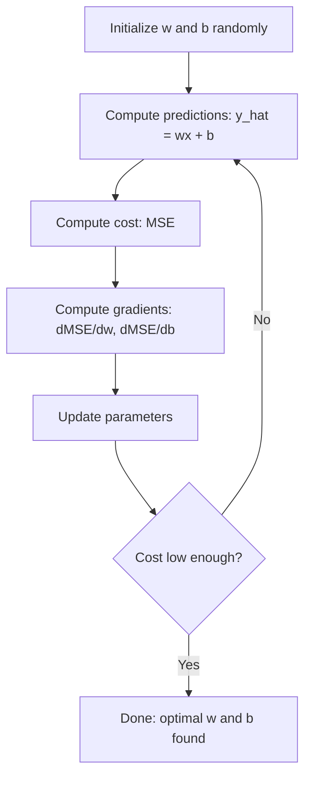

# 线性回归

> 线性回归在数据中绘制最佳拟合直线，是机器学习的入门首课。

**类型：** 构建  
**语言：** Python  
**前置知识：** 第一阶段（线性代数、微积分、优化理论），第二阶段课程1  
**时长：** ~90分钟

## 学习目标

- 推导均方误差的梯度下降更新规则，并从零实现线性回归算法
- 从计算复杂度和使用场景比较梯度下降与正规方程
- 建立带特征标准化的多元线性回归模型，并解读学习到的权重
- 阐述岭回归（L2正则化）如何通过惩罚大权重来防止过拟合

## 问题描述

你拥有房屋面积和对应售价的数据，想要根据新房屋的面积预测价格。虽然可以在散点图上目测，但你需要一个公式。你需要找到最佳拟合数据的一条直线，这样输入任意面积就能得到价格预测。

线性回归就是你所需的这条直线。更重要的是，它引入了完整的机器学习训练循环：定义模型、定义代价函数、优化参数。每个机器学习算法都遵循相同模式。在此通过最简单案例掌握它，你将在各处识别出这个模式。

这不仅适用于简单问题。线性回归在生产系统中用于需求预测、A/B测试分析、金融建模，并作为所有回归任务的基准模型。

## 核心概念

### 模型

线性回归假设输入（x）与输出（y）之间存在线性关系：

```
y = wx + b
```

- `w`（权重/斜率）：当x增加1单位时y的变化量
- `b`（偏置/截距）：当x=0时y的取值

对于多输入（特征）情况，扩展为：

```
y = w1*x1 + w2*x2 + ... + wn*xn + b
```

或向量形式：`y = w^T * x + b`

目标：找到使预测y在所有训练样本上尽可能接近实际y的w和b值。

### 代价函数（均方误差）

如何衡量“尽可能接近”？需要一个单一数值来量化预测错误程度。最常用的是均方误差（MSE）：

```
MSE = (1/n) * sum((y_predicted - y_actual)^2)
```

为何使用平方？两个原因：首先，它对大误差的惩罚远大于小误差（误差10比误差1的惩罚重100倍而非10倍）；其次，平方函数处处光滑可微，便于优化。

代价函数形成一个曲面。对于单权重w和偏置b，MSE曲面呈碗状（凸抛物面）。碗底就是MSE最小值所在。训练就是找到这个碗底。

### 梯度下降

梯度下降通过沿下坡方向逐步移动来找到碗底。



梯度提供两个信息：每个参数的移动方向和移动幅度。

对于 y_hat = wx + b 的MSE：

```
dMSE/dw = (2/n) * sum((y_hat - y) * x)
dMSE/db = (2/n) * sum(y_hat - y)
```

更新规则：

```
w = w - learning_rate * dMSE/dw
b = b - learning_rate * dMSE/db
```

学习率控制步长：过大则越过最小值导致发散；过小则训练时间过长。典型初始值：0.01、0.001或0.0001。

### 正规方程（解析解）

对于线性回归，存在一个直接公式无需迭代即可给出最优权重：

```
w = (X^T * X)^(-1) * X^T * y
```

通过矩阵求逆一步解出w。对小规模数据集效果完美，但对大数据集（百万行或数千特征），梯度下降更优，因为矩阵求逆的时间复杂度是特征数量的O(n^3)。

### 多元线性回归

使用多特征时，模型变为：

```
y = w1*x1 + w2*x2 + ... + wn*xn + b
```

机制相同：MSE作为代价函数，梯度下降同时更新所有权重。唯一区别是拟合对象从直线变为超平面。

特征缩放在此很重要。若一个特征范围0-1，另一个0-1000000，梯度下降会因代价曲面被拉长而难以收敛。训练前需标准化特征（减均值，除以标准差）。

### 多项式回归

如果关系非线性怎么办？仍可通过构造多项式特征使用线性回归：

```
y = w1*x + w2*x^2 + w3*x^3 + b
```

这仍是“线性”回归，因为模型对权重（w1, w2, w3）是线性的，仅使用了x的非线性特征。

更高次多项式可拟合更复杂曲线，但有过拟合风险。10次多项式会穿过10点数据集中的每个点，但对新数据预测效果差。

### R方分数

MSE告诉你误差大小，但其数值依赖y的尺度。R方（R²）提供尺度无关的度量：

```
R^2 = 1 - (sum of squared residuals) / (sum of squared deviations from mean)
    = 1 - SS_res / SS_tot
```

- R² = 1.0：完美预测
- R² = 0.0：模型不优于始终预测均值
- R² < 0.0：模型比预测均值更差

### 正则化预览（岭回归）

当特征众多时，模型可能通过赋予大权重而过拟合。岭回归（L2正则化）增加惩罚项：

```
Cost = MSE + lambda * sum(w_i^2)
```

惩罚项抑制大权重。超参数λ控制权衡：λ越大权重越小，正则化越强。这将在后续课程深入讲解，目前只需了解其存在及作用原理。

## 实践构建

### 步骤1：生成样本数据

```python
import random
import math

random.seed(42)

TRUE_W = 3.0
TRUE_B = 7.0
N_SAMPLES = 100

X = [random.uniform(0, 10) for _ in range(N_SAMPLES)]
y = [TRUE_W * x + TRUE_B + random.gauss(0, 2.0) for x in X]

print(f"Generated {N_SAMPLES} samples")
print(f"True relationship: y = {TRUE_W}x + {TRUE_B} (+ noise)")
print(f"First 5 points: {[(round(X[i], 2), round(y[i], 2)) for i in range(5)]}")
```

### 步骤2：从零实现线性回归（梯度下降）

```python
class LinearRegression:
    def __init__(self, learning_rate=0.01):
        self.w = 0.0
        self.b = 0.0
        self.lr = learning_rate
        self.cost_history = []

    def predict(self, X):
        return [self.w * x + self.b for x in X]

    def compute_cost(self, X, y):
        predictions = self.predict(X)
        n = len(y)
        cost = sum((pred - actual) ** 2 for pred, actual in zip(predictions, y)) / n
        return cost

    def compute_gradients(self, X, y):
        predictions = self.predict(X)
        n = len(y)
        dw = (2 / n) * sum((pred - actual) * x for pred, actual, x in zip(predictions, y, X))
        db = (2 / n) * sum(pred - actual for pred, actual in zip(predictions, y))
        return dw, db

    def fit(self, X, y, epochs=1000, print_every=200):
        for epoch in range(epochs):
            dw, db = self.compute_gradients(X, y)
            self.w -= self.lr * dw
            self.b -= self.lr * db
            cost = self.compute_cost(X, y)
            self.cost_history.append(cost)
            if epoch % print_every == 0:
                print(f"  Epoch {epoch:4d} | Cost: {cost:.4f} | w: {self.w:.4f} | b: {self.b:.4f}")
        return self

    def r_squared(self, X, y):
        predictions = self.predict(X)
        y_mean = sum(y) / len(y)
        ss_res = sum((actual - pred) ** 2 for actual, pred in zip(y, predictions))
        ss_tot = sum((actual - y_mean) ** 2 for actual in y)
        return 1 - (ss_res / ss_tot)


print("=== Training Linear Regression (Gradient Descent) ===")
model = LinearRegression(learning_rate=0.005)
model.fit(X, y, epochs=1000, print_every=200)
print(f"\nLearned: y = {model.w:.4f}x + {model.b:.4f}")
print(f"True:    y = {TRUE_W}x + {TRUE_B}")
print(f"R-squared: {model.r_squared(X, y):.4f}")
```

### 步骤3：正规方程（解析解）

```python
class LinearRegressionNormal:
    def __init__(self):
        self.w = 0.0
        self.b = 0.0

    def fit(self, X, y):
        n = len(X)
        x_mean = sum(X) / n
        y_mean = sum(y) / n
        numerator = sum((X[i] - x_mean) * (y[i] - y_mean) for i in range(n))
        denominator = sum((X[i] - x_mean) ** 2 for i in range(n))
        self.w = numerator / denominator
        self.b = y_mean - self.w * x_mean
        return self

    def predict(self, X):
        return [self.w * x + self.b for x in X]

    def r_squared(self, X, y):
        predictions = self.predict(X)
        y_mean = sum(y) / len(y)
        ss_res = sum((actual - pred) ** 2 for actual, pred in zip(y, predictions))
        ss_tot = sum((actual - y_mean) ** 2 for actual in y)
        return 1 - (ss_res / ss_tot)


print("\n=== Normal Equation (Closed-Form) ===")
model_normal = LinearRegressionNormal()
model_normal.fit(X, y)
print(f"Learned: y = {model_normal.w:.4f}x + {model_normal.b:.4f}")
print(f"R-squared: {model_normal.r_squared(X, y):.4f}")
```

### 步骤4：多元线性回归

```python
class MultipleLinearRegression:
    def __init__(self, n_features, learning_rate=0.01):
        self.weights = [0.0] * n_features
        self.bias = 0.0
        self.lr = learning_rate
        self.cost_history = []

    def predict_single(self, x):
        return sum(w * xi for w, xi in zip(self.weights, x)) + self.bias

    def predict(self, X):
        return [self.predict_single(x) for x in X]

    def compute_cost(self, X, y):
        predictions = self.predict(X)
        n = len(y)
        return sum((pred - actual) ** 2 for pred, actual in zip(predictions, y)) / n

    def fit(self, X, y, epochs=1000, print_every=200):
        n = len(y)
        n_features = len(X[0])
        for epoch in range(epochs):
            predictions = self.predict(X)
            errors = [pred - actual for pred, actual in zip(predictions, y)]
            for j in range(n_features):
                grad = (2 / n) * sum(errors[i] * X[i][j] for i in range(n))
                self.weights[j] -= self.lr * grad
            grad_b = (2 / n) * sum(errors)
            self.bias -= self.lr * grad_b
            cost = self.compute_cost(X, y)
            self.cost_history.append(cost)
            if epoch % print_every == 0:
                print(f"  Epoch {epoch:4d} | Cost: {cost:.4f}")
        return self

    def r_squared(self, X, y):
        predictions = self.predict(X)
        y_mean = sum(y) / len(y)
        ss_res = sum((actual - pred) ** 2 for actual, pred in zip(y, predictions))
        ss_tot = sum((actual - y_mean) ** 2 for actual in y)
        return 1 - (ss_res / ss_tot)


random.seed(42)
N = 100
X_multi = []
y_multi = []
for _ in range(N):
    size = random.uniform(500, 3000)
    bedrooms = random.randint(1, 5)
    age = random.uniform(0, 50)
    price = 50 * size + 10000 * bedrooms - 1000 * age + 50000 + random.gauss(0, 20000)
    X_multi.append([size, bedrooms, age])
    y_multi.append(price)


def standardize(X):
    n_features = len(X[0])
    means = [sum(X[i][j] for i in range(len(X))) / len(X) for j in range(n_features)]
    stds = []
    for j in range(n_features):
        variance = sum((X[i][j] - means[j]) ** 2 for i in range(len(X))) / len(X)
        stds.append(variance ** 0.5)
    X_scaled = []
    for i in range(len(X)):
        row = [(X[i][j] - means[j]) / stds[j] if stds[j] > 0 else 0 for j in range(n_features)]
        X_scaled.append(row)
    return X_scaled, means, stds


y_mean_val = sum(y_multi) / len(y_multi)
y_std_val = (sum((yi - y_mean_val) ** 2 for yi in y_multi) / len(y_multi)) ** 0.5
y_scaled = [(yi - y_mean_val) / y_std_val for yi in y_multi]

X_scaled, x_means, x_stds = standardize(X_multi)

print("\n=== Multiple Linear Regression (3 features) ===")
print("Features: house size, bedrooms, age")
multi_model = MultipleLinearRegression(n_features=3, learning_rate=0.01)
multi_model.fit(X_scaled, y_scaled, epochs=1000, print_every=200)

print(f"\nWeights (standardized): {[round(w, 4) for w in multi_model.weights]}")
print(f"Bias (standardized): {multi_model.bias:.4f}")
print(f"R-squared: {multi_model.r_squared(X_scaled, y_scaled):.4f}")
```

### 步骤5：多项式回归

```python
class PolynomialRegression:
    def __init__(self, degree, learning_rate=0.01):
        self.degree = degree
        self.weights = [0.0] * degree
        self.bias = 0.0
        self.lr = learning_rate

    def make_features(self, X):
        return [[x ** (d + 1) for d in range(self.degree)] for x in X]

    def predict(self, X):
        features = self.make_features(X)
        return [sum(w * f for w, f in zip(self.weights, row)) + self.bias for row in features]

    def fit(self, X, y, epochs=1000, print_every=200):
        features = self.make_features(X)
        n = len(y)
        for epoch in range(epochs):
            predictions = [sum(w * f for w, f in zip(self.weights, row)) + self.bias for row in features]
            errors = [pred - actual for pred, actual in zip(predictions, y)]
            for j in range(self.degree):
                grad = (2 / n) * sum(errors[i] * features[i][j] for i in range(n))
                self.weights[j] -= self.lr * grad
            grad_b = (2 / n) * sum(errors)
            self.bias -= self.lr * grad_b
            if epoch % print_every == 0:
                cost = sum(e ** 2 for e in errors) / n
                print(f"  Epoch {epoch:4d} | Cost: {cost:.6f}")
        return self

    def r_squared(self, X, y):
        predictions = self.predict(X)
        y_mean = sum(y) / len(y)
        ss_res = sum((actual - pred) ** 2 for actual, pred in zip(y, predictions))
        ss_tot = sum((actual - y_mean) ** 2 for actual in y)
        return 1 - (ss_res / ss_tot)


random.seed(42)
X_poly = [x / 10.0 for x in range(0, 50)]
y_poly = [0.5 * x ** 2 - 2 * x + 3 + random.gauss(0, 1.0) for x in X_poly]

x_max = max(abs(x) for x in X_poly)
X_poly_norm = [x / x_max for x in X_poly]
y_poly_mean = sum(y_poly) / len(y_poly)
y_poly_std = (sum((yi - y_poly_mean) ** 2 for yi in y_poly) / len(y_poly)) ** 0.5
y_poly_norm = [(yi - y_poly_mean) / y_poly_std for yi in y_poly]

print("\n=== Polynomial Regression (degree 2 vs degree 5) ===")
print("True relationship: y = 0.5x^2 - 2x + 3")

print("\nDegree 2:")
poly2 = PolynomialRegression(degree=2, learning_rate=0.1)
poly2.fit(X_poly_norm, y_poly_norm, epochs=2000, print_every=500)
print(f"  R-squared: {poly2.r_squared(X_poly_norm, y_poly_norm):.4f}")

print("\nDegree 5:")
poly5 = PolynomialRegression(degree=5, learning_rate=0.1)
poly5.fit(X_poly_norm, y_poly_norm, epochs=2000, print_every=500)
print(f"  R-squared: {poly5.r_squared(X_poly_norm, y_poly_norm):.4f}")

print("\nDegree 2 fits the true curve well. Degree 5 fits training data slightly better")
print("but risks overfitting on new data.")
```

### 步骤6：岭回归（L2正则化）

```python
class RidgeRegression:
    def __init__(self, n_features, learning_rate=0.01, alpha=1.0):
        self.weights = [0.0] * n_features
        self.bias = 0.0
        self.lr = learning_rate
        self.alpha = alpha

    def predict_single(self, x):
        return sum(w * xi for w, xi in zip(self.weights, x)) + self.bias

    def predict(self, X):
        return [self.predict_single(x) for x in X]

    def fit(self, X, y, epochs=1000, print_every=200):
        n = len(y)
        n_features = len(X[0])
        for epoch in range(epochs):
            predictions = self.predict(X)
            errors = [pred - actual for pred, actual in zip(predictions, y)]
            mse = sum(e ** 2 for e in errors) / n
            reg_term = self.alpha * sum(w ** 2 for w in self.weights)
            cost = mse + reg_term
            for j in range(n_features):
                grad = (2 / n) * sum(errors[i] * X[i][j] for i in range(n))
                grad += 2 * self.alpha * self.weights[j]
                self.weights[j] -= self.lr * grad
            grad_b = (2 / n) * sum(errors)
            self.bias -= self.lr * grad_b
            if epoch % print_every == 0:
                print(f"  Epoch {epoch:4d} | Cost: {cost:.4f} | L2 penalty: {reg_term:.4f}")
        return self


print("\n=== Ridge Regression (L2 Regularization) ===")
print("Same data as multiple regression, with alpha=0.1")
ridge = RidgeRegression(n_features=3, learning_rate=0.01, alpha=0.1)
ridge.fit(X_scaled, y_scaled, epochs=1000, print_every=200)
print(f"\nRidge weights: {[round(w, 4) for w in ridge.weights]}")
print(f"Plain weights: {[round(w, 4) for w in multi_model.weights]}")
print("Ridge weights are smaller (shrunk toward zero) due to the L2 penalty.")
```

## 实际应用

现在使用scikit-learn实现相同功能——这才是生产环境实际使用的工具。

```python
from sklearn.linear_model import LinearRegression as SklearnLR
from sklearn.linear_model import Ridge
from sklearn.preprocessing import PolynomialFeatures, StandardScaler
from sklearn.model_selection import train_test_split
from sklearn.metrics import mean_squared_error, r2_score
import numpy as np

np.random.seed(42)
X_sk = np.random.uniform(0, 10, (100, 1))
y_sk = 3.0 * X_sk.squeeze() + 7.0 + np.random.normal(0, 2.0, 100)

X_train, X_test, y_train, y_test = train_test_split(X_sk, y_sk, test_size=0.2, random_state=42)

lr = SklearnLR()
lr.fit(X_train, y_train)
y_pred = lr.predict(X_test)

print("=== Scikit-learn Linear Regression ===")
print(f"Coefficient (w): {lr.coef_[0]:.4f}")
print(f"Intercept (b): {lr.intercept_:.4f}")
print(f"R-squared (test): {r2_score(y_test, y_pred):.4f}")
print(f"MSE (test): {mean_squared_error(y_test, y_pred):.4f}")

poly = PolynomialFeatures(degree=2, include_bias=False)
X_poly_sk = poly.fit_transform(X_train)
X_poly_test = poly.transform(X_test)

lr_poly = SklearnLR()
lr_poly.fit(X_poly_sk, y_train)
print(f"\nPolynomial degree 2 R-squared: {r2_score(y_test, lr_poly.predict(X_poly_test)):.4f}")

scaler = StandardScaler()
X_train_scaled = scaler.fit_transform(X_train)
X_test_scaled = scaler.transform(X_test)

ridge = Ridge(alpha=1.0)
ridge.fit(X_train_scaled, y_train)
print(f"Ridge R-squared: {r2_score(y_test, ridge.predict(X_test_scaled)):.4f}")
print(f"Ridge coefficient: {ridge.coef_[0]:.4f}")
```

你的从零实现与scikit-learn结果一致。区别在于：scikit-learn处理了边界情况、数值稳定性和性能优化。生产环境请使用库，理解原理请使用从零实现版本。

## 成果产出

本课程产出：
- `outputs/skill-regression.md` - 基于问题选择合适回归方法的技能

## 练习题

1. 实现批量梯度下降、随机梯度下降（SGD）和小批量梯度下降。在同一数据集上比较收敛速度。哪种收敛最快？哪种代价曲线最平滑？
2. 从三次函数（y = ax³ + bx² + cx + d + 噪声）生成数据。拟合1次、3次和10次多项式。比较训练R²与测试R²。过拟合在几次时明显？
3. 实现Lasso回归（L1正则化：惩罚项 = α * Σ|wᵢ|）。在多特征房屋数据上训练。比较哪些权重归零，与岭回归有何不同？为何L1产生稀疏解而L2不会？

## 术语表

| 术语 | 通俗说法 | 准确定义 |
|------|----------|----------|
| 线性回归 | “画条数据拟合线” | 寻找使wx+b与实际y值平方差之和最小的权重w和偏置b |
| 代价函数 | “模型有多差” | 将模型参数映射到量化预测误差的单值函数，优化目标即最小化该值 |
| 均方误差 | “平方误差的平均” | (1/n) * Σ(预测值 - 实际值)²，对大误差进行不成比例的惩罚 |
| 梯度下降 | “下山行走” | 沿降低代价函数的方向（由偏导数确定）迭代调整参数 |
| 学习率 | “步长” | 控制每次梯度下降步骤参数变化幅度的标量值 |
| 正规方程 | “直接求解” | 无需迭代的解析解 w = (XᵀX)⁻¹Xᵀy，直接给出最优权重 |
| R方 | “拟合优度” | 模型解释的y方差比例，范围从负无穷到1.0 |
| 特征缩放 | “让特征可比” | 将特征变换到相似范围（如零均值、单位方差）以加速梯度下降收敛 |
| 正则化 | “惩罚复杂性” | 向代价函数添加使权重收缩的项，防止过拟合 |
| 岭回归 | “L2正则化” | 在MSE基础上增加λ * Σ(wᵢ²)惩罚项的线性回归 |
| 多项式回归 | “用线性数学拟合曲线” | 在多项式特征（x, x², x³, ...）上进行线性回归，仍对权重线性 |
| 过拟合 | “死记训练数据” | 使用过于复杂的模型，导致其拟合训练数据中的噪声，在新数据上表现差 |

## 延伸阅读

- [统计学习导论（ISLR）](https://www.statlearning.com/) -- 免费PDF，第3章和第6章涵盖线性回归和正则化，附R语言实践案例
- [统计学习基础（ESL）](https://hastie.su.domains/ElemStatLearn/) -- 免费PDF，ISLR的数学深化版本，深入讲解岭回归和Lasso
- [斯坦福CS229线性回归讲义](https://cs229.stanford.edu/main_notes.pdf) -- Andrew Ng从第一性原理推导正规方程和梯度下降的笔记
- [scikit-learn线性回归文档](https://scikit-learn.org/stable/modules/linear_model.html) -- LinearRegression、Ridge、Lasso、ElasticNet的实践参考，附代码示例