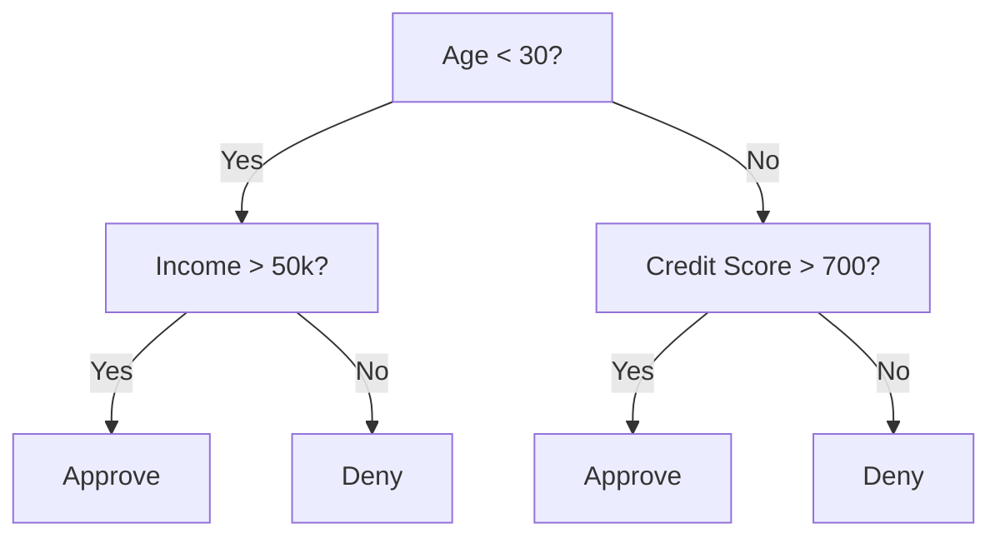
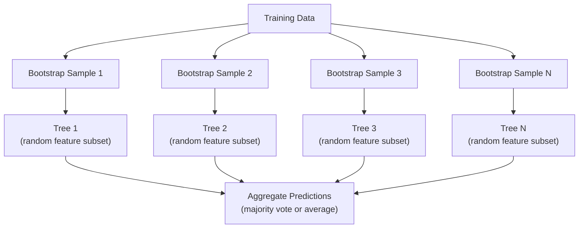

# 决策树与随机森林

> 决策树本质就是一个流程图。但一片决策树之林却是机器学习中最强大的工具之一。

**类型：** 构建
**语言：** Python
**先决条件：** 阶段1（课程09 信息论，课程06 概率论）
**时间：** 约90分钟

## 学习目标

- 实现基尼不纯度、熵和信息增益的计算，以寻找最佳的决策树分裂点
- 从头构建一个带有预剪枝控制（最大深度、最小样本数）的决策树分类器
- 使用自助采样和特征随机化构建随机森林，并解释其为何能减少方差
- 比较MDI特征重要性与置换重要性，并识别MDI产生偏差的情况

## 问题背景

你拥有表格数据。行是样本，列是特征，还有一个你想要预测的目标列。你当然可以尝试用神经网络来解决。但对于表格数据，基于树的模型（决策树、随机森林、梯度提升树）通常优于深度学习。Kaggle上关于结构化数据的竞赛大多由XGBoost和LightGBM主导，而非Transformer。

为什么？树模型能直接处理混合特征类型（数值型和类别型），无需预处理。它们能捕捉非线性关系，无需特征工程。它们具有可解释性：你可以查看树并明确知道做出某个预测的原因。而随机森林通过对多棵树取平均，在中等规模数据集上具有很强的抗过拟合能力。

本课将从头使用递归分裂法构建决策树，然后在其基础上构建随机森林。你将实现分裂标准（基尼不纯度、熵、信息增益）背后的数学原理，并理解为何弱学习器的集成会成为一个强学习器。

## 核心概念

### 决策树的功能

决策树通过提出一系列“是/否”问题，将特征空间划分为矩形区域。



每个内部节点根据阈值测试某个特征。每个叶节点给出一个预测。要分类一个新的数据点，你从根节点开始，沿着分支前进，直到到达一个叶节点。

树采用自上而下的方式构建：在每个节点处，选择能最佳分离数据的特征和阈值。“最佳”由分裂标准定义。

### 分裂标准：衡量不纯度

在每个节点，我们有一组样本。我们希望将它们分裂，使得得到的子节点尽可能“纯净”，即每个子节点主要包含同一类别的样本。

**基尼不纯度**衡量的是：如果根据该节点的类别分布随机标记一个样本，它被错误分类的概率。

```
Gini(S) = 1 - sum(p_k^2)

where p_k is the proportion of class k in set S.
```

对于一个纯节点（全是同一类），基尼 = 0。对于类别各占50%的二元分裂，基尼 = 0.5。值越低越好。

```
Example: 6 cats, 4 dogs

Gini = 1 - (0.6^2 + 0.4^2) = 1 - (0.36 + 0.16) = 0.48
```

**熵**衡量节点中的信息含量（无序度）。在阶段1课程09中已有介绍。

```
Entropy(S) = -sum(p_k * log2(p_k))
```

对于一个纯节点，熵 = 0。对于类别各占50%的二元分裂，熵 = 1.0。值越低越好。

```
Example: 6 cats, 4 dogs

Entropy = -(0.6 * log2(0.6) + 0.4 * log2(0.4))
        = -(0.6 * -0.737 + 0.4 * -1.322)
        = 0.442 + 0.529
        = 0.971 bits
```

**信息增益**是分裂后不纯度（熵或基尼）的减少量。

```
IG(S, feature, threshold) = Impurity(S) - weighted_avg(Impurity(S_left), Impurity(S_right))

where the weights are the proportions of samples in each child.
```

每个节点的贪心算法：尝试每一个特征和每一个可能的阈值。选择能最大化信息增益的（特征，阈值）组合。

### 分裂机制

对于一个在当前节点具有 n 个特征和 m 个样本的数据集：

1. 对于每个特征 j（j = 1 到 n）：
   - 按特征 j 对样本排序
   - 尝试每一对连续不同值之间的中点作为阈值
   - 计算每个阈值对应的信息增益
2. 选择信息增益最大的特征和阈值
3. 将数据划分为左子集（特征 <= 阈值）和右子集（特征 > 阈值）
4. 在每个子节点上递归执行此过程

这种贪心方法并不能保证得到全局最优树。寻找最优树是NP难问题。但贪心分裂在实践中效果很好。

### 停止条件

如果没有停止条件，树会一直生长，直到每个叶节点都是纯的（每个叶节点一个样本）。这完美地记住了训练数据，但泛化能力极差。

**预剪枝**在树完全生长前停止：
- 最大深度：当树达到设定深度时停止分裂
- 每个叶节点的最小样本数：如果节点样本数少于 k 则停止
- 最小信息增益：如果最佳分裂对不纯度的改善小于一个阈值则停止
- 最大叶节点数：限制叶节点的总数

**后剪枝**先让树完全生长，然后再修剪回来：
- 代价复杂度剪枝（scikit-learn使用）：添加一个与叶节点数量成正比的惩罚项。增加惩罚项以获得更小的树
- 减少误差剪枝：如果验证误差没有增加，则移除一个子树

预剪枝更简单快速。后剪枝通常能产生更好的树，因为它不会过早停止可能带来有用后续分裂的分裂操作。

### 用于回归的决策树

对于回归问题，叶节点的预测值是该叶节点中目标值的均值。分裂标准也随之改变：

**方差减少**替代了信息增益：

```
VR(S, feature, threshold) = Var(S) - weighted_avg(Var(S_left), Var(S_right))
```

选择能最大程度减少方差的分裂。树将输入空间划分为若干区域，并在每个区域内预测一个常数（均值）。

### 随机森林：集成的力量

单个决策树具有高方差。数据的微小变化可能导致完全不同的树。随机森林通过对多棵树取平均来解决这个问题。



两个随机性来源使得树具有多样性：

**Bagging（自助聚合）：** 每棵树在一个自助样本上训练，即从训练数据中有放回地随机抽样。每次抽样大约包含原始样本的63%（其余为袋外样本，可用于验证）。

**特征随机化：** 在每次分裂时，只考虑一个随机的特征子集。对于分类问题，默认是 sqrt(n_features)。对于回归问题，默认是 n_features/3。这可以防止所有树都基于相同的主导特征进行分裂。

关键洞察：对许多不相关的树取平均可以减少方差而不增加偏差。每个单独的树可能很平庸，但集成起来却很强大。

### 特征重要性

随机森林天然提供特征重要性分数。最常见的方法：

**平均不纯度减少（MDI）：** 对于每个特征，求和所有树和所有使用该特征的节点中，该特征带来的总不纯度减少量。在早期分裂中能带来更大不纯度减少的特征更重要。

```
importance(feature_j) = sum over all nodes where feature_j is used:
    (n_samples_at_node / n_total_samples) * impurity_decrease
```

这种方法很快（在训练过程中计算），但偏向于高基数特征和具有许多可能分裂点的特征。

**置换重要性**是替代方法：随机打乱一个特征的值，并测量模型准确率下降了多少。更可靠但更慢。

### 树模型何时优于神经网络

在表格数据上，树和森林通常优于神经网络。有几个原因：

| 因素 | 树模型 | 神经网络 |
|--------|-------|----------------|
| 混合类型（数值型 + 类别型） | 原生支持 | 需要编码 |
| 小数据集（< 1万行） | 效果好 | 容易过拟合 |
| 特征交互 | 通过分裂发现 | 需要架构设计 |
| 可解释性 | 完全透明 | 黑盒 |
| 训练时间 | 分钟级 | 小时级 |
| 超参数敏感度 | 低 | 高 |

当数据具有空间或序列结构（图像、文本、音频）时，神经网络胜出。对于扁平的特征表格，树模型是默认选择。

## 动手构建

### 第1步：基尼不纯度和熵

从头构建这两种分裂标准，并验证它们在判定好分裂时是否一致。

```python
import math

def gini_impurity(labels):
    n = len(labels)
    if n == 0:
        return 0.0
    counts = {}
    for label in labels:
        counts[label] = counts.get(label, 0) + 1
    return 1.0 - sum((c / n) ** 2 for c in counts.values())

def entropy(labels):
    n = len(labels)
    if n == 0:
        return 0.0
    counts = {}
    for label in labels:
        counts[label] = counts.get(label, 0) + 1
    return -sum(
        (c / n) * math.log2(c / n) for c in counts.values() if c > 0
    )
```

### 第2步：寻找最佳分裂

尝试每一个特征和每一个阈值。返回信息增益最大的那个。

```python
def information_gain(parent_labels, left_labels, right_labels, criterion="gini"):
    measure = gini_impurity if criterion == "gini" else entropy
    n = len(parent_labels)
    n_left = len(left_labels)
    n_right = len(right_labels)
    if n_left == 0 or n_right == 0:
        return 0.0
    parent_impurity = measure(parent_labels)
    child_impurity = (
        (n_left / n) * measure(left_labels) +
        (n_right / n) * measure(right_labels)
    )
    return parent_impurity - child_impurity
```

### 第3步：构建 DecisionTree 类

实现递归分裂、预测和特征重要性跟踪。

```python
class DecisionTree:
    def __init__(self, max_depth=None, min_samples_split=2,
                 min_samples_leaf=1, criterion="gini",
                 max_features=None):
        self.max_depth = max_depth
        self.min_samples_split = min_samples_split
        self.min_samples_leaf = min_samples_leaf
        self.criterion = criterion
        self.max_features = max_features
        self.tree = None
        self.feature_importances_ = None

    def fit(self, X, y):
        self.n_features = len(X[0])
        self.feature_importances_ = [0.0] * self.n_features
        self.n_samples = len(X)
        self.tree = self._build(X, y, depth=0)
        total = sum(self.feature_importances_)
        if total > 0:
            self.feature_importances_ = [
                fi / total for fi in self.feature_importances_
            ]

    def predict(self, X):
        return [self._predict_one(x, self.tree) for x in X]
```

### 第4步：构建 RandomForest 类

实现自助采样、特征随机化和多数投票。

```python
class RandomForest:
    def __init__(self, n_trees=100, max_depth=None,
                 min_samples_split=2, max_features="sqrt",
                 criterion="gini"):
        self.n_trees = n_trees
        self.max_depth = max_depth
        self.min_samples_split = min_samples_split
        self.max_features = max_features
        self.criterion = criterion
        self.trees = []

    def fit(self, X, y):
        n = len(X)
        for _ in range(self.n_trees):
            indices = [random.randint(0, n - 1) for _ in range(n)]
            X_boot = [X[i] for i in indices]
            y_boot = [y[i] for i in indices]
            tree = DecisionTree(
                max_depth=self.max_depth,
                min_samples_split=self.min_samples_split,
                max_features=self.max_features,
                criterion=self.criterion,
            )
            tree.fit(X_boot, y_boot)
            self.trees.append(tree)

    def predict(self, X):
        all_preds = [tree.predict(X) for tree in self.trees]
        predictions = []
        for i in range(len(X)):
            votes = {}
            for preds in all_preds:
                v = preds[i]
                votes[v] = votes.get(v, 0) + 1
            predictions.append(max(votes, key=votes.get))
        return predictions
```

完整实现（包括所有辅助方法）请参见 `code/trees.py`。

## 实际使用

使用 scikit-learn，训练随机森林只需三行代码：

```python
from sklearn.ensemble import RandomForestClassifier
from sklearn.datasets import load_iris
from sklearn.model_selection import train_test_split

X, y = load_iris(return_X_y=True)
X_train, X_test, y_train, y_test = train_test_split(X, y, random_state=42)

rf = RandomForestClassifier(n_estimators=100, random_state=42)
rf.fit(X_train, y_train)
print(f"Accuracy: {rf.score(X_test, y_test):.4f}")
print(f"Feature importances: {rf.feature_importances_}")
```

在实践中，梯度提升树（XGBoost, LightGBM, CatBoost）通常比随机森林更强，因为它们顺序构建树，每棵树都去纠正前一棵树的错误。但随机森林更不容易被错误配置，且几乎不需要超参数调优。

## 交付物

本课产出 `outputs/prompt-tree-interpreter.md` —— 一个用于向业务相关方解释决策树分裂的提示词。输入训练好的树的结构（深度、特征、分裂阈值、准确率），它会将模型转化为通俗易懂的规则，对特征重要性进行排序，标记过拟合或数据泄漏问题，并给出后续建议。任何时候你需要向不懂代码的人解释基于树的模型时，都可以使用它。

## 练习

1. 在一个包含3个类别的2D数据集上训练单个决策树。手动跟踪分裂过程并绘制矩形决策边界。比较 max_depth=2 与 max_depth=10 时的边界。
2. 为回归树实现方差减少分裂。生成 y = sin(x) + noise 的200个点，并用你的回归树拟合。绘制树的分段常数预测与真实曲线。
3. 构建包含1、5、10、50和200棵树的随机森林。绘制训练准确率和测试准确率随树数量的变化曲线。观察测试准确率会达到平台期但不会下降（森林抗过拟合）。
4. 在5个不同数据集上，比较基尼不纯度和熵作为分裂标准。测量准确率和树深度。在大多数情况下，它们会产生几乎相同的结果。解释原因。
5. 实现置换重要性。在一个某个特征是随机噪声但基数很高的数据集上，将其与MDI重要性进行比较。MDI会将噪声特征排在高位，而置换重要性则不会。

## 关键术语

| 术语 | 人们怎么说 | 实际含义 |
|------|----------------|----------------------|
| 决策树 | “一个用于预测的流程图” | 一种通过学习一系列 if/else 分裂将特征空间划分为矩形区域的模型 |
| 基尼不纯度 | “节点有多混杂” | 在一个节点错误分类随机样本的概率。0 = 纯净，0.5 = 二元分裂的最大不纯度 |
| 熵 | “节点中的无序度” | 节点的信息含量。0 = 纯净，1.0 = 二元分裂的最大不确定性。源自信息论 |
| 信息增益 | “分裂的好坏程度” | 分裂后不纯度的减少量。用于选择分裂的贪心标准 |
| 预剪枝 | “提前停止树的生长” | 通过设置最大深度、最小样本数或最小增益阈值来提前停止树的生长 |
| 后剪枝 | “之后修剪树” | 让树完全生长，然后移除不能提升验证性能的子树 |
| Bagging | “在随机子集上训练” | 自助聚合。在每个模型上使用不同的有放回随机抽样样本进行训练 |
| 随机森林 | “一堆树” | 决策树的集成，每棵树在一个自助样本上训练，每次分裂使用随机的特征子集 |
| 特征重要性（MDI） | “哪些特征重要” | 每个特征对所有树和节点贡献的总不纯度减少量 |
| 置换重要性 | “打乱并检查” | 随机打乱一个特征的值后准确率的下降程度。对于噪声特征比MDI更可靠 |
| 方差减少 | “回归版的信息增益” | 信息增益在回归树中的类比。选择能最大程度减少目标方差的分裂 |
| 自助样本 | “可重复的随机抽样” | 从原始数据集中有放回地抽取的随机样本。大小相同，但有重复项 |

## 延伸阅读

- [Breiman: Random Forests (2001)](https://link.springer.com/article/10.1023/A:1010933404324) - 随机森林的原始论文
- [Grinsztajn et al.: Why do tree-based models still outperform deep learning on tabular data? (2022)](https://arxiv.org/abs/2207.08815) - 对树模型与神经网络在表格任务上的严格比较
- [scikit-learn 决策树文档](https://scikit-learn.org/stable/modules/tree.html) - 带可视化工具的实践指南
- [XGBoost: A Scalable Tree Boosting System (Chen & Guestrin, 2016)](https://arxiv.org/abs/1603.02754) - 在Kaggle上占主导地位的梯度提升论文