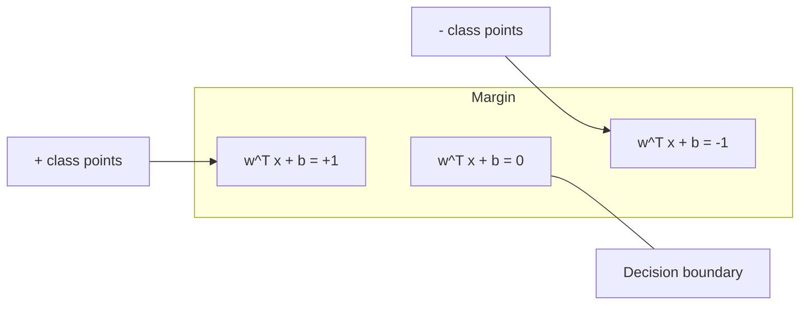
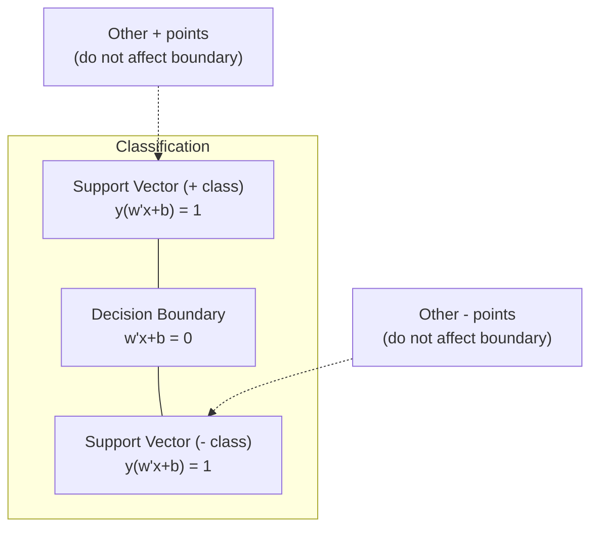
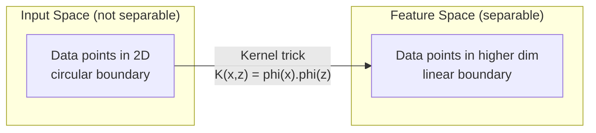

# 支持向量机

> 在两类数据之间找到最宽的街道。这就是全部思想。

**类型：** 构建
**语言：** Python
**先决条件：** 第一阶段（课程08 优化，14 范数与距离，18 凸优化）
**时间：** ~90分钟

## 学习目标

- 从零开始实现一个线性支持向量机，使用铰链损失和梯度下降法在原始公式上进行优化
- 解释最大间隔原则，并从训练好的模型中识别支持向量
- 比较线性、多项式和径向基函数核，解释核技巧如何避免显式的高维映射
- 评估C参数控制的间隔宽度与分类错误之间的权衡

## 问题描述

你有两类数据点，需要画一条线（或超平面）将它们分开。无限多条线都可行。应该选择哪一条？

选择具有最大间隔的那条。间隔是决策边界与每侧最近数据点之间的距离。更宽的间隔意味着分类器更有信心，对未见数据的泛化能力更好。

这种直觉引出了支持向量机，这是机器学习中数学上最优雅的算法之一。SVM在深度学习兴起之前是主导的分类方法，并且对于小数据集、高维数据以及需要具有理论保证的、原理明确且易于理解的模型的问题，它仍然是最佳选择。

SVM直接关联第一阶段：优化是凸的（课程18），间隔用范数度量（课程14），而核技巧利用点积来处理非线性边界，无需在高维空间中显式计算。

## 核心概念

### 最大间隔分类器

给定线性可分的数据，标签y_i属于{-1, +1}，特征向量为x_i，我们想要一个超平面w^T x + b = 0来分离类别。

点x_i到超平面的距离为：

```
distance = |w^T x_i + b| / ||w||
```

对于一个正确分类的点：y_i * (w^T x_i + b) > 0。间隔是超平面到两侧最近点距离的两倍。



优化问题：

```
maximize    2 / ||w||     (the margin width)
subject to  y_i * (w^T x_i + b) >= 1  for all i
```

等价形式（最小化||w||^2更容易优化）：

```
minimize    (1/2) ||w||^2
subject to  y_i * (w^T x_i + b) >= 1  for all i
```

这是一个凸二次规划问题。它具有唯一的全局解。恰好位于间隔边界上的数据点（即满足y_i * (w^T x_i + b) = 1的点）就是支持向量。它们是唯一决定决策边界的点。移动或删除任何非支持向量点，边界都不会改变。

### 支持向量：关键的少数点



大多数训练点是无关紧要的。只有支持向量重要。这就是为什么SVM在预测时内存高效：你只需要存储支持向量，而不是整个训练集。

支持向量的数量也给出了泛化误差的界限。相对于数据集大小，支持向量越少，泛化能力越好。

### 软间隔：用C参数处理噪声

真实数据很少完全可分。一些点可能在边界的错误一侧，或者位于间隔内。软间隔公式通过引入松弛变量来允许违规。

```
minimize    (1/2) ||w||^2 + C * sum(xi_i)
subject to  y_i * (w^T x_i + b) >= 1 - xi_i
            xi_i >= 0  for all i
```

松弛变量xi_i衡量点i违反间隔的程度。C控制着权衡：

| C值 | 行为 |
|---------|----------|
| 大C | 严厉惩罚违规。窄间隔，误分类少。可能过拟合 |
| 小C | 允许更多违规。宽间隔，误分类多。可能欠拟合 |

C是正则化强度的倒数。大C = 正则化弱。小C = 正则化强。

### 铰链损失：SVM的损失函数

软间隔SVM可以重写为无约束优化问题：

```
minimize    (1/2) ||w||^2 + C * sum(max(0, 1 - y_i * (w^T x_i + b)))
```

项max(0, 1 - y_i * f(x_i))是铰链损失。当点被正确分类且位于间隔之外时，它为零。当点位于间隔内或被错误分类时，它是线性的。

```
Hinge loss for a single point:

loss
  |
  | \
  |  \
  |   \
  |    \
  |     \_______________
  |
  +-----|-----|-------->  y * f(x)
       0     1

Zero loss when y*f(x) >= 1 (correctly classified, outside margin).
Linear penalty when y*f(x) < 1.
```

与逻辑损失（逻辑回归）比较：

```
Hinge:     max(0, 1 - y*f(x))          Hard cutoff at margin
Logistic:  log(1 + exp(-y*f(x)))        Smooth, never exactly zero
```

铰链损失产生稀疏解（只有支持向量有非零贡献）。逻辑损失使用所有数据点。这使得SVM在预测时更加内存高效。

### 用梯度下降法训练线性SVM

你可以使用铰链损失加上L2正则化，通过梯度下降来训练线性SVM，而无需求解带约束的二次规划问题：

```
L(w, b) = (lambda/2) * ||w||^2 + (1/n) * sum(max(0, 1 - y_i * (w^T x_i + b)))

Gradient with respect to w:
  If y_i * (w^T x_i + b) >= 1:  dL/dw = lambda * w
  If y_i * (w^T x_i + b) < 1:   dL/dw = lambda * w - y_i * x_i

Gradient with respect to b:
  If y_i * (w^T x_i + b) >= 1:  dL/db = 0
  If y_i * (w^T x_i + b) < 1:   dL/db = -y_i
```

这被称为原始公式。它每轮迭代的时间复杂度为O(n * d)，其中n是样本数，d是特征数。对于大型、稀疏、高维数据（如文本分类），这是很快的。

### 对偶公式与核技巧

SVM问题的拉格朗日对偶（来自第一阶段课程18，KKT条件）是：

```
maximize    sum(alpha_i) - (1/2) * sum_ij(alpha_i * alpha_j * y_i * y_j * (x_i . x_j))
subject to  0 <= alpha_i <= C
            sum(alpha_i * y_i) = 0
```

对偶形式只涉及数据点之间的点积x_i . x_j。这是关键见解。用一个核函数K(x_i, x_j)替换每一个点积，SVM就可以学习非线性边界，而无需显式计算变换。

```
Linear kernel:      K(x, z) = x . z
Polynomial kernel:  K(x, z) = (x . z + c)^d
RBF (Gaussian):     K(x, z) = exp(-gamma * ||x - z||^2)
```

径向基函数核将数据映射到一个无限维空间。在输入空间中接近的点，其核值接近1。距离远的点，其核值接近0。它可以学习任何平滑的决策边界。



核技巧在高维空间中计算点积，而无需真正进入该空间。对于在D维空间中的d次多项式核，显式特征空间有O(D^d)维。但K(x, z)的计算时间是O(D)。

### 用于回归的SVM（SVR）

支持向量回归拟合一个宽度为epsilon的管道围绕数据。管道内的点损失为零。管道外的点被线性惩罚。

```
minimize    (1/2) ||w||^2 + C * sum(xi_i + xi_i*)
subject to  y_i - (w^T x_i + b) <= epsilon + xi_i
            (w^T x_i + b) - y_i <= epsilon + xi_i*
            xi_i, xi_i* >= 0
```

epsilon参数控制管道宽度。更宽的管道 = 更少的支持向量 = 更平滑的拟合。更窄的管道 = 更多的支持向量 = 更紧的拟合。

### 为什么SVM输给了深度学习（以及它们何时仍然获胜）

SVM在1990年代末到21世纪初主导了机器学习。深度学习在以下几个方面超越了它：

| 因素 | SVMs | 深度学习 |
|--------|------|---------------|
| 特征工程 | 需要人工设计 | 自动学习特征 |
| 可扩展性 | 核方法为O(n^2)到O(n^3) | 随机梯度下降每轮O(n) |
| 图像/文本/音频 | 需要手工特征 | 从原始数据学习 |
| 大数据集（>10万） | 速度慢 | 扩展性好 |
| GPU加速 | 收益有限 | 大幅提速 |

SVM在以下情况下仍然胜出：
- 小数据集（几百到几千个样本）
- 高维稀疏数据（使用TF-IDF特征的文本）
- 需要数学保证时（间隔界限）
- 训练时间必须最小时（线性SVM非常快）
- 具有清晰间隔结构的二分类问题
- 异常检测（单类SVM）

## 动手构建

### 第1步：铰链损失和梯度

基础。计算一个批次的铰链损失及其梯度。

```python
def hinge_loss(X, y, w, b):
    n = len(X)
    total_loss = 0.0
    for i in range(n):
        margin = y[i] * (dot(w, X[i]) + b)
        total_loss += max(0.0, 1.0 - margin)
    return total_loss / n
```

### 第2步：通过梯度下降实现线性SVM

通过最小化正则化的铰链损失进行训练。无需二次规划求解器。

```python
class LinearSVM:
    def __init__(self, lr=0.001, lambda_param=0.01, n_epochs=1000):
        self.lr = lr
        self.lambda_param = lambda_param
        self.n_epochs = n_epochs
        self.w = None
        self.b = 0.0

    def fit(self, X, y):
        n_features = len(X[0])
        self.w = [0.0] * n_features
        self.b = 0.0

        for epoch in range(self.n_epochs):
            for i in range(len(X)):
                margin = y[i] * (dot(self.w, X[i]) + self.b)
                if margin >= 1:
                    self.w = [wj - self.lr * self.lambda_param * wj
                              for wj in self.w]
                else:
                    self.w = [wj - self.lr * (self.lambda_param * wj - y[i] * X[i][j])
                              for j, wj in enumerate(self.w)]
                    self.b -= self.lr * (-y[i])

    def predict(self, X):
        return [1 if dot(self.w, x) + self.b >= 0 else -1 for x in X]
```

### 第3步：核函数

实现线性、多项式和径向基函数核。

```python
def linear_kernel(x, z):
    return dot(x, z)

def polynomial_kernel(x, z, degree=3, c=1.0):
    return (dot(x, z) + c) ** degree

def rbf_kernel(x, z, gamma=0.5):
    diff = [xi - zi for xi, zi in zip(x, z)]
    return math.exp(-gamma * dot(diff, diff))
```

### 第4步：间隔和支持向量识别

训练后，识别哪些点是支持向量，并计算间隔宽度。

```python
def find_support_vectors(X, y, w, b, tol=1e-3):
    support_vectors = []
    for i in range(len(X)):
        margin = y[i] * (dot(w, X[i]) + b)
        if abs(margin - 1.0) < tol:
            support_vectors.append(i)
    return support_vectors
```

参见`code/svm.py`获取包含所有演示的完整实现。

## 实际使用

使用scikit-learn：

```python
from sklearn.svm import SVC, LinearSVC, SVR
from sklearn.preprocessing import StandardScaler
from sklearn.pipeline import Pipeline

clf = Pipeline([
    ("scaler", StandardScaler()),
    ("svm", SVC(kernel="rbf", C=1.0, gamma="scale")),
])
clf.fit(X_train, y_train)
print(f"Accuracy: {clf.score(X_test, y_test):.4f}")
print(f"Support vectors: {clf['svm'].n_support_}")
```

重要提示：在训练SVM之前，务必对特征进行缩放。SVM对特征的大小敏感，因为间隔取决于||w||，未缩放的特征会扭曲几何结构。

对于大型数据集，使用`LinearSVC`（原始公式，每轮O(n)）而不是`SVC`（对偶公式，O(n^2)到O(n^3)）：

```python
from sklearn.svm import LinearSVC

clf = Pipeline([
    ("scaler", StandardScaler()),
    ("svm", LinearSVC(C=1.0, max_iter=10000)),
])
```

## 练习

1. 生成一个2D线性可分数据集。训练你的LinearSVM并识别支持向量。验证支持向量是最接近决策边界的点。

2. 在一个含噪数据集上，将C从0.001变化到1000。为每个C值绘制决策边界。观察从宽间隔（欠拟合）到窄间隔（过拟合）的转变。

3. 创建一个类别边界是圆形（非线性）的数据集。证明线性SVM失败。计算径向基函数核矩阵，并展示在核诱导的特征空间中类别变得可分。

4. 在相同数据集上比较铰链损失和逻辑损失。训练一个线性SVM和一个逻辑回归。计算有多少训练点对每个模型的决策边界有贡献（支持向量与所有点）。

5. 实现SVR（epsilon不敏感损失）。将其拟合到y = sin(x) + noise数据上。绘制预测周围的epsilon管道，并高亮显示支持向量（管道外的点）。

## 关键术语

| 术语 | 实际含义 |
|------|----------------------|
| 支持向量 | 最接近决策边界的训练点。唯一决定超平面的点 |
| 间隔 | 决策边界与最近支持向量之间的距离。SVM最大化这个距离 |
| 铰链损失 | max(0, 1 - y*f(x))。当正确分类且位于间隔外时为零。否则线性惩罚 |
| C参数 | 间隔宽度与分类错误之间的权衡。大C = 窄间隔，小C = 宽间隔 |
| 软间隔 | 允许间隔违规的SVM公式，通过松弛变量实现。处理不可分数据 |
| 核技巧 | 在高维特征空间中计算点积，而无需显式映射到该空间 |
| 线性核 | K(x, z) = x . z。等价于标准点积。用于线性可分数据 |
| 径向基函数核 | K(x, z) = exp(-gamma * \|\|x-z\|\|^2)。映射到无限维。学习任何平滑边界 |
| 多项式核 | K(x, z) = (x . z + c)^d。映射到多项式组合的特征空间 |
| 对偶公式 | SVM问题的重构，仅依赖于数据点之间的点积。启用核方法 |
| SVR | 支持向量回归。在数据周围拟合一个epsilon管道。管道内的点损失为零 |
| 松弛变量 | xi_i：衡量一个点违反间隔的程度。对于间隔外正确分类的点为零 |
| 最大间隔 | 选择使到每类最近点距离最大化的超平面的原则 |

## 延伸阅读

- [Vapnik: 《统计学习理论的本质》(1995)](https://link.springer.com/book/10.1007/978-1-4757-3264-1) - SVM和统计学习理论的奠基性著作
- [Cortes & Vapnik: 《支持向量网络》(1995)](https://link.springer.com/article/10.1007/BF00994018) - 原始SVM论文
- [Platt: 《序贯最小优化算法》(1998)](https://www.microsoft.com/en-us/research/publication/sequential-minimal-optimization-a-fast-algorithm-for-training-support-vector-machines/) - 使SVM训练实用的SMO算法
- [scikit-learn SVM文档](https://scikit-learn.org/stable/modules/svm.html) - 包含实现细节的实用指南
- [LIBSVM: 支持向量机库](https://www.csie.ntu.edu.tw/~cjlin/libsvm/) - 大多数SVM实现背后的C++库