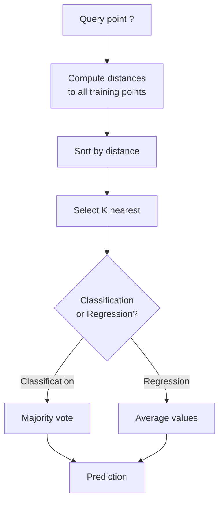
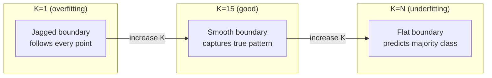
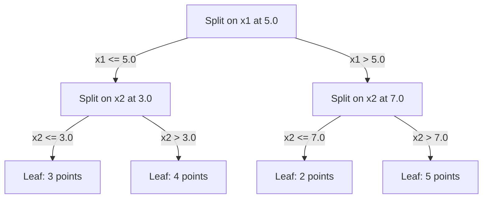

# K-近邻算法与距离

> 存储一切。通过查看邻居来预测。简单而有效的算法。

**类型：** 构建
**语言：** Python
**前提：** 第1阶段（第14课：范数与距离）
**时间：** 约90分钟

## 学习目标

- 从零实现可配置K值和距离加权投票的KNN分类与回归
- 比较L1、L2、余弦和闵可夫斯基距离度量，并为特定数据类型选择合适度量
- 解释维度灾难，并演示KNN在高维空间中性能下降的原因
- 构建KD树实现高效近邻搜索，并分析其何时优于暴力搜索

## 问题描述

你有一个数据集。一个新数据点到来。你需要对其进行分类或预测其值。与从数据中学习参数的方法（如线性回归或支持向量机）不同，KNN只需找到与新点最近的K个训练点，并让它们投票。

这就是K-近邻算法。没有训练阶段。没有需要学习的参数。没有需要最小化的损失函数。你存储整个训练集，并在预测时计算距离。

听起来过于简单以至于难以奏效。但KNN在许多问题上表现出奇地好，尤其对于中小型数据集。深入理解它能揭示基本概念：距离度量的选择（关联到第1阶段第14课）、维度灾难，以及懒惰学习与急切学习的区别。

KNN也以不同名称出现在现代AI各处。向量数据库对嵌入进行KNN搜索。检索增强生成（RAG）查找K个最近的文档片段。推荐系统查找相似用户或物品。算法本质相同。规模与数据结构不同。

## 核心概念

### KNN如何工作

给定标记点数据集和新查询点：

1. 计算查询点到数据集所有点的距离
2. 按距离排序
3. 选取最近的K个点
4. 分类：在K个邻居中进行多数投票
5. 回归：对K个邻居的值取平均（或加权平均）



这就是整个算法。无需拟合。无需梯度下降。无需迭代训练。

### 选择K值

K是唯一的超参数。它控制偏差-方差权衡：

| K值 | 行为 |
|-----|------|
| K = 1 | 决策边界紧贴每个点。训练误差为零。高方差。过拟合 |
| 小K（3-5） | 对局部结构敏感。能捕获复杂边界 |
| 大K | 边界更平滑。对噪声更鲁棒。可能欠拟合 |
| K = N | 对所有点预测多数类。最大偏差 |

常见起点是K = √N（N为数据集点数）。二分类时使用奇数K以避免票数相同。



### 距离度量

距离函数定义“近”的含义。不同度量产生不同的邻居，不同的预测。

**L2（欧氏距离）**是默认选择。直线距离。

```
d(a, b) = sqrt(sum((a_i - b_i)^2))
```

对特征尺度敏感。使用L2进行KNN前务必标准化特征。

**L1（曼哈顿距离）**计算绝对差之和。比L2对离群点更鲁棒，因为不计算差的平方。

```
d(a, b) = sum(|a_i - b_i|)
```

**余弦距离**衡量向量间夹角，忽略幅度。对文本和嵌入数据至关重要。

```
d(a, b) = 1 - (a . b) / (||a|| * ||b||)
```

**闵可夫斯基距离**用参数p概括L1和L2。

```
d(a, b) = (sum(|a_i - b_i|^p))^(1/p)

p=1: Manhattan
p=2: Euclidean
p->inf: Chebyshev (max absolute difference)
```

使用何种度量取决于数据：

| 数据类型 | 最佳度量 | 原因 |
|----------|----------|------|
| 数值特征，尺度相似 | L2（欧氏距离） | 默认选择，适用于空间数据 |
| 数值特征，有离群点 | L1（曼哈顿距离） | 鲁棒，不放大较大差异 |
| 文本嵌入 | 余弦距离 | 幅度是噪声，方向是语义 |
| 高维稀疏数据 | 余弦或L1 | L2受维度灾难影响严重 |
| 混合类型 | 自定义距离 | 根据特征类型组合度量 |

### 加权KNN

标准KNN对所有K个邻居赋予相同权重。但距离0.1的邻居应比距离5.0的邻居更重要。

**距离加权KNN**根据距离的倒数为每个邻居加权：

```
weight_i = 1 / (distance_i + epsilon)

For classification: weighted vote
For regression:     weighted average = sum(w_i * y_i) / sum(w_i)
```

epsilon防止当查询点恰好与训练点完全重合时除零。

加权KNN对K值选择不太敏感，因为无论K值如何，远处邻居的贡献都很小。

### 维度灾难

KNN性能在高维空间会下降。这不是模糊担忧，而是数学事实。

**问题1：距离趋同。** 随着维度增加，最大距离与最小距离的比值趋近于1。所有点与查询点“同样远”。

```
In d dimensions, for random uniform points:

d=2:    max_dist / min_dist = varies widely
d=100:  max_dist / min_dist ~ 1.01
d=1000: max_dist / min_dist ~ 1.001

When all distances are nearly equal, "nearest" is meaningless.
```

**问题2：体积爆炸。** 为在固定数据比例内捕获K个邻居，需要扩大搜索半径以覆盖特征空间的更大比例。高维空间的“邻域”包含大部分空间。

**问题3：角落主导。** 在d维单位超立方体中，大部分体积集中在角落附近而非中心。当d增大时，内切于立方体的球体包含的体积比例趋近于零。

实际影响：KNN在特征数约20-50个时表现良好。超过此范围，需要先降维（PCA、UMAP、t-SNE）再应用KNN，或使用能利用数据内在低维性的树结构搜索。

### KD树：快速近邻搜索

暴力KNN计算查询点到每个训练点的距离。每次查询复杂度为O(n * d)。对大型数据集太慢。

KD树沿特征轴递归划分空间。每层沿某个维度的中位值进行划分。



查找最近邻时，遍历树到包含查询点的叶节点，然后回溯并检查邻近分区（仅当可能包含更近点时）。

平均查询时间：低维空间O(log n)。但高维空间（d > 20）会退化为O(n)，因为回溯能排除的分支越来越少。

### 球树：更适用于中等维度

球树将数据划分为嵌套超球体而非轴对齐方框。每个节点定义一个球（中心+半径），包含该子树中的所有点。

相比KD树的优势：
- 在中等维度（最高约50维）表现更好
- 能处理非轴对齐结构
- 更紧密的边界体积意味着搜索时能剪枝更多分支

KD树和球树都是精确算法。对于真正的大规模搜索（百万点、数百维），使用近似最近邻方法（HNSW、IVF、乘积量化）。这些内容在第1阶段第14课介绍。

### 懒惰学习与急切学习

KNN是懒惰学习器：训练时不做任何计算，所有工作在预测时完成。大多数其他算法（线性回归、SVM、神经网络）是急切学习器：训练时进行大量计算构建紧凑模型，预测很快。

| 方面 | 懒惰学习（KNN） | 急切学习（SVM、神经网络） |
|------|----------------|------------------------|
| 训练时间 | O(1) 仅存储数据 | O(n * 迭代次数) |
| 预测时间 | O(n * d) 每次查询 | O(d) 或 O(参数量) |
| 预测时内存 | 存储整个训练集 | 仅存储模型参数 |
| 适应新数据 | 立即添加点 | 需重新训练模型 |
| 决策边界 | 隐式，动态计算 | 显式，训练后固定 |

懒惰学习适用于：
- 数据集频繁变化（添加/删除点无需重新训练）
- 查询量很少
- 希望零训练时间
- 数据集足够小使得暴力搜索很快

### KNN用于回归

KNN回归通过平均K个邻居的目标值而非多数投票进行预测。

```
prediction = (1/K) * sum(y_i for i in K nearest neighbors)

Or with distance weighting:
prediction = sum(w_i * y_i) / sum(w_i)
where w_i = 1 / distance_i
```

KNN回归产生分段常数（或加权时分段平滑）的预测。它不能外推至训练数据范围之外。如果训练目标都在0到100之间，KNN永远不会预测200。

## 实现步骤

### 步骤1：距离函数

实现L1、L2、余弦和闵可夫斯基距离。这些直接关联第1阶段第14课。

```python
import math

def l2_distance(a, b):
    return math.sqrt(sum((ai - bi) ** 2 for ai, bi in zip(a, b)))

def l1_distance(a, b):
    return sum(abs(ai - bi) for ai, bi in zip(a, b))

def cosine_distance(a, b):
    dot_val = sum(ai * bi for ai, bi in zip(a, b))
    norm_a = math.sqrt(sum(ai ** 2 for ai in a))
    norm_b = math.sqrt(sum(bi ** 2 for bi in b))
    if norm_a == 0 or norm_b == 0:
        return 1.0
    return 1.0 - dot_val / (norm_a * norm_b)

def minkowski_distance(a, b, p=2):
    if p == float('inf'):
        return max(abs(ai - bi) for ai, bi in zip(a, b))
    return sum(abs(ai - bi) ** p for ai, bi in zip(a, b)) ** (1 / p)
```

### 步骤2：KNN分类器和回归器

构建完整的KNN，支持可配置K、距离度量和可选的距离加权。

```python
class KNN:
    def __init__(self, k=5, distance_fn=l2_distance, weighted=False,
                 task="classification"):
        self.k = k
        self.distance_fn = distance_fn
        self.weighted = weighted
        self.task = task
        self.X_train = None
        self.y_train = None

    def fit(self, X, y):
        self.X_train = X
        self.y_train = y

    def predict(self, X):
        return [self._predict_one(x) for x in X]
```

### 步骤3：构建KD树实现高效搜索

从零构建KD树，递归地在每个维度的中位数上进行划分。

```python
class KDTree:
    def __init__(self, X, indices=None, depth=0):
        # Recursively partition the data
        self.axis = depth % len(X[0])
        # Split on median of the current axis
        ...

    def query(self, point, k=1):
        # Traverse to leaf, then backtrack
        ...
```

完整实现（含所有辅助方法和演示）见`code/knn.py`。

### 步骤4：特征缩放

KNN需要特征缩放，因为距离对特征幅度敏感。范围0到1000的特征会主导范围0到1的特征。

```python
def standardize(X):
    n = len(X)
    d = len(X[0])
    means = [sum(X[i][j] for i in range(n)) / n for j in range(d)]
    stds = [
        max(1e-10, (sum((X[i][j] - means[j]) ** 2 for i in range(n)) / n) ** 0.5)
        for j in range(d)
    ]
    return [[((X[i][j] - means[j]) / stds[j]) for j in range(d)] for i in range(n)], means, stds
```

## 使用方法

使用scikit-learn：

```python
from sklearn.neighbors import KNeighborsClassifier
from sklearn.preprocessing import StandardScaler
from sklearn.pipeline import Pipeline

clf = Pipeline([
    ("scaler", StandardScaler()),
    ("knn", KNeighborsClassifier(n_neighbors=5, metric="euclidean")),
])
clf.fit(X_train, y_train)
print(f"Accuracy: {clf.score(X_test, y_test):.4f}")
```

当数据集足够大且维度足够低时，scikit-learn会自动使用KD树或球树。对于高维数据，会退回到暴力搜索。可通过`algorithm`参数控制。

对于大规模近邻搜索（百万向量），使用FAISS、Annoy或向量数据库：

```python
import faiss

index = faiss.IndexFlatL2(dimension)
index.add(embeddings)
distances, indices = index.search(query_vectors, k=5)
```

## 练习

1. 在3类2D数据集上实现KNN分类。绘制K=1、K=5、K=15和K=N时的决策边界。观察从过拟合到欠拟合的过渡。

2. 在2、5、10、50、100和500维空间中各生成1000个随机点。对每个维度，计算最大成对距离与最小成对距离的比值。绘制比值与维度的关系图，直观展示维度灾难。

3. 在文本分类问题（使用TF-IDF向量）上比较L1、L2和余弦距离的KNN性能。哪种度量准确率最高？为什么余弦距离在文本上通常更优？

4. 实现KD树，测量1k、10k和100k个点在2维、10维和50维数据集上查询时间与暴力搜索的对比。在哪个维度上KD树不再比暴力搜索快？

5. 构建加权KNN回归器拟合y = sin(x) + 噪声。与K=3、10、30时的无权重KNN对比。证明加权能产生更平滑的预测，尤其当K较大时。

## 核心术语

| 术语 | 实际含义 |
|------|----------|
| K-近邻算法 | 非参数算法，通过查找距查询点最近的K个训练点进行预测 |
| 懒惰学习 | 训练时不做计算。所有工作在预测时完成。KNN是典型例子 |
| 急切学习 | 训练时进行大量计算以构建紧凑模型。大多数机器学习算法都是急切的 |
| 维度灾难 | 高维空间中距离趋同，邻域扩大覆盖大部分空间，使KNN失效 |
| KD树 | 递归沿特征轴划分空间的二叉树。低维空间查询时间O(log n) |
| 球树 | 嵌套超球体构成的树。在中等维度（最高约50）比KD树表现更好 |
| 加权KNN | 邻居按距离倒数加权。近邻对预测影响更大 |
| 特征缩放 | 将特征标准化到可比范围。基于距离的方法（如KNN）必需 |
| 多数投票 | 通过统计K个邻居中最常见的类别进行分类 |
| 暴力搜索 | 计算到每个训练点的距离。每次查询O(n*d)。精确但大型n下慢 |
| 近似最近邻 | 比精确搜索更快找到近似最近点的算法（HNSW、LSH、IVF） |
| Voronoi图 | 空间划分，每个区域包含所有比其他点更接近某个训练点的点。K=1的KNN产生Voronoi边界 |

## 延伸阅读

- [Cover & Hart: 最近邻模式分类 (1967)](https://ieeexplore.ieee.org/document/1053964) - 基础KNN论文，证明其错误率不超过贝叶斯最优的两倍
- [Friedman, Bentley, Finkel: 以对数期望时间查找最佳匹配的算法 (1977)](https://dl.acm.org/doi/10.1145/355744.355745) - 原始KD树论文
- [Beyer et al.: 何时“最近邻”有意义？ (1999)](https://link.springer.com/chapter/10.1007/3-540-49257-7_15) - 最近邻维度灾难的形式化分析
- [scikit-learn 近邻算法文档](https://scikit-learn.org/stable/modules/neighbors.html) - 含算法选择的实用指南
- [FAISS: 高效相似性搜索库](https://github.com/facebookresearch/faiss) - Meta的十亿级近似最近邻搜索库