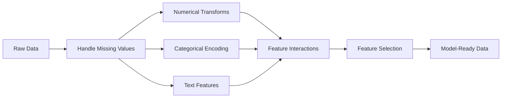

# 特征工程与选择

> 一个好特征抵得上一千个数据点。

**类型:** 构建  
**语言:** Python  
**前提条件:** 阶段一（机器学习统计学、线性代数），阶段二课程1-7  
**时间:** ~90分钟

## 学习目标

- 实现数值变换（标准化、最小-最大缩放、对数变换、分箱）并解释每种变换适用的场景
- 为类别特征构建独热编码、标签编码和目标编码，并识别目标编码中的数据泄露风险
- 从零构建TF-IDF向量化器，并解释为何其在文本分类中优于原始词频
- 应用基于过滤器的特征选择（方差阈值、相关性、互信息）来降低维度

## 问题描述

你有一个数据集。你选择一个算法。你训练它。结果平平。你尝试更复杂的算法。仍然平平。你花了一周调参。略有提升。

然后有人将原始数据转化为更好的特征，一个简单的逻辑回归就打败了你精心调优的梯度提升集成模型。

这种情况经常发生。在经典机器学习中，数据的表示比算法选择更重要。一个使用"平方英尺"和"卧室数量"特征的房屋价格模型，无论学习器多么复杂，都会打败一个将"原始地址字符串"作为特征的模型。算法只能基于你提供的信息工作。

特征工程是将原始数据转化为更容易让模型发现模式的过程。特征选择是丢弃那些只增加噪声而不提供信号的特征的过程。两者结合，是经典机器学习中杠杆作用最高的活动。

## 概念

### 特征处理流程



### 数值特征

原始数字通常不能直接用于模型。常见变换：

**缩放：** 将特征置于相同范围，使得基于距离的算法（K-Means, KNN, SVM）能平等对待所有特征。最小-最大缩放映射到 [0, 1]。标准化（z分数）映射为均值=0，标准差=1。

**对数变换：** 压缩右偏分布（如收入、人口、词频）。将乘法关系转换为加法关系。

**分箱：** 将连续值转换为类别。当特征与目标的关系是非线性但呈阶梯状时（如年龄组）很有用。

**多项式特征：** 创建 x^2, x^3, x1*x2 等项。允许线性模型捕获非线性关系，代价是特征数增加。

### 类别特征

模型需要数字。类别需要编码。

**独热编码：** 为每个类别创建一个二进制列。"颜色 = 红/蓝/绿" 变成三列：is_red, is_blue, is_green。对于基数较低的特征效果很好，但当类别很多时特征维度会爆炸。

**标签编码：** 将每个类别映射到一个整数：红=0，蓝=1，绿=2。引入了错误的顺序关系（模型可能认为 绿 > 蓝 > 红）。仅适用于基于树的模型（它们可以按单个值进行分裂）。

**目标编码：** 用该类别对应目标变量的平均值替换每个类别。强大但危险：数据泄露风险高。必须仅在训练数据上计算，并应用于测试数据。

### 文本特征

**计数向量化器：** 统计每个词在文档中出现的次数。"the cat sat on the mat" 变成 {the: 2, cat: 1, sat: 1, on: 1, mat: 1}。

**TF-IDF：** 词频-逆文档频率。根据词在整个文档集合中的独特程度进行加权。常见词如 "the" 获得低权重。罕见的、有区分度的词获得高权重。

```
TF(word, doc) = count(word in doc) / total words in doc
IDF(word) = log(total docs / docs containing word)
TF-IDF = TF * IDF
```

### 缺失值

真实数据有缺失。策略：

- **删除行：** 仅当缺失数据稀少且随机时使用
- **均值/中位数插补：** 简单，保持分布形状（中位数对异常值更稳健）
- **众数插补：** 用于类别特征
- **指示列：** 在插补前添加一个二进制列 "was_this_missing"。数据缺失的事实本身可能具有信息量
- **前向/后向填充：** 用于时间序列数据

### 特征交互

有时关系存在于组合中。单独的"身高"和"体重"比"BMI = 体重 / 身高^2"的预测能力弱。特征交互会倍增特征空间，因此需利用领域知识来选择正确的交互项。

### 特征选择

特征不是越多越好。不相关特征会增加噪声、增加训练时间，并可能导致过拟合。

**过滤方法（模型前）：**
- 相关性：删除彼此高度相关的特征（冗余）
- 互信息：衡量知道一个特征能在多大程度上减少关于目标的不确定性
- 方差阈值：删除变化极小的特征

**包裹方法（基于模型）：**
- L1正则化（Lasso）：将不相关特征的权重精确驱动为零
- 递归特征消除：训练，移除最不重要的特征，重复

**为什么选择很重要：** 一个只有10个好特征的模型，通常会优于一个拥有10个好特征和90个噪声特征的模型。噪声特征给了模型在不泛化的训练数据模式上过拟合的机会。

## 从零构建

### 第1步：从零实现数值变换

```python
import math


def min_max_scale(values):
    min_val = min(values)
    max_val = max(values)
    if max_val == min_val:
        return [0.0] * len(values)
    return [(v - min_val) / (max_val - min_val) for v in values]


def standardize(values):
    n = len(values)
    mean = sum(values) / n
    variance = sum((v - mean) ** 2 for v in values) / n
    std = math.sqrt(variance) if variance > 0 else 1.0
    return [(v - mean) / std for v in values]


def log_transform(values):
    return [math.log(v + 1) for v in values]


def bin_values(values, n_bins=5):
    min_val = min(values)
    max_val = max(values)
    bin_width = (max_val - min_val) / n_bins
    if bin_width == 0:
        return [0] * len(values)
    result = []
    for v in values:
        bin_idx = int((v - min_val) / bin_width)
        bin_idx = min(bin_idx, n_bins - 1)
        result.append(bin_idx)
    return result


def polynomial_features(row, degree=2):
    n = len(row)
    result = list(row)
    if degree >= 2:
        for i in range(n):
            result.append(row[i] ** 2)
        for i in range(n):
            for j in range(i + 1, n):
                result.append(row[i] * row[j])
    return result
```

### 第2步：从零实现类别编码

```python
def one_hot_encode(values):
    categories = sorted(set(values))
    cat_to_idx = {cat: i for i, cat in enumerate(categories)}
    n_cats = len(categories)

    encoded = []
    for v in values:
        row = [0] * n_cats
        row[cat_to_idx[v]] = 1
        encoded.append(row)

    return encoded, categories


def label_encode(values):
    categories = sorted(set(values))
    cat_to_int = {cat: i for i, cat in enumerate(categories)}
    return [cat_to_int[v] for v in values], cat_to_int


def target_encode(feature_values, target_values, smoothing=10):
    global_mean = sum(target_values) / len(target_values)

    category_stats = {}
    for feat, target in zip(feature_values, target_values):
        if feat not in category_stats:
            category_stats[feat] = {"sum": 0.0, "count": 0}
        category_stats[feat]["sum"] += target
        category_stats[feat]["count"] += 1

    encoding = {}
    for cat, stats in category_stats.items():
        cat_mean = stats["sum"] / stats["count"]
        weight = stats["count"] / (stats["count"] + smoothing)
        encoding[cat] = weight * cat_mean + (1 - weight) * global_mean

    return [encoding[v] for v in feature_values], encoding
```

### 第3步：从零实现文本特征

```python
def count_vectorize(documents):
    vocab = {}
    idx = 0
    for doc in documents:
        for word in doc.lower().split():
            if word not in vocab:
                vocab[word] = idx
                idx += 1

    vectors = []
    for doc in documents:
        vec = [0] * len(vocab)
        for word in doc.lower().split():
            vec[vocab[word]] += 1
        vectors.append(vec)

    return vectors, vocab


def tfidf(documents):
    n_docs = len(documents)

    vocab = {}
    idx = 0
    for doc in documents:
        for word in doc.lower().split():
            if word not in vocab:
                vocab[word] = idx
                idx += 1

    doc_freq = {}
    for doc in documents:
        seen = set()
        for word in doc.lower().split():
            if word not in seen:
                doc_freq[word] = doc_freq.get(word, 0) + 1
                seen.add(word)

    vectors = []
    for doc in documents:
        words = doc.lower().split()
        word_count = len(words)
        tf_map = {}
        for word in words:
            tf_map[word] = tf_map.get(word, 0) + 1

        vec = [0.0] * len(vocab)
        for word, count in tf_map.items():
            tf = count / word_count
            idf = math.log(n_docs / doc_freq[word])
            vec[vocab[word]] = tf * idf
        vectors.append(vec)

    return vectors, vocab
```

### 第4步：从零实现缺失值插补

```python
def impute_mean(values):
    present = [v for v in values if v is not None]
    if not present:
        return [0.0] * len(values), 0.0
    mean = sum(present) / len(present)
    return [v if v is not None else mean for v in values], mean


def impute_median(values):
    present = sorted(v for v in values if v is not None)
    if not present:
        return [0.0] * len(values), 0.0
    n = len(present)
    if n % 2 == 0:
        median = (present[n // 2 - 1] + present[n // 2]) / 2
    else:
        median = present[n // 2]
    return [v if v is not None else median for v in values], median


def impute_mode(values):
    present = [v for v in values if v is not None]
    if not present:
        return values, None
    counts = {}
    for v in present:
        counts[v] = counts.get(v, 0) + 1
    mode = max(counts, key=counts.get)
    return [v if v is not None else mode for v in values], mode


def add_missing_indicator(values):
    return [0 if v is not None else 1 for v in values]
```

### 第5步：从零实现特征选择

```python
def correlation(x, y):
    n = len(x)
    mean_x = sum(x) / n
    mean_y = sum(y) / n
    cov = sum((xi - mean_x) * (yi - mean_y) for xi, yi in zip(x, y)) / n
    std_x = math.sqrt(sum((xi - mean_x) ** 2 for xi in x) / n)
    std_y = math.sqrt(sum((yi - mean_y) ** 2 for yi in y) / n)
    if std_x == 0 or std_y == 0:
        return 0.0
    return cov / (std_x * std_y)


def mutual_information(feature, target, n_bins=10):
    feat_min = min(feature)
    feat_max = max(feature)
    bin_width = (feat_max - feat_min) / n_bins if feat_max != feat_min else 1.0
    feat_binned = [
        min(int((f - feat_min) / bin_width), n_bins - 1) for f in feature
    ]

    n = len(feature)
    target_classes = sorted(set(target))

    feat_bins = sorted(set(feat_binned))
    p_feat = {}
    for b in feat_bins:
        p_feat[b] = feat_binned.count(b) / n

    p_target = {}
    for t in target_classes:
        p_target[t] = target.count(t) / n

    mi = 0.0
    for b in feat_bins:
        for t in target_classes:
            joint_count = sum(
                1 for fb, tv in zip(feat_binned, target) if fb == b and tv == t
            )
            p_joint = joint_count / n
            if p_joint > 0:
                mi += p_joint * math.log(p_joint / (p_feat[b] * p_target[t]))

    return mi


def variance_threshold(features, threshold=0.01):
    n_features = len(features[0])
    n_samples = len(features)
    selected = []

    for j in range(n_features):
        col = [features[i][j] for i in range(n_samples)]
        mean = sum(col) / n_samples
        var = sum((v - mean) ** 2 for v in col) / n_samples
        if var >= threshold:
            selected.append(j)

    return selected


def remove_correlated(features, threshold=0.9):
    n_features = len(features[0])
    n_samples = len(features)

    to_remove = set()
    for i in range(n_features):
        if i in to_remove:
            continue
        col_i = [features[r][i] for r in range(n_samples)]
        for j in range(i + 1, n_features):
            if j in to_remove:
                continue
            col_j = [features[r][j] for r in range(n_samples)]
            corr = abs(correlation(col_i, col_j))
            if corr >= threshold:
                to_remove.add(j)

    return [i for i in range(n_features) if i not in to_remove]
```

### 第6步：完整流程与演示

```python
import random


def make_housing_data(n=200, seed=42):
    random.seed(seed)
    data = []
    for _ in range(n):
        sqft = random.uniform(500, 5000)
        bedrooms = random.choice([1, 2, 3, 4, 5])
        age = random.uniform(0, 50)
        neighborhood = random.choice(["downtown", "suburbs", "rural"])
        has_pool = random.choice([True, False])

        sqft_with_missing = sqft if random.random() > 0.05 else None
        age_with_missing = age if random.random() > 0.08 else None

        price = (
            50 * sqft
            + 20000 * bedrooms
            - 1000 * age
            + (50000 if neighborhood == "downtown" else 10000 if neighborhood == "suburbs" else 0)
            + (15000 if has_pool else 0)
            + random.gauss(0, 20000)
        )

        data.append({
            "sqft": sqft_with_missing,
            "bedrooms": bedrooms,
            "age": age_with_missing,
            "neighborhood": neighborhood,
            "has_pool": has_pool,
            "price": price,
        })
    return data


if __name__ == "__main__":
    data = make_housing_data(200)

    print("=== Raw Data Sample ===")
    for row in data[:3]:
        print(f"  {row}")

    sqft_raw = [d["sqft"] for d in data]
    age_raw = [d["age"] for d in data]
    prices = [d["price"] for d in data]

    print("\n=== Missing Value Handling ===")
    sqft_missing = sum(1 for v in sqft_raw if v is None)
    age_missing = sum(1 for v in age_raw if v is None)
    print(f"  sqft missing: {sqft_missing}/{len(sqft_raw)}")
    print(f"  age missing: {age_missing}/{len(age_raw)}")

    sqft_indicator = add_missing_indicator(sqft_raw)
    age_indicator = add_missing_indicator(age_raw)
    sqft_imputed, sqft_fill = impute_median(sqft_raw)
    age_imputed, age_fill = impute_mean(age_raw)
    print(f"  sqft filled with median: {sqft_fill:.0f}")
    print(f"  age filled with mean: {age_fill:.1f}")

    print("\n=== Numerical Transforms ===")
    sqft_scaled = standardize(sqft_imputed)
    age_scaled = min_max_scale(age_imputed)
    sqft_log = log_transform(sqft_imputed)
    age_binned = bin_values(age_imputed, n_bins=5)
    print(f"  sqft standardized: mean={sum(sqft_scaled)/len(sqft_scaled):.4f}, std={math.sqrt(sum(v**2 for v in sqft_scaled)/len(sqft_scaled)):.4f}")
    print(f"  age min-max: [{min(age_scaled):.2f}, {max(age_scaled):.2f}]")
    print(f"  age bins: {sorted(set(age_binned))}")

    print("\n=== Categorical Encoding ===")
    neighborhoods = [d["neighborhood"] for d in data]

    ohe, ohe_cats = one_hot_encode(neighborhoods)
    print(f"  One-hot categories: {ohe_cats}")
    print(f"  Sample encoding: {neighborhoods[0]} -> {ohe[0]}")

    le, le_map = label_encode(neighborhoods)
    print(f"  Label encoding map: {le_map}")

    te, te_map = target_encode(neighborhoods, prices, smoothing=10)
    print(f"  Target encoding: {({k: round(v) for k, v in te_map.items()})}")

    print("\n=== Text Features ===")
    descriptions = [
        "large modern house with pool",
        "small cozy cottage near downtown",
        "spacious family home with large yard",
        "modern apartment downtown with view",
        "rustic cabin in rural area",
    ]
    cv, cv_vocab = count_vectorize(descriptions)
    print(f"  Vocabulary size: {len(cv_vocab)}")
    print(f"  Doc 0 non-zero features: {sum(1 for v in cv[0] if v > 0)}")

    tf, tf_vocab = tfidf(descriptions)
    print(f"  TF-IDF vocabulary size: {len(tf_vocab)}")
    top_words = sorted(tf_vocab.keys(), key=lambda w: tf[0][tf_vocab[w]], reverse=True)[:3]
    print(f"  Doc 0 top TF-IDF words: {top_words}")

    print("\n=== Polynomial Features ===")
    sample_row = [sqft_scaled[0], age_scaled[0]]
    poly = polynomial_features(sample_row, degree=2)
    print(f"  Input: {[round(v, 4) for v in sample_row]}")
    print(f"  Polynomial: {[round(v, 4) for v in poly]}")
    print(f"  Features: [x1, x2, x1^2, x2^2, x1*x2]")

    print("\n=== Feature Selection ===")
    feature_matrix = [
        [sqft_scaled[i], age_scaled[i], float(sqft_indicator[i]), float(age_indicator[i])]
        + ohe[i]
        for i in range(len(data))
    ]

    print(f"  Total features: {len(feature_matrix[0])}")

    surviving_var = variance_threshold(feature_matrix, threshold=0.01)
    print(f"  After variance threshold (0.01): {len(surviving_var)} features kept")

    surviving_corr = remove_correlated(feature_matrix, threshold=0.9)
    print(f"  After correlation filter (0.9): {len(surviving_corr)} features kept")

    binary_prices = [1 if p > sum(prices) / len(prices) else 0 for p in prices]
    print("\n  Mutual information with target:")
    feature_names = ["sqft", "age", "sqft_missing", "age_missing"] + [f"neigh_{c}" for c in ohe_cats]
    for j in range(len(feature_matrix[0])):
        col = [feature_matrix[i][j] for i in range(len(feature_matrix))]
        mi = mutual_information(col, binary_prices, n_bins=10)
        print(f"    {feature_names[j]}: MI={mi:.4f}")

    print("\n  Correlation with price:")
    for j in range(len(feature_matrix[0])):
        col = [feature_matrix[i][j] for i in range(len(feature_matrix))]
        corr = correlation(col, prices)
        print(f"    {feature_names[j]}: r={corr:.4f}")
```

## 实际使用

使用scikit-learn，这些变换可以组合成流水线：

```python
from sklearn.preprocessing import StandardScaler, OneHotEncoder, PolynomialFeatures
from sklearn.impute import SimpleImputer
from sklearn.feature_extraction.text import TfidfVectorizer
from sklearn.feature_selection import mutual_info_classif, VarianceThreshold
from sklearn.compose import ColumnTransformer
from sklearn.pipeline import Pipeline

numeric_pipe = Pipeline([
    ("imputer", SimpleImputer(strategy="median")),
    ("scaler", StandardScaler()),
])

categorical_pipe = Pipeline([
    ("encoder", OneHotEncoder(sparse_output=False)),
])

preprocessor = ColumnTransformer([
    ("num", numeric_pipe, ["sqft", "age"]),
    ("cat", categorical_pipe, ["neighborhood"]),
])
```

从零实现的版本展示了每个变换内部的确切运作方式。库版本增加了边界情况处理、稀疏矩阵支持和流水线组合，但其数学原理是相同的。

## 成果产出

本课程产出：
- `outputs/prompt-feature-engineer.md` - 一个用于系统性地从原始数据进行特征工程的提示

## 练习

1.  在数值变换中添加稳健缩放（使用中位数和四分位距，而非均值和标准差）。在包含极端异常值的数据上，将其与标准缩放进行比较。
2.  实现留一法目标编码：对于每一行，计算排除该行自身目标值后的目标均值。展示这与朴素目标编码相比如何减少过拟合。
3.  构建一个自动化特征选择流水线，结合方差阈值、相关性过滤和互信息排序。将其应用于住房数据集，并比较使用全部特征与选定特征时的模型性能（使用简单线性回归）。

## 关键术语

| 术语 | 通俗说法 | 实际含义 |
|------|---------|---------|
| 特征工程 | "造新列" | 将原始数据转化为能向模型暴露模式的表示 |
| 标准化 | "弄成正态分布" | 减去均值并除以标准差，使特征具有均值=0和标准差=1 |
| 独热编码 | "创建虚拟变量" | 为每个类别创建一个二进制列，使得每行只有一个列的值为1 |
| 目标编码 | "用答案来编码" | 用该类别的平均目标值替换每个类别，并进行平滑处理以防止过拟合 |
| TF-IDF | "高级词频统计" | 词频乘以逆文档频率：根据词在语料库中的独特性进行加权 |
| 插补 | "填空" | 用估计值（均值、中位数、众数或模型预测值）替换缺失值 |
| 特征选择 | "扔掉坏列" | 移除增加噪声或冗余的特征，只保留包含关于目标信号的那些 |
| 互信息 | "一件事告诉你多少关于另一件事的信息" | 通过观察变量X所获得的关于变量Y不确定性的减少量的度量 |
| 数据泄露 | "无意中作弊" | 在训练过程中使用了预测时不可用的信息，导致过于乐观的结果 |

## 延伸阅读

- [《特征工程与选择》(Max Kuhn & Kjell Johnson)](http://www.feat.engineering/) - 涵盖特征工程全貌的免费在线书籍
- [scikit-learn 预处理指南](https://scikit-learn.org/stable/modules/preprocessing.html) - 所有标准变换的实用参考
- [《正确实施目标编码》(Micci-Barreca, 2001)](https://dl.acm.org/doi/10.1145/507533.507538) - 关于带平滑处理的目标编码的原始论文