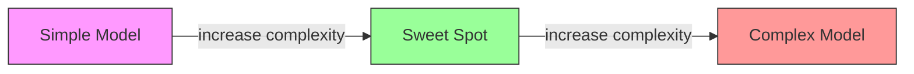
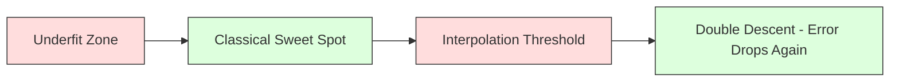
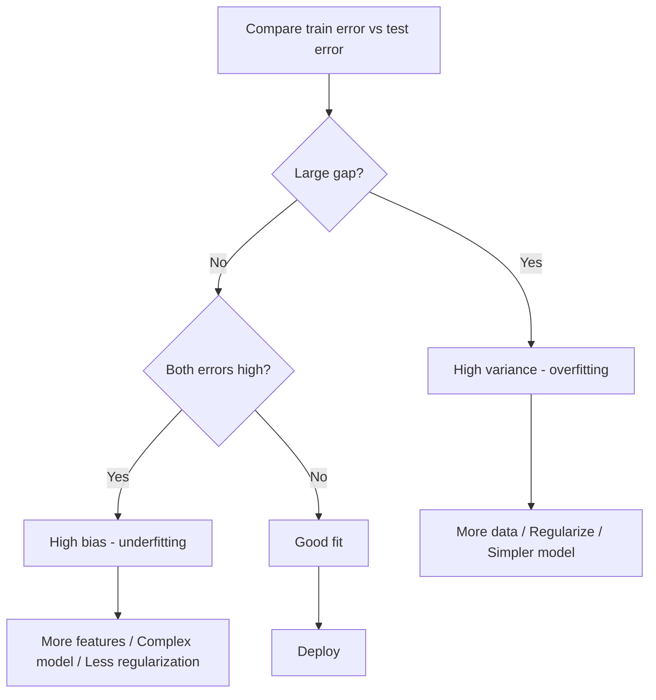
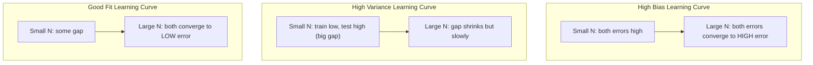
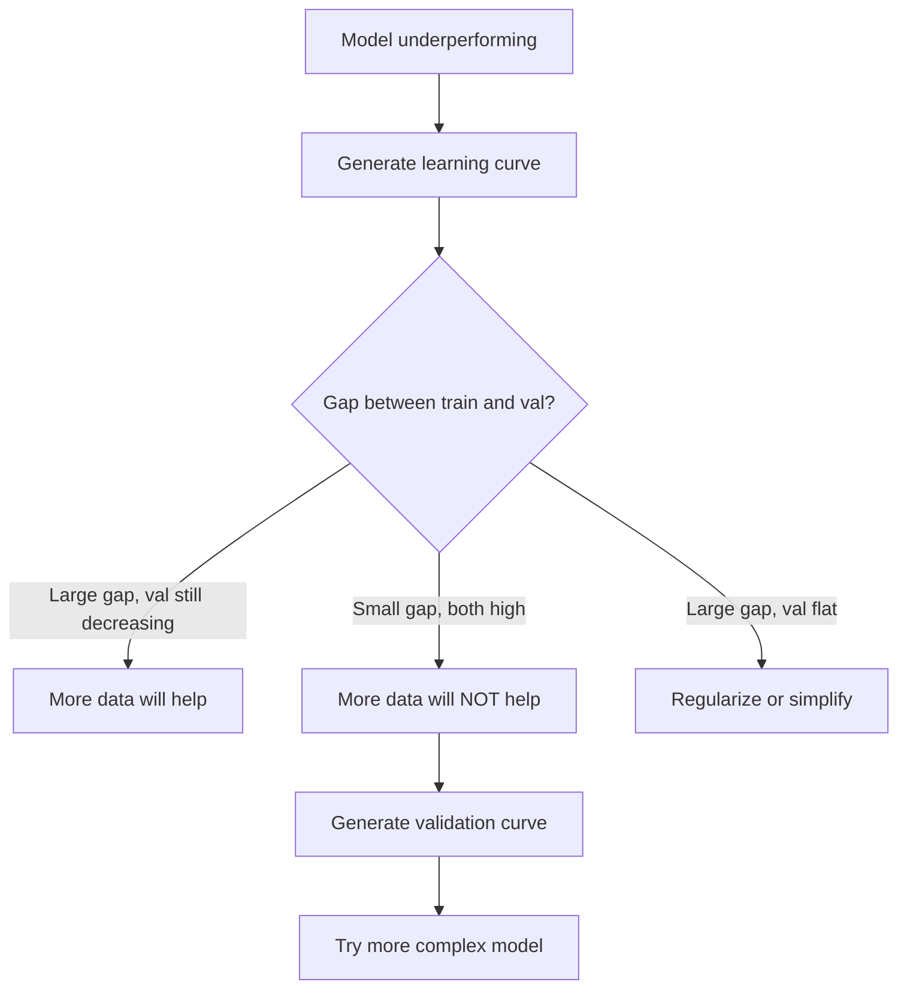

# 偏差-方差权衡

> 每个模型误差都源于三个来源之一：偏差、方差或噪声。你只能控制前两者。

**类型：** 学习  
**语言：** Python  
**先决条件：** 第 2 阶段，课程 01-09（机器学习基础、回归、分类、评估）  
**时间：** 约 75 分钟

## 学习目标

- 推导期望预测误差的偏差-方差分解，并解释不可约噪声的作用
- 利用训练和测试误差模式诊断模型是否遭受高偏差或高方差问题
- 解释正则化技术（L1、L2、丢弃法、早停法）如何用偏差换取方差
- 实现实验，可视化不同复杂度模型间的偏差-方差权衡

## 问题所在

你训练了一个模型。它在测试数据上有一些误差。这些误差从何而来？

如果你的模型过于简单（例如用线性回归拟合弯曲数据集），它将始终无法捕捉真实模式。这就是偏差。如果你的模型过于复杂（例如在 15 个数据点上拟合 20 次多项式），它会完美拟合训练数据，但在新数据上的预测会天差地别。这就是方差。

对于固定容量的模型，你无法同时最小化两者。降低偏差会导致方差上升；降低方差会导致偏差上升。理解这种权衡是机器学习中最实用的诊断技能。它能告诉你应增加还是减少模型复杂度，是否需要更多数据或更好的特征工程，是否需要更多或更少的正则化。

## 概念解析

### 偏差：系统性误差

偏差衡量模型的平均预测值与真实值之间的差距。如果在从相同分布抽取的多个不同训练集上训练同一模型并对其预测取平均，偏差就是该平均值与真实值之间的差距。

高偏差意味着模型过于僵化，无法捕捉真实规律。用直线拟合抛物线，无论你给多少数据，总会偏离曲线。这就是欠拟合。

```
High bias (underfitting):
  Model always predicts roughly the same wrong thing.
  Training error: HIGH
  Test error: HIGH
  Gap between them: SMALL
```

### 方差：对训练数据的敏感性

方差衡量在不同数据子集上训练时，模型预测的变化程度。如果训练集的微小变化导致模型的巨大变化，则方差较高。

高方差意味着模型在拟合训练数据中的噪声，而非底层信号。20 次多项式会穿过每个训练点，但在点间剧烈振荡。这就是过拟合。

```
High variance (overfitting):
  Model fits training data perfectly but fails on new data.
  Training error: LOW
  Test error: HIGH
  Gap between them: LARGE
```

### 分解式

对于任意点 x，在平方损失下的期望预测误差可以精确分解为：

```
Expected Error = Bias^2 + Variance + Irreducible Noise

where:
  Bias^2   = (E[f_hat(x)] - f(x))^2
  Variance = E[(f_hat(x) - E[f_hat(x)])^2]
  Noise    = E[(y - f(x))^2]             (sigma^2)
```

- `f(x)` 是真实函数
- `f_hat(x)` 是你的模型预测
- `E[...]` 是在不同训练集上的期望
- `y` 是观测标签（真实函数加噪声）

噪声项是不可约的。没有模型能在有噪声数据上比 sigma^2 做得更好。你的任务是在偏差平方和方差之间找到合适的平衡。

### 模型复杂度与误差



经典的 U 形曲线：

| 复杂度 | 偏差 | 方差 | 总误差 |
|--------|------|------|--------|
| 过低   | 高   | 低   | 高（欠拟合） |
| 恰好   | 适中 | 适中 | 最低 |
| 过高   | 低   | 高   | 高（过拟合） |

### 正则化作为偏差-方差控制手段

正则化有意增加偏差以减少方差。它约束模型，使其无法追逐噪声。

- **L2（岭回归）：** 将所有权重向零收缩。保留所有特征但削弱其影响力。
- **L1（Lasso）：** 将部分权重精确推至零。执行特征选择。
- **丢弃法：** 训练过程中随机禁用神经元。强制学习冗余表示。
- **早停法：** 在模型完全拟合训练数据前停止训练。

正则化强度（lambda、丢弃率、训练轮数）直接控制了你在偏差-方差曲线上的位置。正则化越强，偏差越大，方差越小。

### 双重下降：现代视角

经典理论认为：过了最优拐点后，复杂度越高越有害。但自 2019 年以来的研究揭示了一些出乎意料的现象。如果持续增加模型容量，远超过插值阈值（即模型有足够的参数完美拟合训练数据），测试误差可能会再次下降。



这种“双重下降”现象解释了为什么大规模过度参数化的神经网络（参数数量远多于训练样本）仍能良好泛化。经典的偏差-方差权衡并未过时，但对现代范式而言并不完整。

关于双重下降的关键观察：
- 它发生在线性模型、决策树和神经网络中
- 在插值区域，增加数据量实际上可能有害（样本维度的双重下降）
- 增加训练轮数也可能导致它（轮次维度的双重下降）
- 正则化可以平滑峰值，但无法消除它

为什么会这样？在插值阈值处，模型刚好有足够的容量拟合所有训练点。它被迫采用一种非常特定的解，穿过每个点，数据的微小扰动会导致拟合的巨大变化。这正是方差峰值所在。超过阈值后，模型存在多种完美拟合数据的解。学习算法（例如带有隐式正则化的梯度下降）倾向于从中选择最简单的解。这种对简单解的隐式偏好是过度参数化模型能够泛化的原因。

| 范式 | 参数量 vs 样本量 | 行为 |
|------|------------------|------|
| 欠参数化 | p << n | 经典权衡适用 |
| 插值阈值 | p ~ n | 方差达到峰值，测试误差激增 |
| 过参数化 | p >> n | 隐式正则化生效，测试误差下降 |

实际应用：如果你使用的是神经网络或大型树集成模型，不要停留在插值阈值处。要么远低于它（使用显式正则化），要么远超过它。最糟糕的位置恰好在阈值上。

### 诊断你的模型



| 症状 | 诊断 | 修正方法 |
|------|------|----------|
| 训练误差高，测试误差高 | 偏差问题 | 增加特征、使用更复杂模型、减少正则化 |
| 训练误差低，测试误差高 | 方差问题 | 增加数据、正则化、简化模型、使用丢弃法 |
| 训练误差低，测试误差低 | 拟合良好 | 可直接部署 |
| 训练误差下降，测试误差上升 | 过拟合进行中 | 使用早停法 |

### 实用策略

**当问题是偏差时：**
- 添加多项式或交互特征
- 使用更灵活的模型（树集成替代线性模型）
- 减少正则化强度
- 训练更长时间（如果尚未收敛）

**当问题是方差时：**
- 获取更多训练数据
- 使用装袋法（随机森林）
- 增加正则化（更大的 lambda，更多的丢弃）
- 特征选择（移除噪声特征）
- 使用交叉验证尽早发现问题

### 集成方法与方差缩减

集成方法是应对方差的最实用工具。

**装袋法（自助聚合）** 在训练数据的不同自助样本上训练多个模型，然后对其预测取平均。每个单独的模型方差都很高，但平均值的方差要低得多。随机森林就是装袋法应用于决策树的产物。

其数学原理：如果你对 N 个独立预测取平均，每个方差为 sigma^2，平均的方差为 sigma^2 / N。模型并非完全独立（它们看到的是相似数据），所以减少量小于 1/N，但效果依然显著。

**提升法** 通过顺序构建模型来减少偏差，每个新模型都侧重于当前集成的误差。梯度提升和 AdaBoost 是主要例子。如果你添加太多模型，提升法可能会过拟合，因此需要早停法或正则化。

| 方法 | 主要影响 | 偏差变化 | 方差变化 |
|------|----------|----------|----------|
| 装袋法 | 减少方差 | 不变 | 减少 |
| 提升法 | 减少偏差 | 减少 | 可能增加 |
| 堆叠法 | 同时减少 | 取决于元学习器 | 取决于基础模型 |
| 丢弃法 | 隐式装袋 | 略微增加 | 减少 |

**实用规则：** 如果你的基础模型方差很高（深度树、高次多项式），使用装袋法。如果你的基础模型偏差很高（浅树桩、简单线性模型），使用提升法。

### 学习曲线

学习曲线将训练和验证误差绘制为训练集大小的函数。这是你拥有的最实用的诊断工具。与单一的训练/测试比较不同，学习曲线展示了模型的轨迹，并告诉你更多数据是否有帮助。



如何解读：

| 场景 | 训练误差 | 验证误差 | 差距 | 含义 | 应对措施 |
|------|----------|----------|------|------|----------|
| 高偏差 | 高 | 高 | 小 | 模型无法捕捉规律 | 增加特征、复杂模型、减少正则化 |
| 高方差 | 低 | 高 | 大 | 模型记忆了训练数据 | 更多数据、正则化、简化模型 |
| 拟合良好 | 适中 | 适中 | 小 | 模型泛化良好 | 可直接部署 |
| 高方差，正在改善 | 低 | 随数据增加而下降 | 在缩小 | 数据可以解决的方差问题 | 收集更多数据 |
| 高偏差，平稳 | 高 | 高且平稳 | 小且平稳 | 更多数据**无效** | 改变模型架构 |

关键洞察：如果两条曲线都已平台期，差距小但误差都高，那么更多数据无效。你需要更好的模型。如果差距大且仍在缩小，那么更多数据会有帮助。

### 如何生成学习曲线

有两种方法：

**方法一：固定模型，改变训练集大小。** 保持模型和超参数不变。在训练数据的越来越大的子集上训练。在每个大小上测量训练误差和验证误差。这是标准的学习曲线。

**方法二：固定数据，改变模型复杂度。** 保持数据不变。扫描一个复杂度参数（多项式次数、树深度、层数）。在每个复杂度上测量训练误差和验证误差。这是验证曲线，直接展示了偏差-方差权衡。

两种方法互补。第一种告诉你更多数据是否有帮助。第二种告诉你不同模型是否有帮助。在决定下一步之前，两者都应运行。



## 动手构建

`code/bias_variance.py` 中的代码运行完整的偏差-方差分解实验。以下是分步方法。

### 步骤 1：从已知函数生成合成数据

我们使用带有高斯噪声的 `f(x) = sin(1.5x) + 0.5x`。知道真实函数让我们可以计算精确的偏差和方差。

```python
def true_function(x):
    return np.sin(1.5 * x) + 0.5 * x

def generate_data(n_samples=30, noise_std=0.5, x_range=(-3, 3), seed=None):
    rng = np.random.RandomState(seed)
    x = rng.uniform(x_range[0], x_range[1], n_samples)
    y = true_function(x) + rng.normal(0, noise_std, n_samples)
    return x, y
```

### 步骤 2：自助采样与多项式拟合

对于每个多项式次数，我们抽取多个自助训练集，拟合多项式，并记录在固定测试网格上的预测。这为我们提供了每个测试点上的预测分布。

```python
def fit_polynomial(x_train, y_train, degree, lam=0.0):
    X = np.column_stack([x_train ** d for d in range(degree + 1)])
    if lam > 0:
        penalty = lam * np.eye(X.shape[1])
        penalty[0, 0] = 0
        w = np.linalg.solve(X.T @ X + penalty, X.T @ y_train)
    else:
        w = np.linalg.lstsq(X, y_train, rcond=None)[0]
    return w
```

我们在 200 个不同的自助样本上进行拟合。每个自助样本都来自相同的底层分布，但包含不同的点。

### 步骤 3：计算偏差平方、方差分解

在每个测试点有 200 组预测后，我们可以直接从定义计算分解：

```python
mean_pred = predictions.mean(axis=0)
bias_sq = np.mean((mean_pred - y_true) ** 2)
variance = np.mean(predictions.var(axis=0))
total_error = np.mean(np.mean((predictions - y_true) ** 2, axis=1))
```

- `mean_pred` 是从自助样本估计的 E[f_hat(x)]
- `bias_sq` 是平均预测与真实值之间的平方差
- `variance` 是预测在自助样本间的平均离散度
- `total_error` 应近似等于偏差平方 + 方差 + 噪声

### 步骤 4：学习曲线

学习曲线在固定模型复杂度的同时扫描训练集大小。它们显示你的模型是受数据限制还是受容量限制。

```python
def demo_learning_curves():
    sizes = [10, 15, 20, 30, 50, 75, 100, 150, 200, 300]
    degree = 5

    for n in sizes:
        train_errors = []
        test_errors = []
        for seed in range(50):
            x_train, y_train = generate_data(n_samples=n, seed=seed * 100)
            w = fit_polynomial(x_train, y_train, degree)
            train_pred = predict_polynomial(x_train, w)
            train_mse = np.mean((train_pred - y_train) ** 2)
            test_pred = predict_polynomial(x_test, w)
            test_mse = np.mean((test_pred - y_test) ** 2)
            train_errors.append(train_mse)
            test_errors.append(test_mse)
        # Average over runs gives the learning curve point
```

对于高方差模型（数据少时使用 5 次多项式），你会看到：
- 训练误差开始很低，随着更多数据使得记忆变得更难而增加
- 测试误差开始很高，随着模型获得更多信号而下降
- 差距随着数据增加而缩小

对于高偏差模型（1 次多项式），两个误差都很快收敛到相同的高值，更多数据无济于事。

### 步骤 5：正则化扫描

代码还包括 `demo_regularization_sweep()`，它固定一个高次多项式（15 次），并从 0.001 到 100 扫描岭回归正则化强度。这从另一个角度展示了偏差-方差权衡：不是改变模型复杂度，而是改变约束强度。

```python
def demo_regularization_sweep():
    alphas = [0.001, 0.005, 0.01, 0.05, 0.1, 0.5, 1.0, 5.0, 10.0, 50.0, 100.0]
    for alpha in alphas:
        results = bias_variance_decomposition([15], lam=alpha)
        r = results[15]
        print(f"alpha={alpha:.3f}  bias={r['bias_sq']:.4f}  var={r['variance']:.4f}")
```

在 alpha 较小时，15 次多项式几乎不受约束。方差主导，因为模型在追逐每个自助样本中的噪声。在 alpha 较大时，惩罚如此强烈，以至于模型实际上变成了近似常数函数。偏差主导。最优的 alpha 介于这两个极端之间。

这与改变多项式次数得到的 U 形曲线相同，但由一个连续旋钮而非离散旋钮控制。在实践中，正则化是控制权衡的首选方式，因为它允许细粒度控制而不改变特征集。

## 使用它

sklearn 提供了 `learning_curve` 和 `validation_curve` 来自动化这些诊断，无需编写自助采样循环。

### 验证曲线：扫描模型复杂度

```python
from sklearn.model_selection import validation_curve
from sklearn.pipeline import make_pipeline
from sklearn.preprocessing import PolynomialFeatures
from sklearn.linear_model import Ridge

degrees = list(range(1, 16))
train_scores_all = []
val_scores_all = []

for d in degrees:
    pipe = make_pipeline(PolynomialFeatures(d), Ridge(alpha=0.01))
    train_scores, val_scores = validation_curve(
        pipe, X, y, param_name="polynomialfeatures__degree",
        param_range=[d], cv=5, scoring="neg_mean_squared_error"
    )
    train_scores_all.append(-train_scores.mean())
    val_scores_all.append(-val_scores.mean())
```

这直接给你偏差-方差权衡曲线。在验证分数相对于训练分数最差的地方，方差主导。在两者都差的地方，偏差主导。

### 学习曲线：扫描训练集大小

```python
from sklearn.model_selection import learning_curve

pipe = make_pipeline(PolynomialFeatures(5), Ridge(alpha=0.01))
train_sizes, train_scores, val_scores = learning_curve(
    pipe, X, y, train_sizes=np.linspace(0.1, 1.0, 10),
    cv=5, scoring="neg_mean_squared_error"
)
train_mse = -train_scores.mean(axis=1)
val_mse = -val_scores.mean(axis=1)
```

将 `train_mse` 和 `val_mse` 绘制为 `train_sizes` 的函数。其形状告诉你关于模型的一切。

### 带正则化扫描的交叉验证

```python
from sklearn.model_selection import cross_val_score

alphas = [0.001, 0.01, 0.1, 1.0, 10.0, 100.0]
for alpha in alphas:
    pipe = make_pipeline(PolynomialFeatures(10), Ridge(alpha=alpha))
    scores = cross_val_score(pipe, X, y, cv=5, scoring="neg_mean_squared_error")
    print(f"alpha={alpha:>7.3f}  MSE={-scores.mean():.4f} +/- {scores.std():.4f}")
```

这扫描固定模型复杂度下的正则化强度。你会看到相同的偏差-方差权衡：alpha 低意味着高方差，alpha 高意味着高偏差。

### 综合运用：完整的诊断工作流程

在实践中，你按顺序运行这些诊断：

1.  训练你的模型。计算训练和测试误差。
2.  如果两者都高：你有偏差问题。跳到步骤 4。
3.  如果训练误差低但测试误差高：你有方差问题。生成学习曲线查看更多数据是否有帮助。如果没有，则进行正则化。
4.  生成验证曲线，扫描你的主要复杂度参数。找到最优拐点。
5.  在最优拐点处，生成学习曲线。如果差距仍然很大，你需要更多数据或正则化。
6.  使用 `cross_val_score` 尝试不同 alpha 值的岭回归/Lasso。选择交叉验证误差最低的 alpha。

对于大多数表格数据集，这需要 10-15 分钟的计算时间，并节省了数小时的猜测。

## 部署它

本课程产出：`outputs/prompt-model-diagnostics.md`

## 练习

1.  使用 `noise_std=0`（无噪声）运行分解。不可约误差项会发生什么？最优复杂度会改变吗？
2.  将训练集大小从 30 增加到 300。这对方差分量有何影响？最优多项式次数会移动吗？
3.  为实验添加 L2 正则化（岭回归）。对于固定的高次多项式（15 次），将 lambda 从 0 扫描到 100。将偏差平方和方差绘制为 lambda 的函数。
4.  将真实函数从多项式改为 `sin(x)`。偏差-方差分解如何变化？是否仍存在清晰的最优次数？
5.  实现一个简单的自助聚合（装袋法）包装器：在自助样本上训练 10 个模型并取平均预测。证明这可以减少方差而不显著增加偏差。

## 关键术语

| 术语 | 人们怎么说 | 实际含义 |
|------|------------|----------|
| 偏差 | "模型太简单" | 来自错误假设的系统性误差。平均模型预测与真实值之间的差距。 |
| 方差 | "模型过拟合了" | 来自对训练数据敏感性的误差。预测在不同训练集间的变化程度。 |
| 不可约误差 | "数据中的噪声" | 来自真实数据生成过程随机性的误差。任何模型都无法消除它。 |
| 欠拟合 | "学得不够" | 模型具有高偏差。即使在训练数据上也错过了真实规律。 |
| 过拟合 | "记住了数据" | 模型具有高方差。它拟合了训练数据中不泛化的噪声。 |
| 正则化 | "约束模型" | 添加惩罚项以降低模型复杂度，用偏差换取更低的方差。 |
| 双重下降 | "更多参数可能有用" | 当模型容量远超过插值阈值时，测试误差再次下降。 |
| 模型复杂度 | "模型的灵活程度" | 模型拟合任意规律的能力。由架构、特征或正则化控制。 |

## 延伸阅读

- [Hastie, Tibshirani, Friedman: Elements of Statistical Learning, Ch. 7](https://hastie.su.domains/ElemStatLearn/) — 偏差-方差分解的权威论述
- [Belkin et al., Reconciling modern machine learning practice and the bias-variance trade-off (2019)](https://arxiv.org/abs/1812.11118) — 双重下降论文
- [Nakkiran et al., Deep Double Descent (2019)](https://arxiv.org/abs/1912.02292) — 轮次维度和样本维度的双重下降
- [Scott Fortmann-Roe: Understanding the Bias-Variance Tradeoff](http://scott.fortmann-roe.com/docs/BiasVariance.html) — 清晰的可视化解释