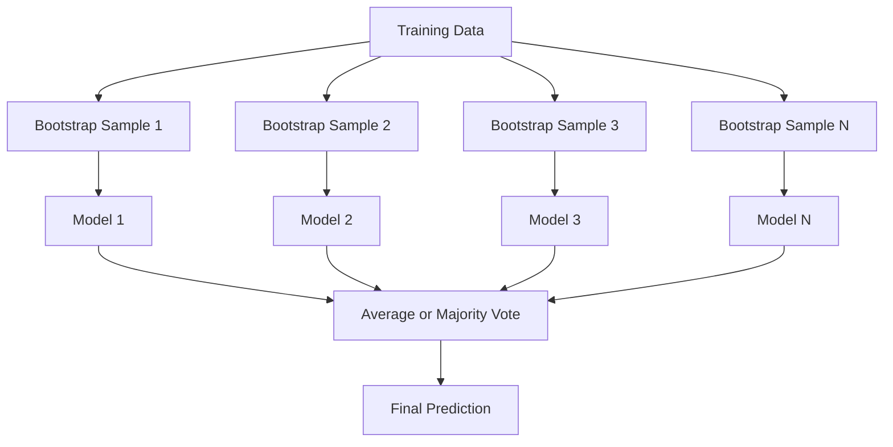
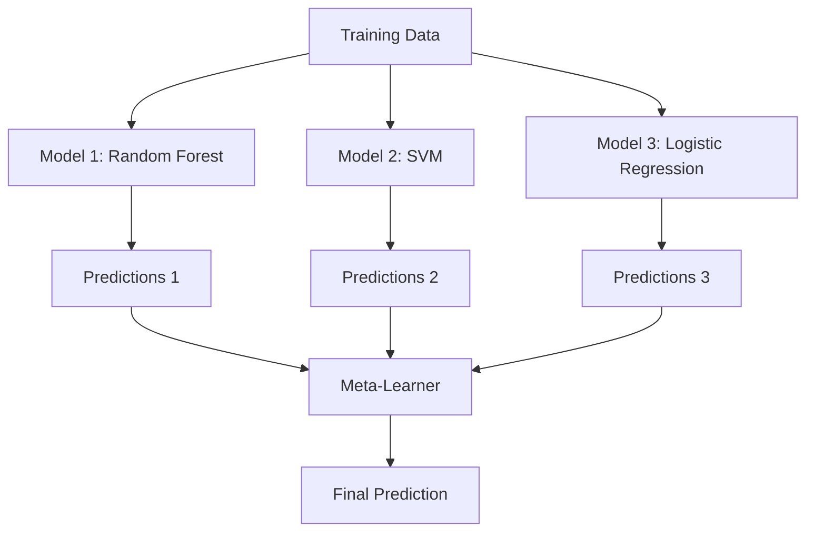

# 集成方法

> 一组弱学习器，经过正确组合，可以成为一个强学习器。这不是比喻，这是一个定理。

**类型:** 构建  
**语言:** Python  
**先决条件:** 第2阶段，第10课（偏差-方差权衡）  
**时间:** ~120分钟

## 学习目标

- 从头实现AdaBoost和梯度提升，并解释提升如何通过顺序处理减少偏差
- 构建一个bagging集成，并演示通过平均去相关模型如何在不增加偏差的情况下减少方差
- 根据每种方法针对的误差成分，比较bagging、boosting和stacking
- 评估集成多样性，并解释为什么多数投票准确性会随着更多独立弱学习器的加入而提高

## 问题所在

单个决策树训练速度快、易于解释，但会过拟合。单个线性模型在复杂边界上会欠拟合。你可以花几天时间设计完美的模型架构。或者，你可以组合一堆不完美的模型，得到比其中任何一个单独模型都更好的结果。

集成方法做的就是这件事。它们是赢得Kaggle表格数据竞赛最可靠的技术，驱动着大多数生产环境的机器学习系统，并且生动地展示了偏差-方差权衡。Bagging减少方差。Boosting减少偏差。Stacking学习在哪些输入上信任哪些模型。

## 概念

### 为什么集成有效

假设你有N个独立的分类器，每个准确率p > 0.5。多数投票的准确率为：

```
P(majority correct) = sum over k > N/2 of C(N,k) * p^k * (1-p)^(N-k)
```

对于21个准确率各为60%的分类器，多数投票准确率约为74%。如果有101个分类器，则上升到84%。当模型犯不同错误时，错误会相互抵消。

关键要求是**多样性**。如果所有模型都犯同样的错误，组合它们毫无帮助。集成有效是因为它们通过以下方式产生多样化的模型：

- 不同的训练子集（bagging）
- 不同的特征子集（随机森林）
- 顺序纠错（boosting）
- 不同的模型族（stacking）

### Bagging（Bootstrap聚合）

Bagging通过在每个模型上使用训练数据的不同bootstrap样本来创建多样性。



Bootstrap样本是从原始数据中有放回抽取的，大小与原始数据相同。每个bootstrap样本中大约包含63.2%的独特样本。剩余的36.8%（袋外样本）提供了一个免费的验证集。

Bagging在不太增加偏差的情况下减少方差。每个单独的树都过拟合其bootstrap样本，但每棵树的过拟合方式不同，因此平均化会抵消噪声。

**随机森林**是带额外技巧的bagging：在每个分裂点，只考虑特征的随机子集。这迫使树之间产生更多的多样性。分类任务的候选特征典型数量是`sqrt(n_features)`，回归任务是`n_features / 3`。

### Boosting（顺序纠错）

Boosting顺序地训练模型。每个新模型都专注于前一个模型出错的例子。


Boosting减少偏差。每个新模型纠正当前集成的系统性误差。最终预测是所有模型的加权总和，其中更好的模型获得更高的权重。

权衡：如果你运行太多轮次，boosting可能会过拟合，因为它会持续拟合更难的例子，其中一些可能是噪声。

### AdaBoost

AdaBoost（自适应提升）是第一个实用的boosting算法。它可以与任何基础学习器一起使用，通常是决策桩（深度为1的树）。

算法：

```
1. Initialize sample weights: w_i = 1/N for all i

2. For t = 1 to T:
   a. Train weak learner h_t on weighted data
   b. Compute weighted error:
      err_t = sum(w_i * I(h_t(x_i) != y_i)) / sum(w_i)
   c. Compute model weight:
      alpha_t = 0.5 * ln((1 - err_t) / err_t)
   d. Update sample weights:
      w_i = w_i * exp(-alpha_t * y_i * h_t(x_i))
   e. Normalize weights to sum to 1

3. Final prediction: H(x) = sign(sum(alpha_t * h_t(x)))
```

误差较低的模型获得更高的alpha值。被错误分类的样本获得更高的权重，以便下一个模型关注它们。

### 梯度提升

梯度提升将boosting推广到任意损失函数。它不是重新加权样本，而是将每个新模型拟合到当前集成的残差（损失的负梯度）上。

```
1. Initialize: F_0(x) = argmin_c sum(L(y_i, c))

2. For t = 1 to T:
   a. Compute pseudo-residuals:
      r_i = -dL(y_i, F_{t-1}(x_i)) / dF_{t-1}(x_i)
   b. Fit a tree h_t to the residuals r_i
   c. Find optimal step size:
      gamma_t = argmin_gamma sum(L(y_i, F_{t-1}(x_i) + gamma * h_t(x_i)))
   d. Update:
      F_t(x) = F_{t-1}(x) + learning_rate * gamma_t * h_t(x)

3. Final prediction: F_T(x)
```

对于平方误差损失，伪残差就是实际残差：`r_i = y_i - F_{t-1}(x_i)`。每个树实际上拟合的是前一个集成的误差。

学习率（收缩）控制每棵树的贡献程度。较小的学习率需要更多的树，但泛化能力更好。典型值：0.01到0.3。

### XGBoost：为何它主导表格数据

XGBoost（极端梯度提升）是带有工程优化的梯度提升，使其快速、准确且抗过拟合：

- **正则化目标：** 对叶子权重的L1和L2惩罚防止单个树过于自信
- **二阶近似：** 使用损失函数的一阶和二阶导数，提供更好的分裂决策
- **稀疏感知分裂：** 通过在每个分裂点为缺失数据学习最佳方向，原生处理缺失值
- **列子采样：** 像随机森林一样，在每个分裂点采样特征以增加多样性
- **加权分位数草图：** 在分布式数据上高效地找到连续特征的分裂点
- **缓存感知块结构：** 内存布局针对CPU缓存行优化

对于表格数据，XGBoost（及其后继者LightGBM）始终优于神经网络。这种情况短期内不会改变。如果你的数据适合放在行列表格中，就从梯度提升开始。

### Stacking（元学习）

Stacking使用多个基础模型的预测作为元学习器的特征。



元学习器学习在哪些输入上信任哪个基础模型。如果随机森林在某些区域表现更好，而SVM在其他区域更好，元学习器将学会相应地路由。

为避免数据泄露，基础模型的预测必须通过在训练集上进行交叉验证生成。你绝不能在相同数据上训练基础模型和生成元特征。

### 投票

最简单的集成。直接组合预测。

- **硬投票：** 对类别标签进行多数投票。
- **软投票：** 平均预测概率，选择平均概率最高的类别。通常更好，因为它使用了置信度信息。

## 动手构建

### 第1步：决策桩（基础学习器）

`code/ensembles.py`中的代码从头实现了所有内容。我们从一个决策桩开始：一个只有一次分裂的树。

```python
class DecisionStump:
    def __init__(self):
        self.feature_idx = None
        self.threshold = None
        self.polarity = 1
        self.alpha = None

    def fit(self, X, y, weights):
        n_samples, n_features = X.shape
        best_error = float("inf")

        for f in range(n_features):
            thresholds = np.unique(X[:, f])
            for thresh in thresholds:
                for polarity in [1, -1]:
                    pred = np.ones(n_samples)
                    pred[polarity * X[:, f] < polarity * thresh] = -1
                    error = np.sum(weights[pred != y])
                    if error < best_error:
                        best_error = error
                        self.feature_idx = f
                        self.threshold = thresh
                        self.polarity = polarity

    def predict(self, X):
        n = X.shape[0]
        pred = np.ones(n)
        idx = self.polarity * X[:, self.feature_idx] < self.polarity * self.threshold
        pred[idx] = -1
        return pred
```

### 第2步：从头实现AdaBoost

```python
class AdaBoostScratch:
    def __init__(self, n_estimators=50):
        self.n_estimators = n_estimators
        self.stumps = []
        self.alphas = []

    def fit(self, X, y):
        n = X.shape[0]
        weights = np.full(n, 1 / n)

        for _ in range(self.n_estimators):
            stump = DecisionStump()
            stump.fit(X, y, weights)
            pred = stump.predict(X)

            err = np.sum(weights[pred != y])
            err = np.clip(err, 1e-10, 1 - 1e-10)

            alpha = 0.5 * np.log((1 - err) / err)
            weights *= np.exp(-alpha * y * pred)
            weights /= weights.sum()

            stump.alpha = alpha
            self.stumps.append(stump)
            self.alphas.append(alpha)

    def predict(self, X):
        total = sum(a * s.predict(X) for a, s in zip(self.alphas, self.stumps))
        return np.sign(total)
```

### 第3步：从头实现梯度提升

```python
class GradientBoostingScratch:
    def __init__(self, n_estimators=100, learning_rate=0.1, max_depth=3):
        self.n_estimators = n_estimators
        self.lr = learning_rate
        self.max_depth = max_depth
        self.trees = []
        self.initial_pred = None

    def fit(self, X, y):
        self.initial_pred = np.mean(y)
        current_pred = np.full(len(y), self.initial_pred)

        for _ in range(self.n_estimators):
            residuals = y - current_pred
            tree = SimpleRegressionTree(max_depth=self.max_depth)
            tree.fit(X, residuals)
            update = tree.predict(X)
            current_pred += self.lr * update
            self.trees.append(tree)

    def predict(self, X):
        pred = np.full(X.shape[0], self.initial_pred)
        for tree in self.trees:
            pred += self.lr * tree.predict(X)
        return pred
```

### 第4步：与sklearn比较

代码验证我们的从头实现与sklearn的`AdaBoostClassifier`和`GradientBoostingClassifier`产生了相似的准确性，并将所有方法并排比较。

## 实际应用

### 何时使用每种方法

| 方法 | 减少 | 最适用于 | 需注意 |
|--------|---------|----------|---------------|
| Bagging / 随机森林 | 方差 | 噪声数据、特征多 | 对偏差没有帮助 |
| AdaBoost | 偏差 | 干净数据、简单基础学习器 | 对异常值和噪声敏感 |
| 梯度提升 | 偏差 | 表格数据、竞赛 | 训练慢，不调整容易过拟合 |
| XGBoost / LightGBM | 两者 | 生产环境表格ML | 超参数多 |
| Stacking | 两者 | 获取最后1-2%的准确率 | 复杂，元学习器有过拟合风险 |
| 投票 | 方差 | 快速组合多样化模型 | 仅当模型多样化时有帮助 |

### 表格数据的生产栈

对于大多数表格预测问题，尝试顺序如下：

1. 使用默认参数的**LightGBM或XGBoost**
2. 调整n_estimators, learning_rate, max_depth, min_child_weight
3. 如果需要最后的0.5%，用3-5个多样化模型构建stacking集成
4. 全程使用交叉验证

尽管研究不断，神经网络在表格数据上几乎总是不如梯度提升。TabNet、NODE等偶尔能匹配，但很少能击败调优良好的XGBoost。

## 交付使用

本课生成`outputs/prompt-ensemble-selector.md` —— 一个帮助你为给定数据集选择正确集成方法的提示。描述你的数据（大小、特征类型、噪声水平、类别平衡）和你要解决的问题。该提示会引导你完成决策清单，推荐一种方法，建议起始超参数，并警告该方法的常见错误。同时生成`outputs/skill-ensemble-builder.md`包含完整的选择指南。

## 练习

1. 修改AdaBoost实现，以跟踪每一轮后的训练准确率。绘制准确率与估计器数量的关系图。何时收敛？

2. 通过添加随机特征子采样到回归树，从头实现一个随机森林。使用`max_features=sqrt(n_features)`训练100棵树并平均预测。比较方差减少量与单棵树的差异。

3. 在梯度提升实现中，添加早停：跟踪每一轮后的验证损失，当连续10轮没有改善时停止。实际需要多少棵树？

4. 构建一个包含三个基础模型（逻辑回归、决策树、k近邻）和一个逻辑回归元学习器的stacking集成。使用5折交叉验证生成元特征。与每个单独基础模型进行比较。

5. 在相同数据集上使用默认参数运行XGBoost。将其准确性与你从头实现的梯度提升进行比较。计时两者。速度差异有多大？

## 关键术语

| 术语 | 人们常说 | 实际含义 |
|------|----------------|----------------------|
| Bagging | "在随机子集上训练" | Bootstrap聚合：在bootstrap样本上训练模型，平均预测以减少方差 |
| Boosting | "聚焦于难样本" | 顺序训练模型，每个模型纠正当前集成的误差，以减少偏差 |
| AdaBoost | "重新加权数据" | 通过样本权重更新进行boosting；误分类点对下一个学习器获得更高权重 |
| 梯度提升 | "拟合残差" | 通过将每个新模型拟合到损失函数的负梯度进行boosting |
| XGBoost | "Kaggle利器" | 带正则化、二阶优化和系统级速度技巧的梯度提升 |
| Stacking | "模型上的模型" | 使用基础模型的预测作为元学习器的输入特征 |
| 随机森林 | "许多随机化的树" | 带决策树的bagging，在每个分裂点添加随机特征子采样以增加多样性 |
| 集成多样性 | "犯不同的错误" | 模型在误差上必须不相关，集成才能优于个体 |
| 袋外误差 | "免费验证" | 未在bootstrap抽样中的样本（约36.8%）无需留出集即可作为验证集 |

## 扩展阅读

- [Schapire & Freund: Boosting: Foundations and Algorithms](https://mitpress.mit.edu/9780262526036/) -- AdaBoost创造者撰写的书籍
- [Friedman: Greedy Function Approximation: A Gradient Boosting Machine (2001)](https://statweb.stanford.edu/~jhf/ftp/trebst.pdf) -- 原始梯度提升论文
- [Chen & Guestrin: XGBoost (2016)](https://arxiv.org/abs/1603.02754) -- XGBoost论文
- [Wolpert: Stacked Generalization (1992)](https://www.sciencedirect.com/science/article/abs/pii/S0893608005800231) -- 原始stacking论文
- [scikit-learn Ensemble Methods](https://scikit-learn.org/stable/modules/ensemble.html) -- 实用参考