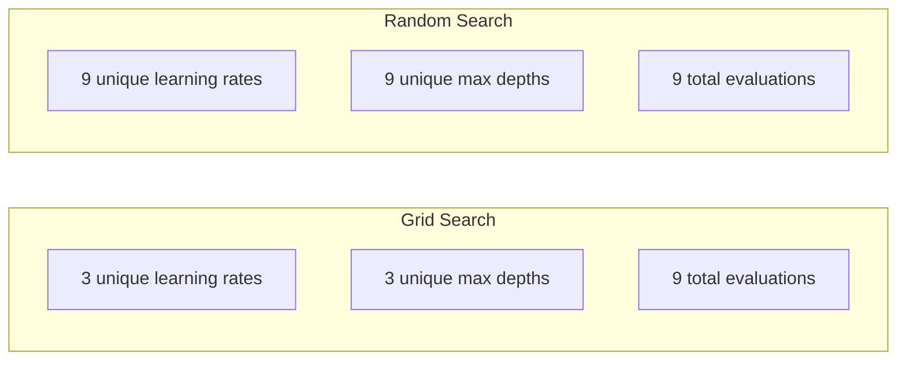
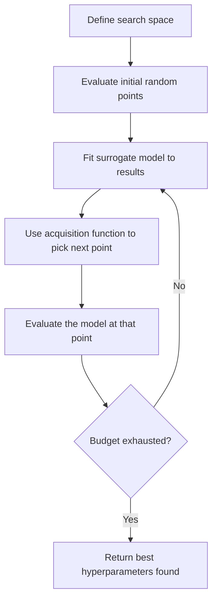
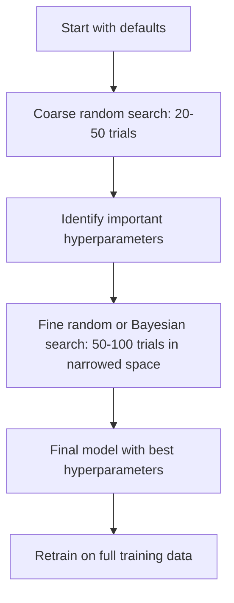
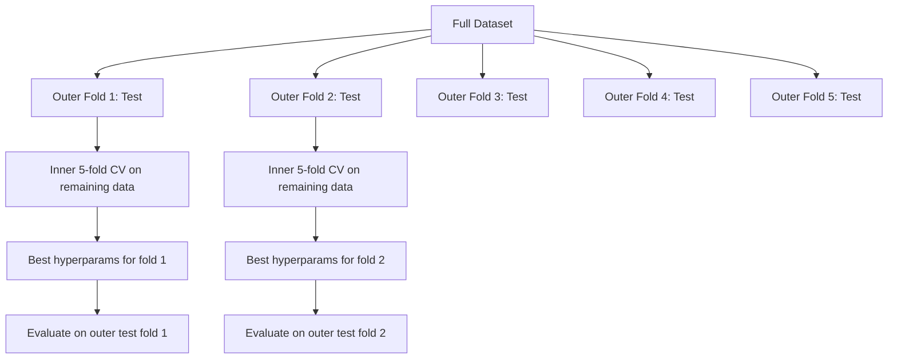

# 超参数调优

> 超参数是训练开始前你需要调整的旋钮。调整得好坏，是平庸模型与优秀模型之间的区别。

**类型：** 构建  
**语言：** Python  
**先修课程：** 第二阶段，第11课（集成方法）  
**时间：** 约90分钟

## 学习目标

- 从头实现网格搜索、随机搜索和贝叶斯优化，并比较其样本效率
- 解释为什么当大多数超参数有效维度较低时，随机搜索优于网格搜索
- 使用代理模型和采集函数构建贝叶斯优化循环来引导搜索
- 设计超参数调优策略，通过适当的交叉验证避免在验证集上过拟合

## 问题所在

你的梯度提升模型有学习率、树的数量、最大深度、每片叶子的最小样本数、子样本比率和列采样比率。那是六个超参数。如果每个有5个合理值，网格就有 5^6 = 15,625 种组合。每次训练需要10秒。尝试所有组合需要43小时的计算时间。

网格搜索是最直观的方法，但在大规模下是最糟糕的。随机搜索用更少的计算做得更好。贝叶斯优化通过从过去的评估中学习，表现更佳。知道使用哪种策略，以及哪些超参数真正重要，可以节省数天的浪费的GPU时间。

## 核心概念

### 参数 vs 超参数

参数是在训练过程中学习的（权重、偏置、分裂阈值）。超参数在训练开始前设置，控制学习如何发生。

| 超参数 | 控制什么 | 典型范围 |
|--------|----------|----------|
| 学习率 | 每次更新的步长 | 0.001 到 1.0 |
| 树/周期的数量 | 训练多久 | 10 到 10,000 |
| 最大深度 | 模型复杂度 | 1 到 30 |
| 正则化（lambda） | 防止过拟合 | 0.0001 到 100 |
| 批次大小 | 梯度估计噪声 | 16 到 512 |
| Dropout率 | 丢弃的神经元比例 | 0.0 到 0.5 |

### 网格搜索

网格搜索评估指定值的每一个组合。它详尽且易于理解，但随着超参数数量的增加呈指数级扩展。

```
Grid for 2 hyperparameters:

  learning_rate: [0.01, 0.1, 1.0]
  max_depth:     [3, 5, 7]

  Evaluations: 3 x 3 = 9 combinations

  (0.01, 3)  (0.01, 5)  (0.01, 7)
  (0.1,  3)  (0.1,  5)  (0.1,  7)
  (1.0,  3)  (1.0,  5)  (1.0,  7)
```

网格搜索有一个根本性缺陷：如果一个超参数重要而另一个不重要，大多数评估都是浪费的。从9次评估中，你只得到重要参数的3个唯一值。

### 随机搜索

随机搜索从分布中采样超参数，而不是从网格中。在同样9次评估的预算下，你得到每个超参数的9个唯一值。



随机为何胜过网格（Bergstra & Bengio, 2012）：

- 大多数超参数的有效维度很低。对于给定问题，通常只有6个超参数中的1-2个真正重要。
- 网格搜索将评估浪费在不重要的维度上。
- 在相同的预算下，随机搜索能更密集地覆盖重要维度。
- 在60次随机试验中，你有95%的机会找到一个在最优值5%以内的点（如果搜索空间中存在这样一个点）。

### 贝叶斯优化

随机搜索忽略结果。它不会从高学习率导致发散或深度3始终优于深度10中学到东西。贝叶斯优化使用过去的评估来决定下一步搜索哪里。



两个关键组成部分：

**代理模型：** 一个评估成本低的模型（通常是高斯过程），用于近似昂贵的目标函数。它在搜索空间中的任何点同时提供预测和不确定性估计。

**采集函数：** 通过平衡利用（在已知的好点附近搜索）和探索（在不确定性高的地方搜索）来决定下一步评估哪里。常见的选择：

- **期望改进（EI）：** 在这个点，我们期望比当前最佳值改进多少？
- **置信上界（UCB）：** 预测值加上不确定性的倍数。更高的UCB意味着要么有希望，要么未被探索。
- **改进概率（PI）：** 这个点优于当前最佳值的概率是多少？

贝叶斯优化通常用比随机搜索少2-5倍的评估次数就能找到更好的超参数。拟合代理模型的开销与实际训练模型相比可以忽略不计。

### 早停

并非每次训练运行都需要完成。如果一个配置在10个周期后明显很差，就停止它并继续前进。这就是超参数搜索背景下的早停。

策略：
- **基于耐心：** 如果验证损失连续N个周期未改善，则停止
- **中位数剪枝：** 如果试验的中间结果在同一步骤差于已完成试验的中位数，则停止
- **Hyperband：** 为许多配置分配小预算，然后逐步为最佳配置增加预算

Hyperband特别有效。它启动81个配置，每个训练1个周期，保留前三分之一，给它们3个周期，保留前三分之一，以此类推。这比为所有配置运行完整预算找到好配置的速度快10-50倍。

### 学习率调度器

学习率几乎总是最重要的超参数。调度器在训练过程中调整它，而不是保持固定。

| 调度器 | 公式 | 何时使用 |
|--------|------|----------|
| 步长衰减 | 每N个周期乘以0.1 | 经典CNN训练 |
| 余弦退火 | lr * 0.5 * (1 + cos(pi * t / T)) | 现代默认选择 |
| 预热+衰减 | 线性增加然后余弦衰减 | Transformer模型 |
| 单周期 | 在一个周期内先升后降 | 快速收敛 |
| 平台期减小 | 当指标停滞时按因子减小 | 安全默认选择 |

### 超参数重要性

并非所有超参数都同等重要。关于随机森林（Probst等人，2019）和梯度提升的研究显示了共同的模式：

**高重要性：**
- 学习率（总是首先调整）
- 估计器/周期的数量（使用早停而不是调整）
- 正则化强度

**中等重要性：**
- 最大深度/层数
- 每片叶子的最小样本数/权重衰减
- 子样本比率

**低重要性：**
- 最大特征数（对于随机森林）
- 特定激活函数的选择
- 批次大小（在合理范围内）

首先调整重要参数，其余保持默认值。

### 实用策略



具体工作流程：

1.  **从库的默认值开始。** 它们由经验丰富的从业者选择，通常已经达到80%的效果。
2.  **粗略随机搜索。** 范围要广，20-50次试验。使用早停快速终止糟糕的运行。
3.  **分析结果。** 哪些超参数与性能相关？缩小搜索空间。
4.  **精细搜索。** 在缩小的空间内进行贝叶斯优化或聚焦的随机搜索。50-100次试验。
5.  **使用找到的最佳超参数重新训练所有训练数据。**

### 交叉验证集成

在单个验证分割上调优超参数是有风险的。最佳超参数可能过拟合特定的验证折。嵌套交叉验证通过使用两个循环来解决这个问题：

- **外层循环**（评估）：将数据分割为训练+验证集和测试集。报告无偏的性能。
- **内层循环**（调优）：将训练+验证集分割为训练集和验证集。找到最佳超参数。



每个外层折独立找到其自身的最佳超参数。外层分数是泛化性能的无偏估计。

使用sklearn：

```python
from sklearn.model_selection import cross_val_score, GridSearchCV
from sklearn.ensemble import GradientBoostingRegressor

inner_cv = GridSearchCV(
    GradientBoostingRegressor(),
    param_grid={
        "learning_rate": [0.01, 0.05, 0.1],
        "max_depth": [2, 3, 5],
        "n_estimators": [50, 100, 200],
    },
    cv=5,
    scoring="neg_mean_squared_error",
)

outer_scores = cross_val_score(
    inner_cv, X, y, cv=5, scoring="neg_mean_squared_error"
)

print(f"Nested CV MSE: {-outer_scores.mean():.4f} +/- {outer_scores.std():.4f}")
```

这是昂贵的（5个外层折 x 5个内层折 x 27个网格点 = 675次模型拟合），但它给出了一个可信的性能估计。在论文中报告最终结果或决策风险很高时使用它。

### 实用技巧

**从学习率开始。** 对于基于梯度的方法，它总是最重要的超参数。糟糕的学习率会让其他所有调整都变得无关紧要。将其他超参数固定在默认值，首先扫描学习率。

**对学习率和正则化使用对数均匀分布。** 0.001和0.01之间的差异与0.1和1.0之间的差异同样重要。线性搜索会在较大端浪费预算。

**使用早停代替调整n_estimators。** 对于提升方法和神经网络，将n_estimators或周期设置得足够高，并让早停决定何时停止。这从搜索中移除了一个超参数。

**预算分配。** 将你调优预算的60%花在前2个最重要的超参数上。将剩余的40%花在其他所有参数上。前2个参数占据了大部分性能差异。

**比例很重要。** 切勿在对数尺度上搜索批次大小（16, 32, 64是合适的）。总是在对数尺度上搜索学习率。根据超参数影响模型的方式匹配搜索分布。

| 模型类型 | 主要超参数 | 推荐搜索方法 | 预算 |
|----------|------------|--------------|------|
| 随机森林 | n_estimators, max_depth, min_samples_leaf | 随机搜索，50次试验 | 低（训练快） |
| 梯度提升 | learning_rate, n_estimators, max_depth | 贝叶斯优化，100次试验 + 早停 | 中等 |
| 神经网络 | learning_rate, weight_decay, batch_size | 贝叶斯或随机搜索，100+次试验 | 高（训练慢） |
| SVM | C, gamma (RBF核) | 对数尺度上网格搜索，25-50次试验 | 低（2个参数） |
| Lasso/Ridge | alpha | 对数尺度上一维搜索，20次试验 | 非常低 |
| XGBoost | learning_rate, max_depth, subsample, colsample | 贝叶斯优化，100-200次试验 + 早停 | 中等 |

**有疑问时：** 随机搜索，试验次数为超参数数量的2倍（例如，6个超参数 = 至少12次试验）。你会惊讶于50次试验的随机搜索经常击败精心设计的网格搜索。

## 动手实现

### 步骤1：从头实现网格搜索

`code/tuning.py` 中的代码实现了网格搜索、随机搜索和一个简单的贝叶斯优化器。

```python
def grid_search(model_fn, param_grid, X_train, y_train, X_val, y_val):
    keys = list(param_grid.keys())
    values = list(param_grid.values())
    best_score = -float("inf")
    best_params = None
    n_evals = 0

    for combo in itertools.product(*values):
        params = dict(zip(keys, combo))
        model = model_fn(**params)
        model.fit(X_train, y_train)
        score = evaluate(model, X_val, y_val)
        n_evals += 1

        if score > best_score:
            best_score = score
            best_params = params

    return best_params, best_score, n_evals
```

### 步骤2：从头实现随机搜索

```python
def random_search(model_fn, param_distributions, X_train, y_train,
                  X_val, y_val, n_iter=50, seed=42):
    rng = np.random.RandomState(seed)
    best_score = -float("inf")
    best_params = None

    for _ in range(n_iter):
        params = {k: sample(v, rng) for k, v in param_distributions.items()}
        model = model_fn(**params)
        model.fit(X_train, y_train)
        score = evaluate(model, X_val, y_val)

        if score > best_score:
            best_score = score
            best_params = params

    return best_params, best_score, n_iter
```

### 步骤3：贝叶斯优化（简化版）

核心思想：将一个高斯过程拟合到观察到的（超参数，得分）对上，然后使用一个采集函数决定下一步看哪里。

```python
class SimpleBayesianOptimizer:
    def __init__(self, search_space, n_initial=5):
        self.search_space = search_space
        self.n_initial = n_initial
        self.X_observed = []
        self.y_observed = []

    def _kernel(self, x1, x2, length_scale=1.0):
        dists = np.sum((x1[:, None, :] - x2[None, :, :]) ** 2, axis=2)
        return np.exp(-0.5 * dists / length_scale ** 2)

    def _fit_gp(self, X_new):
        X_obs = np.array(self.X_observed)
        y_obs = np.array(self.y_observed)
        y_mean = y_obs.mean()
        y_centered = y_obs - y_mean

        K = self._kernel(X_obs, X_obs) + 1e-4 * np.eye(len(X_obs))
        K_star = self._kernel(X_new, X_obs)

        L = np.linalg.cholesky(K)
        alpha = np.linalg.solve(L.T, np.linalg.solve(L, y_centered))
        mu = K_star @ alpha + y_mean

        v = np.linalg.solve(L, K_star.T)
        var = 1.0 - np.sum(v ** 2, axis=0)
        var = np.maximum(var, 1e-6)

        return mu, var

    def _expected_improvement(self, mu, var, best_y):
        sigma = np.sqrt(var)
        z = (mu - best_y) / (sigma + 1e-10)
        ei = sigma * (z * norm_cdf(z) + norm_pdf(z))
        return ei

    def suggest(self):
        if len(self.X_observed) < self.n_initial:
            return sample_random(self.search_space)

        candidates = [sample_random(self.search_space) for _ in range(500)]
        X_cand = np.array([to_vector(c) for c in candidates])
        mu, var = self._fit_gp(X_cand)
        ei = self._expected_improvement(mu, var, max(self.y_observed))
        return candidates[np.argmax(ei)]

    def observe(self, params, score):
        self.X_observed.append(to_vector(params))
        self.y_observed.append(score)
```

高斯过程代理在每个候选点提供两样东西：预测得分（mu）和不确定性（var）。期望改进平衡了这两点：它倾向于模型预测得分高或者不确定性高的点。早期，大多数点不确定性高，所以优化器进行探索。后期，它专注于最有希望的区域。

### 步骤4：比较所有方法

在同一个合成目标函数上运行所有三种方法并进行比较。这个比较使用了一个简化的包装器，它用一个直接的目标函数（无模型训练）调用每个优化器，因此API与上面基于模型的实现不同：

```python
def synthetic_objective(params):
    lr = params["learning_rate"]
    depth = params["max_depth"]
    return -(np.log10(lr) + 2) ** 2 - (depth - 4) ** 2 + 10

param_grid = {
    "learning_rate": [0.001, 0.01, 0.1, 1.0],
    "max_depth": [2, 3, 4, 5, 6, 7, 8],
}

grid_best = None
grid_score = -float("inf")
grid_history = []
for combo in itertools.product(*param_grid.values()):
    params = dict(zip(param_grid.keys(), combo))
    score = synthetic_objective(params)
    grid_history.append((params, score))
    if score > grid_score:
        grid_score = score
        grid_best = params

param_dist = {
    "learning_rate": ("log_float", 0.001, 1.0),
    "max_depth": ("int", 2, 8),
}

rand_best = None
rand_score = -float("inf")
rand_history = []
rng = np.random.RandomState(42)
for _ in range(28):
    params = {k: sample(v, rng) for k, v in param_dist.items()}
    score = synthetic_objective(params)
    rand_history.append((params, score))
    if score > rand_score:
        rand_score = score
        rand_best = params

optimizer = SimpleBayesianOptimizer(param_dist, n_initial=5)
bayes_history = []
for _ in range(28):
    params = optimizer.suggest()
    score = synthetic_objective(params)
    optimizer.observe(params, score)
    bayes_history.append((params, score))
bayes_score = max(s for _, s in bayes_history)

print(f"{'Method':<20} {'Best Score':>12} {'Evaluations':>12}")
print("-" * 50)
print(f"{'Grid Search':<20} {grid_score:>12.4f} {len(grid_history):>12}")
print(f"{'Random Search':<20} {rand_score:>12.4f} {len(rand_history):>12}")
print(f"{'Bayesian Opt':<20} {bayes_score:>12.4f} {len(bayes_history):>12}")
```

在相同的预算下，贝叶斯优化通常最快找到最佳分数，因为它不会在明显糟糕的区域浪费评估。随机搜索比网格搜索覆盖更广。网格搜索只在你只有非常少的超参数且可以承担穷举搜索时才胜出。

## 实践应用

### 实践中的Optuna

对于严肃的超参数调优，Optuna是推荐的库。它开箱即支持剪枝、分布式搜索和可视化。

```python
import optuna

def objective(trial):
    lr = trial.suggest_float("learning_rate", 1e-4, 1e-1, log=True)
    n_est = trial.suggest_int("n_estimators", 50, 500)
    max_depth = trial.suggest_int("max_depth", 2, 10)

    model = GradientBoostingRegressor(
        learning_rate=lr,
        n_estimators=n_est,
        max_depth=max_depth,
    )
    model.fit(X_train, y_train)
    return mean_squared_error(y_val, model.predict(X_val))

study = optuna.create_study(direction="minimize")
study.optimize(objective, n_trials=100)

print(f"Best params: {study.best_params}")
print(f"Best MSE: {study.best_value:.4f}")
```

Optuna的关键特性：
- `suggest_float(..., log=True)` 用于最好在对数尺度上搜索的参数（学习率，正则化）
- `suggest_int` 用于整数参数
- `suggest_categorical` 用于离散选择
- 内置 MedianPruner 用于对糟糕试验的早停
- `study.trials_dataframe()` 用于分析

### 使用Optuna进行剪枝

剪枝会提前停止没有希望的试验，节省大量计算。以下是模式：

```python
import optuna
from sklearn.model_selection import cross_val_score

def objective(trial):
    params = {
        "learning_rate": trial.suggest_float("lr", 1e-4, 0.5, log=True),
        "max_depth": trial.suggest_int("max_depth", 2, 10),
        "n_estimators": trial.suggest_int("n_estimators", 50, 500),
        "subsample": trial.suggest_float("subsample", 0.5, 1.0),
    }

    model = GradientBoostingRegressor(**params)
    scores = cross_val_score(model, X_train, y_train, cv=3,
                             scoring="neg_mean_squared_error")
    mean_score = -scores.mean()

    trial.report(mean_score, step=0)
    if trial.should_prune():
        raise optuna.TrialPruned()

    return mean_score

pruner = optuna.pruners.MedianPruner(n_startup_trials=10, n_warmup_steps=5)
study = optuna.create_study(direction="minimize", pruner=pruner)
study.optimize(objective, n_trials=200)
```

如果一个试验的中间值在同一步骤差于所有已完成试验的中位数，`MedianPruner` 会停止该试验。剪枝需要调用 `trial.report()` 来报告中间指标，并调用 `trial.should_prune()` 来检查是否应停止试验。`n_startup_trials=10` 确保至少有10个试验完全完成，然后剪枝才开始生效。这通常可以节省40-60%的总计算量。

### sklearn内置的调优器

对于快速实验，sklearn提供了 `GridSearchCV`, `RandomizedSearchCV`, 和 `HalvingRandomSearchCV`：

```python
from sklearn.model_selection import RandomizedSearchCV
from scipy.stats import loguniform, randint

param_dist = {
    "learning_rate": loguniform(1e-4, 0.5),
    "max_depth": randint(2, 10),
    "n_estimators": randint(50, 500),
}

search = RandomizedSearchCV(
    GradientBoostingRegressor(),
    param_dist,
    n_iter=100,
    cv=5,
    scoring="neg_mean_squared_error",
    random_state=42,
    n_jobs=-1,
)
search.fit(X_train, y_train)
print(f"Best params: {search.best_params_}")
print(f"Best CV MSE: {-search.best_score_:.4f}")
```

对学习率和正则化使用scipy的 `loguniform`。对整数超参数使用 `randint`。`n_jobs=-1` 标志可以跨所有CPU核心并行化。

### 超参数调优中的常见错误

**预处理中的数据泄露。** 如果你在交叉验证之前在整个数据集上拟合一个缩放器，验证折中的信息会泄露到训练中。始终将预处理放在 `Pipeline` 中，使其仅在训练折上拟合。

**过拟合验证集。** 运行数千次试验实际上是在验证集上训练。使用嵌套交叉验证进行最终性能估计，或者留出一个单独的、在调优期间从不接触的测试集。

**搜索范围太窄。** 如果你的最佳值位于搜索空间的边界，说明你搜索得不够广泛。最优值可能在你的范围之外。始终检查最佳参数是否在边缘。

**忽略交互效应。** 在提升方法中，学习率和估计器数量强烈交互。低学习率需要更多估计器。分别调整它们比一起调整效果更差。

**对迭代模型不使用早停。** 对于梯度提升和神经网络，将n_estimators或周期设置得足够高并使用早停。这严格优于将迭代次数作为超参数进行调整。

## 练习

1.  用相同的总预算（例如50次评估）运行网格搜索和随机搜索。比较找到的最佳分数。用不同的随机种子重复实验10次。随机搜索赢的频率是多少？

2.  从头实现Hyperband。从81个配置开始，每个训练1个周期。每一轮保留前1/3，并将它们的预算增加两倍。比较总计算量（所有配置的所有周期之和）与运行所有81个配置完整预算所需的计算量。

3.  将一个学习率调度器（余弦退火）添加到第11课的梯度提升实现中。与固定学习率相比，它有帮助吗？

4.  使用Optuna在一个真实数据集（例如sklearn的乳腺癌数据集）上调整RandomForestClassifier。使用 `optuna.visualization.plot_param_importances(study)` 查看哪些超参数最重要。它与本课的重要性排名匹配吗？

5.  实现一个简单的采集函数（期望改进），并展示探索与利用。绘制代理模型的均值和不确定性，并展示EI选择下一步评估的位置。

## 关键术语

| 术语 | 人们怎么说 | 它的实际含义 |
|------|------------|--------------|
| 超参数 | "你选择的一个设置" | 在训练前设置的一个值，控制学习过程，不是从数据中学习得到的 |
| 网格搜索 | "尝试所有组合" | 在指定的参数网格上进行穷举搜索。成本呈指数级。 |
| 随机搜索 | "只是随机采样" | 从分布中采样超参数。比网格搜索更好地覆盖重要维度。 |
| 贝叶斯优化 | "智能搜索" | 使用目标函数的代理模型来决定下一步在哪里评估，平衡探索与利用 |
| 代理模型 | "一个廉价的近似" | 一个模型（通常是高斯过程），根据观察到的评估来近似昂贵的目标函数 |
| 采集函数 | "下一步看哪里" | 通过平衡期望改进和不确定性来为候选点打分。EI和UCB是常见选择。 |
| 早停 | "别浪费时间了" | 当验证性能停止改善时提前终止训练 |
| Hyperband | "配置的锦标赛" | 自适应资源分配：用小预算启动许多配置，保留最佳配置并增加其预算 |
| 学习率调度器 | "训练中改变学习率" | 在训练过程中调整学习率以获得更好收敛性的函数 |

## 延伸阅读

- [Bergstra & Bengio: Random Search for Hyper-Parameter Optimization (2012)](https://jmlr.org/papers/v13/bergstra12a.html) -- 证明了随机优于网格的论文
- [Snoek et al., Practical Bayesian Optimization of Machine Learning Algorithms (2012)](https://arxiv.org/abs/1206.2944) -- 机器学习的贝叶斯优化
- [Li et al., Hyperband: A Novel Bandit-Based Approach (2018)](https://jmlr.org/papers/v18/16-558.html) -- Hyperband论文
- [Optuna: A Next-generation Hyperparameter Optimization Framework](https://arxiv.org/abs/1907.10902) -- Optuna论文
- [Probst et al., Tunability: Importance of Hyperparameters (2019)](https://jmlr.org/papers/v20/18-444.html) -- 哪些超参数重要