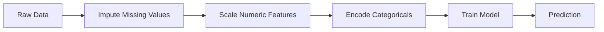
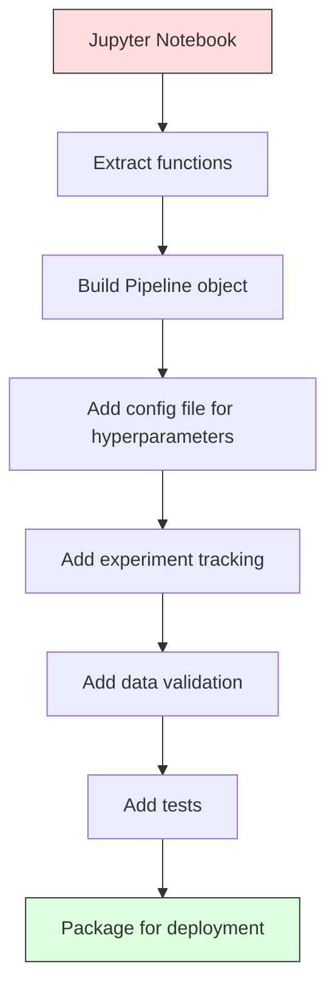

# 机器学习流水线

> 一个模型不是产品。一条流水线才是。流水线是从原始数据到部署预测的全部过程，且每一步都必须是可复现的。

**类型:** 构建
**语言:** Python
**前提:** 第二阶段，第12课（超参数调优）
**时间:** 约120分钟

## 学习目标

- 从头构建一个机器学习流水线，将插补、缩放、编码和模型训练链接成一个单一的可复现对象
- 识别数据泄漏场景，并解释流水线如何通过仅在训练数据上拟合转换器来防止它们
- 构建一个 `ColumnTransformer`，对数值特征和分类特征应用不同的预处理
- 实现流水线序列化，并演示相同的拟合流水线在训练和生产中产生一致的结果

## 问题所在

你有一个笔记本，它加载数据，用中位数填充缺失值，缩放特征，训练模型，并打印准确率。它能工作。你把它发布了。

一个月后，有人重新训练模型并得到了不同的结果。中位数是在包含测试数据的完整数据集上计算的（数据泄漏）。缩放参数没有保存，因此推理使用了不同的统计量。特征工程代码在训练和服务之间是复制粘贴的，这些副本已经发生了分歧。生产环境中的一个分类列出现了编码器从未见过的新值。

这些不是假设。它们是机器学习系统在生产中失败最常见的原因。流水线通过将每个转换步骤打包成一个单一的、有序的、可复现的对象来解决所有这些问题。

## 核心概念

### 什么是流水线

流水线是一个有序的数据转换序列，后面跟着一个模型。每一步都以前一步的输出作为输入。整个流水线在训练数据上拟合一次。在推理时，同一个拟合好的流水线转换新数据并产生预测。



流水线保证：
- 转换仅在训练数据上拟合（无泄漏）
- 推理时应用相同的转换
- 整个对象可以序列化并作为一个构件部署
- 交叉验证对每个折叠应用流水线，防止微妙的泄漏

### 数据泄漏：沉默的杀手

数据泄漏发生在来自测试集或未来数据的信息污染训练时。流水线可以防止最常见的形式。

**泄漏的（错误的）：**
```python
X = df.drop("target", axis=1)
y = df["target"]

scaler = StandardScaler()
X_scaled = scaler.fit_transform(X)

X_train, X_test = X_scaled[:800], X_scaled[800:]
y_train, y_test = y[:800], y[800:]
```

缩放器看到了测试数据。均值和标准差包含了测试样本。这会夸大准确率估计。

**正确的：**
```python
X_train, X_test = X[:800], X[800:]

scaler = StandardScaler()
X_train_scaled = scaler.fit_transform(X_train)
X_test_scaled = scaler.transform(X_test)
```

有了流水线，你不需要考虑这些。流水线会自动处理。

### sklearn 流水线

sklearn 的 `Pipeline` 将转换器和一个估计器链接起来。它暴露了 `.fit()`、`.predict()` 和 `.score()`，这些方法会按顺序应用所有步骤。

```python
from sklearn.pipeline import Pipeline
from sklearn.preprocessing import StandardScaler
from sklearn.linear_model import LogisticRegression

pipe = Pipeline([
    ("scaler", StandardScaler()),
    ("model", LogisticRegression()),
])

pipe.fit(X_train, y_train)
predictions = pipe.predict(X_test)
```

当你调用 `pipe.fit(X_train, y_train)` 时：
1. 缩放器在 X_train 上调用 `fit_transform`
2. 模型在缩放后的 X_train 上调用 `fit`

当你调用 `pipe.predict(X_test)` 时：
1. 缩放器在 X_test 上调用 `transform`（而不是 fit_transform）
2. 模型在缩放后的 X_test 上调用 `predict`

缩放器在拟合过程中从未看到测试数据。这就是全部意义所在。

### ColumnTransformer：为不同列设置不同流水线

真实的数据集包含数值列和分类列，它们需要不同的预处理。`ColumnTransformer` 解决了这个问题。

```python
from sklearn.compose import ColumnTransformer
from sklearn.preprocessing import StandardScaler, OneHotEncoder
from sklearn.impute import SimpleImputer

numeric_pipe = Pipeline([
    ("impute", SimpleImputer(strategy="median")),
    ("scale", StandardScaler()),
])

categorical_pipe = Pipeline([
    ("impute", SimpleImputer(strategy="most_frequent")),
    ("encode", OneHotEncoder(handle_unknown="ignore")),
])

preprocessor = ColumnTransformer([
    ("num", numeric_pipe, ["age", "income", "score"]),
    ("cat", categorical_pipe, ["city", "gender", "plan"]),
])

full_pipeline = Pipeline([
    ("preprocess", preprocessor),
    ("model", GradientBoostingClassifier()),
])
```

OneHotEncoder 中的 `handle_unknown="ignore"` 对于生产至关重要。当出现新的类别（模型从未见过的城市）时，它会生成一个零向量，而不是崩溃。

### 实验跟踪

流水线使训练可复现，但你还需要跟踪不同实验之间发生了什么：使用了哪些超参数，哪个数据集版本，指标是什么，运行的是哪个代码。

**MLflow** 是最常见的开源解决方案：

```python
import mlflow

with mlflow.start_run():
    mlflow.log_param("max_depth", 5)
    mlflow.log_param("n_estimators", 100)
    mlflow.log_param("learning_rate", 0.1)

    pipe.fit(X_train, y_train)
    accuracy = pipe.score(X_test, y_test)

    mlflow.log_metric("accuracy", accuracy)
    mlflow.sklearn.log_model(pipe, "model")
```

每次运行都记录了参数、指标、构件和完整的模型。你可以比较运行，复现任何实验，并部署任何模型版本。

**Weights & Biases (wandb)** 提供相同的功能，并带有一个托管仪表板：

```python
import wandb

wandb.init(project="my-pipeline")
wandb.config.update({"max_depth": 5, "n_estimators": 100})

pipe.fit(X_train, y_train)
accuracy = pipe.score(X_test, y_test)

wandb.log({"accuracy": accuracy})
```

### 模型版本控制

在实验跟踪之后，你需要管理模型版本。哪个模型在生产中？哪个在预发布阶段？哪个是上周的？

MLflow 的模型注册中心提供：
- **版本跟踪：** 每个保存的模型都会获得一个版本号
- **阶段转换：** “预发布”、“生产”、“归档”
- **审批流程：** 模型必须被明确提升到生产阶段
- **回滚：** 可以立即切换回之前的版本

### 使用 DVC 进行数据版本控制

代码用 git 进行版本控制。数据也应该进行版本控制，但 git 无法处理大文件。DVC（数据版本控制）解决了这个问题。

```
dvc init
dvc add data/training.csv
git add data/training.csv.dvc data/.gitignore
git commit -m "Track training data"
dvc push
```

DVC 将实际数据存储在远程存储（S3、GCS、Azure）中，并在 git 中保留一个小的 `.dvc` 文件来记录哈希值。当你检出一个 git 提交时，`dvc checkout` 会恢复当时使用的精确数据。

这意味着每次 git 提交都固定了代码和数据。完全可复现。

### 可复现实验

一个可复现的实验需要四样东西：

1. **固定的随机种子：** 为 numpy、random 和框架（torch、sklearn）设置种子
2. **固定的依赖：** 使用精确版本号的 requirements.txt 或 poetry.lock
3. **版本化的数据：** 使用 DVC 或类似工具
4. **配置文件：** 所有超参数放在配置文件中，而不是硬编码

```python
import numpy as np
import random

def set_seed(seed=42):
    random.seed(seed)
    np.random.seed(seed)
    try:
        import torch
        torch.manual_seed(seed)
        torch.cuda.manual_seed_all(seed)
        torch.backends.cudnn.deterministic = True
    except ImportError:
        pass
```

### 从笔记本到生产流水线



典型的进展步骤：

1. **笔记本探索：** 快速实验、可视化、特征想法
2. **提取函数：** 将预处理、特征工程、评估移到模块中
3. **构建流水线：** 将转换链接到 sklearn Pipeline 或自定义类中
4. **配置管理：** 将所有超参数移到 YAML/JSON 配置中
5. **实验跟踪：** 添加 MLflow 或 wandb 日志记录
6. **数据验证：** 在训练前检查数据模式、分布和缺失值模式
7. **测试：** 为转换器编写单元测试，为完整流水线编写集成测试
8. **部署：** 序列化流水线，包装成 API（FastAPI，Flask），容器化

### 常见的流水线错误

| 错误 | 为什么是坏的 | 解决方案 |
|---------|-------------|-----|
| 在分割前在全部数据上拟合 | 数据泄漏 | 使用 `Pipeline` 与 `cross_val_score` |
| 流水线外的特征工程 | 训练与服务时的转换不一致 | 将所有转换放入 `Pipeline` |
| 不处理未知类别 | 生产中遇到新值会崩溃 | `OneHotEncoder(handle_unknown="ignore")` |
| 硬编码列名 | 模式改变时会中断 | 使用配置中的列名列表 |
| 无数据验证 | 对坏数据进行静默错误预测 | 在预测前添加模式检查 |
| 训练/服务偏差 | 模型在生产中看到不同的特征 | 训练和推理使用同一个 `Pipeline` 对象 |

## 动手构建

`code/pipeline.py` 中的代码从头开始构建一个完整的机器学习流水线：

### 步骤 1：自定义转换器

```python
class CustomTransformer:
    def __init__(self):
        self.means = None
        self.stds = None

    def fit(self, X):
        self.means = np.mean(X, axis=0)
        self.stds = np.std(X, axis=0)
        self.stds[self.stds == 0] = 1.0
        return self

    def transform(self, X):
        return (X - self.means) / self.stds

    def fit_transform(self, X):
        return self.fit(X).transform(X)
```

### 步骤 2：从头构建流水线

```python
class PipelineFromScratch:
    def __init__(self, steps):
        self.steps = steps

    def fit(self, X, y=None):
        X_current = X.copy()
        for name, step in self.steps[:-1]:
            X_current = step.fit_transform(X_current)
        name, model = self.steps[-1]
        model.fit(X_current, y)
        return self

    def predict(self, X):
        X_current = X.copy()
        for name, step in self.steps[:-1]:
            X_current = step.transform(X_current)
        name, model = self.steps[-1]
        return model.predict(X_current)
```

### 步骤 3：带流水线的交叉验证

代码演示了带流水线的交叉验证如何防止数据泄漏：缩放器在每个折叠的训练数据上分别拟合。

### 步骤 4：使用 sklearn 的完整生产流水线

一个完整的流水线，包含 `ColumnTransformer`、多个预处理路径和一个模型，使用正确的交叉验证和实验日志进行训练。

## 产出与部署

本课将产出：
- `outputs/prompt-ml-pipeline.md` -- 构建和调试机器学习流水线的技能
- `code/pipeline.py` -- 从头到尾通过 sklearn 构建的完整流水线

## 练习

1.  构建一个能处理包含 3 个数值列和 2 个分类列数据集的流水线。使用 `ColumnTransformer` 对数值列应用中位数插补 + 缩放，对分类列应用众数插补 + 独热编码。使用 5 折交叉验证进行训练。

2.  故意引入数据泄漏：在分割前在全部数据集上拟合缩放器。比较（有泄漏的）交叉验证分数和（干净的）流水线交叉验证分数。差异有多大？

3.  使用 `joblib.dump` 序列化你的流水线。在一个单独的脚本中加载它并运行预测。验证预测结果是相同的。

4.  向流水线添加一个自定义转换器，为两个最重要的数值列创建多项式特征（度数为 2）。它应该放在流水线中的哪个位置？

5.  为流水线设置 MLflow 跟踪。运行 5 个不同超参数的实验。使用 MLflow 界面 (`mlflow ui`) 比较运行结果并选择最佳模型。

## 关键术语

| 术语 | 人们常说 | 其实际含义 |
|------|----------------|----------------------|
| 流水线 | “转换链 + 模型” | 一个有序的已拟合转换器和模型序列，作为一个单元应用以防止泄漏 |
| 数据泄漏 | “测试信息泄漏到训练中” | 使用训练集之外的信息来构建模型，从而夸大性能估计 |
| ColumnTransformer | “每列不同的预处理” | 将不同的流水线应用于列的不同子集，并合并结果 |
| 实验跟踪 | “记录你的运行” | 记录每次训练运行的参数、指标、构件和代码版本 |
| MLflow | “跟踪和部署模型” | 用于实验跟踪、模型注册中心和部署的开源平台 |
| DVC | “数据的 Git” | 用于大型数据文件的版本控制系统，将哈希值存储在 git 中，将数据存储在远程存储中 |
| 模型注册中心 | “模型版本目录” | 一个跟踪带有阶段标签（预发布、生产、归档）的模型版本的系统 |
| 训练/服务偏差 | “在笔记本里能跑通” | 训练期间与推理期间数据处理方式的差异，导致静默错误 |
| 可复现性 | “相同的代码，相同的结果” | 从相同的代码、数据和配置中获得相同结果的能力 |

## 扩展阅读

- [scikit-learn Pipeline 文档](https://scikit-learn.org/stable/modules/compose.html) -- 官方的流水线参考
- [MLflow 文档](https://mlflow.org/docs/latest/index.html) -- 实验跟踪和模型注册中心
- [DVC 文档](https://dvc.org/doc) -- 数据版本控制
- [Sculley 等人，《机器学习系统中隐藏的技术债务》(2015)](https://papers.nips.cc/paper/2015/hash/86df7dcfd896fcaf2674f757a2463eba-Abstract.html) -- 关于机器学习系统复杂性的开创性论文
- [谷歌机器学习最佳实践：机器学习规则](https://developers.google.com/machine-learning/guides/rules-of-ml) -- 实用的生产机器学习建议