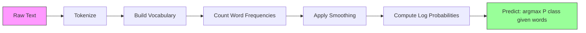

# 朴素贝叶斯

> “朴素”的假设是错误的，但它就是有效。这正是它的妙处所在。

**类型:** 构建
**语言:** Python
**前提知识:** 第二阶段，第 01-07 课（分类、贝叶斯定理）
**时间:** ~75 分钟

## 学习目标

- 从零开始实现带拉普拉斯平滑的多项式朴素贝叶斯，用于文本分类
- 解释为什么朴素的独立性假设在数学上是错误的，但在实践中却能产生正确的类别排序
- 比较多重伯努利、伯努利和高斯朴素贝叶斯变体，并为给定的特征类型选择正确的方法
- 在高维稀疏数据上，将朴素贝叶斯与逻辑回归进行评估，并解释其中起作用的偏差-方差权衡

## 问题所在

你需要对文本进行分类。将邮件分为垃圾邮件或非垃圾邮件。将客户评论分为正面或负面。将支持工单归入不同类别。你有数千个特征（每个词一个），但训练数据有限。

大多数分类器在这里会卡住。逻辑回归需要足够的样本才能可靠地估计数千个权重。决策树一次只能在一个词上进行分割，并且会严重过拟合。在 10,000 维空间中，KNN 毫无意义，因为每个点到其他点的距离都相等。

朴素贝叶斯可以处理这种情况。它做了一个数学上错误的假设（在给定类别下，每个特征都独立于其他特征），但它在文本分类上仍然优于“更智能”的模型，尤其是在训练集较小时。它只需对数据进行单次遍历即可完成训练。它可以扩展到数百万个特征。它能产生概率估计（尽管由于独立性假设，这些概率通常校准不佳）。

理解为什么一个错误的假设能导致好的预测，会教会你关于机器学习的一些根本道理：最好的模型不是最正确的模型，而是针对你的数据具有最佳偏差-方差权衡的模型。

## 概念解析

### 贝叶斯定理（快速回顾）

贝叶斯定理反转了条件概率：

```
P(class | features) = P(features | class) * P(class) / P(features)
```

我们想要 `P(class | features)` -- 给定文档中的词，该文档属于某个类别的概率。我们可以通过以下方式计算：
- `P(features | class)` -- 在该类别的文档中看到这些词的似然
- `P(class)` -- 类别的先验概率（通常情况下，垃圾邮件有多普遍？）
- `P(features)` -- 证据，对所有类别相同，因此在比较时可以忽略它

具有最高 `P(class | features)` 的类别获胜。

### 朴素独立性假设

精确计算 `P(features | class)` 需要估计所有特征一起出现的联合概率。假设词汇表有 10,000 个词，你需要估计 2^10,000 种可能组合上的分布。这不可能做到。

朴素假设：在给定类别的条件下，每个特征都条件独立。

```
P(w1, w2, ..., wn | class) = P(w1 | class) * P(w2 | class) * ... * P(wn | class)
```

你不再估计一个不可能的联合分布，而是估计 n 个简单的、按特征的分布。每个分布只需要一个计数。

这个假设显然是错误的。在任何文档中，“机器”和“学习”这两个词都不是独立的。但分类器不需要正确的概率估计。它需要的是正确的排序——哪个类别的概率最高。独立性假设引入了系统性误差，但这些误差对所有类别的影响相似，因此排序保持正确。

### 为什么它仍然有效

三个原因：

1.  **排序优于校准。** 分类只需要排序第一的类别是正确的。即使当真实概率是 0.7 时，P(垃圾邮件) = 0.99999，分类器仍然能正确选择垃圾邮件。我们不需要正确的概率。我们需要的是正确的赢家。

2.  **高偏差，低方差。** 独立性假设是一个很强的先验。它严重约束了模型，从而防止了过拟合。在训练数据有限的情况下，一个略有错误但稳定的模型，会击败一个理论上正确但极度不稳定的模型。这正是偏差-方差权衡在起作用。

3.  **特征冗余相互抵消。** 相关的特征提供了冗余的证据。分类器会重复计算这些证据，但它也为正确的类别重复计算了证据。如果“机器”和“学习”总是同时出现，两者都为“科技”类别提供了证据。朴素贝叶斯将它们算了两次，但它是为正确的类别算了两次。

第四个，也是实际的原因：朴素贝叶斯非常快。训练是单次遍历数据计数频率。预测是矩阵乘法。你可以在几秒钟内训练一百万个文档。这种速度意味着你可以比使用更慢的模型更快地迭代，尝试更多的特征集，并进行更多的实验。

### 逐步数学推导

让我们通过一个具体的例子来追踪。假设我们有两个类别：垃圾邮件和非垃圾邮件。我们的词汇表有三个词：“免费”、“金钱”、“会议”。

训练数据：
- 垃圾邮件中提及“免费”80次，“金钱”60次，“会议”10次（总共150个词）
- 非垃圾邮件中提及“免费”5次，“金钱”10次，“会议”100次（总共115个词）
- 40% 的邮件是垃圾邮件，60% 是非垃圾邮件

使用拉普拉斯平滑（alpha=1）：

```
P(free | spam)    = (80 + 1) / (150 + 3) = 81/153 = 0.529
P(money | spam)   = (60 + 1) / (150 + 3) = 61/153 = 0.399
P(meeting | spam) = (10 + 1) / (150 + 3) = 11/153 = 0.072

P(free | not-spam)    = (5 + 1) / (115 + 3) = 6/118 = 0.051
P(money | not-spam)   = (10 + 1) / (115 + 3) = 11/118 = 0.093
P(meeting | not-spam) = (100 + 1) / (115 + 3) = 101/118 = 0.856
```

新邮件包含：“免费”（2次）、“金钱”（1次）、“会议”（0次）。

```
log P(spam | email) = log(0.4) + 2*log(0.529) + 1*log(0.399) + 0*log(0.072)
                    = -0.916 + 2*(-0.637) + (-0.919) + 0
                    = -3.109

log P(not-spam | email) = log(0.6) + 2*log(0.051) + 1*log(0.093) + 0*log(0.856)
                        = -0.511 + 2*(-2.976) + (-2.375) + 0
                        = -8.838
```

垃圾邮件以显著优势获胜。“免费”这个词出现两次是垃圾邮件的有力证据。请注意，“会议”没有出现，对两个对数和的贡献都是零（0 * log(P)）——在多重伯努利朴素贝叶斯中，缺席的词没有影响。是伯努利朴素贝叶斯明确地对词的缺席进行建模。

### 三种变体

朴素贝叶斯有三种形式。每种对 `P(feature | class)` 的建模方式不同。

#### 多重伯努利朴素贝叶斯

将每个特征建模为一个计数。最适合特征为词频或 TF-IDF 值的文本数据。

```
P(word_i | class) = (count of word_i in class + alpha) / (total words in class + alpha * vocab_size)
```

其中 `alpha` 是拉普拉斯平滑（下面会解释）。这种变体是文本分类的主力。

#### 高斯朴素贝叶斯

将每个特征建模为一个正态分布。最适合连续特征。

```
P(x_i | class) = (1 / sqrt(2 * pi * var)) * exp(-(x_i - mean)^2 / (2 * var))
```

每个类别在每个特征上都有自己的均值和方差。当特征在每个类别内确实遵循钟形曲线时，这种方法效果很好。

#### 伯努利朴素贝叶斯

将每个特征建模为二元变量（出现或缺席）。最适合短文本或二元特征向量。

```
P(word_i | class) = (docs in class containing word_i + alpha) / (total docs in class + 2 * alpha)
```

与多重伯努利不同，伯努利明确惩罚词的缺席。如果“免费”通常出现在垃圾邮件中，但在这封邮件中缺席，伯努利会将其视为反对垃圾邮件的证据。

### 何时使用哪种变体

| 变体 | 特征类型 | 最适合 | 示例 |
|------|----------|--------|------|
| 多重伯努利 | 计数或频率 | 文本分类、词袋模型 | 邮件垃圾邮件过滤、主题分类 |
| 高斯 | 连续值 | 具有近似正态特征的表格数据 | 鸢尾花分类、传感器数据 |
| 伯努利 | 二元 (0/1) | 短文本、二元特征向量 | 短信垃圾邮件过滤、存在/缺席特征 |

### 拉普拉斯平滑

当一个词出现在测试数据中，但在某个特定类别的训练数据中从未出现过时，会发生什么？

没有平滑时：`P(word | class) = 0/N = 0`。一个零乘以整个乘积会使 `P(class | features) = 0`，无论其他证据如何。一个未见过的词会毁掉整个预测，无论有多少其他证据支持它。

拉普拉斯平滑为每个特征计数添加一个小计数 `alpha`（通常为1）：

```
P(word_i | class) = (count(word_i, class) + alpha) / (total_words_in_class + alpha * vocab_size)
```

当 alpha=1 时，每个词至少获得一个很小的概率。出现在测试邮件中的词“discombobulate”不再会使垃圾邮件概率归零。这种平滑有一个贝叶斯解释：它等同于在词分布上放置一个均匀的狄利克雷先验。

更高的 alpha 意味着更强的平滑（更均匀的分布）。更低的 alpha 意味着模型更信任数据。Alpha 是一个需要调整的超参数。

Alpha 的影响：

| Alpha | 效果 | 何时使用 |
|-------|------|----------|
| 0.001 | 几乎没有平滑，信任数据 | 训练集非常大，没有未见过的特征 |
| 0.1 | 轻度平滑 | 训练集较大 |
| 1.0 | 标准拉普拉斯平滑 | 默认起点 |
| 10.0 | 强平滑，使分布平坦 | 训练集非常小，预计有许多未见过的特征 |

### 对数空间计算

将数百个小于 1 的概率相乘会导致浮点下溢。即使真实值是一个非常小的正数，在浮点数中乘积也会变成零。

解决方案：在对数空间中工作。不乘以概率，而是将它们的对数相加：

```
log P(class | x1, x2, ..., xn) = log P(class) + sum_i log P(xi | class)
```

这使得预测变成了一个点积：

```
log_scores = X @ log_feature_probs.T + log_class_priors
prediction = argmax(log_scores)
```

矩阵乘法。这就是为什么朴素贝叶斯的预测如此之快——它与单层线性模型的操作相同。

### 朴素贝叶斯 vs 逻辑回归

两者都是用于文本的线性分类器。区别在于它们建模的内容。

| 方面 | 朴素贝叶斯 | 逻辑回归 |
|------|-----------|----------|
| 类型 | 生成模型 (建模 P(X\|Y)) | 判别模型 (建模 P(Y\|X)) |
| 训练 | 计数频率 | 优化损失函数 |
| 小数据 | 更好 (强先验有帮助) | 更差 (没有足够数据估计权重) |
| 大数据 | 更差 (错误假设有害) | 更好 (灵活的边界) |
| 特征 | 假设独立 | 处理相关性 |
| 速度 | 单次遍历，非常快 | 迭代优化 |
| 校准 | 概率较差 | 概率较好 |

经验法则：从朴素贝叶斯开始。如果你有足够的数据并且朴素贝叶斯达到平台期，就切换到逻辑回归。

### 分类流水线



在实践中，我们在对数空间中工作以避免浮点下溢。不将许多小概率相乘，而是将它们的对数相加：

```
log P(class | features) = log P(class) + sum_i log P(feature_i | class)
```

## 动手构建

`code/naive_bayes.py` 中的代码从零开始实现了多重伯努利朴素贝叶斯和高斯朴素贝叶斯。

### 多重伯努利朴素贝叶斯

从零开始的实现：

1.  **fit(X, y)**: 对于每个类别，计算每个特征的频率。添加拉普拉斯平滑。计算对数概率。存储类别先验（类别频率的对数）。

2.  **predict_log_proba(X)**: 对于每个样本，计算 log P(class) + 所有特征的 log P(feature_i | class) 之和。这是一个矩阵乘法：X @ log_probs.T + log_priors。

3.  **predict(X)**: 返回具有最高对数概率的类别。

```python
class MultinomialNB:
    def __init__(self, alpha=1.0):
        self.alpha = alpha

    def fit(self, X, y):
        classes = np.unique(y)
        n_classes = len(classes)
        n_features = X.shape[1]

        self.classes_ = classes
        self.class_log_prior_ = np.zeros(n_classes)
        self.feature_log_prob_ = np.zeros((n_classes, n_features))

        for i, c in enumerate(classes):
            X_c = X[y == c]
            self.class_log_prior_[i] = np.log(X_c.shape[0] / X.shape[0])
            counts = X_c.sum(axis=0) + self.alpha
            self.feature_log_prob_[i] = np.log(counts / counts.sum())

        return self
```

关键洞察：在拟合之后，预测只是矩阵乘法加上一个偏置。这就是为什么朴素贝叶斯如此之快。

### 高斯朴素贝叶斯

对于连续特征，我们估计每个类别每个特征的均值和方差：

```python
class GaussianNB:
    def __init__(self):
        pass

    def fit(self, X, y):
        classes = np.unique(y)
        self.classes_ = classes
        self.means_ = np.zeros((len(classes), X.shape[1]))
        self.vars_ = np.zeros((len(classes), X.shape[1]))
        self.priors_ = np.zeros(len(classes))

        for i, c in enumerate(classes):
            X_c = X[y == c]
            self.means_[i] = X_c.mean(axis=0)
            self.vars_[i] = X_c.var(axis=0) + 1e-9
            self.priors_[i] = X_c.shape[0] / X.shape[0]

        return self
```

预测使用每个特征的高斯概率密度函数（PDF），并在特征间相乘（在对数空间中相加）。

### 演示：文本分类

代码生成模拟两个类别（科技文章 vs 体育文章）的合成词袋数据。每个类别有不同的词频分布。多重伯努利朴素贝叶斯使用词频对它们进行分类。

合成数据的工作方式如下：我们创建 200 个“词”（特征列）。词 0-39 在科技文章中频率高，在体育文章中低。词 80-119 在体育文章中频率高，在科技文章中低。词 40-79 在两者中都是中等频率。这创造了一个现实的场景，其中一些词是强有力的类别指示器，而另一些是噪声。

### 演示：连续特征

代码生成类似鸢尾花的数据（3个类别，4个特征，高斯分布簇）。高斯朴素贝叶斯使用每个类别的均值和方差进行分类。每个类别有不同的中心（均值向量）和不同的离散程度（方差），模拟了真实世界中测量值在类别间系统性差异的数据。

代码还演示了：
- **平滑比较：** 使用不同的 alpha 值训练多重伯努利朴素贝叶斯，以展示平滑强度对准确率的影响。
- **训练集大小实验：** 随着训练数据从 20 个增加到 1600 个样本，朴素贝叶斯准确率如何提高。朴素贝叶斯即使在样本非常少的情况下也能达到不错的准确率——这是它的主要优势。
- **混淆矩阵：** 每个类别的精确率、召回率和 F1 分数，以展示朴素贝叶斯在哪里犯错。

### 预测速度

朴素贝叶斯的预测是矩阵乘法。对于 n 个样本，d 个特征，k 个类别：
- 多重伯努利朴素贝叶斯：一次矩阵乘法 (n x d) @ (d x k) = O(n * d * k)
- 高斯朴素贝叶斯：n * k 次高斯 PDF 计算，每次对 d 个特征 = O(n * d * k)

两者在每个维度上都是线性的。将其与 KNN（需要到所有训练点的距离计算）或带有 RBF 核的 SVM（需要对所有支持向量进行核计算）相比。朴素贝叶斯在预测时快了好几个数量级。

## 实际使用

使用 sklearn，两种变体都是一行代码：

```python
from sklearn.naive_bayes import GaussianNB, MultinomialNB

gnb = GaussianNB()
gnb.fit(X_train, y_train)
print(f"GaussianNB accuracy: {gnb.score(X_test, y_test):.3f}")

mnb = MultinomialNB(alpha=1.0)
mnb.fit(X_train_counts, y_train)
print(f"MultinomialNB accuracy: {mnb.score(X_test_counts, y_test):.3f}")
```

使用 sklearn 进行文本分类：

```python
from sklearn.feature_extraction.text import CountVectorizer
from sklearn.naive_bayes import MultinomialNB
from sklearn.pipeline import Pipeline

text_clf = Pipeline([
    ("vectorizer", CountVectorizer()),
    ("classifier", MultinomialNB(alpha=1.0)),
])

text_clf.fit(train_texts, train_labels)
accuracy = text_clf.score(test_texts, test_labels)
```

`naive_bayes.py` 中的代码将从零开始的实现与 sklearn 在相同数据上进行比较，以验证正确性。

### 朴素贝叶斯与 TF-IDF

原始词频给每个词每次出现赋予相同的权重。但像“的”和“是”这样的常见词在每个类别中都频繁出现——它们不携带信息。TF-IDF（词频-逆文档频率）降低常见词的权重，提高罕见的、具有区分性的词的权重。

```python
from sklearn.feature_extraction.text import TfidfVectorizer
from sklearn.naive_bayes import MultinomialNB
from sklearn.pipeline import Pipeline

text_clf = Pipeline([
    ("tfidf", TfidfVectorizer()),
    ("classifier", MultinomialNB(alpha=0.1)),
])
```

TF-IDF 值是非负的，因此可以与多重伯努利朴素贝叶斯一起使用。TF-IDF + 多重伯努利朴素贝叶斯的组合是文本分类最强大的基线之一。在训练样本少于 10,000 的数据集上，它经常击败更复杂的模型。

### 伯努利朴素贝叶斯用于短文本

对于短文本（推文、短信、聊天消息），伯努利朴素贝叶斯可能优于多重伯努利朴素贝叶斯。短文本的词频较低，因此多重伯努利所依赖的频率信息是有噪声的。伯努利朴素贝叶斯只关心出现与否，在短文本中更为可靠。

```python
from sklearn.naive_bayes import BernoulliNB
from sklearn.feature_extraction.text import CountVectorizer

text_clf = Pipeline([
    ("vectorizer", CountVectorizer(binary=True)),
    ("classifier", BernoulliNB(alpha=1.0)),
])
```

CountVectorizer 中的 `binary=True` 标志将所有计数转换为 0/1。没有它，伯努利朴素贝叶斯仍然有效，但它看到的是它未被设计处理的计数值。

### 校准朴素贝叶斯概率

朴素贝叶斯的概率校准不佳。当朴素贝叶斯说 P(垃圾邮件) = 0.95 时，真实概率可能是 0.7。如果你需要可靠的概率估计（例如，设置阈值或与其他模型结合），请使用 sklearn 的 CalibratedClassifierCV：

```python
from sklearn.calibration import CalibratedClassifierCV

calibrated_nb = CalibratedClassifierCV(MultinomialNB(), cv=5, method="sigmoid")
calibrated_nb.fit(X_train, y_train)
proba = calibrated_nb.predict_proba(X_test)
```

这会在朴素贝叶斯原始分数之上，使用交叉验证拟合一个逻辑回归。得到的概率更接近真实的类别频率。

### 常见陷阱

1.  **负特征值。** 多重伯努利朴素贝叶斯要求特征非负。如果你有负值（例如具有某些设置的 TF-IDF 或标准化特征），请改用高斯朴素贝叶斯，或者将特征平移为正值。

2.  **零方差特征。** 高斯朴素贝叶斯除以方差。如果某个特征在某个类别内的方差为零（所有值相同），概率计算会失效。代码在所有方差上添加一个小的平滑项（1e-9）来防止这种情况。

3.  **类别不平衡。** 如果 99% 的邮件是非垃圾邮件，那么先验 P(非垃圾邮件) = 0.99 非常强，会压倒似然证据。你可以手动设置类别先验，或者使用 sklearn 中的 `class_prior` 参数。

4.  **特征缩放。** 多重伯努利朴素贝叶斯不需要缩放（它在计数上工作）。高斯朴素贝叶斯也不需要缩放（它估计每个特征的统计量）。这是相对于逻辑回归和 SVM 的一个优势，因为后者对特征缩放敏感。

## 交付成果

本课产生：
- `outputs/skill-naive-bayes-chooser.md` -- 一个用于选择正确朴素贝叶斯变体的决策技能
- `code/naive_bayes.py` -- 从零实现的多重伯努利朴素贝叶斯和高斯朴素贝叶斯，并与 sklearn 进行比较

### 朴素贝叶斯何时失败

朴素贝叶斯在独立性假设导致排序错误（而不仅仅是概率错误）时会失败。这发生在：

1.  **强特征交互。** 如果类别依赖于两个特征的组合，而不是单独依赖任何一个（类似 XOR 的模式），朴素贝叶斯将完全错过它。每个特征单独不提供证据，朴素贝叶斯无法非线性地组合它们。

2.  **高度相关的特征但提供相反的证据。** 如果特征 A 表示“垃圾邮件”，特征 B 表示“非垃圾邮件”，但 A 和 B 完全相关（在现实中它们总是一致），朴素贝叶斯会看到实际并不存在的冲突证据。

3.  **非常大的训练集。** 有足够的数据时，像逻辑回归这样的判别模型可以学习到真正的决策边界并超越朴素贝叶斯。在小数据上有帮助的独立性现在会阻碍模型的发展。

在实践中，这些失败模式在文本分类中很少见。文本特征数量众多，单独作用微弱，并且独立性假设的误差往往会相互抵消。对于具有少量强相关特征的表格数据，首先考虑逻辑回归或基于树的模型。

## 练习

1.  **平滑实验。** 使用 alpha 值为 0.01, 0.1, 1.0, 10.0 和 100.0 在文本数据上训练多重伯努利朴素贝叶斯。绘制准确率 vs alpha 的图。性能在何处达到峰值？为什么过高的 alpha 会损害性能？

2.  **特征独立性测试。** 获取一个真实的文本数据集。选择两个明显相关的词（“机器”和“学习”）。计算 P(word1 | class) * P(word2 | class) 并与 P(word1 AND word2 | class) 进行比较。独立性假设错得有多离谱？这会影响分类准确率吗？

3.  **伯努利实现。** 用一个伯努利朴素贝叶斯类扩展代码。将词袋模型转换为二元（出现/缺席），并在文本数据上比较其与多重伯努利朴素贝叶斯的准确率。伯努利在何时获胜？

4.  **朴素贝叶斯 vs 逻辑回归。** 在文本数据上训练两者。从 100 个训练样本开始，增加到 10,000 个。为两者绘制准确率 vs 训练集大小的图。在哪个点逻辑回归开始超越朴素贝叶斯？

5.  **垃圾邮件过滤器。** 构建一个完整的垃圾邮件分类器：对原始邮件文本进行分词，构建词汇表，创建词袋特征，训练多重伯努利朴素贝叶斯，使用精确率和召回率进行评估（而不仅仅是准确率——为什么？）。

## 关键术语

| 术语 | 人们怎么说 | 它的实际含义 |
|------|-----------|--------------|
| 朴素贝叶斯 | “简单的概率分类器” | 一个应用贝叶斯定理并假设在给定类别下特征条件独立的分类器 |
| 条件独立 | “特征互不影响” | P(A, B \| C) = P(A \| C) * P(B \| C) —— 在知道 C 的情况下，了解 B 不会给你关于 A 的任何新信息 |
| 拉普拉斯平滑 | “加一平滑” | 为每个特征添加一个小的计数，以防止零概率主导预测 |
| 先验 | “在看到数据之前你所相信的” | P(class) —— 在观察任何特征之前，每个类别的概率 |
| 似然 | “数据拟合得有多好” | P(features \| class) —— 如果类别已知，观察到这些特征的概率 |
| 后验 | “在看到数据之后你所相信的” | P(class \| features) —— 观察到特征后，该类别的更新概率 |
| 生成模型 | “建模数据是如何生成的” | 一个学习 P(X \| Y) 和 P(Y) 然后使用贝叶斯定理得到 P(Y \| X) 的模型 |
| 判别模型 | “建模决策边界” | 一个直接学习 P(Y \| X) 而不建模 X 如何生成的模型 |
| 对数概率 | “避免下溢” | 使用 log P 而不是 P，以防止许多小数的乘积在浮点数中变为零 |

## 扩展阅读

- [scikit-learn 朴素贝叶斯文档](https://scikit-learn.org/stable/modules/naive_bayes.html) —— 所有三种变体及其数学细节
- [McCallum and Nigam, A Comparison of Event Models for Naive Bayes Text Classification (1998)](https://www.cs.cmu.edu/~knigam/papers/multinomial-aaaiws98.pdf) —— 多重伯努利 vs 伯努利用于文本的经典比较
- [Rennie et al., Tackling the Poor Assumptions of Naive Bayes Text Classifiers (2003)](https://people.csail.mit.edu/jrennie/papers/icml03-nb.pdf) —— 对朴素贝叶斯用于文本的改进
- [Ng and Jordan, On Discriminative vs. Generative Classifiers (2001)](https://ai.stanford.edu/~ang/papers/nips01-discriminativegenerative.pdf) —— 证明在数据较少时，朴素贝叶斯比逻辑回归收敛更快