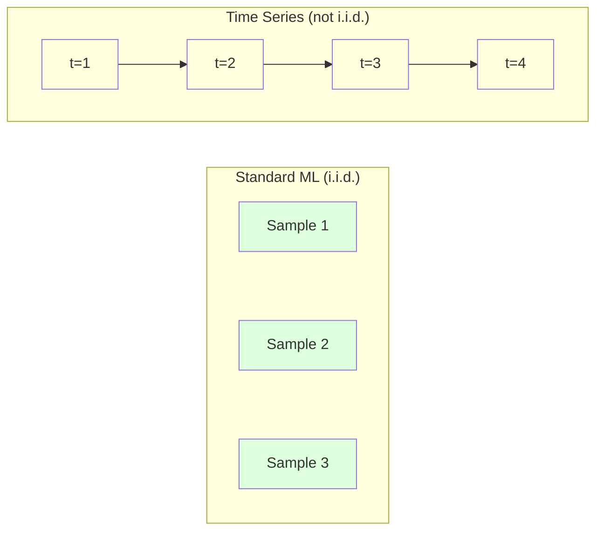
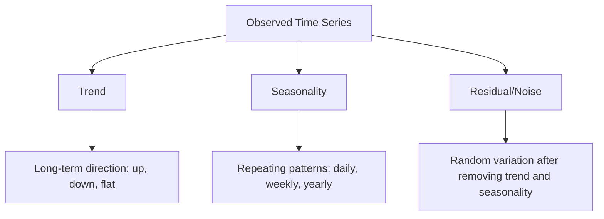
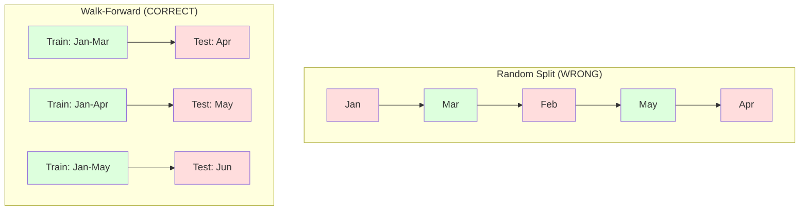

# 时间序列基础

> 过往表现确实能预测未来结果——前提是你先检验了平稳性。

**类型:** 构建  
**语言:** Python  
**前提:** 第二阶段，第01-09课  
**时间:** 约90分钟

## 学习目标

- 将时间序列分解为趋势、季节性和残差分量，并检验平稳性
- 实现滞后特征和滚动统计量，将时间序列转化为监督学习问题
- 构建滚动前向验证框架，防止未来数据泄露到训练集中
- 解释为何随机训练/测试集划分对时间序列无效，并展示与正确时序划分相比的性能差距

## 问题所在

你拥有按时间顺序排列的数据。每日销售额、每小时温度、每分钟CPU使用率、每周股价。你想要预测下一个值、下一周、下一季度。

你动用了标准的机器学习工具包：随机划分训练/测试集、交叉验证、输入特征矩阵、输出预测。每一步都是错的。

时间序列打破了标准机器学习所依赖的假设。样本并非独立——今天的温度取决于昨天的。随机划分会将未来的信息泄露到过去。在回测中表现优异的特征在生产环境中会失败，因为它们依赖于随时间变化的模式。

一个在随机交叉验证中准确率达到95%的模型，在使用基于时间的正确评估方法时可能只有55%的准确率。这种差异不是技术细节问题，而是纸面上有效的模型与生产环境中有效模型之间的区别。

本课涵盖基础内容：时间数据有何不同，如何诚实评估模型，以及如何将时间序列转化为标准机器学习模型可以处理的特征。

## 核心概念

### 时间序列的独特之处

标准机器学习假设独立同分布（i.i.d.）。每个样本都从相同分布中抽取，且相互独立。时间序列违反了这两点：

- **非独立。** 今天的股价取决于昨天的。本周销售额与上周相关。
- **同分布。** 分布会随时间变化。十二月的销售额看起来与三月的不同。

这些违反并非小事。它们改变了你构建特征、评估模型以及选择有效算法的方式。



在标准机器学习中，样本是可互换的。打乱它们不会改变任何事情。在时间序列中，顺序就是一切。打乱会破坏信号。

### 时间序列的组成部分

每个时间序列都是以下成分的组合：



- **趋势**: 长期方向。收入每年增长10%。全球气温上升。
- **季节性**: 固定间隔内的重复模式。零售销售额在十二月激增。空调使用量在七月达到峰值。
- **残差**: 去除趋势和季节性后的剩余部分。如果残差看起来像白噪声，则分解成功捕获了信号。

### 平稳性

如果时间序列的统计特性（均值、方差、自相关性）不随时间变化，则该序列是平稳的。大多数预测方法都假设平稳性。

**为何重要:** 非平稳序列的均值会发生漂移。一个基于一月数据训练的模型学到的均值，将与二月显示的均值不同。系统性错误就会产生。

**如何检查:** 计算滚动均值和滚动标准差。如果它们漂移，则序列是非平稳的。

**如何修正:** 差分。不直接对原始值建模，而是对连续值之间的变化建模：

```
diff[t] = value[t] - value[t-1]
```

如果一轮差分无法使序列平稳，则再次应用差分（二阶差分）。大多数现实世界序列最多需要两轮差分。

**示例:**

原始序列： [100, 102, 106, 112, 120]
一阶差分： [2, 4, 6, 8] (仍在上升趋势中)
二阶差分：  [2, 2, 2] (常数——平稳)

原始序列具有二次趋势。一阶差分将其变为线性趋势。二阶差分使其变平。实践中，很少需要超过两轮。

**正式检验:** 扩展迪基-福勒检验是平稳性的标准统计检验。零假设是“序列非平稳”。p值小于0.05意味着你可以拒绝零假设并得出序列平稳的结论。我们不会从头实现ADF检验（它需要渐进分布表），但我们代码中的滚动统计量方法提供了一种实用的视觉检查手段。

### 自相关性

自相关性衡量时间 t 的值与时间 t-k（过去 k 步）的值之间的相关程度。自相关函数绘制了每个滞后 k 的这种相关性。

**ACF告诉你:**
- 序列的记忆有多远。如果ACF在滞后5后降至零，则5步之前的值已不相关。
- 是否存在季节性。如果ACF在滞后12（月度数据）出现峰值，则存在年度季节性。
- 应创建多少滞后特征。使用ACF变得可忽略之前的滞后。

**偏自相关函数**移除了间接相关性。如果今天仅因为两者都与昨天相关而与3天前相关，则滞后3的PACF将为零，而滞后3的ACF则不为零。

### 滞后特征：将时间序列转化为监督学习

标准机器学习模型需要特征矩阵 X 和目标 y。时间序列只给你一列值。桥梁就是滞后特征。

取序列 [10, 12, 14, 13, 15]，创建滞后1和滞后2特征：

| lag_2 | lag_1 | 目标 |
|-------|-------|------|
| 10    | 12    | 14   |
| 12    | 14    | 13   |
| 14    | 13    | 15   |

现在你有了一个标准的回归问题。任何机器学习模型（线性回归、随机森林、梯度提升）都可以根据滞后值预测目标。

可以工程化的其他特征：
- **滚动统计量:** 过去 k 个值的均值、标准差、最小值、最大值
- **日历特征:** 星期几、月份、是否为节假日、是否为周末
- **差分值:** 与前一步的变化
- **扩展统计量:** 累积均值、累积和
- **比率特征:** 当前值 / 滚动均值（偏离近期均值的程度）
- **交互特征:** lag_1 * 星期几（星期几对动量的影响）

**需要多少个滞后？** 使用自相关函数。如果ACF在滞后10内显著，则至少使用10个滞后。如果存在每周季节性，则包含滞后7（可能还有滞后14）。更多滞后赋予模型更多历史信息，但也带来更多的拟合特征，增加了过拟合风险。

**目标对齐陷阱。** 创建滞后特征时，目标必须是时间 t 的值，所有特征必须使用时间 t-1 或更早的值。如果意外地将时间 t 的值作为特征包含进来，你就有了一个完美的预测器——以及一个完全无用的模型。这是时间序列特征工程中最常见的错误。

### 滚动前向验证

这是本课最重要的概念。标准的k折交叉验证随机将样本分配到训练集和测试集。对于时间序列，这会导致未来信息泄露。



滚动前向验证：
1. 使用截至时间 t 的数据进行训练
2. 在时间 t+1（或 t+1 到 t+k，用于多步预测）进行预测
3. 向前滑动窗口
4. 重复

每个测试折只包含所有训练数据之后的数据。没有未来信息泄露。这为你提供了模型部署后性能的诚实估计。

**扩展窗口**使用所有历史数据进行训练（窗口增长）。**滑动窗口**使用固定大小的训练窗口（窗口滑动）。当你认为旧数据仍然相关时，使用扩展窗口。当世界在变化且旧数据有害时，使用滑动窗口。

### ARIMA直觉

ARIMA是经典的时间序列模型。它包含三个组成部分：

- **AR（自回归）:** 根据过去值预测。AR(p) 使用最后 p 个值。
- **I（积分/差分）:** 通过差分实现平稳性。I(d) 应用 d 轮差分。
- **MA（移动平均）:** 根据过去的预测误差预测。MA(q) 使用最后 q 个误差。

ARIMA(p, d, q) 将三者结合。你基于ACF/PACF分析或自动搜索（auto-ARIMA）来选择 p, d, q。

我们不会从头实现ARIMA——它需要的数值优化超出了本课范围。关键洞察是理解每个组成部分的作用，以便你能解释ARIMA结果并知道何时使用它。

### 何时使用何种方法

| 方法 | 最适用于 | 处理季节性 | 处理外部特征 |
|------|---------|-----------|-------------|
| 滞后特征 + 机器学习 | 包含大量外部特征的表格数据 | 通过日历特征 | 是 |
| ARIMA | 单变量序列，短期预测 | SARIMA变体 | 有限（ARIMAX有限） |
| 指数平滑 | 简单趋势 + 季节性 | 是（Holt-Winters） | 否 |
| Prophet | 商业预测，节假日 | 是（傅里叶项） | 有限 |
| 神经网络（LSTM， Transformer） | 长序列，多序列 | 学习得到 | 是 |

对于大多数实际问题，滞后特征 + 梯度提升是最强的起点。它自然地处理外部特征，不需要平稳性，且易于调试。

### 预测范围与策略

单步预测预测下一个时间步。多步预测预测多个时间步。有三种策略：

**递归（迭代）:** 预测一步，将该预测用作下一步的输入。简单但误差累积——每个预测都使用前一个预测，因此错误会复合。

**直接:** 为每个预测范围训练一个单独的模型。Model-1 预测 t+1，Model-5 预测 t+5。无误差累积，但每个模型的训练样本更少，且它们不共享信息。

**多输出:** 训练一个同时输出所有预测范围的模型。跨预测范围共享信息，但需要支持多输出的模型（或自定义损失函数）。

对于大多数实际问题，对于短范围（1-5步）从递归开始，对于较长范围使用直接法。

### 时间序列中的常见错误

| 错误 | 发生原因 | 如何修正 |
|------|---------|---------|
| 随机划分训练/测试集 | 来自标准机器学习的习惯 | 使用滚动前向或时序划分 |
| 使用未来特征 | 意外包含了时间 t 的特征 | 审查每个特征的时间对齐性 |
| 过拟合季节性 | 模型记忆了日历模式 | 在测试集中留出完整的季节性周期 |
| 忽视规模变化 | 收入翻倍但模式保持不变 | 对百分比变化而非绝对值建模 |
| 滞后特征过多 | "更多历史更好" | 使用ACF确定相关滞后 |
| 未进行差分 | "模型会自己解决" | 树模型处理趋势；线性模型需要平稳性 |

## 动手构建

`code/time_series.py` 中的代码从头实现了核心构建模块。

### 滞后特征创建器

```python
def make_lag_features(series, n_lags):
    n = len(series)
    X = np.full((n, n_lags), np.nan)
    for lag in range(1, n_lags + 1):
        X[lag:, lag - 1] = series[:-lag]
    valid = ~np.isnan(X).any(axis=1)
    return X[valid], series[valid]
```

这将一维序列转换为一个特征矩阵，其中每一行以最后 `n_lags` 个值作为特征，当前值作为目标。

### 滚动前向交叉验证

```python
def walk_forward_split(n_samples, n_splits=5, min_train=50):
    assert min_train < n_samples, "min_train must be less than n_samples"
    step = max(1, (n_samples - min_train) // n_splits)
    for i in range(n_splits):
        train_end = min_train + i * step
        test_end = min(train_end + step, n_samples)
        if train_end >= n_samples:
            break
        yield slice(0, train_end), slice(train_end, test_end)
```

每个划分确保训练数据严格在测试数据之前。训练窗口随每一折扩展。

### 简单自回归模型

一个纯粹的AR模型就是对滞后特征进行线性回归：

```python
class SimpleAR:
    def __init__(self, n_lags=5):
        self.n_lags = n_lags
        self.weights = None
        self.bias = None

    def fit(self, series):
        X, y = make_lag_features(series, self.n_lags)
        # Solve via normal equations
        X_b = np.column_stack([np.ones(len(X)), X])
        theta = np.linalg.lstsq(X_b, y, rcond=None)[0]
        self.bias = theta[0]
        self.weights = theta[1:]
        return self
```

这在概念上与第02课的线性回归相同，但应用于同一变量的时滞版本。

### 平稳性检验

代码计算滚动统计量以视觉和数值方式评估平稳性：

```python
def check_stationarity(series, window=50):
    rolling_mean = np.array([
        series[max(0, i - window):i].mean()
        for i in range(1, len(series) + 1)
    ])
    rolling_std = np.array([
        series[max(0, i - window):i].std()
        for i in range(1, len(series) + 1)
    ])
    return rolling_mean, rolling_std
```

如果滚动均值漂移或滚动标准差变化，则序列是非平稳的。应用差分后再次检查。

代码还通过比较序列的前半部分和后半部分来检查平稳性。如果均值差异超过半个标准差，或者方差比率超过2倍，则标记为非平稳序列。

### 自相关性

```python
def autocorrelation(series, max_lag=20):
    n = len(series)
    mean = series.mean()
    var = series.var()
    acf = np.zeros(max_lag + 1)
    for k in range(max_lag + 1):
        cov = np.mean((series[:n-k] - mean) * (series[k:] - mean))
        acf[k] = cov / var if var > 0 else 0
    return acf
```

## 实际应用

使用sklearn时，你可以直接将滞后特征与任何回归器一起使用：

```python
from sklearn.linear_model import Ridge
from sklearn.ensemble import GradientBoostingRegressor

X, y = make_lag_features(series, n_lags=10)

for train_idx, test_idx in walk_forward_split(len(X)):
    model = Ridge(alpha=1.0)
    model.fit(X[train_idx], y[train_idx])
    predictions = model.predict(X[test_idx])
```

对于ARIMA，使用statsmodels：

```python
from statsmodels.tsa.arima.model import ARIMA

model = ARIMA(train_series, order=(5, 1, 2))
fitted = model.fit()
forecast = fitted.forecast(steps=30)
```

`time_series.py` 中的代码演示了这两种方法，并使用滚动前向验证对它们进行了比较。

### sklearn的TimeSeriesSplit

sklearn提供了 `TimeSeriesSplit` 来实现滚动前向验证：

```python
from sklearn.model_selection import TimeSeriesSplit

tscv = TimeSeriesSplit(n_splits=5)
for train_index, test_index in tscv.split(X):
    X_train, X_test = X[train_index], X[test_index]
    y_train, y_test = y[train_index], y[test_index]
    model.fit(X_train, y_train)
    score = model.score(X_test, y_test)
```

这等同于我们从头实现的 `walk_forward_split`，但集成到了sklearn的交叉验证框架中。你可以与 `cross_val_score` 一起使用它：

```python
from sklearn.model_selection import cross_val_score

scores = cross_val_score(model, X, y, cv=TimeSeriesSplit(n_splits=5))
print(f"Mean score: {scores.mean():.4f} +/- {scores.std():.4f}")
```

### 评估指标

时间序列预测使用回归指标，但具有时间感知的背景：

- **MAE（平均绝对误差）:** |y_true - y_pred| 的平均值。在原始单位中易于解释。"平均预测偏差3.2度。"
- **RMSE（均方根误差）:** 均方误差的平方根。对较大误差的惩罚比MAE更重。当大的错误比许多小的错误更糟时使用。
- **MAPE（平均绝对百分比误差）:** |error / true_value| * 100 的平均值。与规模无关，适用于比较不同序列。但当真实值为零时未定义。
- **朴素基线比较:** 始终与简单的基线进行比较。季节性朴素基线预测上一个时期（昨天、上周）的值。如果你的模型无法打败朴素基线，说明有问题。

### 滚动特征

代码演示了向滞后特征添加滚动统计量（7天和14天窗口的均值、标准差、最小值、最大值）。这些为模型提供了仅靠滞后特征无法捕捉的近期趋势和波动性信息。

例如，如果滚动均值上升，则表明存在上升趋势。如果滚动标准差增加，则表明波动性加剧。这类模式是树模型可以学习的，而线性模型则不能。

## 交付成果

本课产出：
- `outputs/prompt-time-series-advisor.md` —— 用于框架化时间序列问题的提示词
- `code/time_series.py` —— 滞后特征、滚动前向验证、AR模型、平稳性检验

### 必须超越的基线

在构建任何模型之前，先建立基线：

1. **最后一个值（持久性）。** 预测明天与今天相同。对于许多序列，这一点出人意料地难以超越。
2. **季节性朴素。** 预测今天与上周（或去年）的同一天相同。如果你的模型无法打败这个，说明它没有学到任何超越季节性的有用模式。
3. **移动平均。** 预测过去 k 个值的平均值。平滑噪声，但无法捕捉突变。

如果你花哨的机器学习模型输给了季节性朴素基线，那你就犯了错误。最常见的原因：特征中的未来信息泄露、错误的评估方法，或者序列确实是随机且不可预测的。

### 实用技巧

1. **从绘图开始。** 在任何建模之前，绘制原始序列。观察趋势、季节性、异常值、结构性突变（行为的突然变化）。30秒的目视检查往往比一小时的自动分析告诉你更多。

2. **先差分，后建模。** 如果序列有明显趋势，在创建滞后特征前先对其进行差分。树模型可以处理趋势，但线性模型不能，而且差分从无害处。

3. **留出至少一个完整的季节性周期。** 如果你有每周季节性，你的测试集需要至少完整一周。如果是月度，至少完整一个月。否则你无法评估模型是否捕捉了季节性模式。

4. **在生产环境中监控。** 时间序列模型会随着世界变化而性能下降。持续跟踪滚动预测误差。当误差开始增加时，使用近期数据重新训练模型。

5. **警惕制度变化。** 在疫情前数据上训练的模型无法预测疫情后的行为。将已知的制度变化指标作为特征包含进来，或者使用会遗忘旧数据的滑动窗口。

6. **对偏斜序列取对数。** 收入、价格和计数通常是右偏的。取对数可以稳定方差，并使乘法模式变为加法模式，线性模型可以处理。在对数空间中预测，然后取指数回到原始单位。

## 练习

1. **平稳性实验。** 生成一个具有线性趋势的序列。用滚动统计量检查平稳性。应用一阶差分。再次检查。一个二次趋势需要多少轮差分？

2. **滞后选择。** 计算季节性序列（周期=7）的ACF。哪些滞后具有最高的自相关性？仅使用这些滞后（非连续滞后）创建滞后特征。与使用滞后1到7相比，准确率是否提高？

3. **滚动前向 vs 随机划分。** 在滞后特征上训练岭回归。分别用随机80/20划分和滚动前向验证进行评估。随机划分高估了多少性能？

4. **特征工程。** 向滞后特征添加滚动均值（窗口=7）、滚动标准差（窗口=7）和星期几特征。使用滚动前向验证，比较有无这些额外特征的准确率。

5. **多步预测。** 修改AR模型以预测未来5步而非1步。比较两种策略：(a) 预测一步，将该预测用作下一步的输入（递归），以及 (b) 为每个预测范围训练单独的模型（直接）。哪种更准确？

## 关键术语

| 术语 | 人们常说 | 实际含义 |
|------|---------|---------|
| 平稳性 | "统计数据不随时间变化" | 均值、方差和自相关结构随时间保持恒定的序列 |
| 差分 | "减去连续值" | 计算 y[t] - y[t-1] 以去除趋势并实现平稳性 |
| 自相关 | "序列与自身的相关性" | 时间序列与其自身滞后副本之间的相关性，作为滞后的函数 |
| 偏自相关 | "仅直接相关" | 在移除所有更短滞后的效应后，滞后 k 处的自相关性 |
| 滞后特征 | "过去的值作为输入" | 使用 y[t-1], y[t-2], ..., y[t-k] 作为特征来预测 y[t] |
| 滚动前向验证 | "尊重时间的交叉验证" | 训练数据在时间上总是早于测试数据的评估方法 |
| ARIMA | "经典的时间序列模型" | 自回归积分移动平均：结合了过去值（AR）、差分（I）和过去误差（MA） |
| 季节性 | "重复的历法模式" | 时间序列中与日历时期（每日、每周、每年）相关的规律、可预测的周期 |
| 趋势 | "长期方向" | 序列水平随时间持续上升或下降 |
| 扩展窗口 | "使用所有历史" | 训练集随每一折增长的滚动前向验证 |
| 滑动窗口 | "固定大小的历史" | 训练集是向前滑动的固定长度窗口的滚动前向验证 |

## 延伸阅读

- [Hyndman 和 Athanasopoulos，《预测：原理与实践（第3版）》](https://otexts.com/fpp3/) —— 最佳的免费时间序列预测教材
- [scikit-learn 时间序列划分](https://scikit-learn.org/stable/modules/generated/sklearn.model_selection.TimeSeriesSplit.html) —— sklearn的滚动前向划分器
- [statsmodels ARIMA 文档](https://www.statsmodels.org/stable/generated/statsmodels.tsa.arima.model.ARIMA.html) —— 带有诊断的ARIMA实现
- [Makridakis 等，M5竞赛（2022）](https://www.sciencedirect.com/science/article/pii/S0169207021001874) —— 展示机器学习方法与统计方法对比的大规模预测竞赛