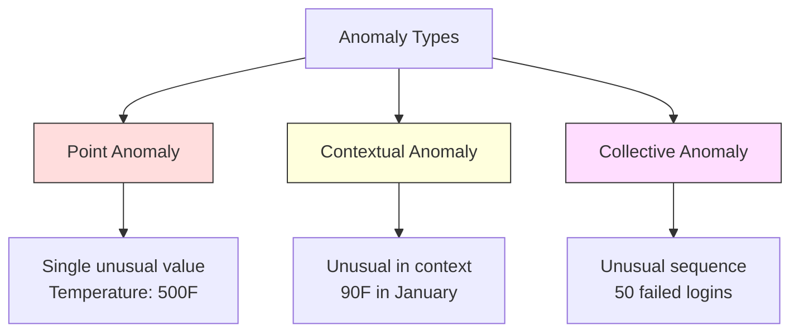
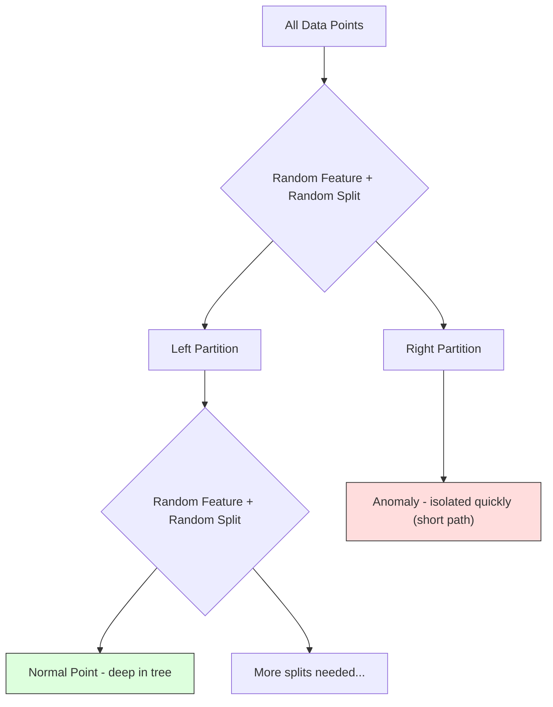
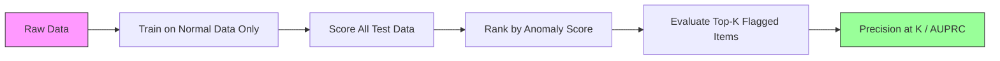

# 异常检测

> 正常很容易定义。异常就是任何不符合常规的东西。

**类型:** 构建
**语言:** Python
**先决条件:** 第2阶段，课程01-09
**时间:** ~75分钟

## 学习目标

- 从零开始实现 Z-score、IQR 和 Isolation Forest 异常检测方法
- 区分点异常、上下文异常和群体异常，并为每种类型选择合适的检测方法
- 解释为什么异常检测被框架化为对正常数据建模，而不是对异常进行分类
- 比较无监督异常检测与有监督分类，评估在新颖异常覆盖度和精度之间的权衡

## 问题描述

一张信用卡在纽约下午2点使用，然后在下午2:05在东京使用。一个工厂传感器读数为150度，而正常范围是80-120度。一台服务器每秒发送50,000个请求，而日均请求量为200。

这些都是异常。发现它们至关重要。欺诈造成数十亿美元损失。设备故障导致停机。网络入侵泄露数据。

挑战在于：你很少有异常的标注示例。欺诈交易仅占总交易量的0.1%。设备故障每年只发生几次。你无法训练一个标准的分类器，因为“异常”类别中几乎没有可供学习的数据。即使你有一些标签，你见过的异常类型也不会是你将遇到的唯一类型。明天的欺诈计划看起来与今天的不同。

异常检测反转了这个问题。与其学习什么是异常的，不如学习什么是正常的。任何偏离正常模式的东西都是可疑的。这种方法无需标签，能适应新类型的异常，并能扩展到海量数据集。

## 概念

### 异常的类型

并非所有异常都一样：

- **点异常。** 一个无论上下文如何都显得异常的数据点。一个温度读数为500度。一个从通常消费50美元的账户中产生了50,000美元的交易。
- **上下文异常。** 一个给定其上下文时显得异常的数据点。90度的温度在夏天是正常的，在冬天是异常的。相同的值，不同的上下文。
- **群体异常。** 一组数据点作为一个整体显得异常，即使每个单独的点可能是正常的。五次登录失败是正常的。五十次连续登录失败就是暴力破解攻击。

大多数方法检测点异常。上下文异常需要时间或位置特征。群体异常需要能感知序列的方法。



### 无监督框架

在标准分类中，你拥有两个类别的标签。在异常检测中，你通常面临以下三种情况之一：

1. **完全无监督。** 完全没有标签。你在所有数据上拟合检测器，并假设异常足够稀少，不会破坏“正常”模型。
2. **半监督。** 你只有干净的正常数据集。你在这个干净集上拟合，并对所有其他数据进行评分。在可能的情况下，这是最强的设置。
3. **弱监督。** 你有少量标注的异常。用它们进行评估，而不是训练。进行无监督训练，然后在标注的子集上测量精确率/召回率。

关键洞察：异常检测与分类有根本区别。你是在建模正常数据的分布，而不是两个类别之间的决策边界。

### 有监督 vs 无监督：权衡

如果你确实有标注的异常，你应该如何利用它们？用于训练（有监督分类）还是仅用于评估（无监督检测）？

**有监督（视为分类）：**
- 捕获你以前见过的精确异常类型
- 对已知异常类型具有更高的精确率
- 完全错过新型异常类型
- 当新的异常类型出现时，需要重新训练
- 需要足够的异常示例（通常太少）

**无监督（建模正常，标记偏差）：**
- 捕获任何偏离正常的情况，包括新型异常
- 不需要标注的异常
- 较高的假阳性率（并非所有异常都是坏的）
- 对分布漂移更具鲁棒性

在实践中，最好的系统结合了两者：无监督检测提供广泛覆盖，有监督模型处理已知的高优先级异常类型，人工审查处理模糊案例。

### Z-Score 方法

最简单的方法。计算每个特征的均值和标准差。将任何距离均值超过 k 个标准差的数据点标记为异常。

```text
z_score = (x - mean) / std
anomaly if |z_score| > threshold
```

默认阈值是3.0（对于高斯分布，99.7%的正常数据落在3个标准差内）。

**优点：** 简单。快速。可解释（“此值偏离正常4.5个标准差”）。

**缺点：** 假设数据服从正态分布。对训练数据中的离群点敏感（离群点会移动均值并放大标准差，使它们更难检测）。在多模态分布上失效。

**适用场景：** 单特征监控，数据大致呈钟形分布。服务器响应时间、制造公差、具有稳定基线的传感器读数。

**失效场景：** 多聚类数据（两个具有不同基线温度的办公地点）、偏态数据（交易金额，1000美元很少见但并非异常）、训练集中存在离群点的数据。

### IQR 方法

比 Z-score 更稳健。使用四分位距而不是均值和标准差。

```
Q1 = 25th percentile
Q3 = 75th percentile
IQR = Q3 - Q1
lower_bound = Q1 - factor * IQR
upper_bound = Q3 + factor * IQR
anomaly if x < lower_bound or x > upper_bound
```

默认因子为1.5。

**优点：** 对离群点稳健（百分位数不受极端值影响）。适用于偏态分布。无正态性假设。

**缺点：** 仅适用于单变量（独立应用于每个特征）。无法检测仅在特征一起考虑时才异常的异常情况（一个点在每个特征上单独看可能是正常的，但在联合空间中是异常的）。

**实践提示：** IQR 中的1.5因子对应于箱线图中的须线。须线之外的点是潜在的离群点。使用3.0而不是1.5会使检测器更保守（标记更少，假阳性更少）。合适的因子取决于你对误报的容忍度。

### Isolation Forest (孤立森林)

关键洞察：异常是少数且不同的。在数据的随机划分中，异常更容易被隔离——它们需要更少的随机分裂就能与其他数据点分离。



**工作原理：**
1. 构建许多随机树（一个孤立森林）
2. 在每个节点上，选择一个随机特征和一个介于该特征最小值与最大值之间的随机分裂值
3. 持续分裂直到每个点都被隔离（位于其自己的叶子节点）
4. 异常点在所有树中的平均路径长度更短

**为何有效：** 正常点位于密集区域。需要许多随机分裂才能将一个点与其邻居隔离开。异常点位于稀疏区域。一两次随机分裂就足以将它们隔离。

异常分数基于所有树的平均路径长度，并通过随机二叉搜索树的期望路径长度进行归一化：

```
score(x) = 2^(-average_path_length(x) / c(n))
```

其中 `c(n)` 是 n 个样本的期望路径长度。分数接近1表示异常。分数接近0.5表示正常。分数接近0表示非常正常（深处于密集聚类中）。

**优点：** 无分布假设。适用于高维空间。扩展性好（样本大小亚线性，因为每棵树使用子样本）。能处理混合特征类型。

**缺点：** 在密集区域的异常上表现不佳（掩蔽效应）。当存在许多不相关特征时，随机分裂效率降低。

**关键超参数：**
- `n_estimators`：树的数量。100通常足够。更多的树使分数更稳定，但计算更慢。
- `max_samples`：每棵树的样本数。原始论文中的默认值是256。较小的值使单棵树的准确性降低，但增加多样性。子采样正是使 Isolation Forest 快速的原因——每棵树只看到数据的一小部分。
- `contamination`：预期的异常比例。仅用于设置阈值。不影响分数本身。

### Local Outlier Factor (局部离群点因子)

LOF 将一个点周围的局部密度与其邻居周围的密度进行比较。一个位于稀疏区域却被密集区域包围的点是异常的。

**工作原理：**
1. 对于每个点，找到其 k 个最近邻
2. 计算局部可达密度（邻域有多密集）
3. 将每个点的密度与其邻居的密度进行比较
4. 如果一个点的密度远低于其邻居的密度，它就是离群点

**LOF 分数：**
- LOF 接近1.0表示与邻居密度相似（正常）
- LOF 大于1.0表示密度低于邻居（可能异常）
- LOF 远大于1.0（例如2.0以上）表示密度显著更低（很可能异常）

“局部”部分至关重要。考虑一个包含两个聚类的数据集：一个密集的1000个点的聚类和一个稀疏的50个点的聚类。稀疏聚类边缘的一个点并不是全局异常——它有50个邻居。但如果其直接邻居比它更密集，它就是局部异常的。LOF 捕捉到了全局方法会遗漏的这种细微差别。

**优点：** 检测局部异常（在某个邻域内异常，即使不是全局异常的点）。适用于不同密度的聚类。

**缺点：** 在大数据集上速度慢（朴素实现为 O(n^2)）。对 k 的选择敏感。在非常高维度下表现不佳（维度灾难影响距离计算）。

### 方法比较

| 方法 | 假设 | 速度 | 处理高维 | 检测局部异常 |
|------|------|------|----------|--------------|
| Z-score | 正态分布 | 非常快 | 是（按特征） | 否 |
| IQR | 无（按特征） | 非常快 | 是（按特征） | 否 |
| Isolation Forest | 无 | 快 | 是 | 部分 |
| LOF | 距离有意义 | 慢 | 差 | 是 |

### 评估挑战

评估异常检测器比评估分类器更困难：

- **极端类别不平衡。** 如果有0.1%的异常，预测所有样本为“正常”可以获得99.9%的准确率。准确率毫无用处。
- **AUROC 具有误导性。** 在严重不平衡的情况下，即使模型在实际阈值下错过了大部分异常，AUROC 看起来也可能不错。
- **更好的指标：** Precision@k（在标记为异常的前 k 个项目中，有多少是真正的异常），AUPRC（精确率-召回率曲线下面积），以及在固定假阳性率下的召回率。



### 异常检测流程

在实践中，异常检测遵循以下工作流程：

1. **收集基线数据。** 理想情况下，选择一个你知道没有（或几乎没有）异常的时期。
2. **特征工程。** 原始特征加上派生特征（滚动统计量、时间特征、比率）。
3. **训练检测器。** 在基线数据上拟合。模型学习“正常”的样子。
4. **对新数据评分。** 每个新的观测值都会得到一个异常分数。
5. **阈值选择。** 选择分数截止值。这是一个业务决策：更高的阈值意味着更少的误报，但也会错过更多异常。
6. **警报与调查。** 标记的点会进入人工审查或自动响应。
7. **反馈收集。** 记录被标记的项目是真正的异常还是误报。使用这些数据来评估检测器，并随时间调整阈值。

这个流程永远不会“完成”。数据分布会发生变化，新的异常类型会出现，阈值需要调整。将异常检测视为一个活的系统，而不是一个一次性的模型。

## 实践构建

`code/anomaly_detection.py` 中的代码从零开始实现了 Z-score、IQR 和 Isolation Forest。

### Z-Score 检测器

```python
def zscore_detect(X, threshold=3.0):
    mean = X.mean(axis=0)
    std = X.std(axis=0)
    std[std == 0] = 1.0
    z = np.abs((X - mean) / std)
    return z.max(axis=1) > threshold
```

简单且向量化。如果任何特征超过阈值，则标记该点。

### IQR 检测器

```python
def iqr_detect(X, factor=1.5):
    q1 = np.percentile(X, 25, axis=0)
    q3 = np.percentile(X, 75, axis=0)
    iqr = q3 - q1
    iqr[iqr == 0] = 1.0
    lower = q1 - factor * iqr
    upper = q3 + factor * iqr
    outside = (X < lower) | (X > upper)
    return outside.any(axis=1)
```

### 从零开始实现 Isolation Forest

从零开始的实现构建了隔离树，这些树随机划分特征空间：

```python
class IsolationTree:
    def __init__(self, max_depth):
        self.max_depth = max_depth

    def fit(self, X, depth=0):
        n, p = X.shape
        if depth >= self.max_depth or n <= 1:
            self.is_leaf = True
            self.size = n
            return self
        self.is_leaf = False
        self.feature = np.random.randint(p)
        x_min = X[:, self.feature].min()
        x_max = X[:, self.feature].max()
        if x_min == x_max:
            self.is_leaf = True
            self.size = n
            return self
        self.threshold = np.random.uniform(x_min, x_max)
        left_mask = X[:, self.feature] < self.threshold
        self.left = IsolationTree(self.max_depth).fit(X[left_mask], depth + 1)
        self.right = IsolationTree(self.max_depth).fit(X[~left_mask], depth + 1)
        return self
```

隔离一个点的路径长度决定了其异常分数。路径越短意味着越异常。

`IsolationForest` 类包装了多棵树：

```python
class IsolationForest:
    def __init__(self, n_estimators=100, max_samples=256, seed=42):
        self.n_estimators = n_estimators
        self.max_samples = max_samples

    def fit(self, X):
        sample_size = min(self.max_samples, X.shape[0])
        max_depth = int(np.ceil(np.log2(sample_size)))
        for _ in range(self.n_estimators):
            idx = rng.choice(X.shape[0], size=sample_size, replace=False)
            tree = IsolationTree(max_depth=max_depth)
            tree.fit(X[idx])
            self.trees.append(tree)

    def anomaly_score(self, X):
        avg_path = average path length across all trees
        scores = 2.0 ** (-avg_path / c(max_samples))
        return scores
```

归一化因子 `c(n)` 是在一个具有 n 个元素的二叉搜索树中进行不成功搜索的期望路径长度。它等于 `2 * H(n-1) - 2*(n-1)/n`，其中 `H` 是调和级数。这种归一化确保分数在不同大小的数据集之间具有可比性。

### 演示场景

代码生成了多个测试场景：

1. **带离群点的单聚类。** 一个2D高斯聚类，注入了远离中心的异常点。所有方法在这里都应该有效。
2. **多模态数据。** 三个大小和密度不同的聚类。聚类之间的点是异常的。Z-score 在这里会很吃力，因为每个特征的范围很宽。
3. **高维数据。** 50个特征，但异常仅在其中5个特征上不同。测试方法是否能在特征子集中找到异常。

每个演示都使用精确率、召回率、F1分数和 Precision@k 来比较所有方法。

## 应用实践

使用 sklearn（使用库实现，而不是从零开始）：

```python
from sklearn.ensemble import IsolationForest
from sklearn.neighbors import LocalOutlierFactor

iso = IsolationForest(n_estimators=100, contamination=0.05, random_state=42)
iso.fit(X_train)
predictions = iso.predict(X_test)

lof = LocalOutlierFactor(n_neighbors=20, contamination=0.05, novelty=True)
lof.fit(X_train)
predictions = lof.predict(X_test)
```

注意 `contamination` 设置了预期的异常比例。正确设置很重要——太低会错过异常，太高会产生误报。

`anomaly_detection.py` 中的代码在相同的数据上比较了从零开始的实现与 sklearn 的实现。

### sklearn 的 contamination 参数

sklearn 中的 `contamination` 参数决定了将连续异常分数转换为二元预测的阈值。它不会改变底层分数。

```python
iso_5 = IsolationForest(contamination=0.05)
iso_10 = IsolationForest(contamination=0.10)
```

两者产生相同的异常分数。但 `iso_5` 标记了前5%，而 `iso_10` 标记了前10%。如果你不知道真实的异常率（你通常不知道），将 contamination 设置为“auto”，并直接使用原始分数。根据假阳性和假阴性之间的成本权衡，设置你自己的阈值。

### One-Class SVM (单类SVM)

另一个值得了解的无监督异常检测器。One-Class SVM 在高维特征空间中（使用核技巧）围绕正常数据拟合一个边界。

```python
from sklearn.svm import OneClassSVM

oc_svm = OneClassSVM(kernel="rbf", gamma="auto", nu=0.05)
oc_svm.fit(X_train)
predictions = oc_svm.predict(X_test)
```

`nu` 参数近似于异常比例。One-Class SVM 在小到中型数据集上效果很好，但无法扩展到非常大的数据集（核矩阵呈二次增长）。

### 自编码器方法（预览）

自编码器是学习压缩和重构数据的神经网络。在正常数据上训练。在测试时，异常数据具有高的重构误差，因为网络只学习了如何重构正常模式。

这将在第3阶段（深度学习）中介绍，但原理相同：对正常进行建模，标记偏离正常的情况。

### 集成异常检测

正如集成方法改进分类（第11课）一样，组合多个异常检测器可以改进检测。最简单的方法是：

1. 运行多个检测器（Z-score, IQR, Isolation Forest, LOF）
2. 将每个检测器的分数归一化到 [0, 1]
3. 对归一化后的分数取平均
4. 在平均分数上设置阈值，标记超过该阈值的点

这可以减少假阳性，因为不同的方法有不同的失败模式。一个被所有四种方法标记的点几乎可以肯定是异常的。一个仅被一种方法标记的点可能是该方法的一个特性。

更复杂的集成方法会根据每个检测器的估计可靠性（如果可能，在已知异常的验证集上测量）对其进行加权。

### 生产环境注意事项

1. **阈值漂移。** 随着数据分布的变化，固定的阈值会过时。监控异常分数的分布，并定期调整。
2. **警报疲劳。** 太多的误报会让操作员停止关注。从一个较高的阈值开始（更少、更可靠的警报），随着信任的建立再降低阈值。
3. **集成方法。** 在生产中，组合多个检测器。只有当多个方法一致认为某个点异常时才标记它。这能显著减少假阳性。
4. **特征工程。** 原始特征通常不够。添加滚动统计量、比率、上次事件以来的时间以及特定领域的特征。好的特征集比检测器的选择更重要。
5. **反馈循环。** 当操作员调查标记的项目并确认或驳回时，将此反馈回系统。随着时间的推移积累标注数据，以评估和改进检测器。

## 交付物

本课程产出：
- `outputs/skill-anomaly-detector.md` -- 一项选择合适检测器的决策技能
- `code/anomaly_detection.py` -- 从零开始实现的 Z-score、IQR 和 Isolation Forest，并与 sklearn 进行比较

### 选择阈值

异常分数是连续的。你需要一个阈值来进行二元决策。这是一个业务决策，而不是技术决策。

考虑两种场景：
- **欺诈检测。** 漏掉欺诈代价高昂（退款、客户信任）。误报需要人工分析师花5分钟调查。设置较低的阈值以捕获更多欺诈，接受更多的误报。
- **设备维护。** 误报意味着不必要的停机，损失50,000美元。漏掉故障意味着500,000美元的维修费用。设置阈值以平衡这些成本。

在这两种情况下，最优阈值取决于假阳性和假阴性之间的成本比率。绘制不同阈值下的精确率和召回率，叠加成本函数，选择成本最低的点。

### 扩展到生产环境

对于生产环境中的实时异常检测：

1. **批量训练，在线评分。** 定期（每天、每周）在最近的正常数据上训练模型。对每个新到达的观测值进行评分。
2. **特征计算必须匹配。** 如果你训练时使用了30天的滚动统计量，你需要30天的历史数据来计算新观测值的特征。缓冲所需的历史数据。
3. **分数分布监控。** 跟踪异常分数随时间的分布。如果中位数分数向上漂移，要么是数据在变化，要么是模型过时了。
4. **可解释性。** 当你标记一个异常时，说明原因。Z-score：“特征X比正常值高出4.2个标准差。” Isolation Forest：“这个点平均被3.1次分裂隔离（正常点需要8.5次）。”

## 练习

1. **阈值调优。** 使用从1.0到5.0步长为0.5的阈值运行 Z-score 检测器。绘制每个阈值下的精确率和召回率。你数据的最佳平衡点在哪里？

2. **多变量异常。** 创建2D数据，其中每个特征单独看都是正常的，但组合起来是异常的（例如，远离主聚类对角线的点）。展示 Z-score 按特征独立检测会错过这些，但 Isolation Forest 能捕捉到。

3. **从零开始实现LOF。** 使用k近邻实现局部离群点因子。在相同数据上与sklearn的LocalOutlierFactor进行比较。使用k=10和k=50 -- k的选择如何影响结果？

4. **流式异常检测。** 修改 Z-score 检测器以在流式环境中工作：随着新点的到达更新运行中的均值和方差（Welford在线算法）。在相同数据上与批量 Z-score 进行比较。

5. **真实世界评估。** 获取一个包含已知异常的数据集（例如来自Kaggle的信用卡欺诈数据）。使用precision@100、precision@500和AUPRC评估所有四种方法。哪种方法效果最好？为什么？

## 关键术语

| 术语 | 人们怎么说 | 它的实际含义 |
|------|------------|--------------|
| Anomaly (异常) | "离群点, 异常点" | 一个显著偏离正常数据预期模式的数据点 |
| Point anomaly (点异常) | "一个奇怪的值" | 一个无论上下文如何都显得异常的个体观测值 |
| Contextual anomaly (上下文异常) | "正常的值, 错误的上下文" | 一个给定其上下文（时间、位置等）时异常的观测值，但在另一个上下文中可能正常 |
| Isolation Forest (孤立森林) | "用随机分裂找离群点" | 一个随机树的集合，能用比正常点更少的分裂来隔离异常 |
| Local Outlier Factor (局部离群点因子) | "与邻居比较密度" | 一种标记其局部密度远低于其邻居密度的点的方法 |
| Z-score (Z分数) | "偏离均值的标准差数" | (x - mean) / std，衡量一个点距离中心多少个标准差 |
| IQR (四分位距) | "四分位距" | Q3 - Q1，衡量中间50%数据的离散程度，用于稳健的离群点检测 |
| Contamination (污染度) | "预期的异常比例" | 一个超参数，告诉检测器应将数据中多大比例标记为异常 |
| Precision@k | "在标记的前k个中，有多少是真实的" | 仅针对最可疑的前k个点计算的精确率，对不平衡的异常检测有用 |
| AUPRC | "精确率-召回率曲线下面积" | 一个汇总所有阈值下精确率-召回率表现的指标，比AUROC更适合不平衡数据 |

## 延伸阅读

- [Liu et al., Isolation Forest (2008)](https://cs.nju.edu.cn/zhouzh/zhouzh.files/publication/icdm08b.pdf) -- 原始Isolation Forest论文
- [Breunig et al., LOF: Identifying Density-Based Local Outliers (2000)](https://dl.acm.org/doi/10.1145/342009.335388) -- 原始LOF论文
- [scikit-learn 离群点检测文档](https://scikit-learn.org/stable/modules/outlier_detection.html) -- sklearn所有异常检测器的概述
- [Chandola et al., Anomaly Detection: A Survey (2009)](https://dl.acm.org/doi/10.1145/1541880.1541882) -- 异常检测方法的全面综述
- [Goldstein and Uchida, A Comparative Evaluation of Unsupervised Anomaly Detection Algorithms (2016)](https://journals.plos.org/plosone/article?id=10.1371/journal.pone.0152173) -- 在真实数据集上对10种方法的实证比较