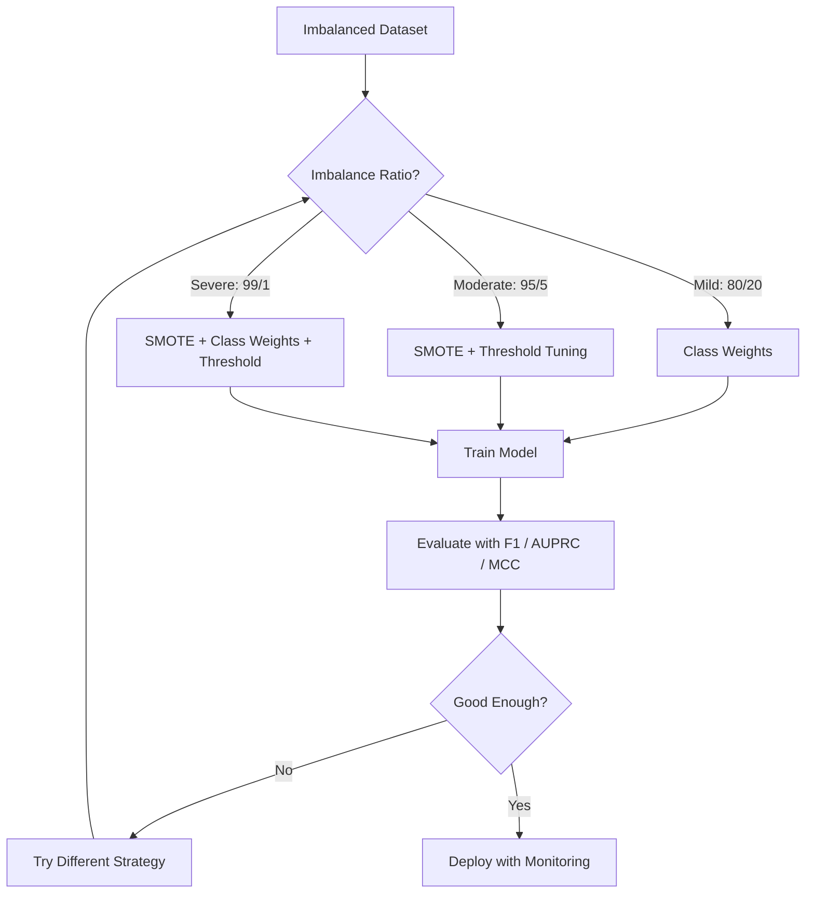
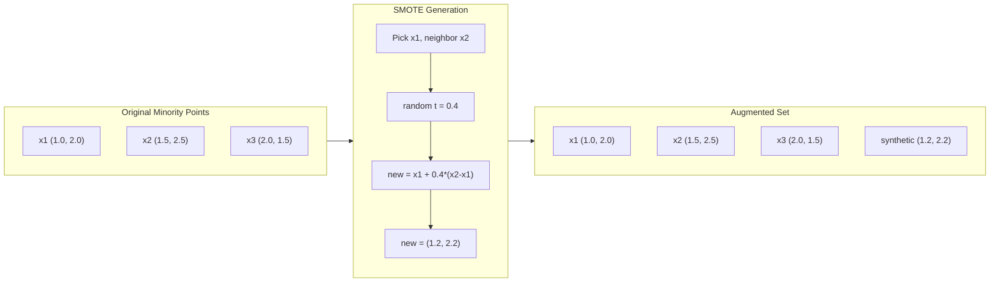
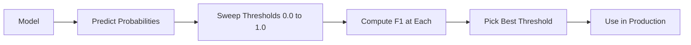
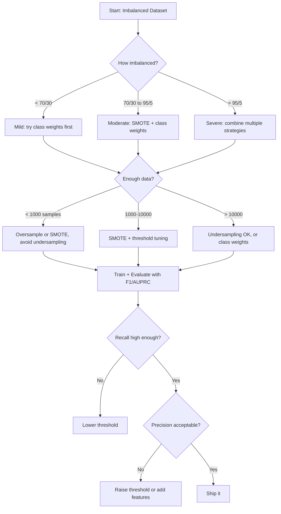

# 处理不平衡数据

> 当你的数据中 99% 是"正常"数据时，准确率就是一个谎言。

**类型：** 构建
**语言：** Python
**先决条件：** 第二阶段，课程 01-09（特别是评估指标）
**时间：** 约 90 分钟

## 学习目标

- 从头实现 SMOTE 并解释合成过采样与随机复制的区别
- 使用 F1 分数、AUPRC 和马修斯相关系数（而非准确率）来评估不平衡分类器
- 比较类权重、阈值调整和重采样策略，并为给定的不平衡比例选择合适的方法
- 构建一个完整的不平衡数据处理流程，结合 SMOTE、类权重和阈值优化

## 问题所在

你构建了一个欺诈检测模型。它达到了 99.9% 的准确率。你为此庆祝。然后你意识到，它对每一笔交易都预测为"非欺诈"。

这不是一个错误。当只有 0.1% 的交易是欺诈时，这是模型会做出的合理行为。模型学到的是，始终猜测多数类可以最小化整体错误。这在技术上是正确的，但完全没有用。

这种情况在所有需要真实分类的场景中都会发生。疾病诊断：1% 的阳性率。网络入侵：0.01% 的攻击。制造缺陷：0.5% 的次品。垃圾邮件过滤：20% 是垃圾邮件。流失预测：5% 的流失客户。少数类越关键，它往往就越罕见。

准确率失效的原因在于它对所有正确预测一视同仁。正确标记一笔合法交易和正确捕捉一次欺诈，都算作一个准确率分数。但捕捉欺诈正是模型存在的全部理由。我们需要能够迫使模型关注这个罕见但重要类别的指标、技术和训练策略。

## 概念详解

### 为什么准确率会失效

考虑一个包含 1000 个样本的数据集：990 个负样本，10 个正样本。一个总是预测为负的模型：

| 实际类别 \ 预测类别 | 预测为正 | 预测为负 |
|--|---|---|
| **实际为正** | 0 (TP) | 10 (FN) |
| **实际为负** | 0 (FP) | 990 (TN) |

准确率 = (0 + 990) / 1000 = 99.0%

这个模型没捕捉到任何欺诈。零疾病。零缺陷。但准确率说是 99%。这就是为什么准确率在不平衡问题中是危险的。

### 更好的指标

**精确率** = TP / (TP + FP)。在所有被标记为正的样本中，有多少是真的？高精确率意味着误报少。

**召回率** = TP / (TP + FN)。在所有实际为正的样本中，我们捕捉到了多少？高召回率意味着漏报少。

**F1 分数** = 2 * 精确率 * 召回率 / (精确率 + 召回率)。调和平均数。比算术平均数更能惩罚精确率和召回率之间的极端不平衡。

**F-beta 分数** = (1 + beta^2) * 精确率 * 召回率 / (beta^2 * 精确率 + 召回率)。当 beta > 1 时，召回率更重要。当 beta < 1 时，精确率更重要。F2 在欺诈检测中很常见（漏报欺诈比误报更糟糕）。

**AUPRC** (精确率-召回率曲线下面积)。类似于 AUC-ROC，但对不平衡数据信息量更大。随机分类器的 AUPRC 等于正类比例（不像 ROC 那样是 0.5）。这使得改进更容易被观察到。

**马修斯相关系数** = (TP * TN - FP * FN) / sqrt((TP+FP)(TP+FN)(TN+FP)(TN+FN))。范围从 -1 到 +1。只有当模型在两个类别上都表现良好时才会给出高分。即使类别大小差异很大，它也是平衡的。

对于上面"总是预测为负"的模型：精确率 = 0/0（未定义，通常设为 0），召回率 = 0/10 = 0，F1 = 0，MCC = 0。这些指标正确地将该模型判定为毫无价值。

### 不平衡数据处理流程



### SMOTE：合成少数类过采样技术

随机过采样复制现有的少数类样本。这可行，但有过拟合的风险，因为模型会反复看到相同的点。

SMOTE 创建新的、合理的合成少数类样本，而不是复制。算法如下：

1.  对于每个少数类样本 x，在其它少数类样本中找到其 k 个最近邻。
2.  随机选择一个邻居。
3.  在 x 与该邻居的连线段上创建一个新样本。

公式：`new_sample = x + random(0, 1) * (neighbor - x)`

这在真实的少数类点之间进行插值，在特征空间的同一区域生成样本，而不是简单地复制现有数据。



### 采样策略对比

**随机过采样**：复制少数类样本以匹配多数类数量。
- 优点：简单，无信息损失
- 缺点：完全相同的重复样本导致过拟合，增加训练时间

**随机欠采样**：移除多数类样本以匹配少数类数量。
- 优点：训练速度快，简单
- 缺点：丢弃了可能有用的多数类数据，方差较高

**SMOTE**：通过插值创建合成少数类样本。
- 优点：生成新的数据点，与随机过采样相比能减少过拟合
- 缺点：可能在决策边界附近产生噪声样本，未考虑多数类的分布

| 策略 | 数据变化 | 风险 | 适用场景 |
|----------|-------------|------|-------------|
| 过采样 | 复制少数类 | 过拟合 | 小数据集，中度不平衡 |
| 欠采样 | 移除多数类 | 信息损失 | 大数据集，需要快速训练 |
| SMOTE | 添加合成少数类 | 边界噪声 | 中度不平衡，有足够的少数类样本进行 k-NN |

### 类权重

与其改变数据，不如改变模型对待错误的方式。为误分类少数类分配更高的权重。

对于一个二分类问题，有 950 个负样本和 50 个正样本：
- 负类的权重 = n_samples / (2 * n_negative) = 1000 / (2 * 950) = 0.526
- 正类的权重 = n_samples / (2 * n_positive) = 1000 / (2 * 50) = 10.0

正类获得了 19 倍的权重。误分类一个正样本的代价与误分类 19 个负样本的代价相同。模型被迫关注少数类。

在逻辑回归中，这会修改损失函数：

```
weighted_loss = -sum(w_i * [y_i * log(p_i) + (1-y_i) * log(1-p_i)])
```

其中 w_i 取决于样本 i 所属的类别。

类权重在数学上等价于过采样的期望，但无需创建新的数据点。这使得它更快，并避免了重复样本带来的过拟合风险。

### 阈值调整

大多数分类器输出的是概率。默认阈值是 0.5：如果 P(正类) >= 0.5，则预测为正类。但 0.5 是武断的。当类别不平衡时，最优阈值通常要低得多。

过程：
1.  训练一个模型。
2.  在验证集上获取预测概率。
3.  从 0.0 到 1.0 扫描阈值。
4.  计算每个阈值下的 F1 分数（或你选择的指标）。
5.  选择使你的指标最大化的阈值。



一个模型可能对一笔欺诈交易输出 P(fraud) = 0.15。在阈值 0.5 下，这会被分类为非欺诈。在阈值 0.10 下，它被正确捕捉。概率的校准不如排序重要——只要欺诈交易的概率高于非欺诈交易，就存在一个能够分开它们的阈值。

### 代价敏感学习

是类权重的泛化。不是统一的代价，而是分配特定的误分类代价：

| 实际类别 \ 预测类别 | 预测为正 | 预测为负 |
|--|---|---|
| **实际为正** | 0（正确） | C_FN = 100 |
| **实际为负** | C_FP = 1 | 0（正确） |

漏报一笔欺诈交易（FN）的代价是误报（FP）的 100 倍。模型为总代价（而非总错误数）进行优化。

当你能估计现实世界的代价时，这是最有原则的方法。漏诊癌症的代价与导致额外活检的误报的代价截然不同。明确这些代价能强制做出正确的权衡。

### 决策流程图



## 动手构建

### 步骤 1：生成一个不平衡数据集

```python
import numpy as np


def make_imbalanced_data(n_majority=950, n_minority=50, seed=42):
    rng = np.random.RandomState(seed)

    X_maj = rng.randn(n_majority, 2) * 1.0 + np.array([0.0, 0.0])
    X_min = rng.randn(n_minority, 2) * 0.8 + np.array([2.5, 2.5])

    X = np.vstack([X_maj, X_min])
    y = np.concatenate([np.zeros(n_majority), np.ones(n_minority)])

    shuffle_idx = rng.permutation(len(y))
    return X[shuffle_idx], y[shuffle_idx]
```

### 步骤 2：从头实现 SMOTE

```python
def euclidean_distance(a, b):
    return np.sqrt(np.sum((a - b) ** 2))


def find_k_neighbors(X, idx, k):
    distances = []
    for i in range(len(X)):
        if i == idx:
            continue
        d = euclidean_distance(X[idx], X[i])
        distances.append((i, d))
    distances.sort(key=lambda x: x[1])
    return [d[0] for d in distances[:k]]


def smote(X_minority, k=5, n_synthetic=100, seed=42):
    rng = np.random.RandomState(seed)
    n_samples = len(X_minority)
    k = min(k, n_samples - 1)
    synthetic = []

    for _ in range(n_synthetic):
        idx = rng.randint(0, n_samples)
        neighbors = find_k_neighbors(X_minority, idx, k)
        neighbor_idx = neighbors[rng.randint(0, len(neighbors))]
        t = rng.random()
        new_point = X_minority[idx] + t * (X_minority[neighbor_idx] - X_minority[idx])
        synthetic.append(new_point)

    return np.array(synthetic)
```

### 步骤 3：随机过采样和欠采样

```python
def random_oversample(X, y, seed=42):
    rng = np.random.RandomState(seed)
    classes, counts = np.unique(y, return_counts=True)
    max_count = counts.max()

    X_resampled = list(X)
    y_resampled = list(y)

    for cls, count in zip(classes, counts):
        if count < max_count:
            cls_indices = np.where(y == cls)[0]
            n_needed = max_count - count
            chosen = rng.choice(cls_indices, size=n_needed, replace=True)
            X_resampled.extend(X[chosen])
            y_resampled.extend(y[chosen])

    X_out = np.array(X_resampled)
    y_out = np.array(y_resampled)
    shuffle = rng.permutation(len(y_out))
    return X_out[shuffle], y_out[shuffle]


def random_undersample(X, y, seed=42):
    rng = np.random.RandomState(seed)
    classes, counts = np.unique(y, return_counts=True)
    min_count = counts.min()

    X_resampled = []
    y_resampled = []

    for cls in classes:
        cls_indices = np.where(y == cls)[0]
        chosen = rng.choice(cls_indices, size=min_count, replace=False)
        X_resampled.extend(X[chosen])
        y_resampled.extend(y[chosen])

    X_out = np.array(X_resampled)
    y_out = np.array(y_resampled)
    shuffle = rng.permutation(len(y_out))
    return X_out[shuffle], y_out[shuffle]
```

### 步骤 4：带类权重的逻辑回归

```python
def sigmoid(z):
    return 1.0 / (1.0 + np.exp(-np.clip(z, -500, 500)))


def logistic_regression_weighted(X, y, weights, lr=0.01, epochs=200):
    n_samples, n_features = X.shape
    w = np.zeros(n_features)
    b = 0.0

    for _ in range(epochs):
        z = X @ w + b
        pred = sigmoid(z)
        error = pred - y
        weighted_error = error * weights

        gradient_w = (X.T @ weighted_error) / n_samples
        gradient_b = np.mean(weighted_error)

        w -= lr * gradient_w
        b -= lr * gradient_b

    return w, b


def compute_class_weights(y):
    classes, counts = np.unique(y, return_counts=True)
    n_samples = len(y)
    n_classes = len(classes)
    weight_map = {}
    for cls, count in zip(classes, counts):
        weight_map[cls] = n_samples / (n_classes * count)
    return np.array([weight_map[yi] for yi in y])
```

### 步骤 5：阈值调整

```python
def find_optimal_threshold(y_true, y_probs, metric="f1"):
    best_threshold = 0.5
    best_score = -1.0

    for threshold in np.arange(0.05, 0.96, 0.01):
        y_pred = (y_probs >= threshold).astype(int)
        tp = np.sum((y_pred == 1) & (y_true == 1))
        fp = np.sum((y_pred == 1) & (y_true == 0))
        fn = np.sum((y_pred == 0) & (y_true == 1))

        if metric == "f1":
            precision = tp / (tp + fp) if (tp + fp) > 0 else 0.0
            recall = tp / (tp + fn) if (tp + fn) > 0 else 0.0
            score = 2 * precision * recall / (precision + recall) if (precision + recall) > 0 else 0.0
        elif metric == "recall":
            score = tp / (tp + fn) if (tp + fn) > 0 else 0.0
        elif metric == "precision":
            score = tp / (tp + fp) if (tp + fp) > 0 else 0.0

        if score > best_score:
            best_score = score
            best_threshold = threshold

    return best_threshold, best_score
```

### 步骤 6：评估函数

```python
def confusion_matrix_values(y_true, y_pred):
    tp = np.sum((y_pred == 1) & (y_true == 1))
    tn = np.sum((y_pred == 0) & (y_true == 0))
    fp = np.sum((y_pred == 1) & (y_true == 0))
    fn = np.sum((y_pred == 0) & (y_true == 1))
    return tp, tn, fp, fn


def compute_metrics(y_true, y_pred):
    tp, tn, fp, fn = confusion_matrix_values(y_true, y_pred)
    accuracy = (tp + tn) / (tp + tn + fp + fn)
    precision = tp / (tp + fp) if (tp + fp) > 0 else 0.0
    recall = tp / (tp + fn) if (tp + fn) > 0 else 0.0
    f1 = 2 * precision * recall / (precision + recall) if (precision + recall) > 0 else 0.0

    denom = np.sqrt(float((tp + fp) * (tp + fn) * (tn + fp) * (tn + fn)))
    mcc = (tp * tn - fp * fn) / denom if denom > 0 else 0.0

    return {
        "accuracy": accuracy,
        "precision": precision,
        "recall": recall,
        "f1": f1,
        "mcc": mcc,
    }
```

### 步骤 7：比较所有方法

```python
X, y = make_imbalanced_data(950, 50, seed=42)
split = int(0.8 * len(y))
X_train, X_test = X[:split], X[split:]
y_train, y_test = y[:split], y[split:]

# Baseline: no treatment
w_base, b_base = logistic_regression_weighted(
    X_train, y_train, np.ones(len(y_train)), lr=0.1, epochs=300
)
probs_base = sigmoid(X_test @ w_base + b_base)
preds_base = (probs_base >= 0.5).astype(int)

# Oversampled
X_over, y_over = random_oversample(X_train, y_train)
w_over, b_over = logistic_regression_weighted(
    X_over, y_over, np.ones(len(y_over)), lr=0.1, epochs=300
)
preds_over = (sigmoid(X_test @ w_over + b_over) >= 0.5).astype(int)

# SMOTE
minority_mask = y_train == 1
X_minority = X_train[minority_mask]
synthetic = smote(X_minority, k=5, n_synthetic=len(y_train) - 2 * int(minority_mask.sum()))
X_smote = np.vstack([X_train, synthetic])
y_smote = np.concatenate([y_train, np.ones(len(synthetic))])
w_sm, b_sm = logistic_regression_weighted(
    X_smote, y_smote, np.ones(len(y_smote)), lr=0.1, epochs=300
)
preds_smote = (sigmoid(X_test @ w_sm + b_sm) >= 0.5).astype(int)

# Class weights
sample_weights = compute_class_weights(y_train)
w_cw, b_cw = logistic_regression_weighted(
    X_train, y_train, sample_weights, lr=0.1, epochs=300
)
probs_cw = sigmoid(X_test @ w_cw + b_cw)
preds_cw = (probs_cw >= 0.5).astype(int)

# Threshold tuning (tune on held-out validation set, not test set)
probs_val = sigmoid(X_val @ w_cw + b_cw)
best_thresh, best_f1 = find_optimal_threshold(y_val, probs_val, metric="f1")
preds_thresh = (probs_cw >= best_thresh).astype(int)
```

代码文件在一个脚本中运行所有这些步骤并打印结果。

## 实际应用

使用 scikit-learn 和 imbalanced-learn，这些技术只需一行代码：

```python
from sklearn.linear_model import LogisticRegression
from sklearn.metrics import classification_report, f1_score
from sklearn.model_selection import train_test_split
from imblearn.over_sampling import SMOTE
from imblearn.under_sampling import RandomUnderSampler
from imblearn.pipeline import Pipeline

X_train, X_test, y_train, y_test = train_test_split(X, y, stratify=y)

model_weighted = LogisticRegression(class_weight="balanced")
model_weighted.fit(X_train, y_train)
print(classification_report(y_test, model_weighted.predict(X_test)))

smote = SMOTE(random_state=42)
X_resampled, y_resampled = smote.fit_resample(X_train, y_train)
model_smote = LogisticRegression()
model_smote.fit(X_resampled, y_resampled)
print(classification_report(y_test, model_smote.predict(X_test)))

pipeline = Pipeline([
    ("smote", SMOTE()),
    ("model", LogisticRegression(class_weight="balanced")),
])
pipeline.fit(X_train, y_train)
print(classification_report(y_test, pipeline.predict(X_test)))
```

从头实现的代码展示了每种技术具体做了什么。SMOTE 只是对少数类进行 k-NN 插值。类权重就是给损失函数乘以一个系数。阈值调整就是一个遍历截止值的 for 循环。没有魔法。

## 交付成果

本课程产出：
- `outputs/skill-imbalanced-data.md` -- 处理不平衡分类问题的决策清单

## 练习

1.  **Borderline-SMOTE**：修改 SMOTE 实现，仅为靠近决策边界（其 k-近邻中包含多数类样本）的少数类点生成合成样本。在类别重叠的数据集上，将其结果与标准 SMOTE 进行比较。

2.  **代价矩阵优化**：实现代价敏感学习，其中代价矩阵作为参数。创建一个函数，接收一个代价矩阵，并返回最小化期望代价的最优预测。使用不同的代价比例（1:10， 1:100， 1:1000）进行测试，并绘制精确率-召回率权衡的变化情况。

3.  **阈值校准**：实现 Platt 缩放（在模型的原始输出上拟合一个逻辑回归以产生校准后的概率）。比较校准前后的精确率-召回率曲线。证明校准不会改变排序（AUC 保持不变），但会使概率更有意义。

4.  **使用平衡 bagging 的集成**：训练多个模型，每个模型基于一个平衡的自举样本（所有少数类 + 多数类的随机子集）。对它们的预测取平均值。将此方法与使用 SMOTE 的单个模型进行比较。同时衡量性能和多次运行的方差。

5.  **不平衡比例实验**：取一个平衡数据集，并逐步增加不平衡比例（50/50， 70/30， 90/10， 95/5， 99/1）。对于每个比例，在有无 SMOTE 的情况下进行训练。绘制两种方法的 F1 分数与不平衡比例的关系图。在什么比例下 SMOTE 开始产生显著差异？

## 关键术语

| 术语 | 人们的说法 | 实际含义 |
|------|----------------|----------------------|
| 类别不平衡 | "一个类别的样本数多得多" | 数据集中类别的分布显著偏斜，导致模型倾向于多数类 |
| SMOTE | "合成过采样" | 通过在现有少数类样本及其 k-近邻少数类邻居之间插值来创建新的少数类样本 |
| 类权重 | "让在稀有类上犯错的代价更高" | 将损失函数乘以特定类别的权重，使模型对少数类误分类的惩罚更重 |
| 阈值调整 | "移动决策边界" | 将分类的概率截止值从默认的 0.5 改为优化所需指标的值 |
| 精确率-召回率权衡 | "你无法同时拥有两者" | 降低阈值能捕捉更多正类（召回率更高），但也会标记更多误报（精确率更低），反之亦然 |
| AUPRC | "PR 曲线下的面积" | 将精确率-召回率曲线汇总为一个数字；当类别严重不平衡时，比 AUC-ROC 信息量更大 |
| 马修斯相关系数 | "平衡的指标" | 预测标签与实际标签之间的相关性，只有当模型在两个类别上都表现良好时才会给出高分 |
| 代价敏感学习 | "不同的错误代价不同" | 将现实世界的误分类代价纳入训练目标，使模型为总代价（而非错误数）进行优化 |
| 随机过采样 | "复制少数类" | 重复少数类样本以平衡类别计数；简单但有过拟合到重复点的风险 |

## 延伸阅读

- [SMOTE：合成少数类过采样技术 (Chawla 等人, 2002)](https://arxiv.org/abs/1106.1813) -- 原始的 SMOTE 论文，至今仍是不平衡学习领域被引用最多的工作
- [从不平衡数据中学习 (He & Garcia, 2009)](https://ieeexplore.ieee.org/document/5128907) -- 全面的综述，涵盖采样、代价敏感和算法方法
- [imbalanced-learn 文档](https://imbalanced-learn.org/stable/) -- Python 库，包含 SMOTE 变体、欠采样策略和流程集成
- [精确率-召回率图比 ROC 图信息量更大 (Saito & Rehmsmeier, 2015)](https://journals.plos.org/plosone/article?id=10.1371/journal.pone.0118432) -- 在不平衡问题中何时以及为何优先选择 PR 曲线而非 ROC 曲线