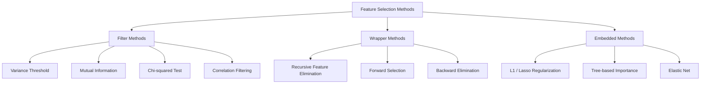
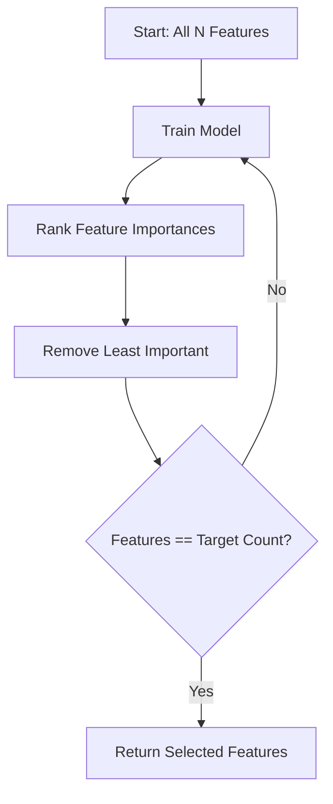
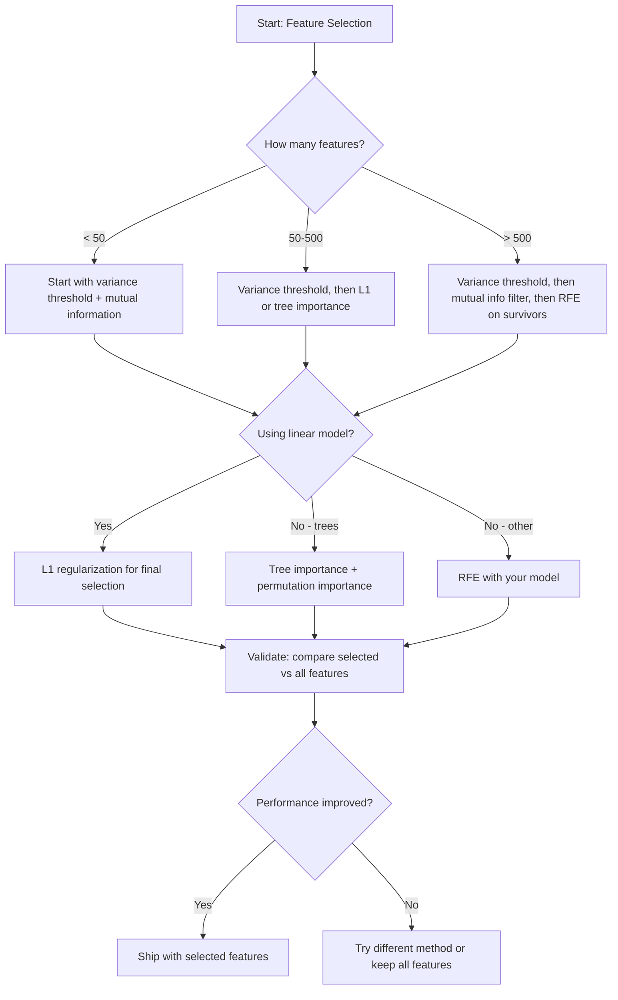

# 特征选择

> 更多特征并非更好。正确的特征才是更好的。

**类型：** 构建  
**语言：** Python  
**前置要求：** 第2阶段，课程01-09，08（特征工程）  
**时间：** ~75分钟

## 学习目标

- 从头实现过滤法（方差阈值、互信息、卡方检验）和包装法（递归特征消除RFE、前向选择）
- 解释为何互信息能捕捉相关性遗漏的非线性特征-目标关系
- 比较L1正则化（嵌入式选择）与RFE（包装式选择）并评估其计算权衡
- 构建结合多种方法的特征选择流程，演示其在留置数据上泛化能力的提升

## 问题所在

你有500个特征。模型训练缓慢，持续过拟合，且无人能解释其学习内容。你添加更多特征以期提升性能，结果反而更糟。

这正是维度诅咒的体现。随着特征数量增长，特征空间体积爆炸式增长。数据点变得稀疏。点间距离趋同。模型需要指数级增长的数据量才能找到真实规律。噪声特征淹没信号特征。过拟合成为常态。

特征选择是解药。剥离噪声，消除冗余，保留承载目标真实信息的特征。结果：训练更快、泛化更好，且模型真正可解释。

目标并非使用所有可用信息，而是使用正确的信息。

## 核心概念

### 特征选择的三大类别

所有特征选择方法均可归为以下三类：



**过滤法** 使用统计度量独立评估每个特征。不依赖模型。速度快，但忽略特征间交互作用。

**包装法** 训练模型来评估特征子集。以模型性能作为评分标准。效果更好，但因需多次重训模型而成本高昂。

**嵌入式法** 在模型训练过程中选择特征。L1正则化将权重驱动至零，决策树基于最有用的特征进行分裂。选择过程发生在拟合阶段，而非独立步骤。

### 方差阈值

最简单的过滤法。若某特征在样本间几乎无变化，则其几乎不携带信息。

考虑某特征在1000个样本中有999个值为0.0，其方差接近零。任何模型都无法利用它区分不同类别。应将其移除。

```
variance(x) = mean((x - mean(x))^2)
```

设定阈值（例如0.01），删除所有方差低于该值的特征。此操作在不查看目标变量的情况下移除常量或近常量特征。

适用场景：作为其他方法前的预处理步骤。能以近乎零成本捕获明显无用特征。

局限性：高方差特征仍可能纯属噪声。方差阈值是必要非充分条件。

### 互信息

互信息衡量已知特征X的值后对目标Y不确定性的减少程度。

```
I(X; Y) = sum_x sum_y p(x, y) * log(p(x, y) / (p(x) * p(y)))
```

若X与Y独立，则p(x, y) = p(x) * p(y)，对数项为零且I(X; Y) = 0。X对Y提供的信息越多，互信息值越高。

关键优势（超越相关性）：互信息能捕捉非线性关系。某特征可能与目标零相关，但若关系呈二次或周期性，则可能具有高互信息值。

对连续特征，需先分箱离散化（基于直方图的估计）。分箱数量影响估计精度——过少则损失信息，过多则引入噪声。常用选择：sqrt(n)个分箱或Sturges规则（1 + log2(n)）。


### 递归特征消除（RFE）

RFE是一种包装法。它利用模型自身的特征重要性进行迭代修剪：

1. 使用全部特征训练模型
2. 根据重要性对特征排序（线性模型用系数，树模型用不纯度减少量）
3. 移除最不重要的特征
4. 重复直至达到目标特征数量



RFE考虑特征交互作用，因为模型同时观察所有剩余特征。移除一个特征会改变其他特征的重要性。这使得它比过滤法更彻底。

代价：需训练N - 目标次数。对500个特征目标为10的情况，即490次训练运行。对于昂贵模型，过程缓慢。可通过每步移除多个特征加速（如每轮移除后10%特征）。

### L1（Lasso）正则化

L1正则化在损失函数中加入权重的绝对值：

```
loss = prediction_error + alpha * sum(|w_i|)
```

alpha参数控制特征修剪的激进程度。alpha越高，越多权重归零。

为何能精确归零？L1惩罚在权重空间形成菱形约束区域。最优解倾向于落在菱形角落，此处一个或多个权重为零。L2正则化（岭回归）形成圆形约束，权重收缩但很少归零。

这是嵌入式特征选择：模型在训练过程中学习忽略哪些特征。零权重特征实质上被移除。

优势：单次训练运行，处理相关特征（选择一个并将其他归零），内置于多数线性模型实现。

局限性：仅适用于线性模型。无法捕捉非线性特征重要性。

### 基于树的特征重要性

决策树及其集成模型（随机森林、梯度提升）天然具有特征排序能力。每次分裂都减少不纯度（分类用基尼系数或信息熵，回归用方差）。产生较大不纯度减少的特征更重要。

对含T棵树的随机森林：

```
importance(feature_j) = (1/T) * sum over all trees of
    sum over all nodes splitting on feature_j of
        (n_samples * impurity_decrease)
```

这为每个特征提供归一化重要性分数。它自动处理非线性关系和特征交互。

注意：基于树的重要性偏向于具有大量唯一值（高基数）的特征。随机ID列会显得重要，因为它完美分割每个样本。建议使用置换重要性作为合理性检查。

### 置换重要性

与模型无关的方法：

1. 训练模型并在验证数据上记录基线性能
2. 对每个特征：随机打乱其值，测量性能下降幅度
3. 下降越大，特征越重要

若打乱某特征不影响性能，则模型不依赖该特征。若性能崩溃，则该特征至关重要。

置换重要性避免了基于树方法的基数偏差。但速度较慢：每个特征需完整评估一次，且为稳定性需多次重复。

### 对比表

| 方法 | 类型 | 速度 | 非线性 | 特征交互 |
|------|------|------|--------|----------|
| 方差阈值 | 过滤法 | 极快 | 否 | 否 |
| 互信息 | 过滤法 | 快 | 是 | 否 |
| 相关性过滤 | 过滤法 | 快 | 否 | 否 |
| RFE | 包装法 | 慢 | 取决于模型 | 是 |
| L1/Lasso | 嵌入式 | 快 | 否（线性） | 否 |
| 树重要性 | 嵌入式 | 中等 | 是 | 是 |
| 置换重要性 | 模型无关 | 慢 | 是 | 是 |

### 决策流程图



## 动手构建

### 步骤1：生成具有已知特征结构的合成数据

```python
import numpy as np


def make_feature_selection_data(n_samples=500, seed=42):
    rng = np.random.RandomState(seed)

    x1 = rng.randn(n_samples)
    x2 = rng.randn(n_samples)
    x3 = rng.randn(n_samples)
    x4 = x1 + 0.1 * rng.randn(n_samples)
    x5 = x2 + 0.1 * rng.randn(n_samples)

    informative = np.column_stack([x1, x2, x3, x4, x5])

    correlated = np.column_stack([
        x1 * 0.9 + 0.1 * rng.randn(n_samples),
        x2 * 0.8 + 0.2 * rng.randn(n_samples),
        x3 * 0.7 + 0.3 * rng.randn(n_samples),
        x1 * 0.5 + x2 * 0.5 + 0.1 * rng.randn(n_samples),
        x2 * 0.6 + x3 * 0.4 + 0.1 * rng.randn(n_samples),
    ])

    noise = rng.randn(n_samples, 10) * 0.5

    X = np.hstack([informative, correlated, noise])
    y = (2 * x1 - 1.5 * x2 + x3 + 0.5 * rng.randn(n_samples) > 0).astype(int)

    feature_names = (
        [f"info_{i}" for i in range(5)]
        + [f"corr_{i}" for i in range(5)]
        + [f"noise_{i}" for i in range(10)]
    )

    return X, y, feature_names
```

我们已知真实情况：特征0-4具有信息性（且3和4是0和1的相关副本），特征5-9与信息特征相关，特征10-19是纯噪声。好的选择方法应将0-4排在最高，10-19排在最低。

### 步骤2：方差阈值

```python
def variance_threshold(X, threshold=0.01):
    variances = np.var(X, axis=0)
    mask = variances > threshold
    return mask, variances
```

### 步骤3：互信息（离散型）

```python
def discretize(x, n_bins=10):
    min_val, max_val = x.min(), x.max()
    if max_val == min_val:
        return np.zeros_like(x, dtype=int)
    bin_edges = np.linspace(min_val, max_val, n_bins + 1)
    binned = np.digitize(x, bin_edges[1:-1])
    return binned


def mutual_information(X, y, n_bins=10):
    n_samples, n_features = X.shape
    mi_scores = np.zeros(n_features)

    y_vals, y_counts = np.unique(y, return_counts=True)
    p_y = y_counts / n_samples

    for f in range(n_features):
        x_binned = discretize(X[:, f], n_bins)
        x_vals, x_counts = np.unique(x_binned, return_counts=True)
        p_x = dict(zip(x_vals, x_counts / n_samples))

        mi = 0.0
        for xv in x_vals:
            for yi, yv in enumerate(y_vals):
                joint_mask = (x_binned == xv) & (y == yv)
                p_xy = np.sum(joint_mask) / n_samples
                if p_xy > 0:
                    mi += p_xy * np.log(p_xy / (p_x[xv] * p_y[yi]))
        mi_scores[f] = mi

    return mi_scores
```

### 步骤4：递归特征消除

```python
def simple_logistic_importance(X, y, lr=0.1, epochs=100):
    n_samples, n_features = X.shape
    w = np.zeros(n_features)
    b = 0.0

    for _ in range(epochs):
        z = X @ w + b
        pred = 1.0 / (1.0 + np.exp(-np.clip(z, -500, 500)))
        error = pred - y
        w -= lr * (X.T @ error) / n_samples
        b -= lr * np.mean(error)

    return w, b


def rfe(X, y, n_features_to_select=5, lr=0.1, epochs=100):
    n_total = X.shape[1]
    remaining = list(range(n_total))
    rankings = np.ones(n_total, dtype=int)
    rank = n_total

    while len(remaining) > n_features_to_select:
        X_subset = X[:, remaining]
        w, _ = simple_logistic_importance(X_subset, y, lr, epochs)
        importances = np.abs(w)

        least_idx = np.argmin(importances)
        original_idx = remaining[least_idx]
        rankings[original_idx] = rank
        rank -= 1
        remaining.pop(least_idx)

    for idx in remaining:
        rankings[idx] = 1

    selected_mask = rankings == 1
    return selected_mask, rankings
```

### 步骤5：L1特征选择

```python
def soft_threshold(w, alpha):
    return np.sign(w) * np.maximum(np.abs(w) - alpha, 0)


def l1_feature_selection(X, y, alpha=0.1, lr=0.01, epochs=500):
    n_samples, n_features = X.shape
    w = np.zeros(n_features)
    b = 0.0

    for _ in range(epochs):
        z = X @ w + b
        pred = 1.0 / (1.0 + np.exp(-np.clip(z, -500, 500)))
        error = pred - y

        gradient_w = (X.T @ error) / n_samples
        gradient_b = np.mean(error)

        w -= lr * gradient_w
        w = soft_threshold(w, lr * alpha)
        b -= lr * gradient_b

    selected_mask = np.abs(w) > 1e-6
    return selected_mask, w
```

### 步骤6：基于树的重要性（简单决策树）

```python
def gini_impurity(y):
    if len(y) == 0:
        return 0.0
    classes, counts = np.unique(y, return_counts=True)
    probs = counts / len(y)
    return 1.0 - np.sum(probs ** 2)


def best_split(X, y, feature_idx):
    values = np.unique(X[:, feature_idx])
    if len(values) <= 1:
        return None, -1.0

    best_threshold = None
    best_gain = -1.0
    parent_gini = gini_impurity(y)
    n = len(y)

    for i in range(len(values) - 1):
        threshold = (values[i] + values[i + 1]) / 2.0
        left_mask = X[:, feature_idx] <= threshold
        right_mask = ~left_mask

        n_left = np.sum(left_mask)
        n_right = np.sum(right_mask)

        if n_left == 0 or n_right == 0:
            continue

        gain = parent_gini - (n_left / n) * gini_impurity(y[left_mask]) - (n_right / n) * gini_impurity(y[right_mask])

        if gain > best_gain:
            best_gain = gain
            best_threshold = threshold

    return best_threshold, best_gain


def tree_importance(X, y, n_trees=50, max_depth=5, seed=42):
    rng = np.random.RandomState(seed)
    n_samples, n_features = X.shape
    importances = np.zeros(n_features)

    for _ in range(n_trees):
        sample_idx = rng.choice(n_samples, size=n_samples, replace=True)
        feature_subset = rng.choice(n_features, size=max(1, int(np.sqrt(n_features))), replace=False)

        X_boot = X[sample_idx]
        y_boot = y[sample_idx]

        tree_imp = _build_tree_importance(X_boot, y_boot, feature_subset, max_depth)
        importances += tree_imp

    total = importances.sum()
    if total > 0:
        importances /= total

    return importances


def _build_tree_importance(X, y, feature_subset, max_depth, depth=0):
    n_features = X.shape[1]
    importances = np.zeros(n_features)

    if depth >= max_depth or len(np.unique(y)) <= 1 or len(y) < 4:
        return importances

    best_feature = None
    best_threshold = None
    best_gain = -1.0

    for f in feature_subset:
        threshold, gain = best_split(X, y, f)
        if gain > best_gain:
            best_gain = gain
            best_feature = f
            best_threshold = threshold

    if best_feature is None or best_gain <= 0:
        return importances

    importances[best_feature] += best_gain * len(y)

    left_mask = X[:, best_feature] <= best_threshold
    right_mask = ~left_mask

    importances += _build_tree_importance(X[left_mask], y[left_mask], feature_subset, max_depth, depth + 1)
    importances += _build_tree_importance(X[right_mask], y[right_mask], feature_subset, max_depth, depth + 1)

    return importances
```

### 步骤7：运行所有方法并比较

代码文件在同一合成数据集上运行所有五种方法，并打印比较表显示各方法选择的特征。

## 实际应用

使用scikit-learn时，特征选择已内置于管道中：

```python
from sklearn.feature_selection import (
    VarianceThreshold,
    mutual_info_classif,
    RFE,
    SelectFromModel,
)
from sklearn.linear_model import Lasso, LogisticRegression
from sklearn.ensemble import RandomForestClassifier

vt = VarianceThreshold(threshold=0.01)
X_filtered = vt.fit_transform(X)

mi_scores = mutual_info_classif(X, y)
top_k = np.argsort(mi_scores)[-10:]

rfe_selector = RFE(LogisticRegression(), n_features_to_select=10)
rfe_selector.fit(X, y)
X_rfe = rfe_selector.transform(X)

lasso_selector = SelectFromModel(Lasso(alpha=0.01))
lasso_selector.fit(X, y)
X_lasso = lasso_selector.transform(X)

rf = RandomForestClassifier(n_estimators=100)
rf.fit(X, y)
importances = rf.feature_importances_
```

从头实现的版本精确展示了各方法内部机制。方差阈值仅计算`var(X, axis=0)`并应用掩码。互信息在列联表中统计联合和边际频率。RFE是训练-排序-修剪的循环。L1是带软阈值步骤的梯度下降。树重要性累积各分裂的不纯度减少量。没有魔法——只有统计和循环。

sklearn版本增强了健壮性（如mutual_info_classif使用k-NN密度估计而非分箱）、速度（C语言实现）和管道集成。

## 产出成果

本课程产出：
- `outputs/skill-feature-selector.md` -- 选择合适特征选择方法的快速参考决策树

## 练习

1. **前向选择**：实现RFE的逆过程。从零特征开始。每步添加最能提升模型性能的特征。当添加特征不再有帮助时停止。与RFE结果比较。哪种更快？哪种效果更好？

2. **稳定性选择**：运行L1特征选择50次，每次使用随机80%数据子样本，且alpha值略有不同。统计每个特征被选中的频率。在>80%运行中被选中的特征为“稳定”。与单次L1选择结果比较。哪种更可靠？

3. **多重共线性检测**：计算所有特征的相关矩阵。实现一个函数：给定相关性阈值（如0.9），移除每个高度相关特征对中的一个（保留与目标互信息更高的特征）。在合成数据集上测试，验证其移除了冗余相关特征。

4. **特征选择管道**：将方差阈值、互信息过滤和RFE链接为单一管道。先移除近零方差特征，再按互信息保留前50%，最后对幸存特征运行RFE。与单独对所有特征运行RFE比较。管道更快吗？准确度相当吗？

5. **从头实现置换重要性**：实现置换重要性。对每个特征打乱其值10次，测量F1分数的平均下降幅度。与基于树的重要性排序比较。找出它们不一致的情况并解释原因（提示：相关特征）。

## 关键术语

| 术语 | 通俗说法 | 实际含义 |
|------|----------|----------|
| 过滤法 | "独立评分特征" | 无需训练模型，使用统计度量独立评估每个特征的特征选择方法 |
| 包装法 | "用模型选特征" | 通过训练模型并以性能为选择标准来评估特征子集的特征选择方法 |
| 嵌入式法 | "模型训练时选特征" | 作为模型拟合过程一部分的特征选择，如L1正则化将权重驱动至零 |
| 互信息 | "一个变量告诉你另一个变量的多少信息" | 衡量已知X后Y不确定性的减少量，能捕捉线性和非线性依赖关系 |
| 递归特征消除 | "训练、排序、修剪、重复" | 迭代式包装法：训练模型、移除最不重要特征、重复直至达到目标数量 |
| L1/Lasso正则化 | "能杀死特征的惩罚项" | 在损失函数中加入权重绝对值之和，将不重要特征的权重驱动至精确零 |
| 方差阈值 | "移除常量特征" | 删除跨样本方差低于指定阈值的特征，过滤掉不携带信息的特征 |
| 特征重要性 | "哪些特征最重要" | 表示每个特征对模型预测贡献程度的分数，由分裂增益（树）或系数幅度（线性）计算 |
| 置换重要性 | "打乱并测量损伤" | 通过随机打乱每个特征的值并测量模型性能下降来评估特征重要性 |
| 维度诅咒 | "特征太多，数据不足" | 添加特征会使特征空间体积指数增长，导致数据稀疏且距离度量失效的现象 |

## 扩展阅读

- [变量与特征选择导论（Guyon & Elisseeff, 2003）](https://jmlr.org/papers/v3/guyon03a.html) -- 特征选择方法基础综述，仍被广泛引用
- [scikit-learn特征选择指南](https://scikit-learn.org/stable/modules/feature_selection.html) -- 包含代码示例的过滤法、包装法和嵌入式法实践参考
- [稳定性选择（Meinshausen & Buhlmann, 2010）](https://arxiv.org/abs/0809.2932) -- 结合子抽样与特征选择以获得稳健可重现的结果
- [警惕默认随机森林重要性（Strobl等, 2007）](https://bmcbioinformatics.biomedcentral.com/articles/10.1186/1471-2105-8-25) -- 证明基于树重要性的基数偏差并提出条件重要性作为替代方案