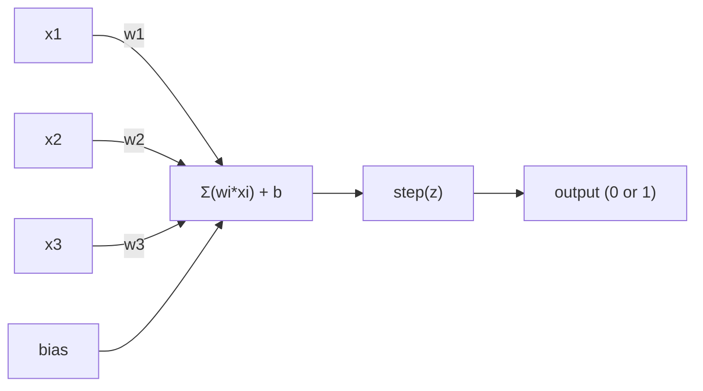
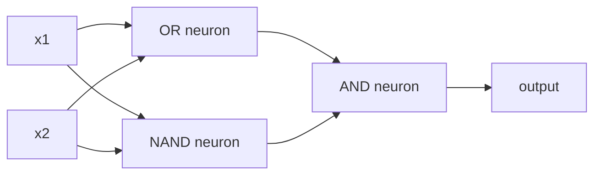

# 感知机

> 感知机是神经网络的原子。拆开它，你会发现权重、偏置和一个决策。

**类型：** 构建
**语言：** Python
**前提：** 第一阶段（线性代数直觉）
**时间：** 约60分钟

## 学习目标

- 使用 Python 从零开始实现一个感知机，包括权重更新规则和阶跃激活函数
- 解释为什么单个感知机只能解决线性可分问题，并演示 XOR 的失败案例
- 通过组合 OR、NAND 和 AND 门构建多层感知机来解决 XOR
- 训练一个具有 sigmoid 激活函数和反向传播的两层网络，使其自动学习 XOR

## 问题背景

你了解向量和点积。你知道矩阵将输入转换为输出。但机器是如何*学习*该使用哪种变换的？

感知机给出了答案。它是最简单的学习机器：接受一些输入，乘以权重，加上偏置，做出二元决策。然后进行调整。仅此而已。所有构建过的神经网络都是这个思想的层叠。

理解感知机意味着理解代码中的“学习”到底意味着什么：调整数字直到输出与现实匹配。

## 核心概念

### 一个神经元，一个决策

感知机接受 n 个输入，每个输入乘以一个权重，求和，加上一个偏置，然后将结果通过激活函数传递。



阶跃函数非常直接：如果加权和加偏置 >= 0，输出 1。否则，输出 0。

```
step(z) = 1  if z >= 0
           0  if z < 0
```

这是一个线性分类器。权重和偏置定义了一条线（或高维空间中的超平面），将输入空间分成两个区域。

### 决策边界

对于两个输入，感知机在二维空间中画出一条线：

```
  x2
  ┤
  │  Class 1        /
  │    (0)          /
  │                /
  │               / w1·x1 + w2·x2 + b = 0
  │              /
  │             /     Class 2
  │            /        (1)
  ┼───────────/──────────── x1
```

线的一侧所有点输出 0。另一侧所有点输出 1。训练会移动这条线，直到它正确分离各个类别。

### 学习规则

感知机学习规则很简单：

```
For each training example (x, y_true):
    y_pred = predict(x)
    error = y_true - y_pred

    For each weight:
        w_i = w_i + learning_rate * error * x_i
    bias = bias + learning_rate * error
```

如果预测正确，误差 = 0，什么都不变。如果预测为 0 但应该是 1，权重增加。如果预测为 1 但应该是 0，权重减小。学习率控制每次调整的大小。

### XOR 问题

这就是它的局限所在。看看这些逻辑门：

```
AND gate:           OR gate:            XOR gate:
x1  x2  out         x1  x2  out         x1  x2  out
0   0   0           0   0   0           0   0   0
0   1   0           0   1   1           0   1   1
1   0   0           1   0   1           1   0   1
1   1   1           1   1   1           1   1   0
```

AND 和 OR 是线性可分的：你可以画一条单一线将 0 和 1 分开。XOR 则不是。没有一条线能将 [0,1] 和 [1,0] 与 [0,0] 和 [1,1] 分开。

```
AND (separable):        XOR (not separable):

  x2                      x2
  1 ┤  0     1            1 ┤  1     0
    │     /                 │
  0 ┤  0 / 0              0 ┤  0     1
    ┼──/──────── x1         ┼──────────── x1
       line works!          no single line works!
```

这是一个根本限制。单个感知机只能解决线性可分问题。Minsky 和 Papert 在 1969 年证明了这一点，这几乎使神经网络研究停滞了十年。

解决方法是：将感知机堆叠成层。多层感知机可以通过将两个线性决策组合成一个非线性决策来解决 XOR。

## 动手构建

### 第 1 步：Perceptron 类

```python
class Perceptron:
    def __init__(self, n_inputs, learning_rate=0.1):
        self.weights = [0.0] * n_inputs
        self.bias = 0.0
        self.lr = learning_rate

    def predict(self, inputs):
        total = sum(w * x for w, x in zip(self.weights, inputs))
        total += self.bias
        return 1 if total >= 0 else 0

    def train(self, training_data, epochs=100):
        for epoch in range(epochs):
            errors = 0
            for inputs, target in training_data:
                prediction = self.predict(inputs)
                error = target - prediction
                if error != 0:
                    errors += 1
                    for i in range(len(self.weights)):
                        self.weights[i] += self.lr * error * inputs[i]
                    self.bias += self.lr * error
            if errors == 0:
                print(f"Converged at epoch {epoch + 1}")
                return
        print(f"Did not converge after {epochs} epochs")
```

### 第 2 步：在逻辑门上训练

```python
and_data = [
    ([0, 0], 0),
    ([0, 1], 0),
    ([1, 0], 0),
    ([1, 1], 1),
]

or_data = [
    ([0, 0], 0),
    ([0, 1], 1),
    ([1, 0], 1),
    ([1, 1], 1),
]

not_data = [
    ([0], 1),
    ([1], 0),
]

print("=== AND Gate ===")
p_and = Perceptron(2)
p_and.train(and_data)
for inputs, _ in and_data:
    print(f"  {inputs} -> {p_and.predict(inputs)}")

print("\n=== OR Gate ===")
p_or = Perceptron(2)
p_or.train(or_data)
for inputs, _ in or_data:
    print(f"  {inputs} -> {p_or.predict(inputs)}")

print("\n=== NOT Gate ===")
p_not = Perceptron(1)
p_not.train(not_data)
for inputs, _ in not_data:
    print(f"  {inputs} -> {p_not.predict(inputs)}")
```

### 第 3 步：观察 XOR 的失败

```python
xor_data = [
    ([0, 0], 0),
    ([0, 1], 1),
    ([1, 0], 1),
    ([1, 1], 0),
]

print("\n=== XOR Gate (single perceptron) ===")
p_xor = Perceptron(2)
p_xor.train(xor_data, epochs=1000)
for inputs, expected in xor_data:
    result = p_xor.predict(inputs)
    status = "OK" if result == expected else "WRONG"
    print(f"  {inputs} -> {result} (expected {expected}) {status}")
```

它永远不会收敛。这证明了单个感知机无法学习 XOR。

### 第 4 步：用两层解决 XOR

诀窍是：XOR = (x1 OR x2) AND NOT (x1 AND x2)。组合三个感知机：



```python
def xor_network(x1, x2):
    or_neuron = Perceptron(2)
    or_neuron.weights = [1.0, 1.0]
    or_neuron.bias = -0.5

    nand_neuron = Perceptron(2)
    nand_neuron.weights = [-1.0, -1.0]
    nand_neuron.bias = 1.5

    and_neuron = Perceptron(2)
    and_neuron.weights = [1.0, 1.0]
    and_neuron.bias = -1.5

    hidden1 = or_neuron.predict([x1, x2])
    hidden2 = nand_neuron.predict([x1, x2])
    output = and_neuron.predict([hidden1, hidden2])
    return output


print("\n=== XOR Gate (multi-layer network) ===")
for inputs, expected in xor_data:
    result = xor_network(inputs[0], inputs[1])
    print(f"  {inputs} -> {result} (expected {expected})")
```

所有四种情况都正确。将感知机堆叠成层可以产生任何单个感知机都无法产生的决策边界。

### 第 5 步：训练一个两层网络

第 4 步手动连接了权重。这适用于 XOR，但对于你事先不知道正确权重的真实问题则不行。解决方法是：用 sigmoid 替换阶跃函数，并通过反向传播自动学习权重。

```python
class TwoLayerNetwork:
    def __init__(self, learning_rate=0.5):
        import random
        random.seed(0)
        self.w_hidden = [[random.uniform(-1, 1), random.uniform(-1, 1)] for _ in range(2)]
        self.b_hidden = [random.uniform(-1, 1), random.uniform(-1, 1)]
        self.w_output = [random.uniform(-1, 1), random.uniform(-1, 1)]
        self.b_output = random.uniform(-1, 1)
        self.lr = learning_rate

    def sigmoid(self, x):
        import math
        x = max(-500, min(500, x))
        return 1.0 / (1.0 + math.exp(-x))

    def forward(self, inputs):
        self.inputs = inputs
        self.hidden_outputs = []
        for i in range(2):
            z = sum(w * x for w, x in zip(self.w_hidden[i], inputs)) + self.b_hidden[i]
            self.hidden_outputs.append(self.sigmoid(z))
        z_out = sum(w * h for w, h in zip(self.w_output, self.hidden_outputs)) + self.b_output
        self.output = self.sigmoid(z_out)
        return self.output

    def train(self, training_data, epochs=10000):
        for epoch in range(epochs):
            total_error = 0
            for inputs, target in training_data:
                output = self.forward(inputs)
                error = target - output
                total_error += error ** 2

                d_output = error * output * (1 - output)

                saved_w_output = self.w_output[:]
                hidden_deltas = []
                for i in range(2):
                    h = self.hidden_outputs[i]
                    hd = d_output * saved_w_output[i] * h * (1 - h)
                    hidden_deltas.append(hd)

                for i in range(2):
                    self.w_output[i] += self.lr * d_output * self.hidden_outputs[i]
                self.b_output += self.lr * d_output

                for i in range(2):
                    for j in range(len(inputs)):
                        self.w_hidden[i][j] += self.lr * hidden_deltas[i] * inputs[j]
                    self.b_hidden[i] += self.lr * hidden_deltas[i]
```

```python
net = TwoLayerNetwork(learning_rate=2.0)
net.train(xor_data, epochs=10000)
for inputs, expected in xor_data:
    result = net.forward(inputs)
    predicted = 1 if result >= 0.5 else 0
    print(f"  {inputs} -> {result:.4f} (rounded: {predicted}, expected {expected})")
```

与第 4 步有两个关键区别。首先，sigmoid 替换了阶跃函数——它是平滑的，因此梯度存在。其次，`backpropagate` 方法将误差从输出层向后传播到隐藏层，根据每个权重对误差的贡献程度按比例调整所有权重。这就是 20 行代码实现的反向传播。

这是通往第 03 课的桥梁。`backpropagate` 和 `train` 方法背后的数学是链式法则在网络图上的应用。我们将在那里正式推导它。

## 实际应用

你刚才从零构建的一切，现在只需一次导入就能实现：

```python
from sklearn.linear_model import Perceptron as SkPerceptron
import numpy as np

X = np.array([[0,0],[0,1],[1,0],[1,1]])
y = np.array([0, 0, 0, 1])

clf = SkPerceptron(max_iter=100, tol=1e-3)
clf.fit(X, y)
print([clf.predict([x])[0] for x in X])
```

五行代码。你 30 行的 `Perceptron` 类做了同样的事情。sklearn 版本添加了收敛检查、多种损失函数和稀疏输入支持——但核心循环是相同的：加权和，阶跃函数，根据误差更新权重。

真正的差距在规模上显现。生产网络中的变化包括：

- 阶跃函数变为 sigmoid、ReLU 或其他平滑激活函数
- 权重通过反向传播自动学习（第 03 课）
- 层变得更深：3、10、100+ 层
- 原理相同：每一层都从前一层的输出创建新的特征

单个感知机只能画直线。堆叠它们，你就可以绘制任何形状。

## 输出成果

本课将产生：
- `outputs/skill-perceptron.md` - 一项关于何时需要单层架构与多层架构的技能

## 练习

1.  在一个 NAND 门（通用门——任何逻辑电路都可以用 NAND 构建）上训练一个感知机。验证其权重和偏置形成了有效的决策边界。
2.  修改 Perceptron 类，以跟踪每个 epoch 的决策边界（w1*x1 + w2*x2 + b = 0）。打印在 AND 门训练期间这条线是如何移动的。
3.  构建一个 3 输入感知机，仅当 3 个输入中至少有 2 个为 1 时输出 1（多数表决函数）。这是线性可分的吗？为什么？

## 关键术语

| 术语 | 人们通常怎么说 | 它的实际含义 |
|------|----------------|----------------------|
| 感知机 (Perceptron) | “假神经元” | 一个线性分类器：输入和权重的点积，加上偏置，通过阶跃函数 |
| 权重 (Weight) | “一个输入的重要性” | 一个乘数，缩放每个输入对决策的贡献 |
| 偏置 (Bias) | “阈值” | 一个常数，用于移动决策边界，使感知机即使在零输入时也能激活 |
| 激活函数 (Activation function) | “压缩数值的东西” | 在加权和之后应用的函数——感知机用阶跃函数，现代网络用 sigmoid/ReLU |
| 线性可分 (Linearly separable) | “你可以在它们之间画一条线” | 一个数据集，其中单个超平面可以完美分离类别 |
| XOR 问题 (XOR problem) | “感知机做不到的事” | 证明单层网络无法学习非线性可分函数 |
| 决策边界 (Decision boundary) | “分类器切换的位置” | 超平面 w*x + b = 0，将输入空间分成两类 |
| 多层感知机 (Multi-layer perceptron) | “真正的神经网络” | 感知机按层堆叠，其中一层的输出馈送下一层的输入 |

## 扩展阅读

- Frank Rosenblatt, "The Perceptron: A Probabilistic Model for Information Storage and Organization in the Brain" (1958) -- 开创一切的原始论文
- Minsky & Papert, "Perceptrons" (1969) -- 这本书证明了 XOR 对于单层网络是不可解的，并扼杀了感知机研究长达十年
- Michael Nielsen, "Neural Networks and Deep Learning", 第 1 章 (http://neuralnetworksanddeeplearning.com/) -- 免费在线资源，对感知机如何组合成网络的最佳可视化解释