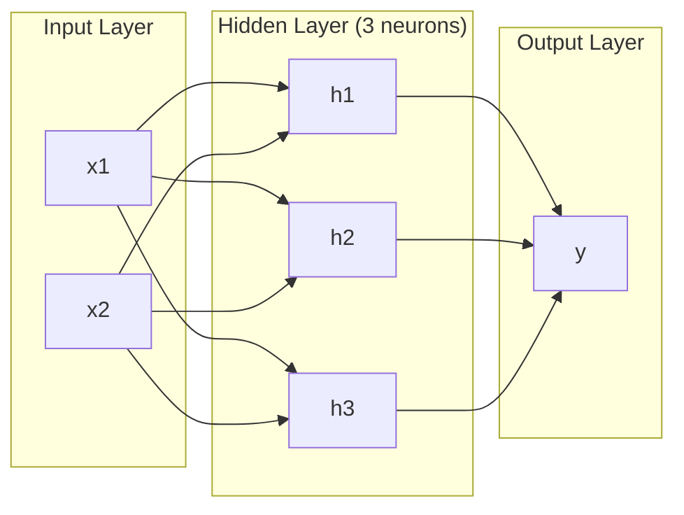
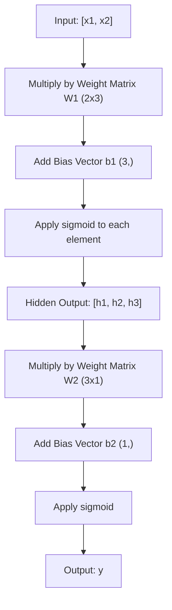
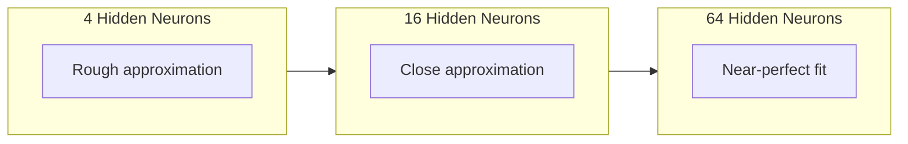

# 多层网络与前向传播

> 一个神经元画一条线。将它们堆叠起来，你就能画出任何形状。

**类型：** 构建
**语言：** Python
**先决条件：** 阶段01（数学基础），课程03.01（感知机）
**时间：** 约90分钟

## 学习目标

- 从零开始使用层和网络类构建一个能执行完整前向传播的多层网络
- 追踪数据在网络各层中的矩阵维度，并识别形状不匹配问题
- 解释堆叠非线性激活函数如何使网络能够学习弯曲的决策边界
- 使用2-2-1架构和手动调整的sigmoid权重解决XOR问题

## 问题所在

单个神经元就是个画线工具，仅此而已。一条直线穿过你的数据。人工智能中的每个实际问题——图像识别、语言理解、围棋——都需要曲线。将神经元堆叠成层，就是你得到曲线的方式。

1969年，明斯基和帕普特证明这种局限是致命的：单层网络无法学习XOR。不是“学习困难”——是数学上不可能。XOR真值表将[0,1]和[1,0]放在一边，[0,0]和[1,1]放在另一边。没有一条直线能将它们分开。

这使神经网络研究的资金断绝了十多年。事后看来，解决方案显而易见：停止使用单层。将神经元堆叠成层。让第一层将输入空间划分为新的特征，让第二层将这些特征组合成任何单一直线都无法做出的决策。

这个堆叠就是多层网络。它是当今所有生产级深度学习模型的基础。前向传播——数据从输入流经隐藏层到达输出——是在其他任何东西能够工作之前，你需要首先构建的东西。

## 概念

### 层：输入层、隐藏层、输出层

一个网络有三种类型的层：

**输入层**——并不是真正的层。它存放你的原始数据。两个特征意味着两个输入节点。这里不发生任何计算。

**隐藏层**——工作在这里进行。每个神经元接收来自前一层的所有输出，应用权重和偏置，然后将结果通过一个激活函数传递。称为“隐藏”是因为你在训练数据中从未直接看到这些值。

**输出层**——最终答案。对于二元分类，一个带有sigmoid的神经元。对于多类别分类，每个类别一个神经元。



这是一个2-3-1网络。两个输入，三个隐藏神经元，一个输出。每个连接都有一个权重。每个神经元（除了输入）都有一个偏置。

每一层产生一个称为隐藏状态的数字向量。对于文本，隐藏状态增加维度——将一个词编码为768个数字以捕获语义。对于图像，它们降低维度——将数百万像素压缩为可管理的表示。隐藏状态是学习发生的地方。

### 神经元与激活函数

每个神经元做三件事：

1. 将每个输入乘以相应的权重
2. 将所有乘积相加并加上一个偏置
3. 将总和通过一个激活函数传递

目前，激活函数是sigmoid：

```
sigmoid(z) = 1 / (1 + e^(-z))
```

Sigmoid将任何数字压缩到(0, 1)的范围内。大的正输入推向1。大的负输入推向0。零映射到0.5。这条平滑的曲线使得学习成为可能——与感知机的硬阶跃不同，sigmoid处处有梯度。

### 前向传播：数据如何流动

前向传播将输入数据逐层推送通过网络，直到到达输出。在前向传播期间不发生学习。它是纯粹的计算：乘、加、激活，重复。



在每一层，三个操作按顺序发生：

```
z = W * input + b       (linear transformation)
a = sigmoid(z)           (activation)
```

一层的输出成为下一层的输入。这就是整个前向传播。

### 矩阵维度

追踪维度是深度学习中最重要的调试技能。以2-3-1网络为例：

| 步骤 | 操作 | 维度 | 结果形状 |
|------|-----------|------------|-------------|
| 输入 | x | -- | (2,) |
| 隐藏线性 | W1 * x + b1 | W1: (3, 2), b1: (3,) | (3,) |
| 隐藏激活 | sigmoid(z1) | -- | (3,) |
| 输出线性 | W2 * h + b2 | W2: (1, 3), b2: (1,) | (1,) |
| 输出激活 | sigmoid(z2) | -- | (1,) |

规则：第k层的权重矩阵W的形状是(该层神经元数，前一层神经元数)。行数匹配当前层。列数匹配前一层。如果形状不匹配，你就遇到了bug。

### 万能逼近定理

1989年，乔治·西本科证明了一件非凡的事情：一个具有单个隐藏层和足够神经元的神经网络可以以任意期望的精度逼近任何连续函数。

这并不意味着单个隐藏层总是最好的。它意味着该架构在理论上是可行的。在实践中，更深的网络（更多层，每层更少神经元）以比浅而宽的网络少得多的参数学习相同的函数。这就是深度学习有效的原因。

直觉上：隐藏层中的每个神经元学习一个“凸起”或特征。足够多的凸起放置在正确的位置可以逼近任何平滑曲线。更多神经元，更多凸起，更好的逼近。



### 可组合性

神经网络是可组合的。你可以将它们堆叠、链接、并行运行。Whisper模型使用一个编码器网络处理音频，并使用一个单独的解码器网络生成文本。现代大语言模型是仅解码器架构。BERT是仅编码器。T5是编码器-解码器。架构选择定义了模型能做什么。

## 动手构建

纯Python。不用numpy。所有矩阵运算从零开始编写。

### 步骤1：Sigmoid激活函数

```python
import math

def sigmoid(x):
    x = max(-500.0, min(500.0, x))
    return 1.0 / (1.0 + math.exp(-x))
```

限制在[-500, 500]区间防止溢出。`math.exp(500)`很大但有限。`math.exp(1000)`是无穷大。

### 步骤2：层类

整个深度学习中最重要的操作是矩阵乘法。每一层，每一个注意力头，每一次前向传播——一路都是矩阵乘法。一个线性层接收一个输入向量，乘以一个权重矩阵，并加上一个偏置向量：y = Wx + b。这个单一的方程式占了神经网络中90%的计算量。

一个层持有一个权重矩阵和一个偏置向量。其前向方法接收一个输入向量并返回激活后的输出。

```python
class Layer:
    def __init__(self, n_inputs, n_neurons, weights=None, biases=None):
        if weights is not None:
            self.weights = weights
        else:
            import random
            self.weights = [
                [random.uniform(-1, 1) for _ in range(n_inputs)]
                for _ in range(n_neurons)
            ]
        if biases is not None:
            self.biases = biases
        else:
            self.biases = [0.0] * n_neurons

    def forward(self, inputs):
        self.last_input = inputs
        self.last_output = []
        for neuron_idx in range(len(self.weights)):
            z = sum(
                w * x for w, x in zip(self.weights[neuron_idx], inputs)
            )
            z += self.biases[neuron_idx]
            self.last_output.append(sigmoid(z))
        return self.last_output
```

权重矩阵的形状是(n_neurons, n_inputs)。每一行是一个神经元在所有输入上的权重。前向方法遍历神经元，计算加权和加上偏置，应用sigmoid，并收集结果。

### 步骤3：网络类

网络是一个层列表。前向传播将它们链接起来：层k的输出馈入层k+1。

```python
class Network:
    def __init__(self, layers):
        self.layers = layers

    def forward(self, inputs):
        current = inputs
        for layer in self.layers:
            current = layer.forward(current)
        return current
```

这就是整个前向传播。四行逻辑。数据进入，流经每一层，从另一端出来。

### 步骤4：使用手动调整权重解决XOR问题

在课程01中，我们通过组合OR、NAND和AND感知机解决了XOR问题。现在用我们的层和网络类做同样的事情。2-2-1架构：两个输入，两个隐藏神经元，一个输出。

```python
hidden = Layer(
    n_inputs=2,
    n_neurons=2,
    weights=[[20.0, 20.0], [-20.0, -20.0]],
    biases=[-10.0, 30.0],
)

output = Layer(
    n_inputs=2,
    n_neurons=1,
    weights=[[20.0, 20.0]],
    biases=[-30.0],
)

xor_net = Network([hidden, output])

xor_data = [
    ([0, 0], 0),
    ([0, 1], 1),
    ([1, 0], 1),
    ([1, 1], 0),
]

for inputs, expected in xor_data:
    result = xor_net.forward(inputs)
    predicted = 1 if result[0] >= 0.5 else 0
    print(f"  {inputs} -> {result[0]:.6f} (rounded: {predicted}, expected: {expected})")
```

大的权重(20, -20)使sigmoid表现得像阶跃函数。第一个隐藏神经元近似OR。第二个近似NAND。输出神经元将它们组合成AND，即XOR。

### 步骤5：圆形分类

一个更难的问题：将2D点分类为在半径0.5、中心在原点的圆内或圆外。这需要弯曲的决策边界——对于单个感知机是不可能的。

```python
import random
import math

random.seed(42)

data = []
for _ in range(200):
    x = random.uniform(-1, 1)
    y = random.uniform(-1, 1)
    label = 1 if (x * x + y * y) < 0.25 else 0
    data.append(([x, y], label))

circle_net = Network([
    Layer(n_inputs=2, n_neurons=8),
    Layer(n_inputs=8, n_neurons=1),
])
```

使用随机权重时，网络分类效果不好。但前向传播仍然运行。这就是关键——前向传播只是计算。学习正确的权重是反向传播，将在课程03中介绍。

```python
correct = 0
for inputs, expected in data:
    result = circle_net.forward(inputs)
    predicted = 1 if result[0] >= 0.5 else 0
    if predicted == expected:
        correct += 1

print(f"Accuracy with random weights: {correct}/{len(data)} ({100*correct/len(data):.1f}%)")
```

随机权重给出较差的准确率——通常比猜测多数类别更差。训练后（课程03），这个具有8个隐藏神经元的相同架构将画出一条弯曲的边界来区分圆内和圆外。

## 使用它

PyTorch用四行代码完成上述所有工作：

```python
import torch
import torch.nn as nn

model = nn.Sequential(
    nn.Linear(2, 8),
    nn.Sigmoid(),
    nn.Linear(8, 1),
    nn.Sigmoid(),
)

x = torch.tensor([[0.0, 0.0], [0.0, 1.0], [1.0, 0.0], [1.0, 1.0]])
output = model(x)
print(output)
```

`nn.Linear(2, 8)`是你的层类：形状为(8, 2)的权重矩阵，形状为(8,)的偏置向量。`nn.Sigmoid()`是你的sigmoid函数，逐元素应用。`nn.Sequential`是你的网络类：按顺序链接各层。

区别在于速度和规模。PyTorch在GPU上运行，处理百万样本的批次，并自动计算梯度用于反向传播。但前向传播逻辑与你刚才从零构建的完全相同。

## 交付使用

本课程产生一个用于设计网络架构的可重用提示：

- `outputs/prompt-network-architect.md`

当你需要决定给定问题的层数、每层神经元数以及使用哪些激活函数时使用它。

## 练习

1. 构建一个2-4-2-1网络（两个隐藏层），用随机权重在XOR数据上运行前向传播。打印中间隐藏层输出，以观察表示在每一层如何变换。
2. 将圆形分类器中的隐藏层大小从8改为2，然后改为32。每次用随机权重运行前向传播。隐藏神经元的数量是否改变了输出范围或分布？为什么？
3. 在网络类上实现一个`count_parameters`方法，返回可训练权重和偏置的总数。在784-256-128-10网络（经典的MNIST架构）上测试它。它有多少个参数？
4. 为3-4-4-2网络构建前向传播。输入RGB颜色值（归一化到0-1）并观察两个输出。这是一个具有两个类别的简单颜色分类器架构。
5. 用“泄漏阶跃”函数替换sigmoid：如果z < 0，返回0.01 * z，否则返回1.0。使用步骤4中相同的手动调整权重在XOR上运行前向传播。它还能工作吗？为什么平滑的sigmoid比硬截断更受青睐？

## 关键术语

| 术语 | 人们常说 | 实际含义 |
|------|----------------|----------------------|
| 前向传播 | “运行模型” | 将输入推送通过每一层——乘以权重、加偏置、激活——以产生输出 |
| 隐藏层 | “中间部分” | 输入和输出之间的任何层，其值在数据中不被直接观察到 |
| 多层网络 | “深度神经网络” | 神经元按顺序堆叠的层，其中每层的输出馈入下一层的输入 |
| 激活函数 | “非线性” | 线性变换后应用的函数，将曲线引入决策边界 |
| Sigmoid | “S曲线” | sigma(z) = 1/(1+e^(-z))，将任何实数压缩到(0,1)，平滑且处处可微 |
| 权重矩阵 | “参数” | 形状为(当前层神经元数，前一层神经元数)的矩阵W，包含可学习的连接强度 |
| 偏置向量 | “偏移量” | 矩阵乘法后添加的向量，即使所有输入为零，神经元也能被激活 |
| 万能逼近 | “神经网络可以学习任何东西” | 具有足够神经元的单个隐藏层可以逼近任何连续函数——但“足够”可能意味着数十亿个 |
| 线性变换 | “矩阵乘法步骤” | z = W * x + b，激活之前的计算，将输入映射到新空间 |
| 决策边界 | “分类器切换的位置” | 输入空间中网络输出越过分类阈值的曲面 |

## 扩展阅读

- Michael Nielsen，"神经网络与深度学习"，第1-2章 (http://neuralnetworksanddeeplearning.com/) —— 关于前向传播和网络结构最清晰的免费解释，带交互式可视化
- Cybenko，"通过Sigmoidal函数的叠加进行逼近" (1989) —— 原始的万能逼近定理论文，出人意料地易读
- 3Blue1Brown，"但什么是神经网络？" (https://www.youtube.com/watch?v=aircAruvnKk) —— 20分钟的视觉演练，涵盖层、权重和前向传播，建立正确的心理模型
- Goodfellow, Bengio, Courville，"深度学习"，第6章 (https://www.deeplearningbook.org/) —— 多层网络的标准参考，在线免费