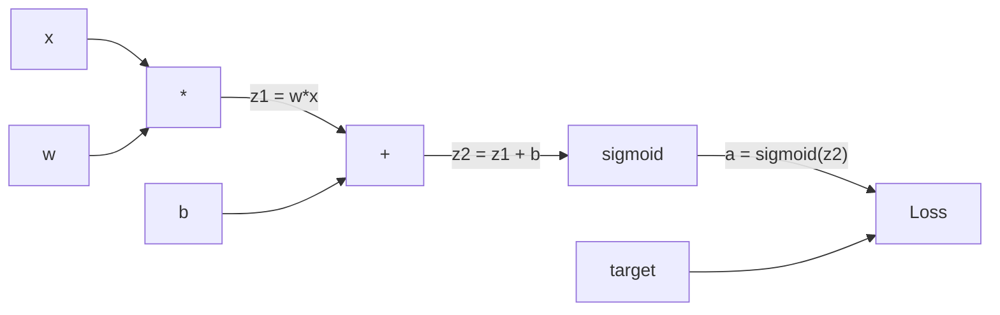
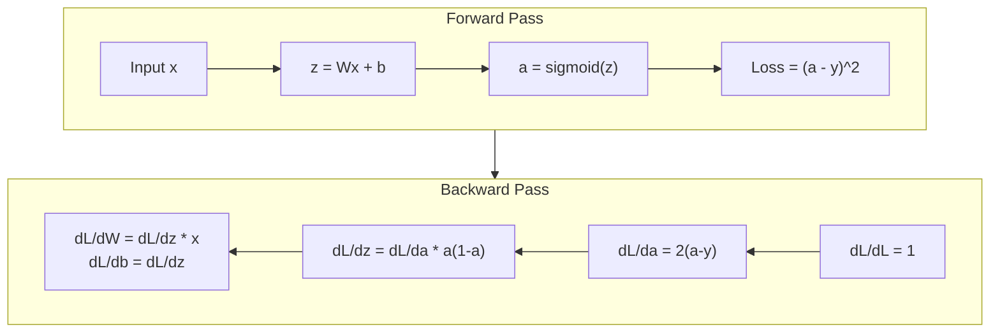
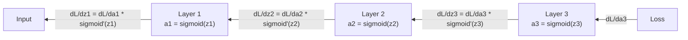

# 从零开始实现反向传播

> 反向传播是使学习成为可能的算法。没有它，神经网络不过是昂贵的随机数生成器。

**类型:** 构建
**语言:** Python
**前提课程:** 03.02课 (多层网络)
**时间:** ~120分钟

## 学习目标

- 实现一个基于值的自动微分引擎，该引擎构建计算图并通过拓扑排序计算梯度
- 利用链式法则推导加法、乘法和 sigmoid 函数的反向传播过程
- 使用你从零开始构建的反向传播引擎，在 XOR 和圆形分类任务上训练一个多层网络
- 识别深度 sigmoid 网络中的梯度消失问题，并解释梯度为何呈指数级衰减

## 问题所在

你的网络有一个包含 768 个输入和 3072 个输出的单隐藏层。这意味着有 2,359,296 个权重。它做出了一个错误的预测。是哪个权重导致了错误？单独测试每个权重需要进行 230 万次前向传播。而反向传播在一次反向传播中就能计算出全部 230 万个梯度。这不是优化。这是可训练与不可能之间的区别。

朴素的方法是：取一个权重，将其微调一个极小的量，再次运行前向传播，衡量损失是增加还是减少。这样你就得到了该权重的梯度。现在对网络中的每个权重都这么做。再乘以数千个训练步骤和数百万个数据点。你需要地质时间级别的时长才能训练出任何有用的东西。

反向传播解决了这个问题。一次前向传播，一次反向传播，所有梯度都被计算出来。诀窍在于微积分中的链式法则，被系统地应用于计算图。这是使深度学习实用的算法。没有它，我们可能还停留在玩具问题上。

## 核心概念

### 链式法则在网络中的应用

你在第 1 阶段第 5 课中见过链式法则。快速回顾：如果 y = f(g(x))，那么 dy/dx = f'(g(x)) * g'(x)。你沿着链条将导数相乘。

在神经网络中，"链条"是从输入到损失的一系列操作。每一层应用权重、加上偏置、通过激活函数。损失函数将最终输出与目标进行比较。反向传播沿着这条链条反向追踪，计算每个操作对误差的贡献。

### 计算图

每次前向传播都会构建一个图。每个节点是一个操作（乘法、加法、sigmoid）。每条边向前传递一个值，向后传递一个梯度。



前向传播：值从左向右流动。x 和 w 产生 z1 = w*x。加上 b 得到 z2。Sigmoid 给出激活值 a。使用损失函数将 a 与目标 y 进行比较。

反向传播：梯度从右向左流动。从 dL/da（损失如何随激活值变化）开始。乘以 da/dz2（sigmoid 的导数）。得到 dL/dz2。将其拆分为 dL/db（等于 dL/dz2，因为 z2 = z1 + b）和 dL/dz1。然后 dL/dw = dL/dz1 * x，dL/dx = dL/dz1 * w。

在反向传播期间，图中的每个节点只有一个任务：接收来自上方的梯度，乘以其局部导数，然后向下传递。

### 前向传播与反向传播



前向传播存储每个中间值：z、a、每层的输入。反向传播需要这些存储的值来计算梯度。这是反向传播核心的记忆-计算权衡。你用内存（存储激活值）换取速度（一次传播而非百万次）。

### 网络中的梯度流

对于一个 3 层网络，梯度会链接经过每一层：



在每一层，梯度会乘以 sigmoid 的导数。Sigmoid 的导数是 a * (1 - a)，其最大值为 0.25（当 a = 0.5 时）。三层深时，梯度最多被乘以 0.25^3 = 0.0156。十层深：0.25^10 = 0.000001。

### 梯度消失

这就是梯度消失问题。Sigmoid 将其输出压缩在 0 和 1 之间。其导数永远小于 0.25。堆叠足够多的 sigmoid 层，梯度会衰减至无。早期层几乎无法学习，因为它们接收到的梯度接近零。

```
sigmoid(z):     Output range [0, 1]
sigmoid'(z):    Max value 0.25 (at z = 0)

After 5 layers:   gradient * 0.25^5 = 0.001x original
After 10 layers:  gradient * 0.25^10 = 0.000001x original
```

这就是深度 sigmoid 网络几乎无法训练的原因。解决方案——ReLU 及其变体——是第 4 课的主题。现在，请理解反向传播本身运作完美。问题在于它所穿越的对象。

### 推导两层网络的梯度

具体数学推导，针对一个具有输入 x、带 sigmoid 的隐藏层、带 sigmoid 的输出层以及均方误差损失的网络。

前向传播：
```
z1 = W1 * x + b1
a1 = sigmoid(z1)
z2 = W2 * a1 + b2
a2 = sigmoid(z2)
L = (a2 - y)^2
```

反向传播（逐步应用链式法则）：
```
dL/da2 = 2(a2 - y)
da2/dz2 = a2 * (1 - a2)
dL/dz2 = dL/da2 * da2/dz2 = 2(a2 - y) * a2 * (1 - a2)

dL/dW2 = dL/dz2 * a1
dL/db2 = dL/dz2

dL/da1 = dL/dz2 * W2
da1/dz1 = a1 * (1 - a1)
dL/dz1 = dL/da1 * da1/dz1

dL/dW1 = dL/dz1 * x
dL/db1 = dL/dz1
```

每个梯度都是从损失出发反向追踪得到的局部导数的乘积。这就是反向传播的全部。

## 动手实现

### 第 1 步：值节点

我们计算中的每个数字都成为一个 `Value`。它存储其数据、梯度以及它是如何创建的（以便它知道如何反向计算梯度）。

```python
class Value:
    def __init__(self, data, children=(), op=''):
        self.data = data
        self.grad = 0.0
        self._backward = lambda: None
        self._children = set(children)
        self._op = op

    def __repr__(self):
        return f"Value(data={self.data:.4f}, grad={self.grad:.4f})"
```

目前没有梯度（0.0）。还没有反向传播函数（空操作）。``_children`` 追踪哪些 `Value` 产生了这个值，以便我们稍后可以对图进行拓扑排序。

### 第 2 步：带有反向函数的操作

每个操作创建一个新的 `Value` 并定义梯度如何通过它向后流动。

```python
def __add__(self, other):
    other = other if isinstance(other, Value) else Value(other)
    out = Value(self.data + other.data, (self, other), '+')

    def _backward():
        self.grad += out.grad
        other.grad += out.grad

    out._backward = _backward
    return out

def __mul__(self, other):
    other = other if isinstance(other, Value) else Value(other)
    out = Value(self.data * other.data, (self, other), '*')

    def _backward():
        self.grad += other.data * out.grad
        other.grad += self.data * out.grad

    out._backward = _backward
    return out
```

对于加法：d(a+b)/da = 1，d(a+b)/db = 1。所以两个输入都直接获得输出的梯度。

对于乘法：d(a*b)/da = b，d(a*b)/db = a。每个输入获得另一个值乘以输出的梯度。

``+=`` 至关重要。一个 `Value` 可能被用于多个操作。它的梯度是来自所有路径的梯度之和。

### 第 3 步：Sigmoid 和损失函数

```python
import math

def sigmoid(self):
    x = self.data
    x = max(-500, min(500, x))
    s = 1.0 / (1.0 + math.exp(-x))
    out = Value(s, (self,), 'sigmoid')

    def _backward():
        self.grad += (s * (1 - s)) * out.grad

    out._backward = _backward
    return out
```

Sigmoid 的导数：sigmoid(x) * (1 - sigmoid(x))。我们在前向传播中计算过 sigmoid(x) = s。复用它。无需额外工作。

```python
def mse_loss(predicted, target):
    diff = predicted + Value(-target)
    return diff * diff
```

单个输出的均方误差：(预测值 - 目标值)^2。我们用带负号的 `Value` 的加法来表达减法。

### 第 4 步：反向传播

拓扑排序确保我们以正确的顺序处理节点——在一个节点的梯度被完全累加后，我们才通过它进行传播。

```python
def backward(self):
    topo = []
    visited = set()

    def build_topo(v):
        if v not in visited:
            visited.add(v)
            for child in v._children:
                build_topo(child)
            topo.append(v)

    build_topo(self)
    self.grad = 1.0
    for v in reversed(topo):
        v._backward()
```

从损失开始（梯度 = 1.0，因为 dL/dL = 1）。沿着排序后的图向后遍历。每个节点的 ``_backward`` 将梯度推送给其子节点。

### 第 5 步：层与网络

```python
import random

class Neuron:
    def __init__(self, n_inputs):
        scale = (2.0 / n_inputs) ** 0.5
        self.weights = [Value(random.uniform(-scale, scale)) for _ in range(n_inputs)]
        self.bias = Value(0.0)

    def __call__(self, x):
        act = sum((wi * xi for wi, xi in zip(self.weights, x)), self.bias)
        return act.sigmoid()

    def parameters(self):
        return self.weights + [self.bias]


class Layer:
    def __init__(self, n_inputs, n_outputs):
        self.neurons = [Neuron(n_inputs) for _ in range(n_outputs)]

    def __call__(self, x):
        out = [n(x) for n in self.neurons]
        return out[0] if len(out) == 1 else out

    def parameters(self):
        params = []
        for n in self.neurons:
            params.extend(n.parameters())
        return params


class Network:
    def __init__(self, sizes):
        self.layers = []
        for i in range(len(sizes) - 1):
            self.layers.append(Layer(sizes[i], sizes[i + 1]))

    def __call__(self, x):
        for layer in self.layers:
            x = layer(x)
            if not isinstance(x, list):
                x = [x]
        return x[0] if len(x) == 1 else x

    def parameters(self):
        params = []
        for layer in self.layers:
            params.extend(layer.parameters())
        return params

    def zero_grad(self):
        for p in self.parameters():
            p.grad = 0.0
```

一个 `Neuron` 接收输入，计算加权和 + 偏置，并应用 sigmoid。权重初始化时乘以 sqrt(2/n_inputs) 以防止在更深层的网络中 sigmoid 饱和。一个 `Layer` 是一个 `Neuron` 列表。一个 `Network` 是一个 `Layer` 列表。``parameters()`` 方法收集所有可学习的 `Value`，以便我们可以更新它们。

### 第 6 步：在 XOR 上训练

```python
random.seed(42)
net = Network([2, 4, 1])

xor_data = [
    ([0.0, 0.0], 0.0),
    ([0.0, 1.0], 1.0),
    ([1.0, 0.0], 1.0),
    ([1.0, 1.0], 0.0),
]

learning_rate = 1.0

for epoch in range(1000):
    total_loss = Value(0.0)
    for inputs, target in xor_data:
        x = [Value(i) for i in inputs]
        pred = net(x)
        loss = mse_loss(pred, target)
        total_loss = total_loss + loss

    net.zero_grad()
    total_loss.backward()

    for p in net.parameters():
        p.data -= learning_rate * p.grad

    if epoch % 100 == 0:
        print(f"Epoch {epoch:4d} | Loss: {total_loss.data:.6f}")

print("\nXOR Results:")
for inputs, target in xor_data:
    x = [Value(i) for i in inputs]
    pred = net(x)
    print(f"  {inputs} -> {pred.data:.4f} (expected {target})")
```

观察损失值下降。从随机预测到正确的 XOR 输出，完全由反向传播计算梯度并将权重向正确方向调整所驱动。

### 第 7 步：圆形分类

在第 2 课中，你手动调整了权重来进行圆形分类。现在让网络自己学习它们。

```python
random.seed(7)

def generate_circle_data(n=100):
    data = []
    for _ in range(n):
        x1 = random.uniform(-1.5, 1.5)
        x2 = random.uniform(-1.5, 1.5)
        label = 1.0 if x1 * x1 + x2 * x2 < 1.0 else 0.0
        data.append(([x1, x2], label))
    return data

circle_data = generate_circle_data(80)

circle_net = Network([2, 8, 1])
learning_rate = 0.5

for epoch in range(2000):
    random.shuffle(circle_data)
    total_loss_val = 0.0
    for inputs, target in circle_data:
        x = [Value(i) for i in inputs]
        pred = circle_net(x)
        loss = mse_loss(pred, target)
        circle_net.zero_grad()
        loss.backward()
        for p in circle_net.parameters():
            p.data -= learning_rate * p.grad
        total_loss_val += loss.data

    if epoch % 200 == 0:
        correct = 0
        for inputs, target in circle_data:
            x = [Value(i) for i in inputs]
            pred = circle_net(x)
            predicted_class = 1.0 if pred.data > 0.5 else 0.0
            if predicted_class == target:
                correct += 1
        accuracy = correct / len(circle_data) * 100
        print(f"Epoch {epoch:4d} | Loss: {total_loss_val:.4f} | Accuracy: {accuracy:.1f}%")
```

我们这里使用在线随机梯度下降——在每个样本后更新权重，而不是累积整个批次。这能更快地打破对称性，并避免在整个损失空间上出现 sigmoid 饱和。每个 epoch 打乱数据顺序可以防止网络记忆数据顺序。

无需手动调整。网络自己发现了圆形决策边界。这就是反向传播的力量：你定义架构、损失函数和数据。算法负责找出权重。

## 实际使用

PyTorch 用几行代码就能完成以上所有工作。核心思想完全相同——自动微分在前向传播期间构建计算图，并沿着它反向追踪以计算梯度。

```python
import torch
import torch.nn as nn

model = nn.Sequential(
    nn.Linear(2, 4),
    nn.Sigmoid(),
    nn.Linear(4, 1),
    nn.Sigmoid(),
)
optimizer = torch.optim.SGD(model.parameters(), lr=1.0)
criterion = nn.MSELoss()

X = torch.tensor([[0,0],[0,1],[1,0],[1,1]], dtype=torch.float32)
y = torch.tensor([[0],[1],[1],[0]], dtype=torch.float32)

for epoch in range(1000):
    pred = model(X)
    loss = criterion(pred, y)
    optimizer.zero_grad()
    loss.backward()
    optimizer.step()

print("PyTorch XOR Results:")
with torch.no_grad():
    for i in range(4):
        pred = model(X[i])
        print(f"  {X[i].tolist()} -> {pred.item():.4f} (expected {y[i].item()})")
```

``loss.backward()`` 是你的 ``total_loss.backward()``。``optimizer.step()`` 是你手动实现的 ``p.data -= lr * p.grad``。``optimizer.zero_grad()`` 是你的 ``net.zero_grad()``。相同的算法，工业级的实现。PyTorch 处理 GPU 加速、混合精度、梯度检查点和数百种层类型。但反向传播是相同的链式法则应用于相同的计算图。

训练运行前向传播，然后反向传播，接着更新权重。推理只运行前向传播。没有梯度，没有更新。这个区别很重要，因为推理是在生产环境中发生的。当你调用像 Claude 或 GPT 这样的 API 时，你是在进行推理——你的提示词正向流经网络，然后 token 从另一端输出。权重不会改变。理解反向传播很重要，因为它塑造了该网络中的每一个权重。

## 成果产出

本课产出：
- ``outputs/prompt-gradient-debugger.md`` —— 一个用于诊断任何神经网络中梯度问题（消失、爆炸、NaN）的可复用提示词

## 练习

1.  为 `Value` 类添加一个 ``__sub__`` 方法（a - b = a + (-1 * b)）。然后实现一个 ``__neg__`` 方法。通过与像 (a - b)^2 这样的简单表达式的手动计算结果进行比较，验证梯度是正确的。
2.  为 `Value` 添加一个 ``relu`` 方法（输出 max(0, x)，如果 x > 0 则导数为 1，否则为 0）。在隐藏层中用 ReLU 替换 sigmoid，并再次在 XOR 上训练。比较收敛速度。你应该会看到更快的训练——这预览了第 4 课的内容。
3.  为 `Value` 实现一个 ``__pow__`` 方法，用于计算整数幂。用它来将 ``mse_loss`` 替换为一个合适的 ``(predicted - target) ** 2`` 表达式。验证梯度与原始实现匹配。
4.  在训练循环中添加梯度裁剪：在调用 ``backward()`` 后，将所有梯度裁剪到 [-1, 1] 范围内。训练一个更深的网络（4 层或更多层使用 sigmoid），并比较有裁剪和无裁剪的损失曲线。这是你防御梯度爆炸的第一道防线。
5.  构建一个可视化：在 XOR 训练后，打印网络中每个参数的梯度。识别哪一层具有最小的梯度。这将演示你在概念部分读到的梯度消失问题。

## 关键术语

| 术语 | 人们常说 | 实际含义 |
|------|----------|----------|
| 反向传播 | "网络学习了" | 一种算法，通过将链式法则反向应用于计算图，为每个权重计算 dL/dw |
| 计算图 | "网络结构" | 一个有向无环图，节点是操作，边传递值（前向）和梯度（反向） |
| 链式法则 | "将导数相乘" | 如果 y = f(g(x))，那么 dy/dx = f'(g(x)) * g'(x) —— 反向传播的数学基础 |
| 梯度 | "最陡上升方向" | 损失函数关于某个参数的偏导数——告诉你如何调整该参数以减少损失 |
| 梯度消失 | "深度网络无法学习" | 梯度在通过具有饱和激活函数（如 sigmoid）的层时呈指数级衰减 |
| 前向传播 | "运行网络" | 通过顺序应用每层操作并存储中间值，从输入计算输出 |
| 反向传播 | "计算梯度" | 反向遍历计算图，使用链式法则在每个节点累加梯度 |
| 学习率 | "学习速度" | 一个标量，控制更新权重时的步长：w_new = w_old - lr * gradient |
| 拓扑排序 | "正确的顺序" | 图节点的一种排序，其中每个节点出现在其所有依赖节点之后——确保梯度在传播前被完全累加 |
| 自动微分 | "自动求导" | 一个系统，在正向计算期间构建计算图并自动计算梯度——PyTorch 引擎所做的工作 |

## 扩展阅读

- Rumelhart, Hinton & Williams, "Learning representations by back-propagating errors" (1986) —— 这篇论文使反向传播成为主流，并开启了多层网络训练的时代
- 3Blue1Brown, "Neural Networks" 系列 (https://www.youtube.com/playlist?list=PLZHQObOWTQDNU6R1_67000Dx_ZCJB-3pi) —— 对反向传播和网络中梯度流的最好的可视化解释